# 使用 GitHub Codespace 修改文档

GitHub 代码空间是托管在云上的开发环境，这使得我们无需再安装 VS Code, Node.js 和 Git 等开发软件，就可以对文档进行维护编辑。

从名称很明显可以看出，“代码空间”是由 GitHub 运营的，因此使用此方法显然需要一个 GitHub 账号。

## 1 进入代码空间

点击下面的按钮/链接，进入创建/选择代码空间的页面：

（仓库主页的按钮与这里的按钮作用一致）

### 初次贡献

如果这是你第一次贡献文档，或是你有相当长一段时间没有打开过 CodeSpace 了，你将会看到下面的界面：

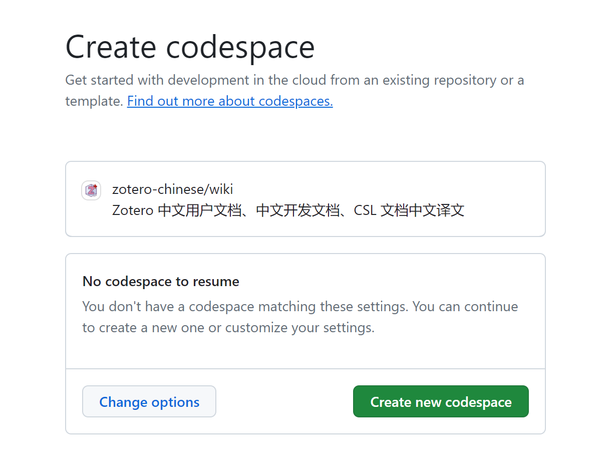

选择绿色按钮 “Create new codespace” 以创建一个新的代码空间，然后等待页面加载完成，创建进度条完成：

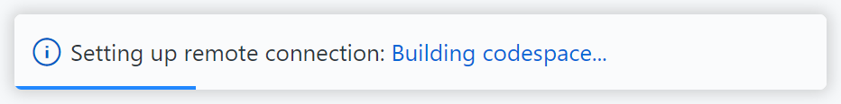

随后，你将进入到如下页面，代码空间配置完成。

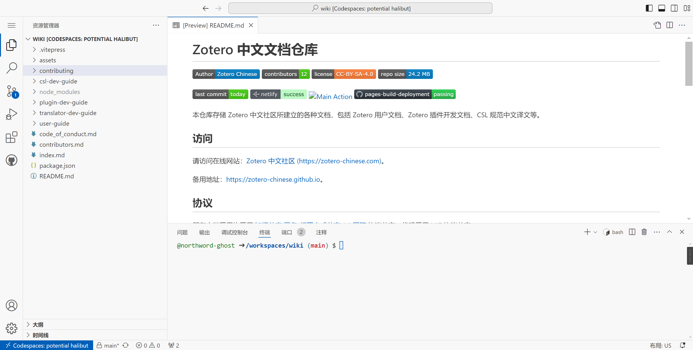

### 非初次贡献

如果你曾在近期创建过 CodeSpace，点击上述按钮时，你将在列表中看到一个已存在的 CodeSpace 。

可以通过点击 CodeSpace 的名称（下图为 “potential halibut”，但每个人创建的名称可能略有差异）进入这个 CodeSpace；

也可以通过点击绿色按钮“Resume this codespace”进入这个 CodeSpace。

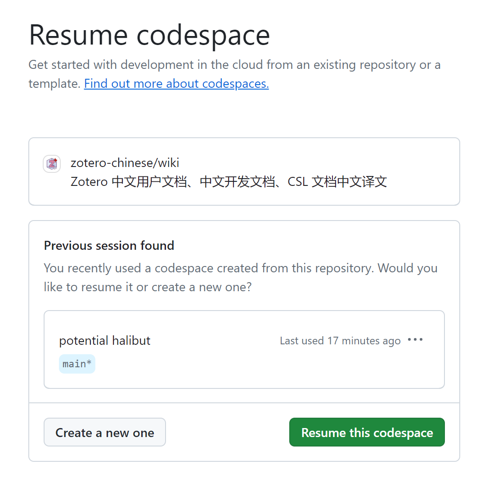

你也可以通过点击“Create a new one”来继续创建一个新的 CodeSpace，但通常我们可以直接复用已有的。

## 2 修改和提交

### 2.1 创建新分支

切换到 `源代码管理`窗格，依次选择`···` 按钮——`分支`。

如果你是第一次贡献，则选择`创建新分支`，

否则，选择 `创建新分支依据...`，然后选择 `upstream/main`，

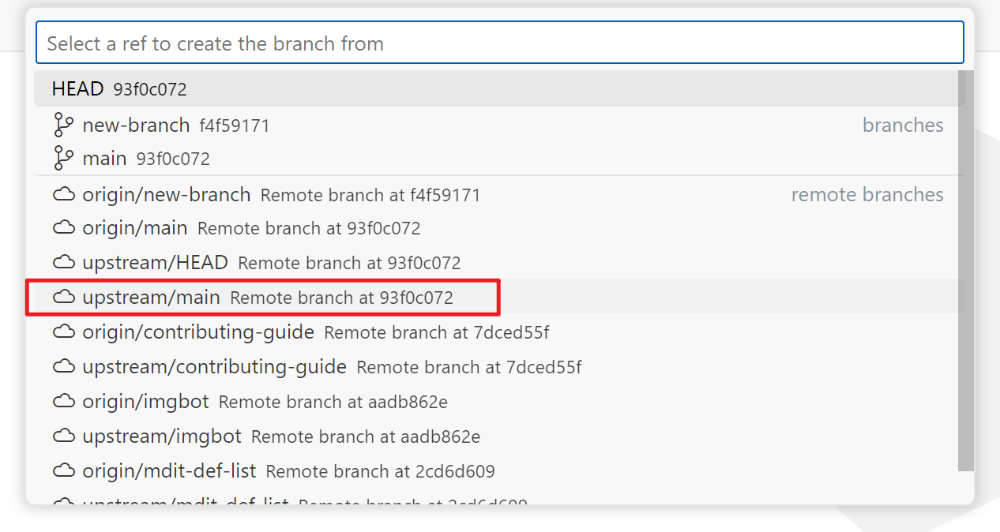

输入分支名，并按回车确认。创建完成后根据提示切换到新分支。

::: info 什么是分支？为什么要创建新分支？

分支是一个 Git 术语，你可以简单地理解为：在主版本的基础上复制了一份出来修改。

始终在新分支上修改内容，有利于 Git 的管理。具体的，如果要同时修改多个内容，某一部分内容被合并，但另一部分内容仍在修改，这时候只在主分支修改显然是不够用的。

此外，主仓库对 PR 采取 `splash and merge` 策略，这会把某一分支的所有提交压缩为一个提交然后合入主分支，这有利于保持仓库提交历史的简洁和线性关系，fork 仓库全部在主分支修改时，将无法自动保持与主仓库的提交历史同步，而使用新分支修改就没有这些烦恼。

:::

当然，如果你忘记了创建新分支，也没有关系，在提交的时候，编辑器还会提醒一次。

### 2.2 修改内容

你可以在左侧“资源管理器”中选择你想要修改的文件，在中间部分编辑文件，进行修改。

::: tip 文档风格和语法

文档使用 MarkDown 语法，这是一种非常简单的标记式语法，如果你还不了解，请参阅 [文档风格指南 #Markdown 语法](markdown.md#文档语法风格)。

:::

::: info 上传文件

图片可以通过在 `src/assets/images/` 文件夹右击，点击 `上传` 来上传到仓库。

也可以直接 `ctrl+v` 粘贴图片。

粘贴的图片会自动保存到 `src/assets/images/` 目录，你可以通过在图片路径上右击，选择“重命名符号”来快速重命名图片文件。

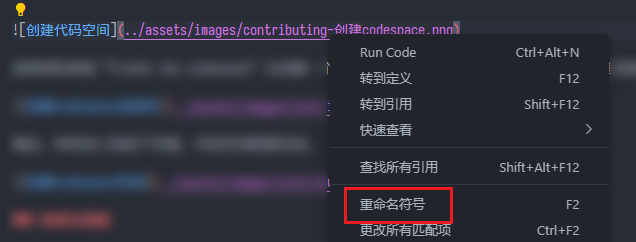

:::

### 2.3 预览修改

你可以在下图所示 `NPM 脚本` 窗格运行 `docs:dev` 脚本，来启动一个开发服务器。

如果你没有找到 `NPM 脚本` 窗格，可以在下图 “资源管理器” 后方的菜单中勾选 “NPM Scripts” 来显示这个窗格。

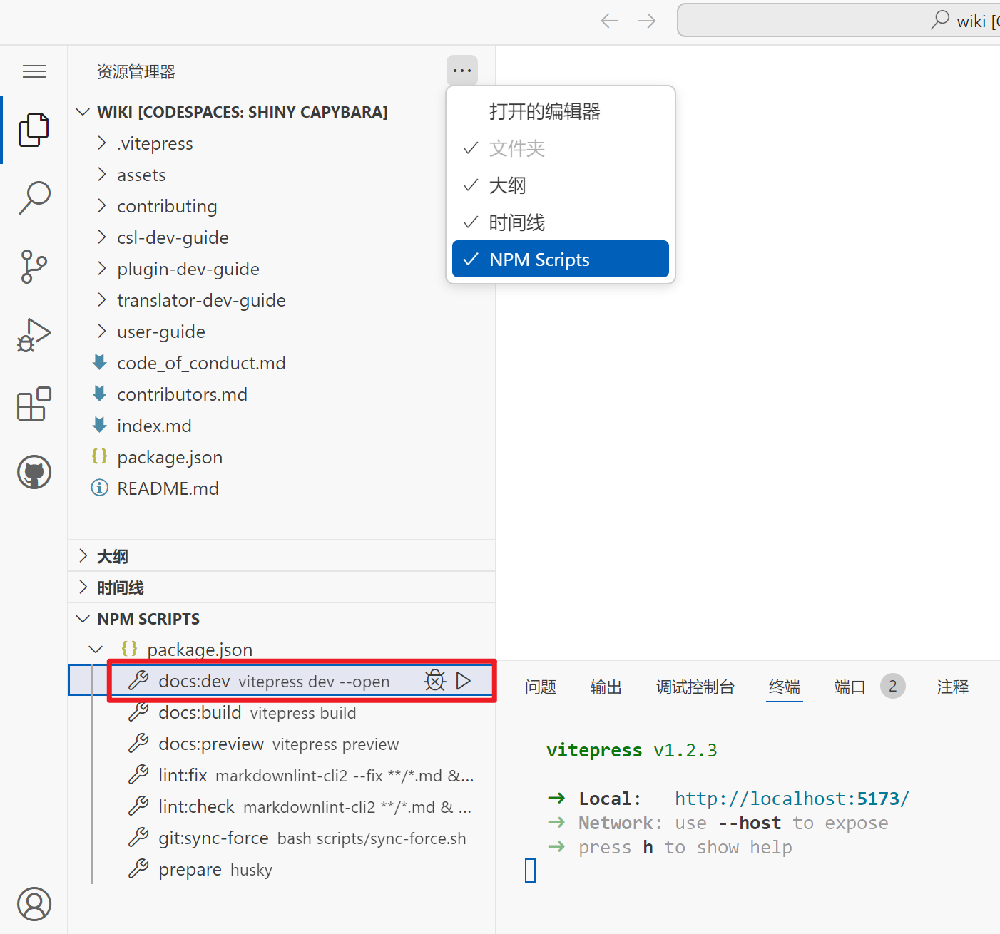

运行脚本后，会自动打开一个浏览器窗口，这个网页会实时更新你在编辑器中所做出的修改。

如果你意外关闭了这个网页，可以在上图右下角所示“终端”中，按住 `Ctrl` + 单击 `https://localhost:5137`，再次打开这个网页。

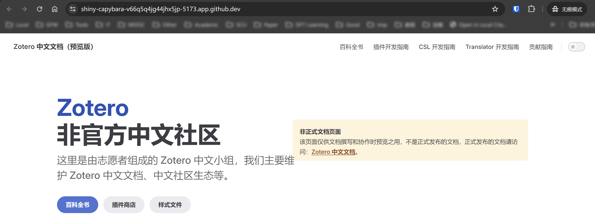

### 2.4 提交并推送修改

你可以简单地把“提交”理解为“保存”。如果你已经完成修改，或是想要临时存储一下，可以按照下述流程。

切换到 `源代码管理` 窗格，在输入框中输入一个简短的修改描述，然后点击按钮 `提交 / Commit`。

<!--  -->

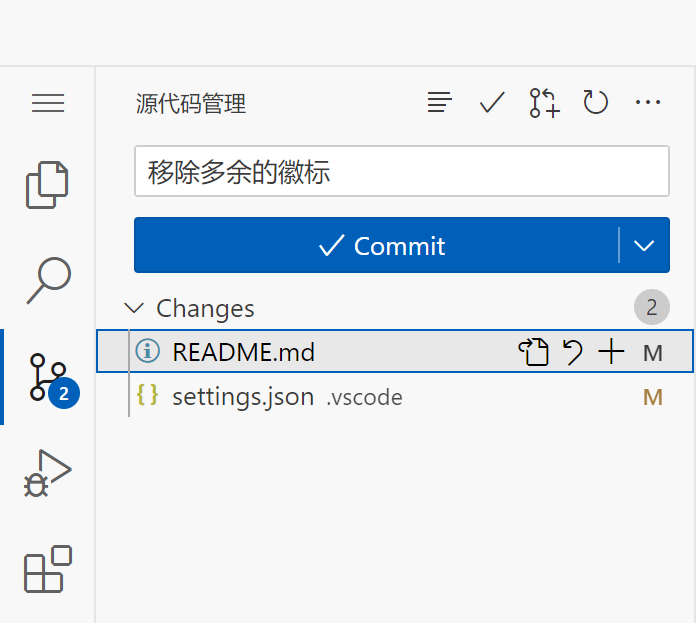

如果你在 [2.1 创建新分支](#21-创建新分支) 完成了创建分支的操作，那么点击“提交”后，将会出现下面的界面：

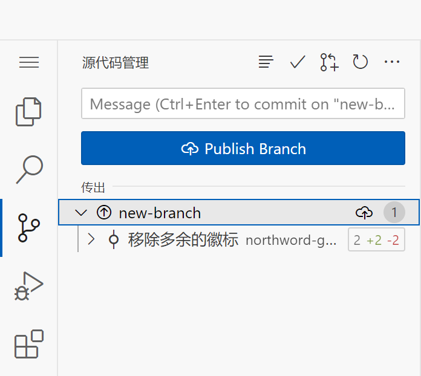

点击“发布分支”。如果你是第一次贡献，你将收到一个弹窗提示你是否需要创建一个分支仓库（fork），点击“创建分支 / Create fork”：

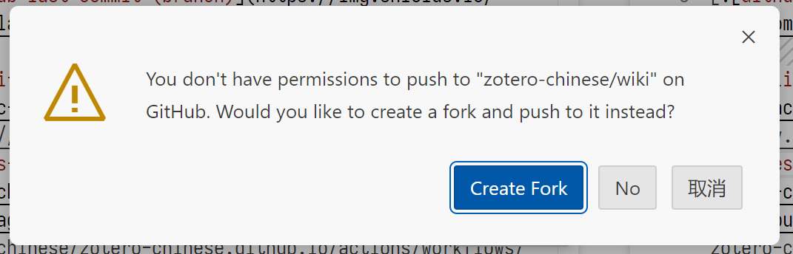

创建完成后，编辑器右下角将出现两个弹窗，提示已完成。

### 2.5 发起 Pull Request

前一步的提交只是提交到了自己的仓库，维护者很难注意到，当你认为你修改的差不多了的时候，就可以把修改提交到文档仓库让大家审核，也就是发起 Pull Request。

点击上面弹窗的蓝色按钮“创建拉取请求 / Create Pull Request”，

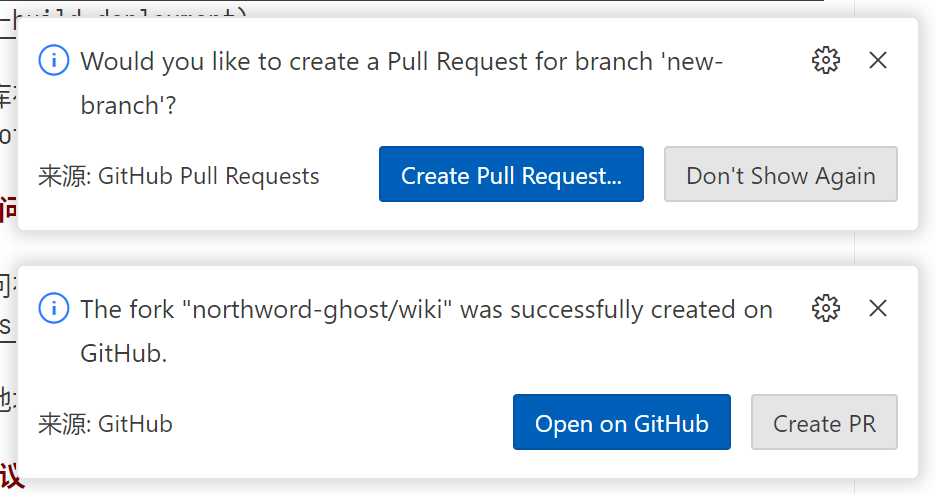

在左侧新出现的界面里，为拉取请求写一个简单明了的标题，简单写一个描述，然后点击蓝色按钮“Create / 创建”。

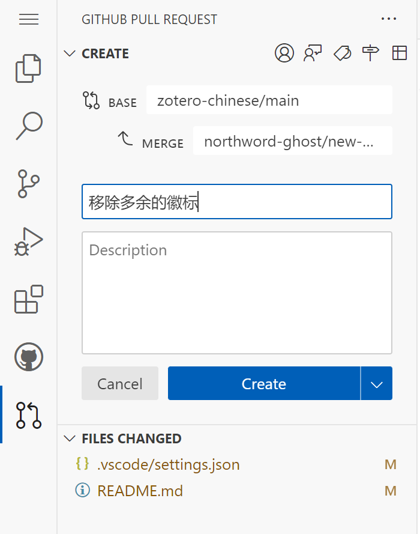

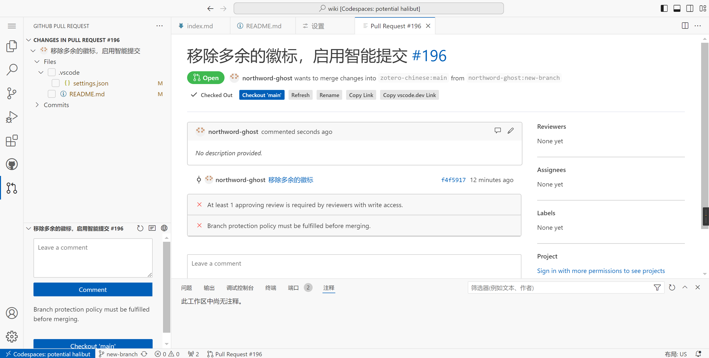

### 2.6 PR 修改

文档维护者收到 PR 后，会对代码进行审核、评论以及修改，并决定是否接受（merge）或结束该 PR。

1. 维护者审核后，可能会请求你作出一些修改，希望读者对审稿人/维护者的评论和意见保持开放的心态，并努力改进代码或文档。

   新的 PR 不一定会及时审核，取决于审稿人/维护者的当时的工作时间。

   ::: tip 如何更新 PR？

   已经发起的 PR，可以直接在这个 PR 对应的分支上继续提交新的内容以更新这个 PR。

   :::

2. PR 创建后，机器人会自动检查格式是否规范，并为这次修改创建一个预览链接。

   如果你是第一次贡献，需要管理员审核后机器人才能运行，这是保障安全需要的。

   

   ::: tip 哪些情况会导致检查错误？

   仓库的自动检查包含格式检查和构建检查。格式上，仓库使用 Markdown Lint 作为规范，如果你使用 VS Code 且安装了推荐的插件，那么通常 Lint 检查是可以通过的。

   构建检查失败最可能的原因就是图片、链接等错误，如图片等目录级别错误、大小写错误、相对链接不存在等。

   :::

3. PR 被接受并合并至官方 main 分支后，则可以更新 main 分支，并删除 pr-workflow 分支

   

## 3 关闭 CodeSpace

点击左下角蓝色按钮“Codespaces: xxxxxx”，在上方弹出的菜单中选择“Stop Current Codespace”，就可以关闭代码空间了，然后你可以安全的关闭浏览器。

当然，你也可以直接关闭浏览器，默认情况下，代码空间在 30 分支无活动后会自动关闭。

## 其他问题

### 我忘记新建分支了

不影响。

### 我提交的 PR 总有冲突

在新建分支是，请选择“从 upstream/main 新建分支”，以确保始终是基于最新的文档修改。

如果还有问题，可以在每一次修改前都运行 `git:force-sync` 脚本。

### 我的 PR 检查没有通过

可以根据 PR 评论里的日志链接，观察是哪里出现了问题。

如果感觉无法解决的，可以等仓库维护人员解决。
