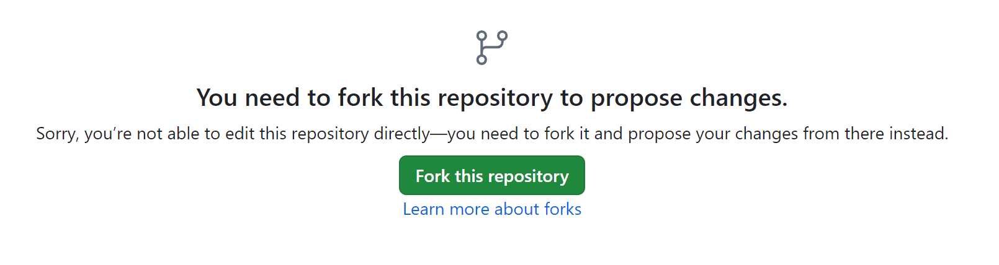
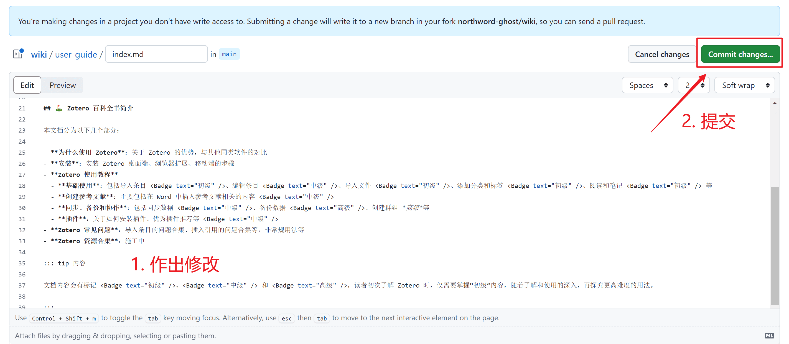
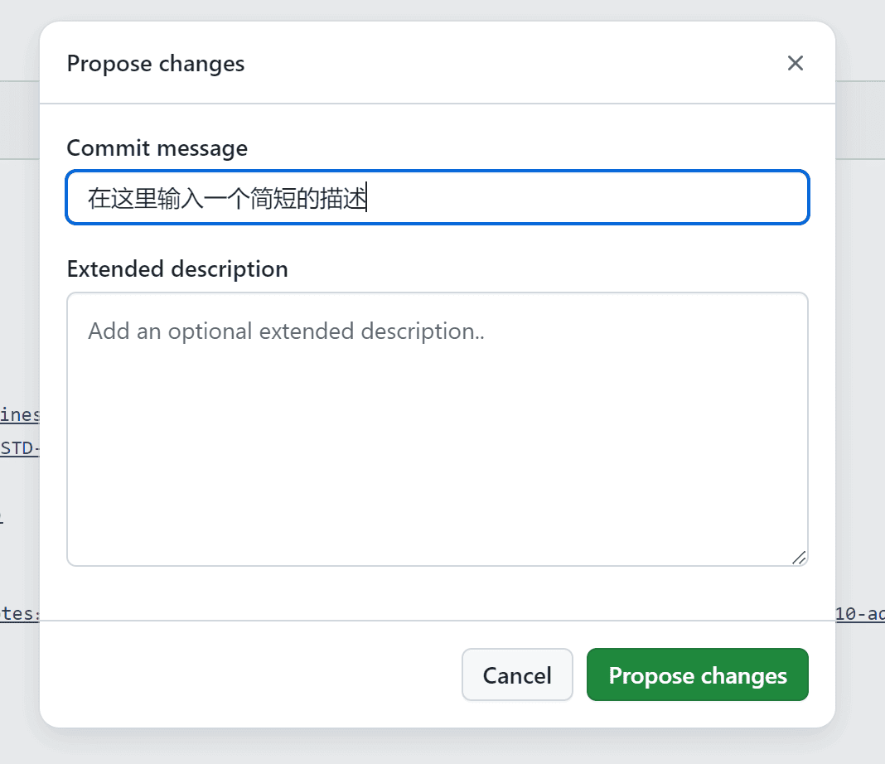
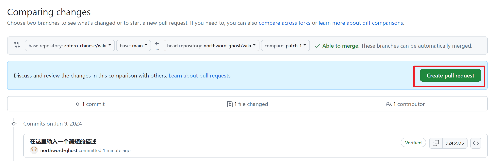
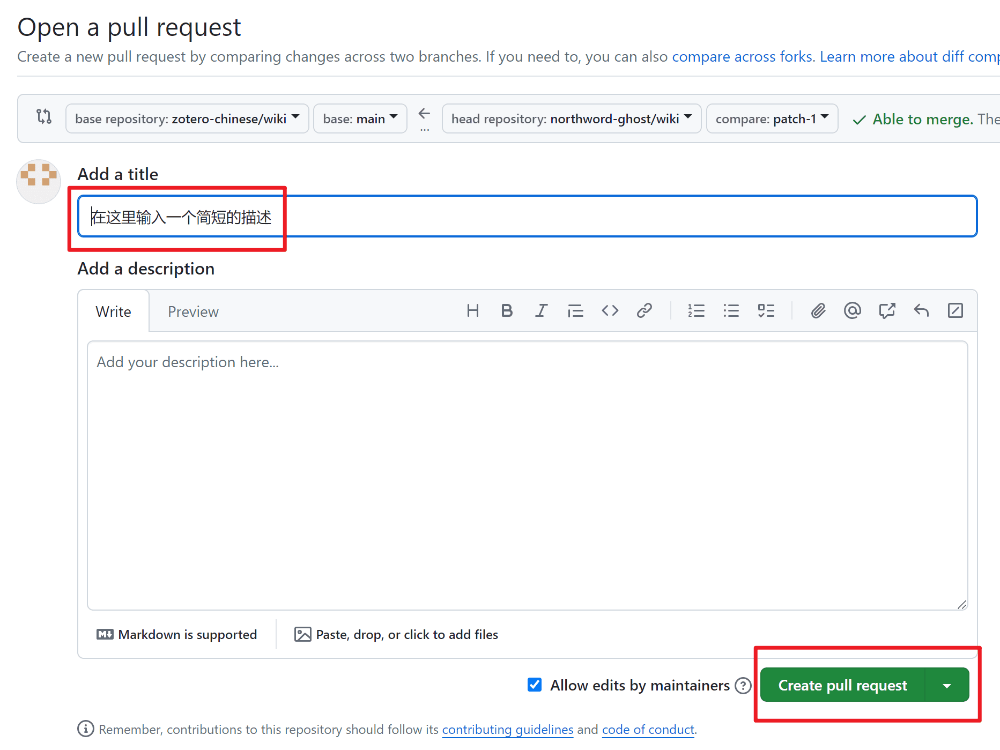

# 文档修改指南

## 项目概述

本文档使用 Markdown 语法编写，Markdown 文件存储在 GitHub 上，使用 VitePress 作为静态页面生成器，通过 GitHub Actions 自动构建网站，并托管在 Netlify 上。

当然，您实际上不需要知道上面的名词代表的是什么，您只需要根据后续小节提供的 [修改方法](#修改方法)，并参阅 [文档风格和语法指南](./markdown.md) ，就可以完成文档的贡献。

目前仓库地址为 <https://github.com/zotero-chinese/wiki/> 。

::: info 需要 GitHub 账号

文档源码开源托管在 [GitHub](https://github.com/) 上，因此读者需要一个 GitHub 账户才能提交 PR。

:::

## 文档维护范围

文档的维护与更新主要包括几个方面：

- 修正错别字、语句不通等
- 修正文档中的错误或不清晰的描述
- 文档里出现“TODO”、“施工中”、“待办”等字样的内容
- 我们在文档仓库里列出的 [待办项](https://github.com/zotero-chinese/wiki/issues)
- 调整章节结构，使文档条理更清晰
- 增加示例、专题或入门教程
- 其他任何你认为有必要修改的地方

如果您期望调整章节结构或对文档进行较大规模的修改重构，希望您可以先在文档仓库的 ISSUE 里发布一个帖子，与我们讨论后再进行。

## 修改方法

::: tip 请根据实际需要选择修改方法

为了降低上手门槛，我们根据需要修改的量和难易程度提供了以下几种修改方法。

:::

### 方法 1：在 GitHub 上在线修改

::: info 评价

难度：⭐

适用于修改简单的别字、语句不通或不清晰的描述等。

:::

1. 在线修改

   打开需要修改的文档网页，点击末尾左下角的 “在 GitHub 上编辑此页”，网页会自动跳转到 GitHub 编辑文档源码的页面。

   

   如果你是第一次贡献，则会提示需要 fork 才能继续，请点击 “Fork this repositiry” 继续即可。

   

   编辑需要修改的地方，文档风格和 Markdown 语法请参阅 [文档风格指南 #Markdown 语法](markdown.md#文档语法风格)。

2. 提交修改

   修改完后，点击右上角的 `Commit Changes...`，

   

   在弹窗中在下方的 “Commit changes” 中输入有关此次修改的标题和具体描述。然后点击“Propose changes”。

   

3. 提交 PR

   在 “Comparing changes” 页面中，，点击“Create Pull request”。

   

   输入此 PR 的标题和具体描述。点击 “Create pull request” 即可。

   

   PR 提交后，CI 工具会自动对提交的 PR 生成一个预览链接并评论在 PR 中，可以在此预览修改的结果。

   维护者将尽快审核这些修改。

### 方法 2：通过代码空间在线修改 <Badge text="推荐" />

::: info 评价

难度：⭐⭐

适用于一般修改。

:::

例如你需要添加一篇文章，上传一些图片等，且对 Git 不甚了解，那么可以使用这种方式在线修改，这可以避免你下载很多软件。

请参考 [使用 `GitHub 代码空间` 修改文档](./github-codespace.md)。

### 方法 3：离线修改

::: info 评价

难度：⭐⭐⭐

适用于维护者。

:::

如果你需要做较大量修改，例如增加几篇文章，或长期贡献/维护仓库，且对 Git 有一些了解，可以采用这种方式：完全本地修改，可以在本地预览修改的效果，修改后再推送到 GitHub。

请参考 [完全构建指南](build.md)。

## 注意事项

- Commit 的注释信息应该是描述性的
- 希望读者对审稿人/维护者的评论和意见保持开放的心态，并努力改进代码或文档
- 新的 PR 不一定会及时审核，取决于审稿人/维护者的当时的工作时间
