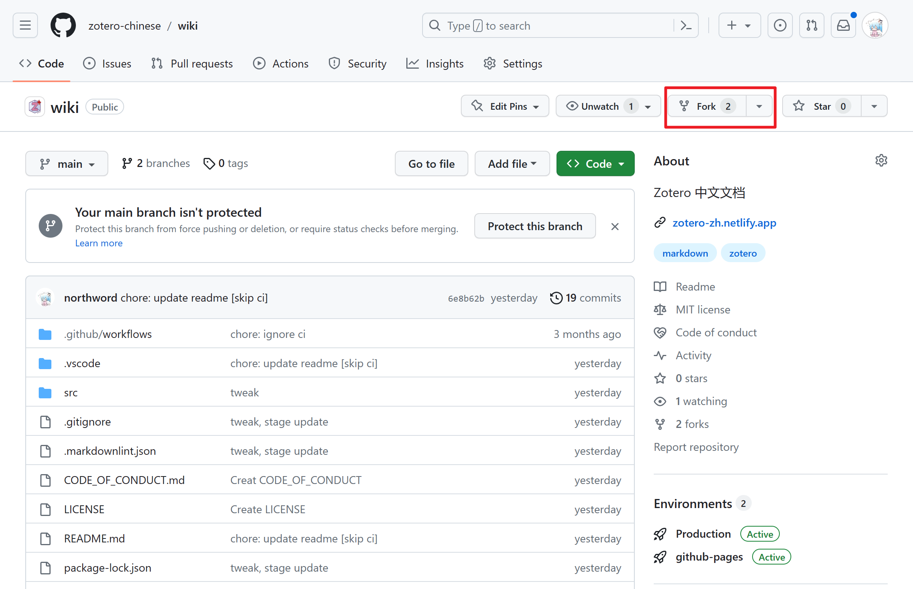
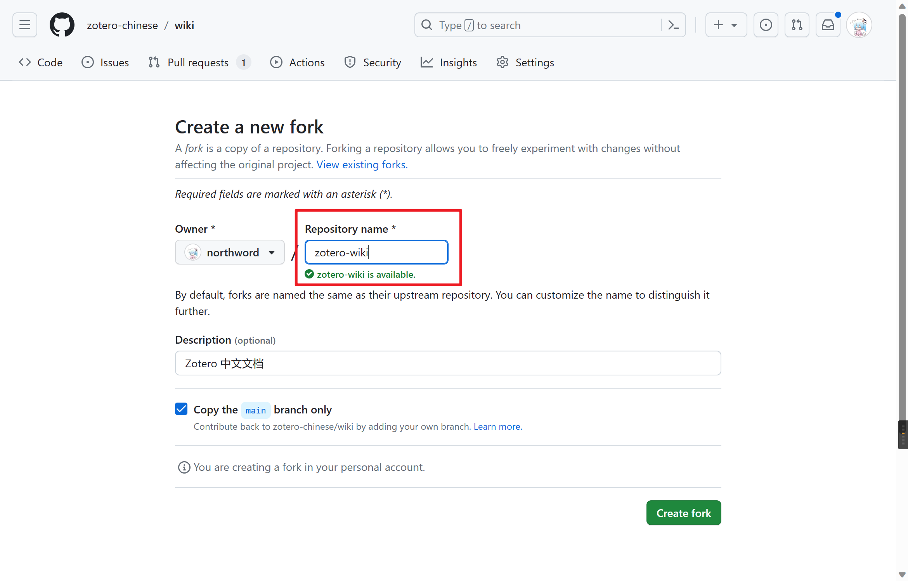
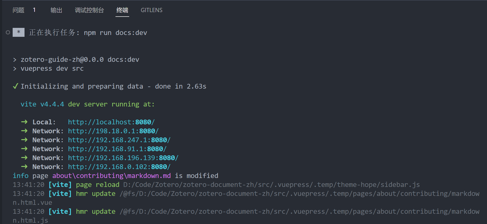

# 构建指南

## 项目概览

本文档使用 Markdown 语法编写，产生的 Markdown 文件托管在 GitHub 上。使用 VuePress 作为静态页面生成器将 Markdown 文件构建为 HTML，使用 VuePress-theme-hope 作为 VuePress 的主题拓展其语法和布局。使用 Netlify 作为持续集成供应商。

目前仓库地址为 <https://github.com/zotero-chinese/wiki/> ，

以下介绍了一次完整修改所需的步骤。

## 环境配置

### 所需软件安装

本文的需要 Node.js 和 Git 安装在你的电脑上，后续步骤假定你已经安装这些程序且可以简单使用，若没有安装这些软件请跟随本小节指引完成安装。

:::: details 安装 Git

地震“学”所有文档均使用 `Git` 进行版本控制。以下步骤假定

用户已安装 git。若未安装，可以使用以下命令安装或更新 git：

::: tabs

@tab Fedora

```bash
sudo dnf install git
```

@tab Ubuntu/Debian

```bash
sudo apt install git
```

@tab macOS

```bash
brew install git
```

@tab Windows

打开 <https://git-scm.com/downloads/> ，下载并安装 Git for Windows。

:::

安装完成后，还需设置个人信息。打开终端，运行以下命令

（将 "zotero-user" 和 "<zotero-user@gmail. com>" 替换成个人对应的信息）:

```bash
# 设置用户姓名和邮箱
$ git config --global user.name "zotero-user"
$ git config --global user.email "zotero-user@gmail.com"

# 查看 ~/.gitconfig
$ cat ~/.gitconfig
[user]
    name = zotero-user
    email = zotero-user@gmail.com
```

::::

::: details Git 和 GitHub 学习资料

以下修改文档并提交的步骤中使用了 Git 的一些常用选项，可以参考以下资料学习更多用法：

- [git 简明指南](http://rogerdudler.github.io/git-guide/index.zh.html)
- [廖雪峰的 Git 教程](http://www.liaoxuefeng.com/wiki/0013739516305929606dd18361248578c67b8067c8c017b000)
- [GotGitHub](http://www.worldhello.net/gotgithub/index.html)
- [How to Use Git and Git Workflows – a Practical Guide](https://www.freecodecamp.org/news/practical-git-and-git-workflows/amp/)
- [Pro Git](https://git-scm.com/book/zh/)

GitHub 相关资料：

- [GitHub 中文文档](https://docs.github.com/cn/github)
- [Understanding the GitHub flow](https://guides.github.com/introduction/flow/)
:::

::: details 安装 Node.js

安装 Node. js

:::

### 克隆和复制仓库

:::info

以下内容假定读者的 GitHub 账号为 `zotero-user`，实际的命令将用户名替换即可。

:::

1. 复制仓库至个人 GitHub 帐号

   点击项目主页 < <https://github.com/zotero-chinese/wiki/> 右上角的 Fork 按钮，将该项目复刻到个人 GitHub 账户下。

   

   

   复制完成后，个人 GitHub 帐号下便有了 <https://github.com/zotero-user/wiki/> 仓库。

2. 克隆个人 GitHub 帐号下的复刻仓库到本地（复刻仓库默认是本地克隆仓库的远程 origin）:

   ```bash
   # Clone repo
   git clone https://github.com/zotero-user/wiki.git

   # 进入仓库目录
   cd wiki/
   ```

   ::: tip

   如果你对 Git 或命令行不了解，可以考虑使用 [Github 客户端](https://desktop.github.com/) 或 VS Code 提供的图形化版本控制管理器作为命令行的替代。

   :::

### 安装依赖

通过下面的命令安装依赖项。

```bash
npm install
```

::: info

上述“环境配置”步骤只需在第一次修改代码时执行一次，一旦复制或克隆某仓库后，就无需再次复制或克隆。

:::

## 修改文档

1. 在本地创建并切换至新分支，假定新分支名为 `pr-workflow`（分支名需简短、描述性且独特）:

   ```bash
   # 若不在 main 分支，需先切换至该分支
   # 若已有一段时间没有更新，请切换到 main 分支后 pull 上游仓库中的更改
   $ git checkout main

   # 创建并切换至 pr-workflow 分支
   $ git checkout -b pr-workflow
   ```

2. 启动开发服务器
   使用以下命令启动开发服务器，如下图，开发服务器启动后，会给出几个本地链接，访问任一链接（通常为 Local）即可得到预览。

   ```bash
   npm run docs:dev
   ```

   开发服务器会监听所有 `.md` 文件的修改，当有文件发生保存是，服务器会自动更新预览并刷新网页。

   

3. 在新建分支中对文档做修改，修改过程中，可以随时在浏览器中检查修改效果

   使用 Markdown 语法编写文档，如果你不清楚本文档所用的 Markdown 语法，请参阅 [Markdown 语法](./markdown.md)。

4. 提交 commit

   ::: details Git commit 的命令

   ```bash
   # 查看仓库当前的状态
   $ git status
   # 添加所有修改
   $ git add --all

   # 查看仓库当前的状态
   $ git status
   # 提交添加的修改
   $ git commit -m "此处填写本次提交的注释信息"
   ```

   :::

   ::: tip

   如前所述，提交命令也可以在 GitHub Desktop 或 VS Code 中完成。

   :::

   ::: warning

   不建议直接在 main 分支中进行修改和提交，这可能会给你自己造成麻烦。

   :::

## 提交并开始 PR

1. 推送 pr-workflow 分支至个人 GitHub 帐号下的复制仓库:

   ```bash
   git push origin pr-workflow
   ```

2. 提交 PR

   进入个人 GitHub 帐号下的复制仓库（即 <https://github.com/zotero-user/wiki/>）。

   一般 GitHub 会自动提示有可提交的 PR，点击 “Compare & pull request”，输入此 PR 的标题和具体描述，

   最后点击 “Create pull request” 即可。

3. 审核、评论以及修改 PR

   文档维护者收到 PR 后，会对代码进行审核、评论以及修改，并决定是否接受（merge）或结束该 PR。

   提交的 PR 在接收前可能需要读者多次修改。这种情况并不要创建新 PR，只需继续本地 pr-workflow 分支中修改并提交，然后再次推送 pr-workflow 分支至远程 origin 即可，修改将自动添加到已提交的 PR 中。

   推送新的修改后，可以选择在该 PR 中留言，以通知维护者已提交新的修改。

4. PR 被接受并合并至官方 main 分支后，则可以更新 main 分支，并删除 pr-workflow 分支

   ::: details

   更新本地和个人 GitHub 中的 main 分支:

   ```bash
   # 切换回本地 main 分支
   $ git checkout main

   # 获取官方 main 分支，并合并到本地 main 分支
   $ git pull upstream main

   # 更新个人 GitHub 中的 main 分支
   $ git push origin main
   ```

   删除本地和个人 GitHub 中的 pr-workflow 分支:

   ```bash
   # 删除本地 pr-workflow 分支
   $ git branch -D pr-workflow

   # 删除个人 GitHub 上的远程 pr-workflow 分支，也可以在 GitHub 上点击按钮删除分支
   $ git push origin :pr-workflow
   ```

   :::

## 其他的脚本

### npm run docs:build

构建

### npm run lint

Markdown Lint
