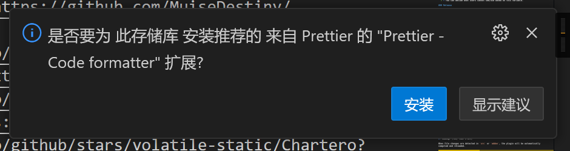
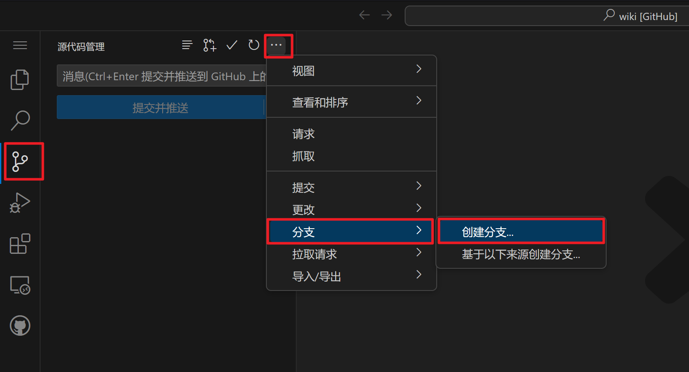
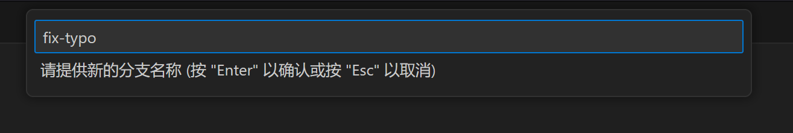
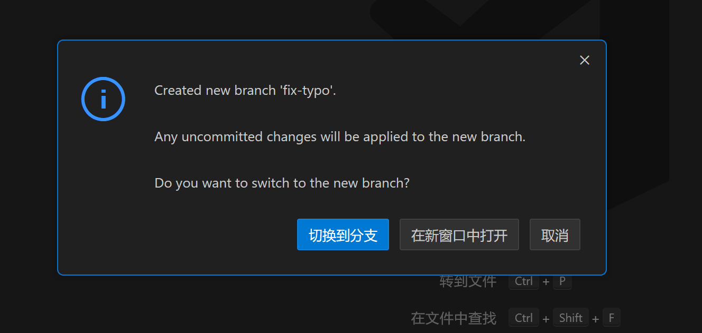
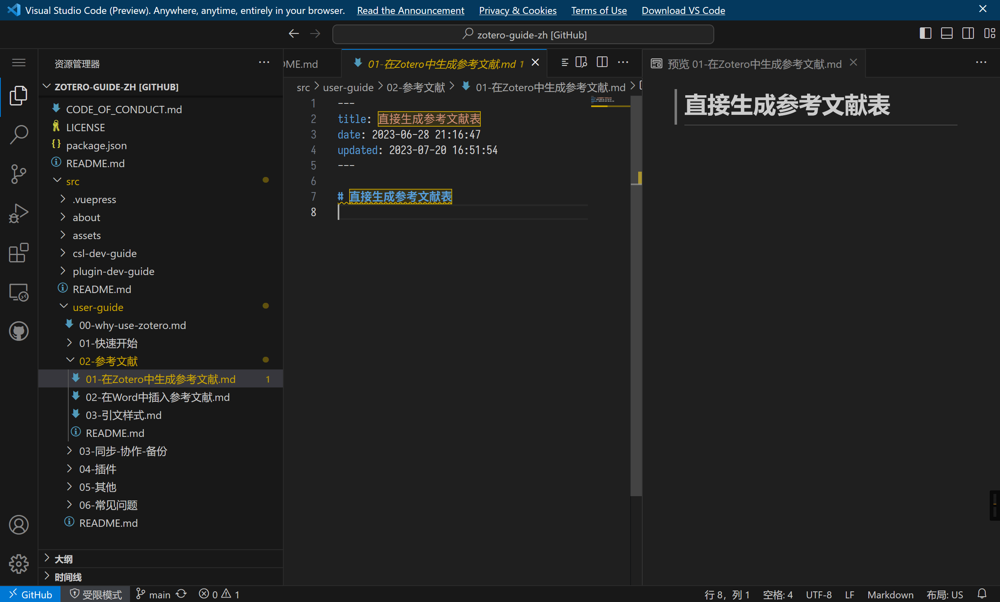
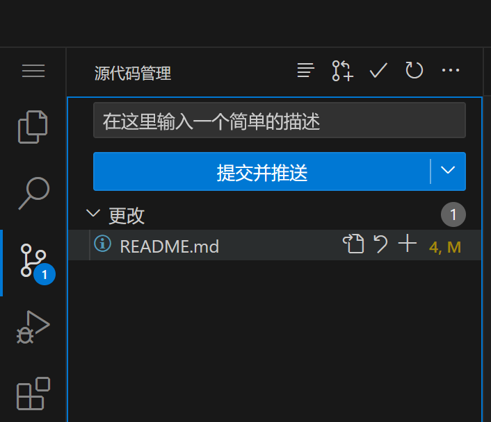
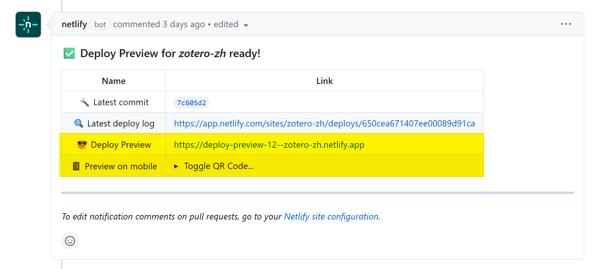

# 通过 VSCode.dev 网站在线更改本文档

1. 打开 <https://vscode.dev/github/zotero-chinese/wiki>
2. 等待页面加载完成
3. 根据提示登录 GitHub 账号

   

4. 根据提示安装推荐的插件

   

5. 新建分支
   切换到 `源代码管理`窗格，依次选择`···` 按钮——`分支`——`创建分支`，输入分支名，并按回车确认。创建完成后根据提示切换到新分支。

   

   

   

   ::: tip 为什么要创建新分支？

   严格地说，所有的修改都应在新分支进行，这有利于 Git 的管理。

   具体的，如果要同时修改多个内容，某一部分内容被合并，但另一部分内容仍在修改，这时候只在主分支修改显然是不够用的。

   此外，主仓库对 PR 采取 `splash and merge` 策略，这会把某一分支的所有提交压缩为一个提交然后合入主分支，这有利于保持仓库提交历史的简洁和线性关系，fork 仓库全部在主分支修改时，将无法自动保持与主仓库的提交历史同步，而使用新分支修改就没有这些烦恼。

   :::

6. 进行对应的修改

   

   ::: tip 上传文件
   图片可以通过在 `src/assets/` 文件夹右击，点击 `上传` 来上传到仓库。

   也可以直接 `ctrl+v` 粘贴图片。
   :::

   ::: tip 文档风格和语法
   文档的写作风格和语法等请参阅 [文档风格指南 #Markdown 语法](markdown.md#文档语法风格)。
   :::

7. 提交并推送

   

8. 发起 Pull Request
9. 等待社区管理员审核合并

PR 发起后，机器人会自动检查 PR 内容是否符合规范，也会部署一个预览版本，可以在这里查看预览。

::: tip 哪些情况会导致检查错误？

仓库的自动检查包含格式检查和构建检查。格式上，仓库使用 Markdown Lint 作为规范，如果你使用 VS Code 且安装了推荐的插件，那么通常 Lint 检查是可以通过的。

构建检查失败最可能的原因就是图片、链接等错误，如图片等目录级别错误、大小写错误、相对链接不存在等。

:::

::: tip 如何更新 PR？

已经发起的 PR，可以直接在这个 PR 对应的分支上继续提交新的内容以更新这个 PR。

:::
