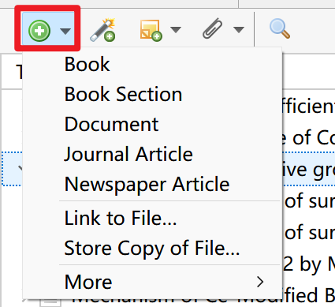

# 添加条目

## 条目与附件

在使用 Zotero 之前，我希望可以引入几个术语：

- 条目 Item：Item是Zotero的基本文件单元，用来表示一篇论文、一本书等的文摘信息，引用时使用的条目中储存的信息。常见的条目类型包括**期刊论文、学位论文、书籍、会议论文。**
- 附件 Attachments：附件既可以作为独立项添加，也可以作为常规 Zotero 条目的子项添加。一般来说，文件当做条目的子项添加。当一篇文献只有附件而没有条目的时候是不能被成功引用的，而一篇文献有条目信息而没有附件时，并不影响正常的引用。常见的附件包括**pdf附件、笔记附件、网页快照。**
- 链接的附件：对于链接文件，Zotero 只存储指向计算机上原始文件位置的链接。链接文件不会同步，如果附件项在 Zotero 中被删除，链接文件也不会被删除，zotero程序也不支持链接文件的同步。（可以简单理解为链接的文件在zotero中作用类似于Windows的快捷方式）
- 存储的附件：默认情况下，存储文件存储在 Zotero 数据目录中，Zotero 会自动管理它们，包括在 Zotero 中删除附件项时删除它们。如果使用文件同步功能，Zotero 会自动在设备之间同步存储的附件，并将它们储存在官方网盘（或WebDAV网盘）中。

## 添加条目

### 通过浏览器添加条目（推荐）

::: tip

使用这种方法需要确保以安装浏览器插件 Zotero Connector。如未安装，请参考：[Zotero 下载与安装](./01-安装.md) 。

:::

通过浏览器添加条目是最方便的途径之一，也是 Zotero 的特色功能之一。

当所在的网页呈现出不同的内容类型时，Zotero Connector 会显示不同的图标。例如，如果打开的是一篇期刊文章，那么图标就会变成下图（红框圈出）。


点击该图标，将在网页右上角显示如下的对话框，选择保存的合集位置，添加标签，即可将网页对应的文献的元数据录入 Zotero ：


此时打开 Zotero，将会自动定位到保存时选择的合集：


下表为部分常见条目类型的 Connector 图标：

| 图标 | 类型 |
| --- | --- |
|  | 默认 |
| | 普通网页 |
| | 期刊文章 |
|  | 会议论文 |
| | 学位论文 |
|  | 图书 |
| | 多个项目 |

::: tip

Connector 抓取中文文献能力依靠中文 Translator 支持，更新中文 Translator 请参考：

- [中文文献增强：茉莉花插件](https://zotero.yuque.com/staff-gkhviy/zotero/jasminum?view=doc_embed&inner=BlFh2)
- 如果茉莉花插件更新translator失败，可以尝试[手动更新translator](../../06-常见问题/如何手动更新translator.md).

Connector 抓取文献错误解决：[从浏览器抓取条目时发生错误 / 抓取时不能自动下载 PDF / 无法自动给添加的 PDF 附件创建条目](https://zotero.yuque.com/staff-gkhviy/zotero/mribmi?view=doc_embed)

如果抓取失败且尝试了上述办法仍然不能解决，请手动下载 PDF 附件并通过附件添加条目。

:::

### 通过标识符添加条目

如果已知文献的 ISBN、DOI、PMID 或 arXiv ID 等标识符， 则可以通过这些标识符将文献导入到 Zotero 中。

在 Zotero 中，点击， 输入标识符，如 DOI: 10.1016/j.cej.2020.125798，然后回车，则对应的文献就会被导入到库中。

如果要一次输入多个标识符，在输入第一个标识符后按 Shift + Enter 会进入多行模式，随后输入其余标识符（每行一个），并通过 Enter 换行。输入完成后，再按 Shift + Enter 即可一次导入所有项目。


### 通过附件添加条目（推荐）

对于已有 PDF 文件的文献，可以通过将 PDF 文件拖拽到 Zotero 中来导入这篇文献。Zotero 会自动通过 PDF 来识别文献 —— 英文文献通常通过识别 PDF 的元数据，中文文献则识别文件名（中文文献文件识别能力由 茉莉花插件提供）。

注意：中文文件名必须为：`姓名_标题.pdf` 或 `姓名_标题.caj`。不是该命名格式的文件将直接导致识别失败。

### 手动创建条目

当以上方法无效或想要创建一个自定义元数据的条目（例如，在线上无法找到的源）时，点击下图红框图标，即可手动录入一个条目。



### 从其他工具导入

请参考：[https://www.zotero.org/support/moving_to_zotero](https://www.zotero.org/support/moving_to_zotero) 。

::: tip 始终及时校准条目

使用 Zotero（或任何其他参考文献管理器）进行引用时，在将项目保存到库中后，应始终检查项目的准确性。

Zotero 并不能保证自动抓取的数据 100% 正确，有时 Zotero 收到的元数据是不完整或不正确的。

我们应始终意识到这个问题，养成导入后随手校正的习惯。

需要注意的字段请见下“编辑条目”小节。

:::

## 编辑条目

::: warning

这一节并非使用 Zotero 必需的知识。如果觉得太复杂，可以暂时跳过。

:::

从以上方法导入的数据并不一定是完全正确的，最好养成导入条目后随手校正的习惯。

如下图所示，在中心窗格中选择一个条目后，右侧（标准视图）或下侧（堆栈视图）会显示该条目的书目信息。多数条目都可以直接单击进行编辑，更改自动保存。


以下是一些比较特殊的字段，拿出来单独介绍：

### 条目类型

请尤其注意这一个选项，这直接决定在引用时，该条目以什么方式出现。且该项在通过浏览器导入时非常容易出错。

最典型的错误就是将“期刊文章/学位论文”等识别为“网页”。这会导致部分引文格式后出现 `[EB/OL]` 等文献标识符。

这时我们应该重新导入或手动更正。

### 期刊缩写

部分期刊要求使用“期刊标题的缩写”进行引用，Zotero 将“期刊名全称”和“期刊名缩写”分别保存在“期刊”和“期刊缩写”两个字段中。

抓取时不一定能准确获得期刊缩写，写论文引用前最好校正一下。

通常期刊缩写的差别多数在于加不加 `.`，例如“Applied Surface Science”可以缩写为“Appl Surf Sci”或“Appl. Surf. Sci.”。我们建议总是存储为加 `.` 的格式。因为去掉 `.` 总是比加上 `.` 更方便，在引用时，对于需要不加 `.` 的期刊就可以通过 CSL 直接去掉 `.`。

::: tip 插件推荐

插件 [Linter for Zotero](https://github.com/northword/zotero-format-metadata) 提供了自动获取期刊的 ISO 4 缩写的功能，可前往 [插件商店](https://plugins.zotero-chinese.com)下载安装。

:::

### 标题

#### 标题中的上下标

```html
<sub>下标内容</sub>
<sup>上标内容</sup>
<i>斜体</i>
<b>粗体</b>
```

::: tip 插件推荐

插件 [Linter for Zotero](https://github.com/northword/zotero-format-metadata) 提供了辅助输入这些富文本标签的功能，可前往 [插件商店](https://plugins.zotero-chinese.com)下载安装。

:::

#### 标题的大小写

我们建议您始终将标题以“句子大小写”的形式存储在 Zotero 库中，这有利于 CSL 进行格式转换。

什么是“句子大小写”？

```plain
- 标题大小写：Mechanism of Ce-Modified Birnessite-MnO<sub>2</sub> in Promoting SO<sub>2</sub> Poisoning Resistance for Low-Temperature NH<sub>3</sub>-SCR
- 句子大小写：Mechanism of Ce-Modified Birnessite-MnO<sub>2</sub> in promoting SO<sub>2</sub> poisoning resistance for low-temperature NH<sub>3</sub>-SCR
-
```

### 额外

所有其他自定义字段均应保存在“额外”字段，保存在该字段的数据应为若干个键值对，每行一个。CSL 引用时可以通过键来调用值。

## 添加附件


