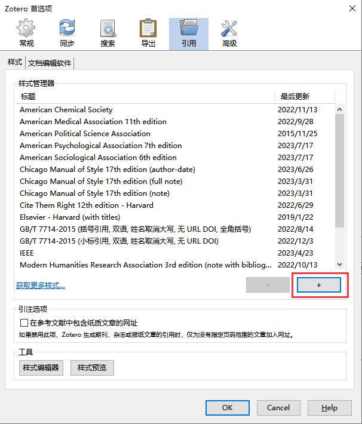
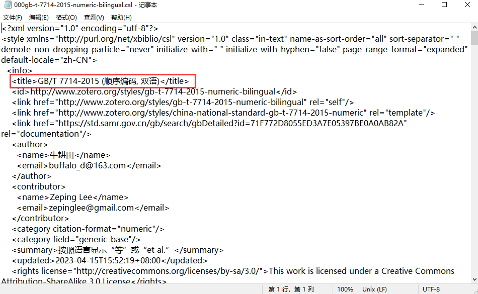

# 官网引用格式下载

1.打开Zotero软件，选择“编辑——首选项”，弹出“Zotero首选项框”

2.若样式管理器中无符合的样式，可以通过“获取更多样式”，搜索期刊名，即可导入期刊要求的样式

# 第三方引用格式

如果上述引文格式不符合你的要求，可到[中文CSL样式](https://github.com/redleafnew/Chinese-STD-GB-T-7714-related-csl/)下载更多CSL引文格式：

1.首先你需要在[中文CSL样式](https://github.com/redleafnew/Chinese-STD-GB-T-7714-related-csl/)页面上找到合适的CSL样式，并记住其名称，然后将引文格式下载下来：

2.将下载的zip压缩文件解压后，回到zotero-首选项-引用-样式 添加引文格式，添加第一步中想要的引文格式：

3.选择合适的CSL样式点击“确定”后即可将想要的引文格式添加到zotero，供后续引用使用。

    ::: info

    如果你想自定义引文格式的名称，使引文格式更便于识别，也可以编辑CSL中的Title中部分，对引文格式进行自定义命名。

    :::

