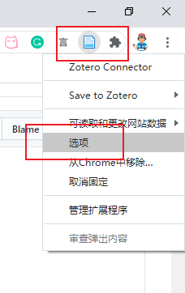
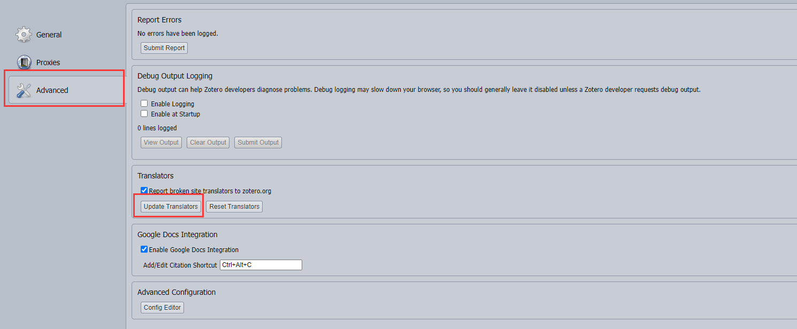

# 如何手动更新 Translator

在使用 Zotero 的过程中，我们经常需要更新 translators 来实现对文献的快速抓取。在许多时候我们可以通过 茉莉花 插件快速完成该操作，但部分时间当茉莉花插件出现故障无法完成自动更新时，我们就需要手动下载新版的 translators 文件，并进行手动更新。

1. 在 Zotero-编辑-首选项-高级-文件和文件夹 找到自己的数据储存位置。

    例如，下图中的数据储存位置就是 `E:\Zotero File`，这里也可以点击“打开数据文件夹”快速打开你的数据文件夹。
    

2. 找到数据文件夹中的 translators 文件夹（对上图而言就是 `E:\Zotero File\translators`），这里是 Zotero translators 的存放位置

    

3. 在 [Zotero translators 中文维护小组](https://github.com/l0o0/translators_CN) 下载最新的 translators
    

4. 将下载的 zip 文件解压后选择其中所有的 translators 文件（.js 文件），并复制
    

5. 将所有的 translators 粘贴到第 1 步中 translators 文件夹并替换，此时已经完成 Zotero 中 translators 文件的更新
    

6. 更新浏览器中的 translators

    更新时请多点几下，根据经验，也可多重启几次 Zotero 或浏览器。

    

    

此时你已经完成了 translators 的更新，此时如果你的浏览器仍然不能完成对文献的识别，在确保步骤1-4正确的前提下，可重复几次步骤 5。
