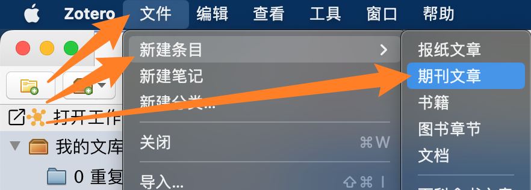
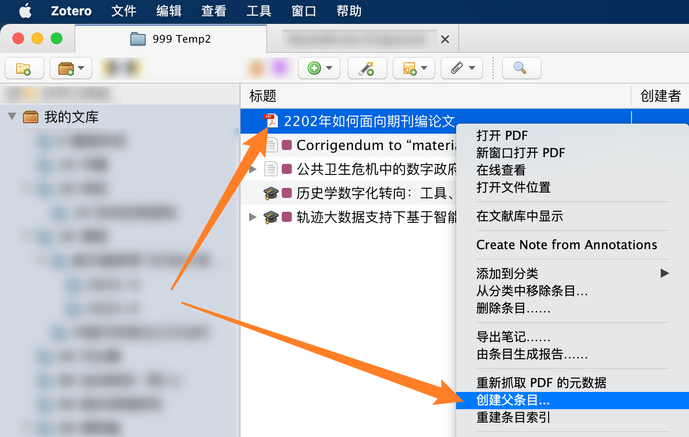
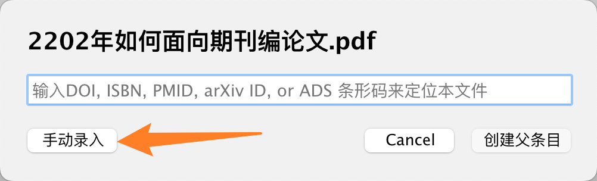
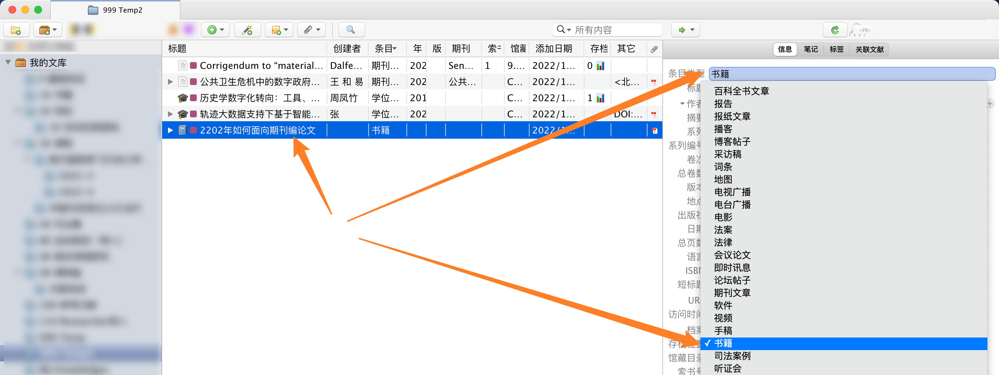
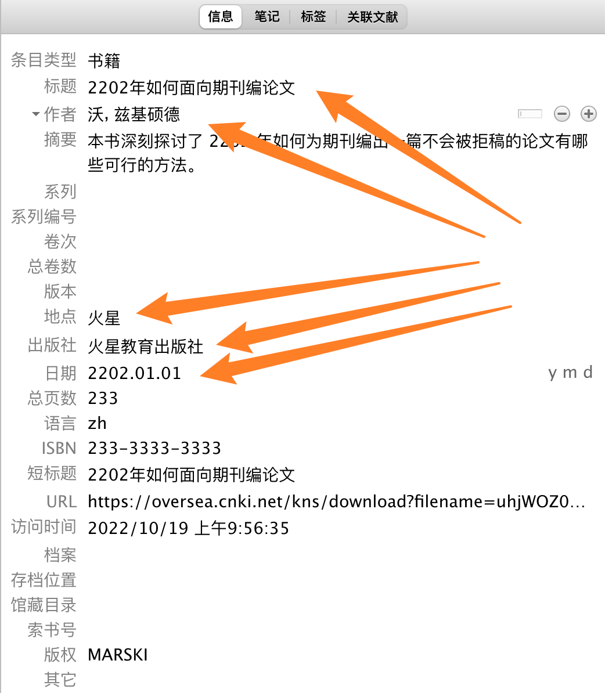

# 添加条目的进阶方法

如果以上常用方法均无法成功获得文献条目，Zotero 也提供了更多进阶方法来获得条目。

## 由通用格式的引用信息导入（通用方法）

大多数学术网站均提供了将文献信息导出为通用格式的功能。如果 Zotero Connector 无法直接从网页抓取文献信息，可以试试从网站上导出通用格式的引用信息，然后再在 Zotero 直接导入这一引文信息，最后再手动将附件附在导入的条目上。这里有 Zotero 支持导入的格式列表：
[How do I import BibTeX or other standardized formats?](https://www.zotero.org/support/kb/importing_standardized_formats)

::: tip

本方法可以用来从网站/其他软件批量导出/迁移文献信息至 Zotero。

:::

::: warning

请注意，此方法导入的**只有文献信息，是不会包含附件的。**

- 对于 **外文** 文献：你可以右键点击导入后的条目，然后点击“找到可用的 PDF”按钮，由 Zotero 查找可用的附件。如果你安装有 Sci-Hub 插件，也可以借助该插件来补充附件。
- 对于 **中文** 文献：知网以外的中文文献基本没有自动补充附件的可能。
<!-- 你可以借助茉莉花插件来为从知网获取的条目抓取附件。 -->

**请尽量避免批量为多个条目抓取附件！** 批量抓取可能导致你被风控或封禁（特别是知网）。

:::

这里以一篇万方上的学位论文为例简要介绍一下这一方法：

1. 打开论文的详情页，点击 `引用` 按钮；

2. 选择一个 Zotero 支持的通用格式；

    

3. 下载包含引用信息的文件/复制包含引用信息的文本（具体操作因网站不同而略有区别）；

4. 在 Zotero 文献列表页面点击 `文件/File` -> `导入/Import` 或 `从剪贴板导入/Import from Clipboard` （根据你的实际情况选择使用哪个功能）；

    

5. 根据界面提示完成导入（这里以通过文件导入为例演示）；

    {width=60%}

    {width=60%}

    {width=60%}

6. 导入完成后，该条目会混入文库中。你可以在左边栏分类列表最下面的 `未分类条目/Unfiled Item` 中按照年份排序来方便地找到刚刚导入的条目，将其拖入你需要的分类中：

    

::: tip

1. 这样导入基本意味着无法自动抓取附件（毕竟，对于好抓取附件的网站，也不会这么难导入）。你需要手动下载附件，然后将附件添加到这一条目上。详见[添加附件教程](./add-items.md#添加附件)；

2. 不同导出格式里的信息可能略有差异，而且可能都不完整甚至有错，你可以后续自己手动编辑右边栏中的 `信息/Info` 进行调整；
   > 以万方为例， **RefWorks** 格式导入的结果中 `分类/Type` 信息是分类号（TP311.52），而不是学位类型（硕士/博士）； **EndNote** 格式的结果中将导师姓名也写入了作者列表，而且将两个导师的姓名直接写成了第二作者的姓和名； **Bibtex** 格式的结果中没有摘要，而且分类写为了硕士论文。

3. 你也可以去百度学术这一类的受支持的通用检索网站抓取/导出引用信息。

4. 有条件的话尽量还是直接从网页上抓取，毕竟这么导入有可能出现各种填写不规范的情况，也可能缺少一些信息。

:::

## 手动创建条目（万能方法）

如果你的文献非常特殊，全网也检索不到（比如一些古籍），你依然可以使用纯手动的方法为它创建一个条目。

1. 新建一个空白条目；

- 如果你目前还没有这篇文献的文件，可以直接点击菜单栏里的 `文件` -> `新建条目` ，然后选择你所需的文献类型（此处以最常见的 `期刊文章` 为例）：

    {width=60%}

- 如果你已经在 Zotero 文库中添加了文献的文件，可以右键点击这个文件，然后点击 `创建父条目...` ，并在弹出的窗口中点击 `手动录入` ：

    {width=60%}

    {width=60%}

1. 在右边栏里完善文献信息。

    创建了条目后，Zotero 会自动选中这一新建的条目，此时你可以在右边栏里修改这个条目的类型，也可以完善这个条目的详细信息（也就是这篇文献的元数据）。为了正确地引用这个条目，不漏掉信息，请尽可能全面地填写右边的信息（当然，如果这是你自己的一篇文档，或者是个 PPT，未来也不会用于再文献里引用，那就无所谓了）。

- 先将条目修改为正确的文献类型（这里以书籍为例）：

    

- 然后手动填写文献的相关信息（如标题、作者、发布日期……）

    {width=60%}

## 从其他工具导入

Zotero 可以将条目从 EndNote、Mendeley、Word 引用 等地方迁移到库中，详情请参阅 [从其他工具导入条目到 Zotero](./import-from-other-software.md)。
