# 添加条目

## 条目与附件

在使用 Zotero 之前，我希望可以引入几个术语：

### 条目 Item

Zotero 的基本文件单元，用来表示一篇论文、一本书等的题录信息，引用时使用的条目中储存的信息。下面是一些常见的条目类别：

|                       图标                       |   类型   |
| :----------------------------------------------: | :------: |
|                                                  |   默认   |
|  | 普通网页 |
|  | 期刊文章 |
|          | 会议论文 |
|    | 学位论文 |
|                  |   图书   |
|    | 多个项目 |

### 附件 Attachments

附件，通常是文件，例如论文的全文 PDF、支持材料等。常见的附件包括：

- PDF 附件 
- 笔记附件 
- 网页快照 

附件既可以作为独立项添加，也可以作为常规 Zotero 条目的子项添加。一般来说，文件当做条目的子项添加。当一篇文献只有附件而没有条目的时候是不能被成功引用的，而一篇文献有条目信息而没有附件时，并不影响正常的引用。

## 添加条目

### 通过浏览器添加条目（推荐）

::: tip

使用这种方法需要确保以安装浏览器插件 Zotero Connector。如未安装，请参考：[Zotero 下载与安装](install.md) 。

:::

通过浏览器添加条目是最方便的途径之一，也是 Zotero 的特色功能之一。

当所在的网页呈现出不同的内容类型时，Zotero Connector 会显示不同的图标（各种类别的图标见 [#条目-item](#条目-item)）。例如，如果打开的是一篇期刊文章，那么图标就会变成下图（红框圈出）。

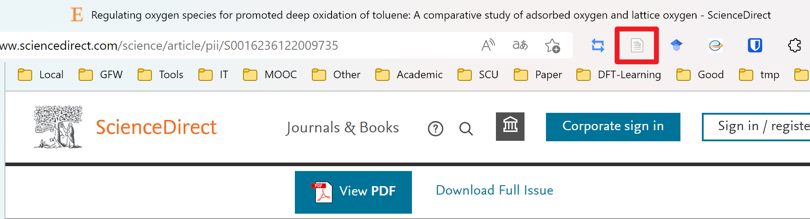

点击该图标，将在网页右上角显示如下的对话框，选择保存的合集位置，添加标签，即可将网页对应的文献的元数据录入 Zotero ：

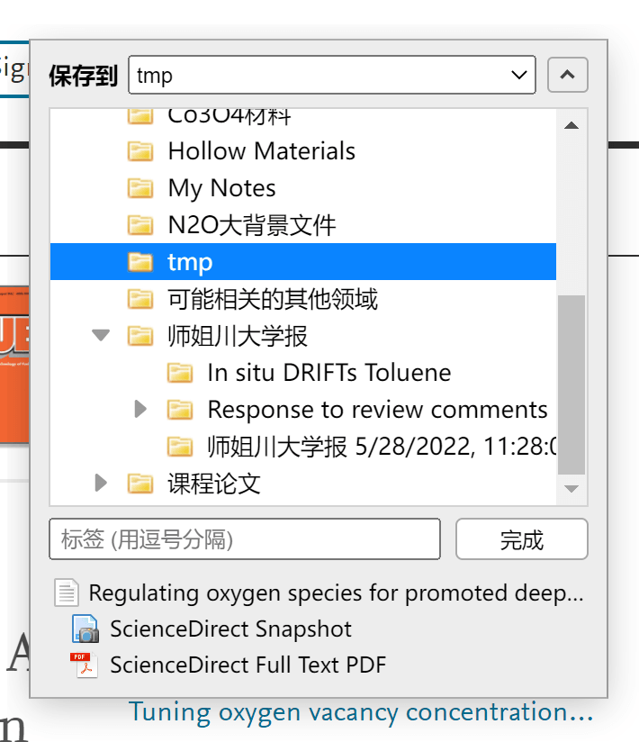

此时打开 Zotero，将会自动定位到保存时选择的合集：

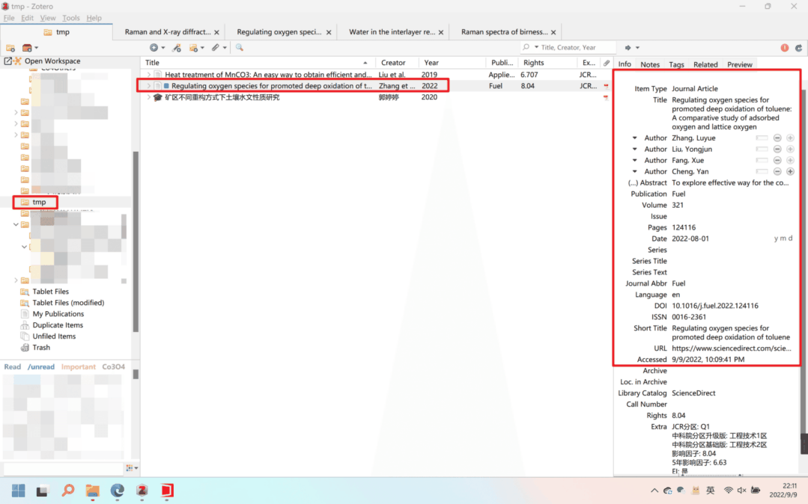

::: tip

Connector 抓取中文文献能力依靠中文 Translator 支持，更新 Translator 请参考：
[如何更新 Translator](./faqs/update-translators.md)。

Connector 抓取文献错误解决：[从浏览器抓取条目时发生错误 / 抓取时不能自动下载 PDF / 无法自动给添加的 PDF 附件创建条目](https://zotero.yuque.com/staff-gkhviy/zotero/mribmi?view=doc_embed)

如果抓取失败且尝试了上述办法仍然不能解决，请手动下载 PDF 附件并通过附件添加条目。

:::

### 通过附件添加条目（推荐）

对于已有 PDF 文件的文献，可以通过将 PDF 文件拖拽到 Zotero 中来添加这篇文献的附件。添加附件后，Zotero 会自动通过 PDF 来识别文献 —— 英文文献通常通过识别 PDF 的元数据，中文文献则识别文件名（中文文献文件识别能力由 茉莉花 插件提供）。

::: note 小提示

不管是中文文献还是英文文献，都 **存在一定的概率无法成功匹配到信息并自动创建条目** 。如果遇到问题了，还是 **建议回到期刊官网的论文详情页抓取信息并创建条目** ，然后将 PDF 文件以附件的形式添加到该条目上（将附件拖到该条目上即可，但不要拖到条目之间的间隙里）。如果 Zotero 确实不支持抓取你正在使用的网站，你也可以采用后文的进阶方法创建条目。

如果您通过附件添加条目信息，建议您在添加后检查每一个条目的元数据。这一功能自动匹配的元数据可能存在错误，建议人工核对后再使用。

:::

#### 英文文献附件自动识别

很多英文文献的 PDF 附件中带有论文的元数据，而 Zotero 也支持通过 PDF 附件中的元数据自动抓取文献信息并自动创建副条目。具体操作如下：

1. 从网页上下载好文献的 PDF 附件。

2. 将 PDF 附件 直接拖入 Zotero 文献列表中的空白区域。

   ::: details 列表种没有空白区域了怎么办？

   如果页面上没有空白区域了，可以 将附件拖到任意两个条目中间的间隙处 ，此时相邻条目间隙处会出现一个横线，如上图所示。请不要将附件直接拖到条目上，因为拖到条目上是另一个功能：将这一文件作为附件添加到该条目中。

   

   :::

3. 此时，界面右上角同步按钮旁会多显示一个图标，这意味着 Zotero 正在检索并匹配这一条目信息。

   

4. 匹配完成后，Zotero 会自动使用元数据创建父条目，并将这一 PDF 文件作为附件添加到新生成的条目中。

   

:::: details 重新抓取外文 PDF 元数据

如果你 **之前添加的外文附件未能自动创建父条目** ，你也可以使用这一功能来重新 **手动触发一次检索匹配** ：

1. 右键点击 **不附属于任何条目的 PDF 附件** 。

2. 点击 检索元数据。

   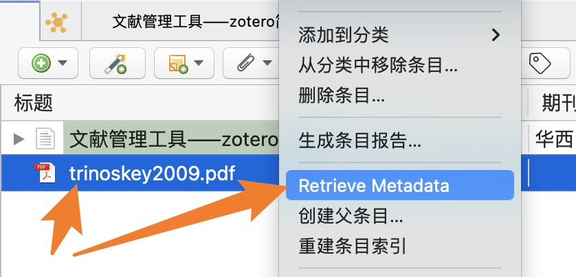{width=60%}

   Zotero 会弹出一个元数据检索窗口显示检索进度。如果检索完成后仍有部分文件检索失败，这意味着 Zotero 无法为这一文献自动检索元数据，请使用其他方法获取文献元数据。

   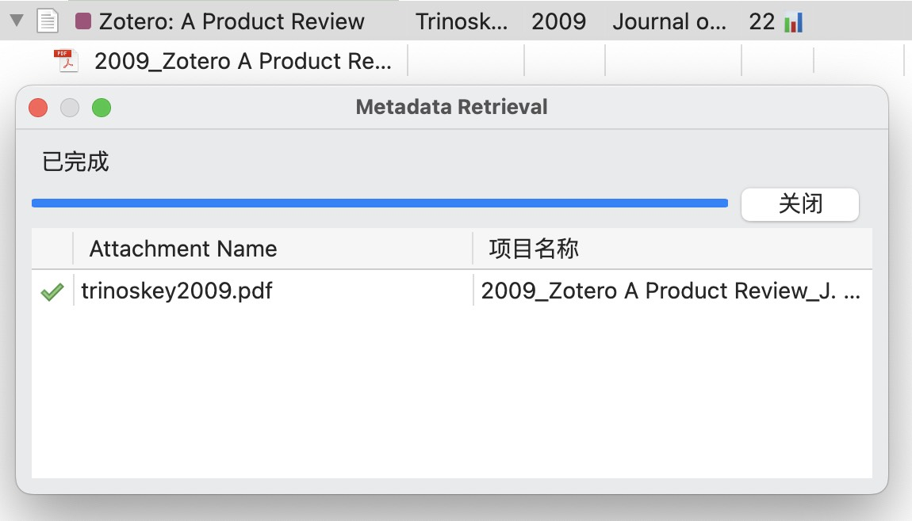{width=60%}

   ::: tip

   请注意，这一功能仅对不属于任何条目的附件文件有效 。如果这一附件已经有了条目了，也就不能重新触发抓取了。右键菜单里不会出现 检索元数据 按钮。

   :::

::::

#### 中文文献附件自动识别

::: info 中文 PDF/CAJ 识别依赖茉莉花插件

中文论文的 PDF/CAJ 附件中通常并没有完善的论文的元数据，Zotero 本身也并不支持为中文文献抓取元数据。

对于中文文献，茉莉花（Jasminum）插件 可以 通过 **文件名** 自动检索元数据并创建条目。 **添加附件的方式与英文文献相同** ，文献添加后茉莉花会自动检索文献、创建条目并将附件移动到条目中。

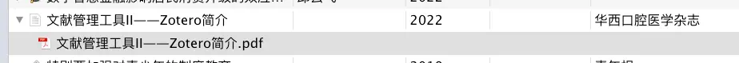

如果你没有安装茉莉花，请前往 [插件商店](https://plugins.zotero-chinese.com) 下载安装插件。关于什么是插件，请参阅 [关于插件](./plugins/about-plugin.md)。

:::

由于为中文文献抓取知网元数据时需要根据文件名检索文献信息， 这一功能对文件名的要求较高。具体要求请看如下说明：

1. 文件名的格式完全符合茉莉花插件设置中的格式（中文文件名必须为：应该是 `标题_第一作者.pdf` 或 `标题_第一作者.caj`）。不是该命名格式的文件将直接导致识别失败。

   ::: details 修改文件名识别模板

   文件名的命名格式 （用于匹配导入附件的文件名中的文献信息）可以在 Zotero 首选项中茉莉花插件的设置中的 文件名模板设置 进行修改。这里 **默认的设置内容和知网上直接下载下来的文件名是一致的。**

   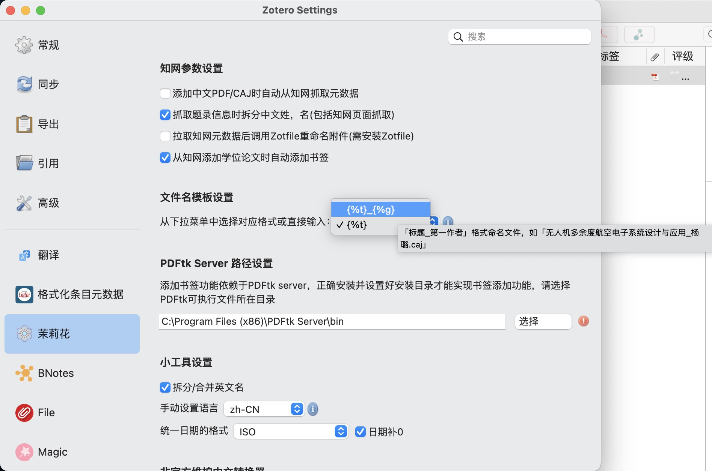

   :::

2. 标题/姓名内容中不含（以下划线为代表的）特殊标点符号（可以尝试将这些符号替换为空格再尝试检索匹配）

3. 文件名没有被添加额外的内容（如重复文件自动添加的编号或 xx 看图王一类的无关信息）。

   如果文献名称比较特别，或文件名里有标点，或者文件名被编辑过，都很有可能会匹配失败并报错。 如下图所示：

   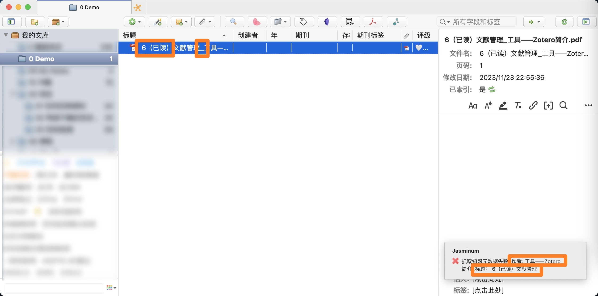

如果因附件名称不规范导致抓取失败，建议你去网页上检索这篇文献并抓取文献信息（元数据），再把这一附件拖入刚刚抓好的文献条目里。

你也可以先将文件名更改成符合前面规定的样子，在 Zotero 中先选中 PDF 附件，然后去右边栏中编辑文件名，并 **勾选上“重命名相关文件”** ，然后再尝试前文提到的手动触发检索匹配：

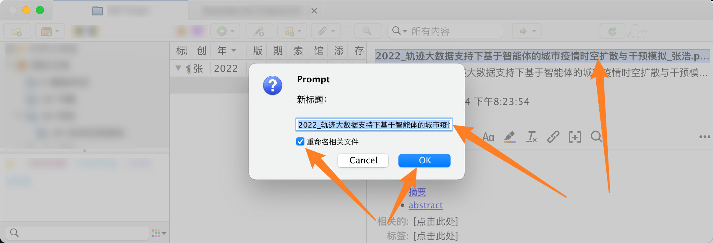

::: warning 请不要一次性大批量导入文献

请务必注意，如果一次性导入的文献过多， **自动检索元数据过于频繁依然可能导致被知网风控** 。如果需要导入的文献很多，建议分多次进行，每次仅少量导入一小部分文献。

:::

:::: details 重新抓取中文 PDF/CAJ 元数据

如果你 **之前添加的中文附件未能自动创建父条目** ，你也可以使用这一功能来重新 **手动触发一次检索匹配** ：

1. 右键点击 **不附属于任何条目的 PDF/CAJ 附件** 。

2. 点击 知网助手，然后点击 抓取知网元数据。

   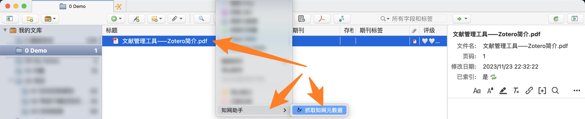

   ::: tip

   请注意，这一功能仅对不属于任何条目的附件文件有效 。如果这一附件已经有了条目了，也就不能重新触发抓取了。右键菜单里只会有 更新知网引用数 的功能。

   :::

::::

### 通过标识符添加条目

如果已知文献的 ISBN、DOI、PMID 或 arXiv ID 等标识符， 则可以通过这些标识符将文献导入到 Zotero 中。

在 Zotero 中，点击， 输入标识符，如 DOI: 10.1016/j.cej.2020.125798，然后回车，则对应的文献就会被导入到库中。

如果要一次输入多个标识符，在输入第一个标识符后按 Shift + Enter 会进入多行模式，随后输入其余标识符（每行一个），并通过 Enter 换行。输入完成后，再按 Shift + Enter 即可一次导入所有项目。

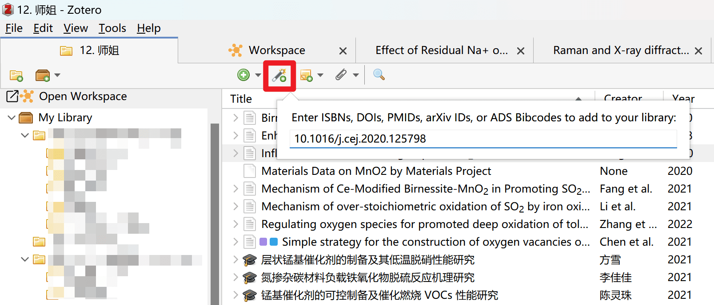

::: tip

这一功能对中文文献（论文、书籍等）基本无效。请使用其他方式为中文文献添加条目。

:::

### 更多方法

如果以上常用方法均无法成功获得文献条目，Zotero 也提供了更多进阶方法来获得条目。相关教程请查看 [手动导入或创建条目教程](add-items-adv.md)。

若需要从其他引文管理器迁移到 Zotero，请参阅 [从其他软件导入](./import-from-other-software.md)。

## 编辑条目

::: tip 始终及时校准条目

使用 Zotero（或任何其他参考文献管理器）进行引用时，在将项目保存到库中后，应始终检查项目的准确性。

Zotero 并不能保证自动抓取的数据 100% 正确，有时 Zotero 收到的元数据是不完整或不正确的。

我们应始终意识到这个问题，养成导入后随手校正的习惯。

需要注意的字段请见下“编辑条目”小节。

:::

从以上方法导入的数据并不一定是完全正确的，最好养成导入条目后随手校正的习惯。

如下图所示，在中心窗格中选择一个条目后，右侧（标准视图）或下侧（堆栈视图）会显示该条目的书目信息。多数条目都可以直接单击进行编辑，更改自动保存。


以下是一些比较特殊的字段，拿出来单独介绍：

### 条目类型

请尤其注意这一个选项，这直接决定在引用时，该条目以什么方式出现。且该项在通过浏览器导入时非常容易出错。

最典型的错误就是将“期刊文章/学位论文”等识别为“网页”。这会导致部分引文格式后出现 `[EB/OL]` 等文献标识符。

这时我们应该重新导入或手动更正。

### 期刊缩写

部分期刊要求使用“期刊标题的缩写”进行引用，Zotero 将“期刊名全称”和“期刊名缩写”分别保存在“期刊”和“期刊缩写”两个字段中。

抓取时不一定能准确获得期刊缩写，写论文引用前最好校正一下。

通常期刊缩写的差别多数在于加不加 `.`，例如“Applied Surface Science”可以缩写为“Appl Surf Sci”或“Appl. Surf. Sci.”。我们建议总是存储为加 `.` 的格式。因为去掉 `.` 总是比加上 `.` 更方便，在引用时，对于需要不加 `.` 的期刊就可以通过 CSL 直接去掉 `.`。

::: tip 插件推荐

插件 [Linter for Zotero](https://github.com/northword/zotero-format-metadata) 提供了自动获取期刊的 ISO 4 缩写的功能，可前往 [插件商店](https://plugins.zotero-chinese.com)下载安装。

:::

### 标题

#### 标题中的上下标

```html
<sub>下标内容</sub>
<sup>上标内容</sup>
<i>斜体</i>
<b>粗体</b>
```

详细请参阅：[在 Word 参考文献表中实现斜体及上下标效果](./faqs/word-addon.md#参考文献中论文题目实现斜体及上标下标效果)。

::: tip 插件推荐

插件 [Linter for Zotero](https://github.com/northword/zotero-format-metadata) 提供了辅助输入这些富文本标签的功能，可前往 [插件商店](https://plugins.zotero-chinese.com)下载安装。

:::

#### 标题的大小写

我们建议您始终将标题以“句子大小写”的形式存储在 Zotero 库中，这有利于 CSL 进行格式转换。

什么是“句子大小写”？

```plain
- 标题大小写：Mechanism of Ce-Modified Birnessite-MnO<sub>2</sub> in Promoting SO<sub>2</sub> Poisoning Resistance for Low-Temperature NH<sub>3</sub>-SCR
- 句子大小写：Mechanism of Ce-Modified Birnessite-MnO<sub>2</sub> in promoting SO<sub>2</sub> poisoning resistance for low-temperature NH<sub>3</sub>-SCR
```

### 额外

所有其他自定义字段均应保存在“额外”字段，保存在该字段的数据应为若干个键值对，每行一个。CSL 引用时可以通过键来调用值。

## 添加附件

- 存储的附件：默认情况下，存储文件存储在 Zotero 数据目录中，Zotero 会自动管理它们，包括在 Zotero 中删除附件项时删除它们。如果使用文件同步功能，Zotero 会自动在设备之间同步存储的附件，并将它们储存在官方网盘（或 WebDAV 网盘）中。
- 链接的附件：对于链接文件，Zotero 只存储指向计算机上原始文件位置的链接。链接文件不会同步，如果附件项在 Zotero 中被删除，链接文件也不会被删除，Zotero 程序也不支持链接文件的同步。（可以简单理解为链接的文件在 Zotero 中作用类似于 Windows 的快捷方式）

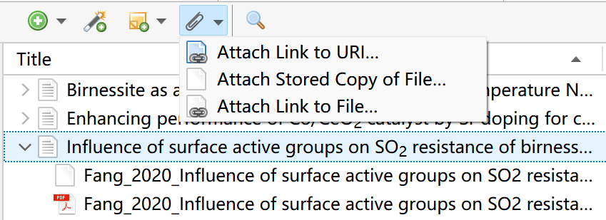
