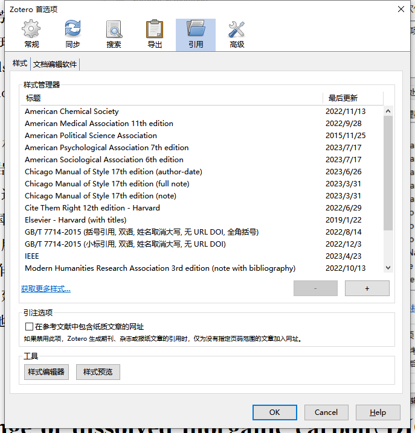
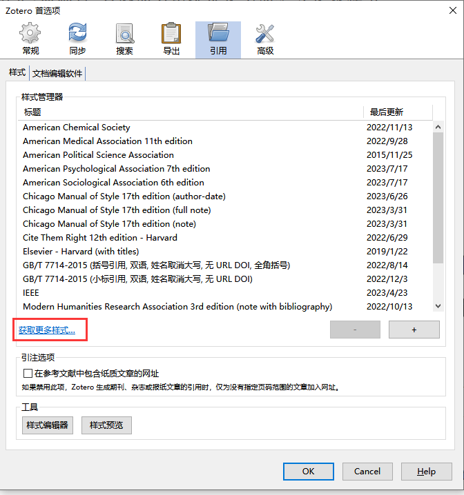
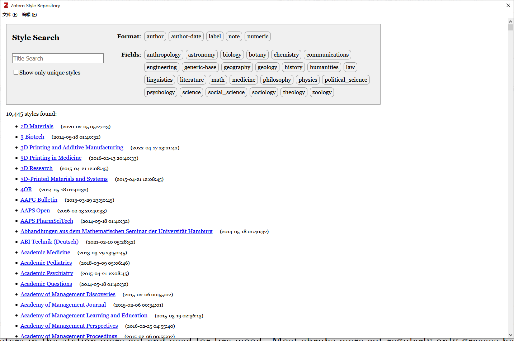

# 引文的样式

Zotero 使用 Citation Style Language 来生成引文格式，Zotero 官方提供了一组 CSL 格式，可以在 Zotero 内下载安装。但是官方的引用格式对国内期刊支持不全，且目前（CSL 1.0.2）仍未支持双语排版（“et al”与“等”混排），所以国内有热心开发者维护了一份第三方引文格式，读者可以按需下载使用。

## 官方引文格式下载

1. 打开 Zotero 软件，选择“编辑—设置”，在弹出窗口中选择“引用”

   

2. 若样式管理器中无符合的样式，可以通过“获取更多样式”，搜索期刊名，即可导入期刊要求的样式

   

   

## 第三方引文格式

如果上述引文格式不符合你的要求，可到[中文 CSL 样式](https://github.com/redleafnew/Chinese-STD-GB-T-7714-related-csl#readme)下载更多 CSL 引文格式：

1. 首先你需要在 [中文 CSL 样式](https://github.com/redleafnew/Chinese-STD-GB-T-7714-related-csl#readme) 页面上找到合适的 CSL 样式，并记住其名称，然后将引文格式下载下来：

   

   ::: warning

   注意需要在 Zotero 处于启动状态时点击，可以直接安装。若 Zotero 没有弹出窗口，则右击 - 另存为，将其保存为 `.csl` 文件，然后双击打开 CSL 文件。

   :::

   ::: tip

   如果上面的网站无法打开，可以访问镜像站：<https://gitee.com/redleafnew00/Chinese-STD-GB-T-7714-related-csl>

   :::

2. 在弹出的窗口中点击“确定”后即可将想要的引文格式添加到 Zotero，供后续引用使用。

   

   
