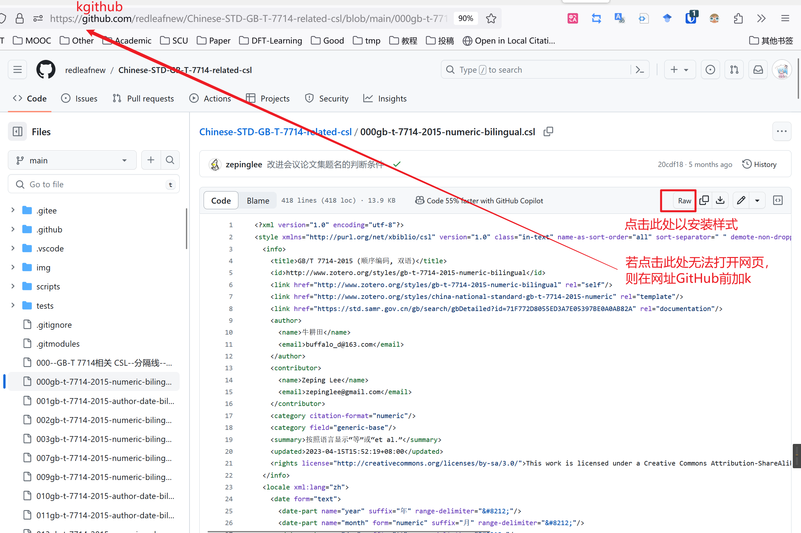
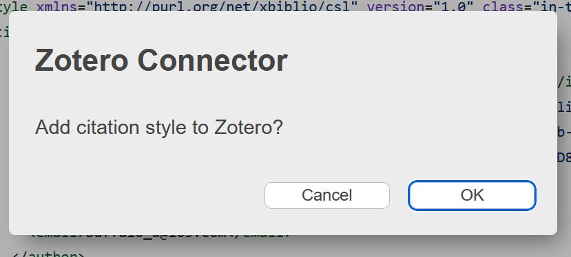
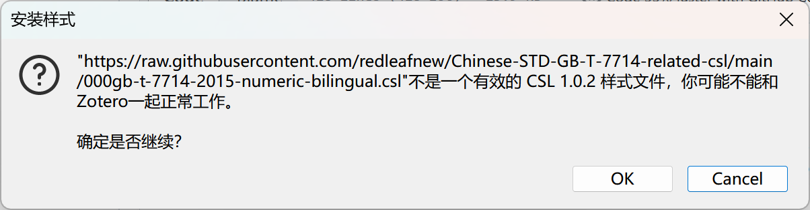

# 引文的样式

Zotero 使用 Citation Style Language 来生成引文格式，Zotero 官方提供了一组 CSL 格式，可以在 Zotero 内下载安装。但是官方的引用格式对国内期刊支持不全，且目前（CSL 1.0.2）仍未支持双语排版（“et al”与“等”混排），所以国内有热心开发者维护了一份第三方引文格式，读者可以按需下载使用。

## 几个术语

- 引注 Citation：
- 参考文献表 bibliography：
- 样式 / CSL 样式：

- 顺序编码制 num：
- 作者-年份 author-data：
- 脚注制 note：

## 官方引文格式下载

打开`编辑`——`设置`——`引用`——`获取额外样式`

在该对话框中键入需要的样式的关键词，通常是期刊的名称，下方会列出符合项。

鼠标悬浮在标题上会显示预览。

单击标题即可安装样式。

尽管官方仓库以及收录了数万个期刊的样式，但大部分中文期刊仍未在官方仓库中出现，因此，开源社区有维护一份 CSL 中文仓库，见下。

## 第三方引文格式

如果上述引文格式不符合你的要求，可到[中文 CSL 样式](https://github.com/redleafnew/Chinese-STD-GB-T-7714-related-csl#readme)下载更多 CSL 引文格式：

1. 首先你需要在 [中文 CSL 样式](https://github.com/redleafnew/Chinese-STD-GB-T-7714-related-csl#readme) 页面上找到合适的 CSL 样式，并记住其名称，然后将引文格式下载下来：

    

    ::: warning

    注意需要在 Zotero 处于启动状态时点击，可以直接安装。若 Zotero 没有弹出窗口，则右击 - 另存为，将其保存为 `.csl` 文件，然后双击打开 CSL 文件。

    :::

    ::: tip

    如果上面的网站无法打开，可以访问镜像站：<https://kgithub.com/redleafnew/Chinese-STD-GB-T-7714-related-csl#readme>

    :::

2. 在弹出的窗口中点击“确定”后即可将想要的引文格式添加到 Zotero，供后续引用使用。

    

    
