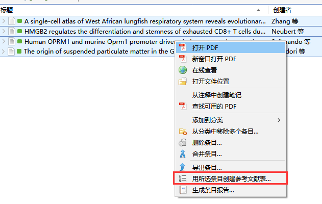
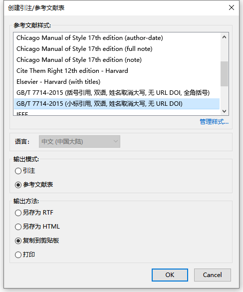
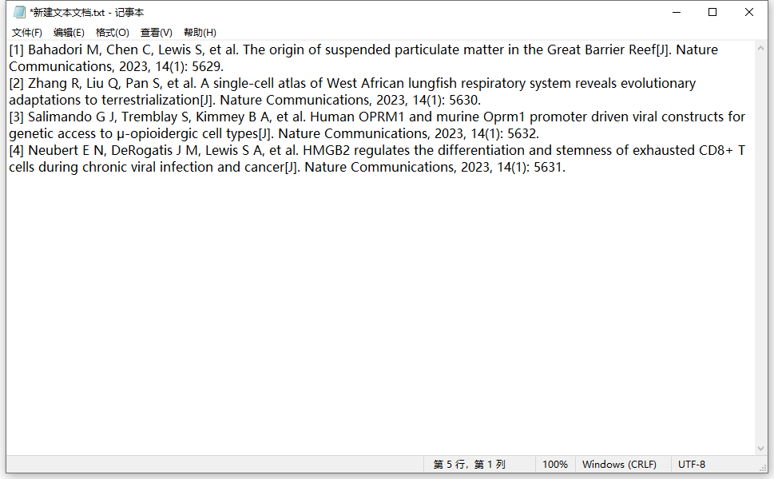

# 直接生成参考文献表

除了前述的在文字处理器中添加引文外，Zotero 也提供了直接导出参考文献表的方法：

::: tip 什么时候使用这种方法？

- 分享文献引文
- 需要在 PowerPoint 中添加参考文献表
- 只是想用文章快速生成参考文献，不想使用 Word 插件

:::

1. 先选择需要引用的文献

    

2. 右键，在菜单中选择 用所选条目创建参考文献表

    

3. 接着根据自己的需要选择需要的 参考文献格式 以及 输出方式

    

4. 如果上一步输出方式选择复制到剪贴板中，此时上述文献的参考文献表就已经复制好了，在任意位置粘贴即可看到。

    ::: info

    注意：参考文献表的顺序 与 第一步中选择文献的顺序有关

    :::

    
