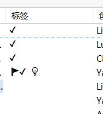
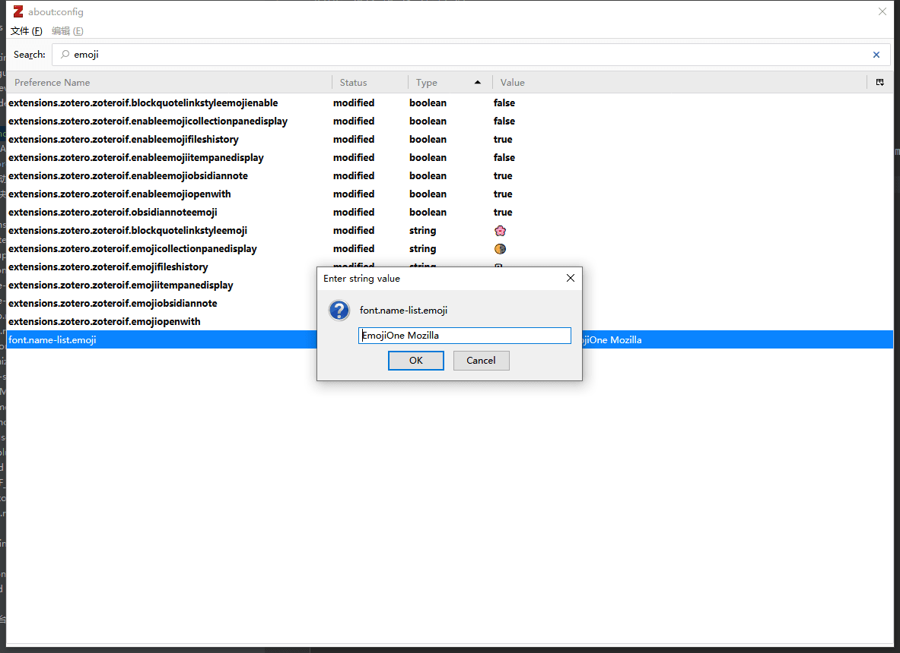

# Emoji变成黑白该怎么办

近期许多同学在系统更新后发现zotero中emoji变成黑白了，初步判断这是由于系统更新出现的问题。

该问题可以通过修改 zotero设置 来解决

具体操作步骤如下：

1. 在菜单编辑选择“首选项”：
   
2. 弹出如下图所示的对话框。
   点击“I accept the risk”
   
3. 在搜索框中输入 emoji，双击搜索到的 "font.name-list.emoji"，修改为"EmojiOne Mozilla"。然后重新启动 Zotero，即可解决问题。
   
4. Emoji 成功变回彩色，问题解决
   