# 如何更新 Translator

在使用 Zotero 的过程中，我们经常需要更新 translators 来实现从网页快速抓取文献信息。通常，我们可以借助 Zotero 本身的功能以及 茉莉花 插件快速完成该操作。但当 Zotero 或 茉莉花 插件出现故障无法完成一键自动更新时，我们也可以手动下载新版的 translators 文件，并进行手动更新。

::: note 提醒

这里的 translator 指的是 Zotero 从浏览器网页抓取文献信息时所需的转换器，在 Zotero 中有时也被称作是“翻译器”。如果你遇到的是语言翻译问题（如标题翻译、摘要翻译、文献阅读中的句段翻译等），通常与本文讲的 translator 无关，请参照 Translate for Zotero 插件的教程进行排查。

:::

## 方法 1：一键自动更新

1. 安装新版茉莉花插件

   更新 translator 之前请确保你安装的 茉莉花 插件已经是最新版本。如果你的 茉莉花 插件版本过低，更新可能会失败。最新的 茉莉花 插件安装包可在这里下载，然后覆盖安装即可：

   中文插件商店：[https://plugins.zotero-chinese.com/](https://plugins.zotero-chinese.com/)

   茉莉花 插件主页：[https://github.com/l0o0/jasminum](https://github.com/l0o0/jasminum)

   ::: tip

   如果你在安装插件中遇到问题，请阅读 [插件安装教程](../plugins/about-plugin.md) 。

   :::

2. 在 Zotero 首选项中，进入 高级 设置，点击下方“自动检查转换器和样式的更新”后面的 立即更新 按钮。

   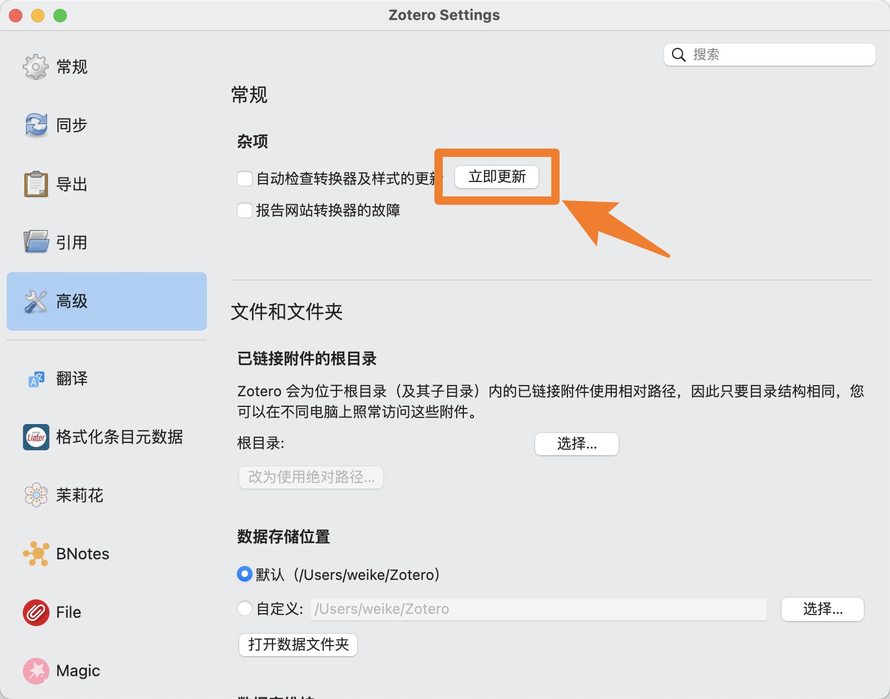{width=60%}

   ::: tip

   建议取消勾选“自动检查转换器和样式的更新”前面的复选框，这样可以避免非官方维护中文转换器被意外替换为官方的版本。如果遇到了文献抓取失败的问题，可再按照本文档的方法更新。

   :::

3. 进入 茉莉花 插件的设置，转到 非官方维护中文翻译器 部分，然后点击 更新全部 按钮。

   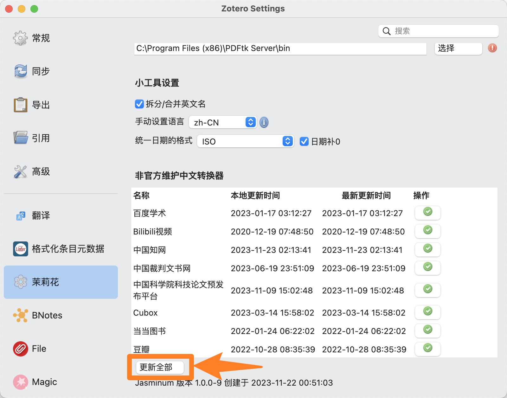{width=60%}

4. 更新 **每一个浏览器** 中 Zotero Connector 插件里的 translators。

   ::: details Google Chrome 和 Microsoft Edge

   1. 右键点击 Zotero Connector 按钮，然后点击 选项

      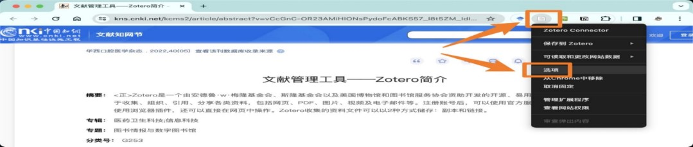

   2. 点击 Advanced 中的 Update Translators 按钮，**连续多点几（十）次**

      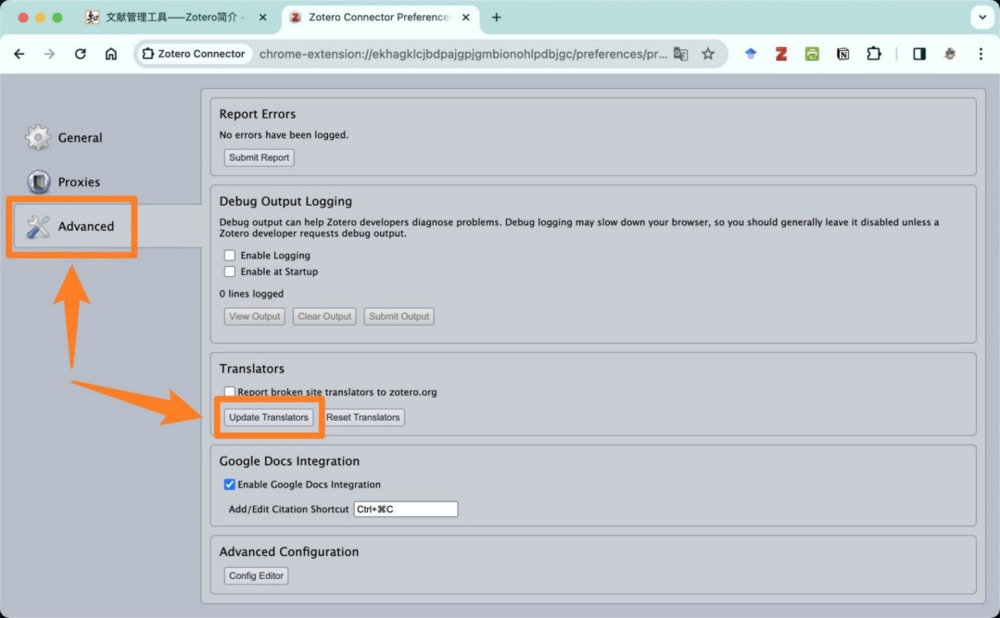

   :::

   ::: details Apple Safari

   1. 在网页空白处点鼠标右键，然后点击 Zotero Preference

      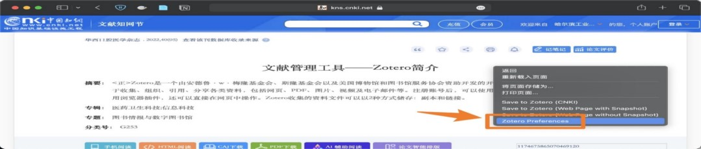

   2. 点击 Advanced 中的 Update Translators 按钮，**连续多点几（十）次**

      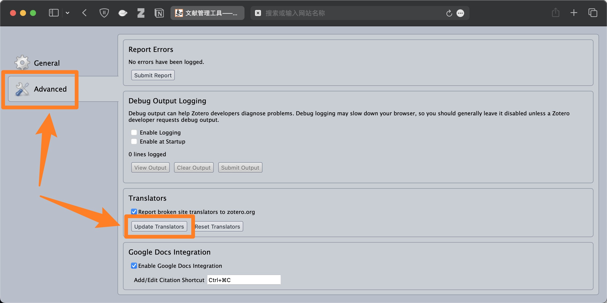

   :::

   ::: warning

   **这一步骤非常关键！** 请务必确保为 **每一个浏览器** 中的 Zotero Connector 插件更新 translators！

   点击 Update Translators 按钮时，请不要吝惜你的鼠标，经验上 **连续多点几（十）次** 通常更有效。

   :::

5. 重启浏览器。

6. 此时你已经完成了 translators 的更新。此时如果你的浏览器仍然不能完成对文献的识别，在确保步骤 1-5 正确的前提下，可重复几次步骤 4 和步骤 5 。

## 方法 2：手动替换文件更新

1. 在 Zotero-编辑-首选项-高级-文件和文件夹 找到自己的数据储存位置。

   例如，下图中的数据储存位置就是 `E:\Zotero File`，这里也可以点击“打开数据文件夹”快速打开你的数据文件夹。

   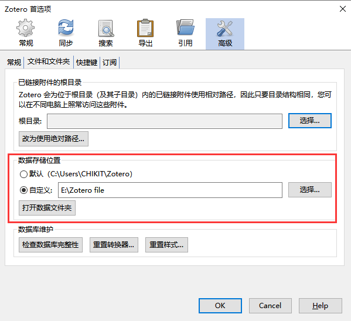

2. 找到数据文件夹中的 translators 文件夹（对上图而言就是 `E:\Zotero File\translators`），这里是 Zotero translators 的存放位置

   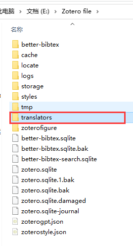

3. 在 [Zotero translators 中文维护小组](https://github.com/l0o0/translators_CN) 下载最新的 translators

   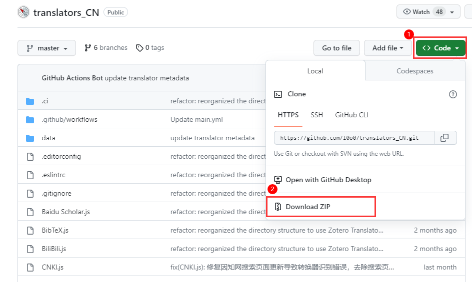

4. 将下载的 zip 文件解压后选择其中所有的 translators 文件（.js 文件），并复制

   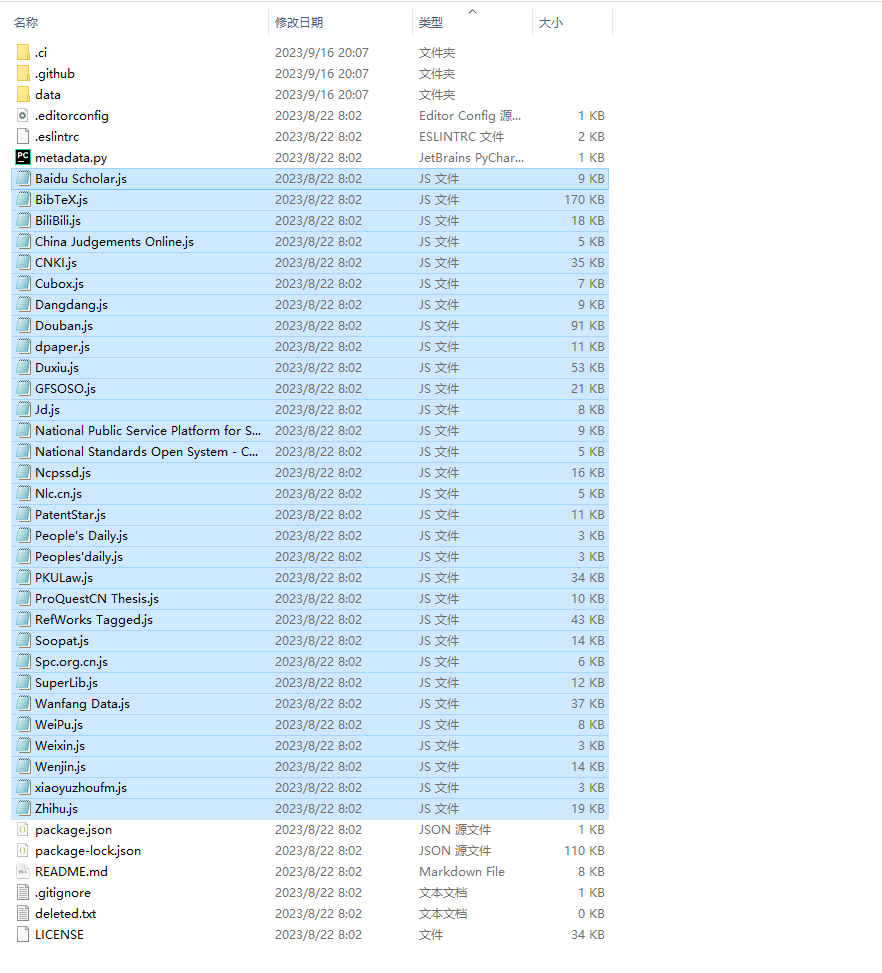

5. 将所有的 translators 粘贴到第 1 步中 translators 文件夹并替换，此时已经完成 Zotero 中 translators 文件的更新

   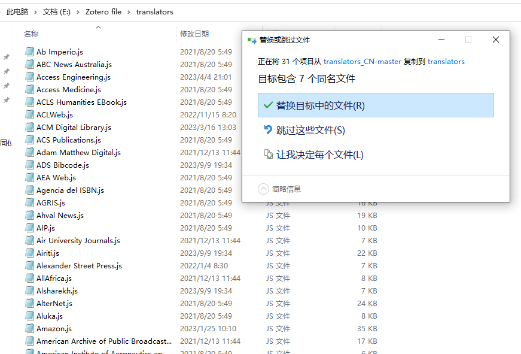

6. 更新 **每一个浏览器** 中 Zotero Connector 插件里的 translators。

   ::: details Google Chrome 和 Microsoft Edge

   1. 右键点击 Zotero Connector 按钮，然后点击 选项

      

   2. 点击 Advanced 中的 Update Translators 按钮，**连续多点几（十）次**

      

   :::

   ::: details Apple Safari

   1. 在网页空白处点鼠标右键，然后点击 Zotero Preference

      

   2. 点击 Advanced 中的 Update Translators 按钮，**连续多点几（十）次**

      

   :::

   ::: warning

   **这一步骤非常关键！** 请务必确保为 **每一个浏览器** 中的 Zotero Connector 插件更新 translators！

   点击 Update Translators 按钮时，请不要吝惜你的鼠标，经验上 **连续多点几（十）次** 通常更有效。

   :::

此时你已经完成了 translators 的更新，此时如果你的浏览器仍然不能完成对文献的识别，在确保步骤 1-5 正确的前提下，可重复几次步骤 6。
