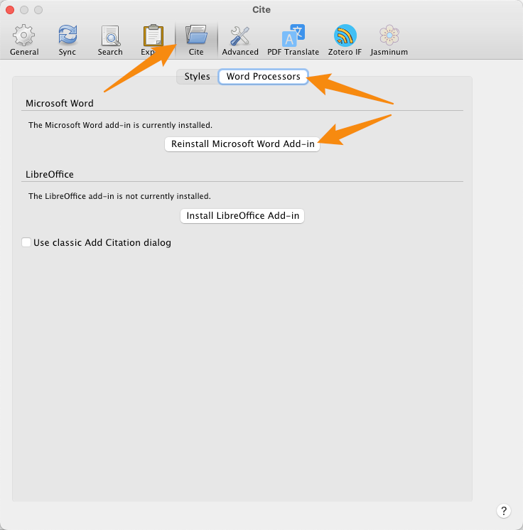
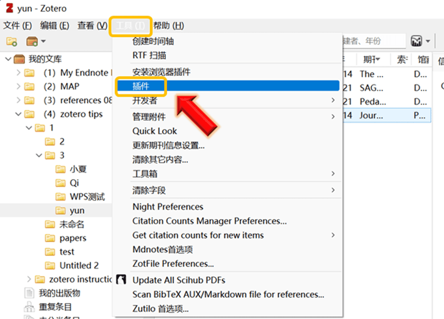
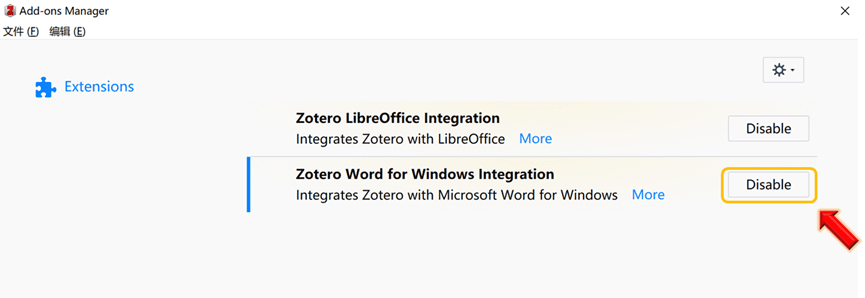
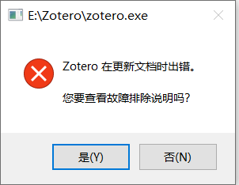
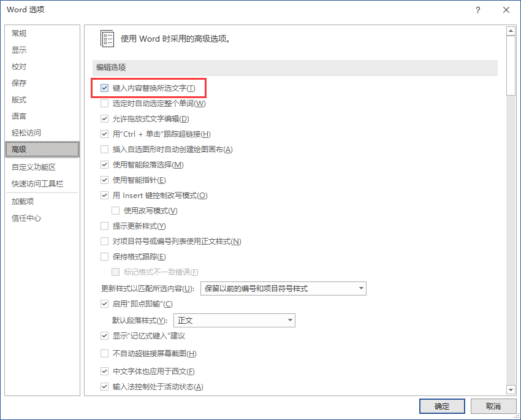
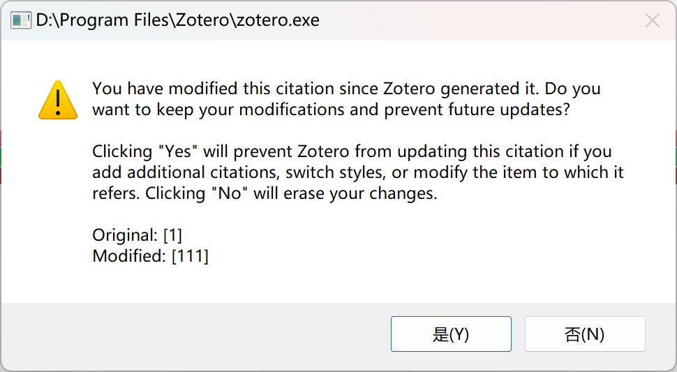
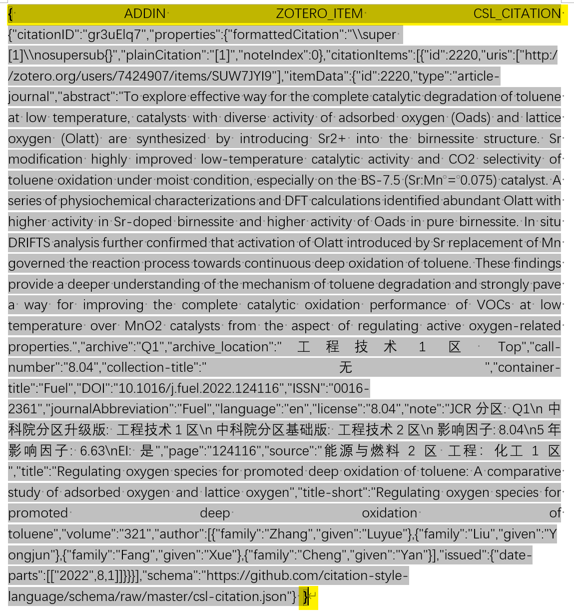

# 关于 Word 加载项的各种问题

本页面整理了一些使用字处理插件常遇到的一些问题，你可以在右侧大纲栏（部分窄屏设备也可能在左侧）快速定位到你需要的内容。

如果没有在本页面找到你需要的问题，可以参考官方文档 [Zotero 文字处理插件报告的一些问题以及可能的解决方案](https://www.zotero.org/support/word_processor_plugin_troubleshooting)。

如果仍没有找到你需要的问题，可以考虑在 Zotero 中文社区提问咨询或前往 Zotero 官方论坛发帖求助。

## 格式问题

由文字处理插件生成的引文和参考书目可能会以与周围文本不同的样式（字体、字体大小等）显示。可以通过更改默认样式来更改生成文本的外观。例如，在 LibreOffice 中，通过格式 → 样式和格式或按 F12 打开样式管理器。右键单击“默认”，选择“修改”，然后对此样式进行所需的更改。在 Word 中，在“格式”→“样式”中打开样式管理器，或者单击功能区“主页”选项卡上的“样式窗格”或“管理样式”按钮。

参考书目格式由您在 Zotero 文档首选项中选择的引文样式控制，并且应符合所使用样式的要求。可以通过编辑“Bibliography”（Word）或“Bibliography 1”（LibreOffice）文字处理程序样式来修改参考书目的格式。

## 参考文献中论文题目实现斜体及上标、下标效果

一些论文的题目需要在参考文献中表现为上标、下标或者斜体：如 CO~2~，H^+^、_Nature_，这该如何实现呢？

方式一：~~插入参考文献后在 Word 中手动修改，但是这种方法每次刷新后需要重新设置非常麻烦。~~（这是不正确的方式，不推荐）

方式二：在 Zotero 中修改该文献的条目信息，通过在题目中添加以下代码来实现上标、下标、斜体、加粗的效果，添加完后返回 Word 刷新引文：

```html
<sup>上标</sup>
<sub>下标</sub>
<i>斜体</i>
<b>加粗</b>
```

:::: details 示例

::: note 标题

`Influence of surface active groups on SO2 resistance of birnessite for low-temperature NH3-SCR`

`Influence of surface active groups on SO<sub>2</sub> resistance of birnessite for low-temperature NH<sub>3</sub>-SCR`

:::

::: note 参考文献表

[1] X. Fang, Y. Liu, L. Chen, Y. Cheng, Influence of surface active groups on SO2 resistance of birnessite for low-temperature NH3-SCR, Chem. Eng. J. 399 (2020) 125798. <https://doi.org/10.1016/j.cej.2020.125798>.

[1] X. Fang, Y. Liu, L. Chen, Y. Cheng, Influence of surface active groups on SO~2~ resistance of birnessite for low-temperature NH~3~-SCR, Chem. Eng. J. 399 (2020) 125798. <https://doi.org/10.1016/j.cej.2020.125798>.

:::

如上示例在 Zotero 条目信息中对需要为下标的单词两侧分别加上 `<sub>`和`</sub>`，回到在 Word 中点击 `Refresh` 刷新条目信息即可看到下标效果已经成功实现。


::::

::: tip 使用 Linter 插件快捷插入

插件 [Linter for Zotero](https://github.com/northword/zotero-format-metadata) 提供了辅助输入这些富文本标签的功能，可前往 [插件商店](https://plugins.zotero-chinese.com)下载安装。

:::

::: tip 使用 Quicker 快捷插入

使用 quicker 动作可以也可以方便的实现同样的效果：

- [添加斜体标识](https://getquicker.net/Sharedaction?code=98c3d460-22b5-49ab-99c2-08d9c6b06ad1)
- [添加加粗标识](https://getquicker.net/Sharedaction?code=dc815b9a-f463-4233-99c5-08d9c6b06ad1)
- [添加上标标识](https://getquicker.net/Sharedaction?code=dee60abc-d1f5-40ad-99c3-08d9c6b06ad1)
- [添加下标标识](https://getquicker.net/Sharedaction?code=b44c0592-89fa-41c2-99c4-08d9c6b06ad1)

:::

## Word 中没有 Zotero 选项卡

一些朋友在 Word 中的 Zotero 选项卡突然消失了，或者使用的时候报错要求重装/升级该加载项。 **这一加载项需要在 Zotero 首选项 中安装** 。具体步骤如下：

1. 保存好正在编辑的 Word 文档，并**彻底退出 Word**。
2. 打开 `Zotero 首选项`。
3. 在 `引用/Cite` -`文字处理软件/Word Processors` 中点击 `重新安装 Microsoft Word 加载项/Reinstall Microsoft Word Add-in` 即可完成安装/更新/重装。



:::warning

如果退出 Word 后重新安装这一加载项仍然报错，建议重启电脑后再尝试。

:::

若上图的【**文字处理软件/Word Processors**】没有内容显示，则需要在 Zotero 软件界面，单击打开【**工具/Tools**】-【**插件/Add-ons**】



找到【**Zotero Word for Windows Integration**】插件，确保其没有处理禁用状态。



## 报错“无法与 Zotero 通讯”

::: info 待办

:::

## Zotero 在更新文档时出错

::: tip

本小节在翻译 [官方文档](https://www.zotero.org/support/kb/debugging_broken_documents) 的基础上，进行了再次整合，以 Microsoft Word 为例进行操作。如果您使用的是 Google Docs 或者 LibreOffice ，可访问 [官方文档 | 排除文字处理器文档中的错误](https://www.zotero.org/support/kb/debugging_broken_documents) 获取帮助。

:::



如果您在尝试在一个**新的空文档**中使用 Zotero 时出错，请参阅 [文字处理器插件故障排除](https://www.zotero.org/support/word_processor_plugin_troubleshooting)。

如果您可以在新的空 Word 文档中插入引文，但在**现有文档**中使用 Zotero 时出现错误，可以按照以下步骤进行问题排查：

1. 检查 Word 设置

   在`文件-选项-高级`，勾选 `键入内容替换所选文字`，问题即可得到解决。
   如问题未得到解决，请按照后续步骤逐步进行排查。

   

2. 重启 Zotero 和 Word。

3. 确保您使用的是最新版本的 Zotero 和 Word。

4. 排除故障时，禁用 Word 中的修订功能，因为它在使用 Zotero 时会产生复杂的效果。
   如果在插入或修改 Zotero 引文时启用了修订功能，它可能会将文档中的许多或所有 Zotero 引文标记为已更改。如果您以前启用了修订功能，请尝试接受所有更改，看看这是否能解决问题。

5. 检查图片标题中的引用。Zotero 不会让你插入它们，但如果你将引用复制到标题中，这很可能是问题的根源。删除这部分引用。

6. 尝试将文档内容复制并粘贴到新文档中，以查看问题是否消失。您可能需要点击 `Document Preferences` 按钮，您的旧引用才会被识别。

7. 通过复制文件本身，而不是通过复制和粘贴内容，制作文档的副本，用于调试。

8. 如果在 Windows 上使用 OneDrive，请将文档的副本保存到本地硬盘，或者尝试删除文件名中的任何空格。OneDrive 会干扰插件的使用，请在使用 Zotero 过程中避免与 Onedrive 同时使用。

9. 打开复制的文件，检查切换到不同的参考书目样式后是否出现错误。

10. 如果文档有参考书目（bibliography,），请删除它后检查是否仍然出现错误。

11. 调试时，如果您在 Word 插件中使用字段模式，显示字段代码而不是格式化文本可能会有所帮助。为此，请在 Word 中按 Alt/Option-F9（或 Alt/Option-Fn-F9）。

12. **隔离有问题的引用。**
    在文档副本中，每次删除一半内容，看看错误是否仍然发生。如果没有，使用 "撤消" 恢复已删除的部分，然后尝试删除另一半。对出现错误的部分重复删除一半的过程，如果两个部分都出现错误，则随机选取一个。继续这样做，直到找到出现问题时必须存在的最小部分（最好只有一个引文）。从原始文档中删除孤立的引文，问题就会消失（除非有多个断开的引文，在这种情况下您需要重复该过程）。

## 您已经修改该引文，是否保留更改？



该弹窗通常是用户手动修改了引文或参考文献表，比如该弹窗即为某文献在文中编码为“[1]”，用户手动把它修改为了“[111]”，Zotero 再次刷新时会询问用户是否保留这些修改？

如果用户需要保留自己的修改，则点击“是 yes”，如果用户需要抛弃自己的修改，使用 Zotero 生成的内容，则需要选择“否 No”。

:::danger

注意：请谨慎选择“是 Yes”，该操作会让 Zotero 不再更新此处！

:::

::: warning

所有的引注顺序更改都应在 Word “引文编辑对话框”中进行，而不是手动修改！

所有的引注/参考文献表的样式修改都应在 CSL 文件中进行，而不是手动修改！

所有的条目信息，如作者、标题、期刊、期卷页等，都应在 Zotero 中更新条目，而不是手动在域代码上修改！

:::

如果已经点了 “是 yes”，Zotero 不再对这一处引文进行更新，而后续又想要 Zotero 对其更新，可以参照下一节。

### 使 Zotero 恢复对引文的更新

首先分析一下 Word 加载项 在 word 留下的域代码结构，以 [https://doi.org/10.1021/acscatal.0c05697](https://doi.org/10.1021/acscatal.0c05697) 为例，其正常插入 Word 后产生的域代码为：

::: details Zotero 引文在 Word 中产生的域代码截图



:::

其中标黄部分是标识这是一个 Word 域代码块的声明，可以不去管，重点在包含在其中的 json 内容，为了方便理解，将其格式化后显示如下：

::: details 上述可以正常更新的域代码格式化后的代码

```json
{
  "citationID": "gr3uElq7",
  "properties": {
    "formattedCitation": "\\super [1]\\nosupersub{}",
    "plainCitation": "[1]",
    "noteIndex": 0
  },
  "citationItems": [
    {
      "id": 2220,
      "uris": ["http://zotero.org/users/7424907/items/SUW7JYI9"],
      "itemData": {
        "id": 2220,
        "type": "article-journal",
        "abstract": "To explore effective way for the complete catalytic degradation of toluene at low temperature, catalysts with diverse activity of adsorbed oxygen (Oads) and lattice oxygen (Olatt) are synthesized by introducing Sr2+ into the birnessite structure. Sr modification highly improved low-temperature catalytic activity and CO2 selectivity of toluene oxidation under moist condition, especially on the BS-7.5 (Sr:Mn = 0.075) catalyst. A series of physiochemical characterizations and DFT calculations identified abundant Olatt with higher activity in Sr-doped birnessite and higher activity of Oads in pure birnessite. In situ DRIFTS analysis further confirmed that activation of Olatt introduced by Sr replacement of Mn governed the reaction process towards continuous deep oxidation of toluene. These findings provide a deeper understanding of the mechanism of toluene degradation and strongly pave a way for improving the complete catalytic oxidation performance of VOCs at low temperature over MnO2 catalysts from the aspect of regulating active oxygen-related properties.",
        "archive": "Q1",
        "archive_location": "工程技术1区 Top",
        "call-number": "8.04",
        "collection-title": "无",
        "container-title": "Fuel",
        "DOI": "10.1016/j.fuel.2022.124116",
        "ISSN": "0016-2361",
        "journalAbbreviation": "Fuel",
        "language": "en",
        "license": "8.04",
        "note": "JCR分区: Q1\n中科院分区升级版: 工程技术1区\n中科院分区基础版: 工程技术2区\n影响因子: 8.04\n5年影响因子: 6.63\nEI: 是",
        "page": "124116",
        "source": "能源与燃料2区 工程：化工1区",
        "title": "Regulating oxygen species for promoted deep oxidation of toluene: A comparative study of adsorbed oxygen and lattice oxygen",
        "title-short": "Regulating oxygen species for promoted deep oxidation of toluene",
        "volume": "321",
        "author": [
          {
            "family": "Zhang",
            "given": "Luyue"
          },
          {
            "family": "Liu",
            "given": "Yongjun"
          },
          {
            "family": "Fang",
            "given": "Xue"
          },
          {
            "family": "Cheng",
            "given": "Yan"
          }
        ],
        "issued": {
          "date-parts": [["2022", 8, 1]]
        }
      }
    }
  ],
  "schema": "https://github.com/citation-style-language/schema/raw/master/csl-citation.json"
}
```

:::

其被修改后，域代码则会变为：

::: details 不能正常更新的域代码

```json {6}
{
  "citationID": "gr3uElq7",
  "properties": {
    "formattedCitation": "\\super [1]\\nosupersub{}",
    "plainCitation": "[1]",
    "dontUpdate": true,
    "noteIndex": 0
  },
  "citationItems": [
    {
      "id": 2220,
      "uris": ["http://zotero.org/users/7424907/items/SUW7JYI9"],
      "itemData": {
        "id": 2220,
        "type": "article-journal",
        "abstract": "To explore effective way for the complete catalytic degradation of toluene at low temperature, catalysts with diverse activity of adsorbed oxygen (Oads) and lattice oxygen (Olatt) are synthesized by introducing Sr2+ into the birnessite structure. Sr modification highly improved low-temperature catalytic activity and CO2 selectivity of toluene oxidation under moist condition, especially on the BS-7.5 (Sr:Mn = 0.075) catalyst. A series of physiochemical characterizations and DFT calculations identified abundant Olatt with higher activity in Sr-doped birnessite and higher activity of Oads in pure birnessite. In situ DRIFTS analysis further confirmed that activation of Olatt introduced by Sr replacement of Mn governed the reaction process towards continuous deep oxidation of toluene. These findings provide a deeper understanding of the mechanism of toluene degradation and strongly pave a way for improving the complete catalytic oxidation performance of VOCs at low temperature over MnO2 catalysts from the aspect of regulating active oxygen-related properties.",
        "archive": "Q1",
        "archive_location": "工程技术1区 Top",
        "call-number": "8.04",
        "collection-title": "无",
        "container-title": "Fuel",
        "DOI": "10.1016/j.fuel.2022.124116",
        "ISSN": "0016-2361",
        "journalAbbreviation": "Fuel",
        "language": "en",
        "license": "8.04",
        "note": "JCR分区: Q1\n中科院分区升级版: 工程技术1区\n中科院分区基础版: 工程技术2区\n影响因子: 8.04\n5年影响因子: 6.63\nEI: 是",
        "page": "124116",
        "source": "能源与燃料2区 工程：化工1区",
        "title": "Regulating oxygen species for promoted deep oxidation of toluene: A comparative study of adsorbed oxygen and lattice oxygen",
        "title-short": "Regulating oxygen species for promoted deep oxidation of toluene",
        "volume": "321",
        "author": [
          {
            "family": "Zhang",
            "given": "Luyue"
          },
          {
            "family": "Liu",
            "given": "Yongjun"
          },
          {
            "family": "Fang",
            "given": "Xue"
          },
          {
            "family": "Cheng",
            "given": "Yan"
          }
        ],
        "issued": {
          "date-parts": [["2022", 8, 1]]
        }
      }
    }
  ],
  "schema": "https://github.com/citation-style-language/schema/raw/master/csl-citation.json"
}
```

:::

可以看到，多了第六行 `"dontUpdate": true,`，我们将这一行去掉，再更新域代码，即可恢复 Zotero 对该处的更新。

## 字段是代码而不是引文/参考书目文本

::: tip 待办

<https://www.zotero.org/support/kb/word_field_codes>

:::

## 引文或参考书目总是以灰色或其他颜色突出显示

::: tip 待办

<https://www.zotero.org/support/kb/citations_highlighted>

:::

## 没有监测到引用

::: tip 待办

<https://www.zotero.org/support/kb/word_field_codes>

:::
