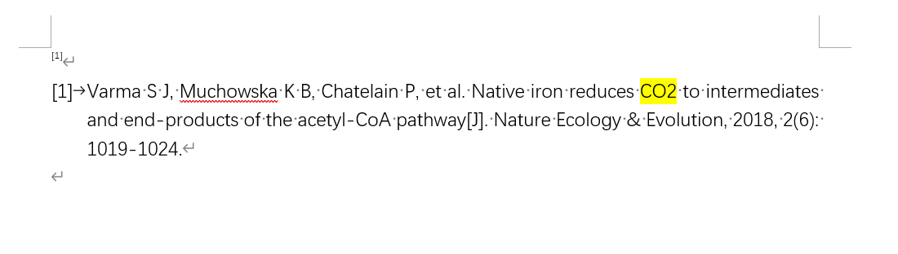
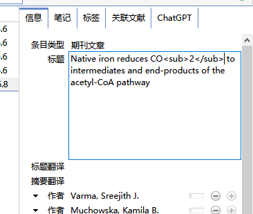
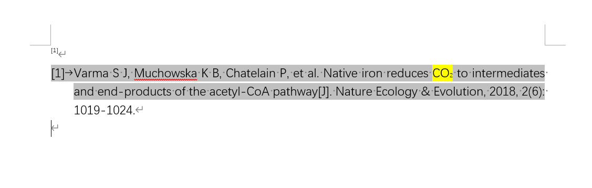

# 参考文献中论文题目部分单词如何实现斜体及上标、下标效果

一些论文的题目需要在参考文献中表现为上标、下标或者斜体：如CO<sub>2</sub>，H<sup>2</sup>、<i> Nature </i>，这该如何实现呢？

1. 插入参考文献后在Word中手动修改，但是这种方法每次刷新后需要重新设置非常麻烦。

2. 在Zotero中修改该文献的条目信息，具体操作如下：

   

Zotero中可以通过在题目中添加以下代码来实现上标、下标、斜体、加粗的效果：

```
<sup>上标</sup>
<sub>下标</sub>
<i> 斜体 </i>
<b> 加粗 </b>
```



如图在zotero条目信息中对需要为下标的单词两侧分别加上`<sub>和</sub>`，




回到在Word中点击`Refresh`刷新条目信息即可看到下标效果已经成功实现。





使用quicker动作可以也可以方便的实现同样的效果：

[添加斜体标识](https://getquicker.net/Sharedaction?code=98c3d460-22b5-49ab-99c2-08d9c6b06ad1)

[添加加粗标识](https://getquicker.net/Sharedaction?code=dc815b9a-f463-4233-99c5-08d9c6b06ad1)

[添加上标标识](https://getquicker.net/Sharedaction?code=dee60abc-d1f5-40ad-99c3-08d9c6b06ad1)

[添加下标标识](https://getquicker.net/Sharedaction?code=b44c0592-89fa-41c2-99c4-08d9c6b06ad1)

