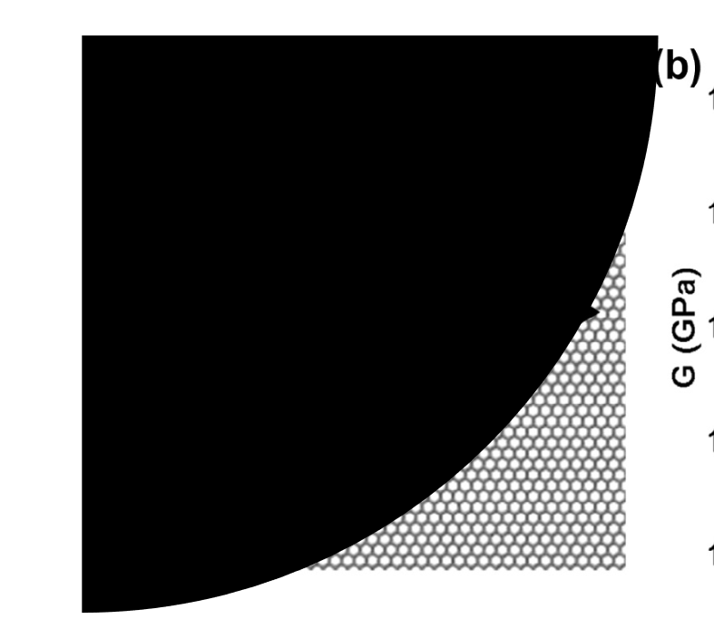
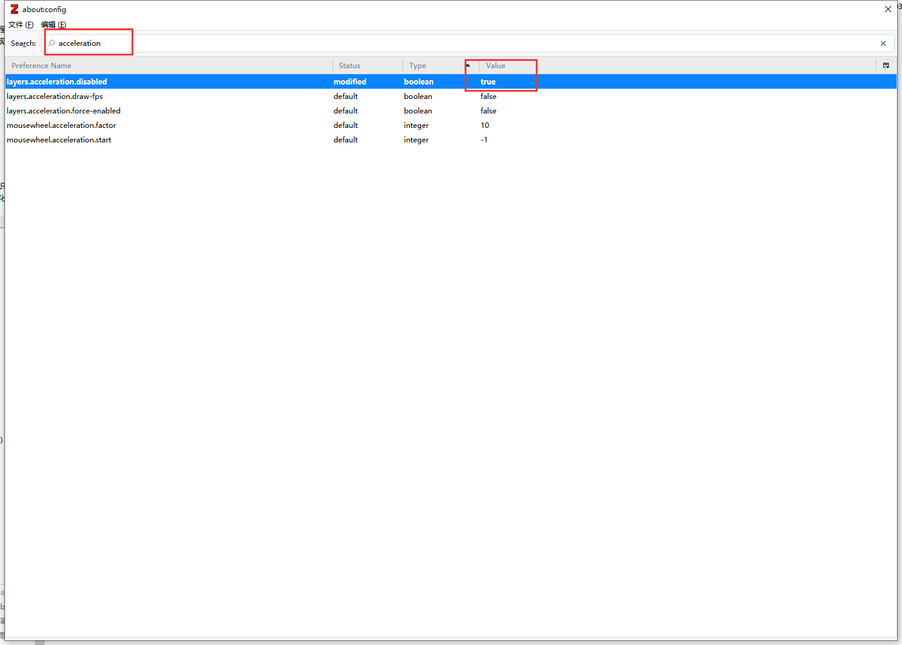

# 如何解决 Zotero 中 pdf 文件图片上有黑色遮挡的问题

部分同学在使用 Zotero 官方阅读器阅读 pdf 的时候，可能会碰到图片出现黑色遮挡的情况。

根据 [Zotero 官方答复](https://forums.zotero.org/discussion/97306/black-shade-on-the-figures-when-opening-pdf-by-zotero-report-id-942401037) ，这个问题可能是由显卡不兼容导致，可以尝试通过更新显卡驱动来解决，或者通过修改 Zotero 设置，以降低部分图形性能为代价，解决这个问题。

具体操作步骤如下：

1. 在菜单编辑选择“首选项”：
   
1. 弹出如下图所示的对话框。
   点击“I accept the risk”
   
1. 在搜索框中输入 acceleration，双击搜索到的 layers.acceleration.disabled，Value 将变为 true。然后重新启动 Zotero，即可解决问题。
   
