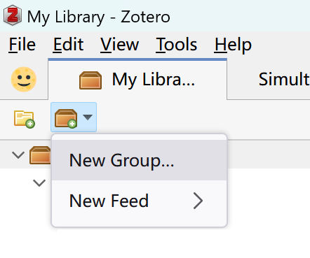

# 群组

## 功能简介

- **课题组协作、小组合作**：文献条目及其附件（包括笔记注释）实时共享同步到群组成员的 Zotero 客户端（桌面端、移动端、网页端）。
- **双向跨库分享文献条目**：“我的文库”可与“群组文库”中的文献条目（item）进行双向跨库复制/移动。
- **Zotero 的移动端（暂仅支持 iOS）支持阅读、修改群组的文献条目**信息及其附件（笔记、全文 PDF 等）
- **不限制群组成员数量**
- **配合 Chartero 插件可以实时查看成员某文献条目的阅读时间**

::: warning 群组依赖 Zotero 账号

群组的条目和附件同步均能且仅能通过 Zotero 官方同步服务同步，因此在使用群组功能前，你必须登录 Zotero 账户，如果你没有登录，请阅读 [同步](./sync.md#数据的同步) 小节完成账号注册和登录。

:::

## 创建群组

有两种方式创建群组：

1. 在 Zotero 客户端中点击如下按钮：

   

2. 在[Zotero 群组页面](https://www.zotero.org/groups) 点击 `Create a New Group` 按钮。

在打开的页面中，为群组输入一个名字，选择[群组的类型](#群组类型)，并依次进行[群组设置](#群组设置)，即可完成创建。

### 群组类型

群组有三类，分别是 `私有群组 (Private)`、`公开, 邀请制群组 (Public, Closed Membership)` 和 `公开, 开放成员群组 (Private)` 三类，下表对比了三种群组类型的特点。

| 项           | 私有群组 | 公开，成员邀请制 | 公开，开放成员 |
| ------------ | -------- | ---------------- | -------------- |
| 谁可以看到   | 仅成员   | 所有人           | 所有人         |
| 谁可以加入   | 邀请     | 邀请             | 所有人         |
| 条目附件共享 | 支持     | 支持             | 不支持         |

群组类型也可以之后可以在群组设置继续更改。

### 群组设置

群组设置页面主要有三个设置项，分别对应条目的读取、编辑、附件的编辑三类权限。

- 读取权限：谁可以看到该群组图书馆中的项目？
  - Anyone on the internet 所有人
  - Any group member 仅所有群组成员
- 编辑权限：谁可以在该组的库中添加、编辑和删除项目？
  - Any group member 所有成员
  - Only group admins 仅群组管理员
- 文件编辑权限：谁可以使用组中存储的文件？（公共开放组不能启用文件存储）
  - Any group member 任何团体成员
  - Only group admins 仅群组管理员
  - No group file storage 无群组文件存储

关于群组成员、群组管理员等的设置，请见 [群组管理](#群组管理) 小节。

## 加入群组

### 加入公开群组

### 加入私有或邀请制群组

## 群组管理
