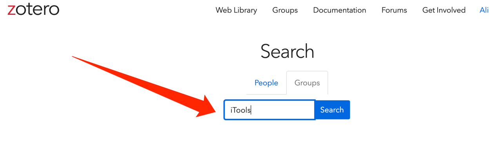
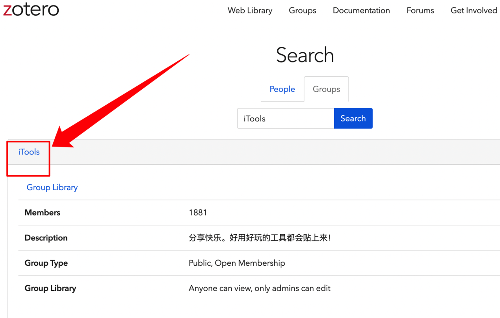
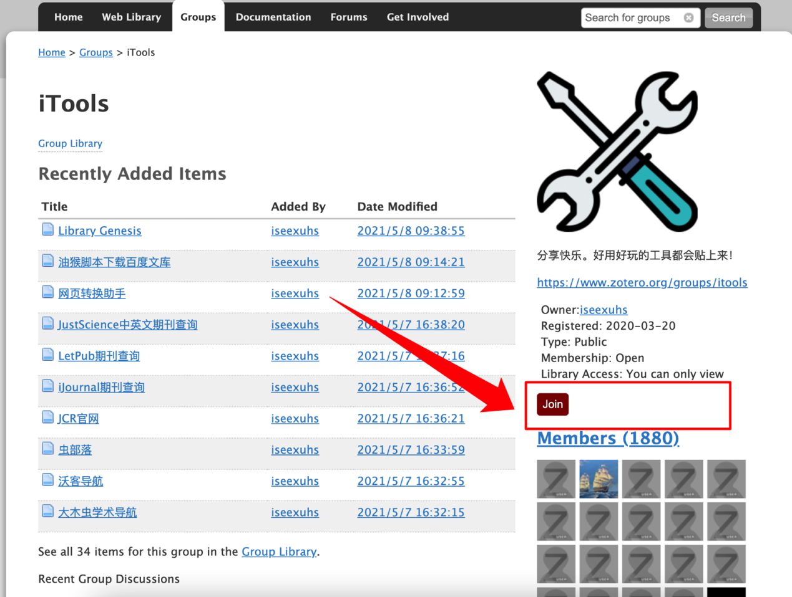
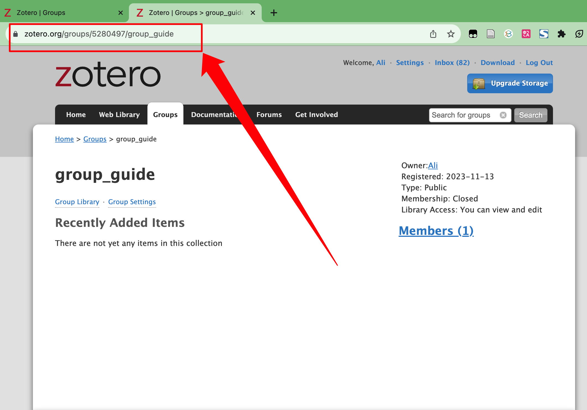
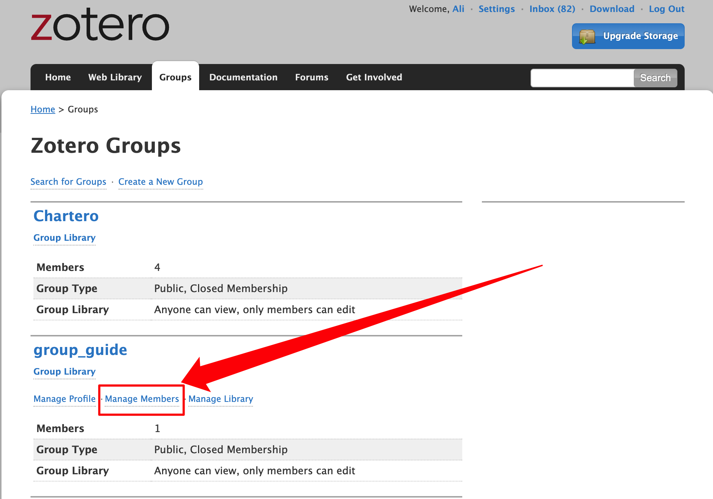
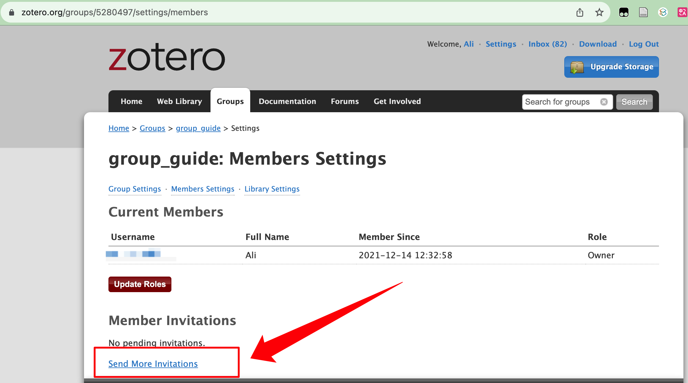
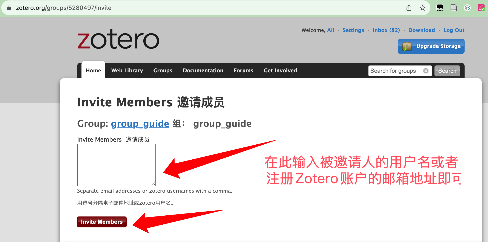

# 群组

## 功能简介

- **课题组协作、小组合作**：文献条目及其附件（包括笔记注释）实时共享同步到群组成员的 Zotero 客户端（桌面端、移动端、网页端）。
- **双向跨库分享文献条目**：“我的文库”可与“群组文库”中的文献条目（item）进行双向跨库复制/移动。
- **Zotero 的移动端（暂仅支持 iOS）支持阅读、修改群组的文献条目**信息及其附件（笔记、全文 PDF 等）
- **不限制群组成员数量**
- **配合 Chartero 插件可以实时查看成员某文献条目的阅读时间**

::: warning 群组依赖 Zotero 账号

群组的条目和附件同步均能且仅能通过 Zotero 官方同步服务同步，因此在使用群组功能前，你必须登录 Zotero 账户，如果你没有登录，请阅读 [同步](./sync.md#数据的同步) 小节完成账号注册和登录。

:::

## 创建群组

有两种方式创建群组：

1. 在 Zotero 客户端中点击如下按钮：

   

2. 在[Zotero 群组页面](https://www.zotero.org/groups) 点击 `Create a New Group` 按钮。

在打开的页面中，为群组输入一个名字，选择[群组的类型](#群组类型)，并依次进行[群组设置](#群组设置)，即可完成创建。

### 群组类型

群组有三类，分别是 `私有群组 (Private)`、`公开, 限定成员制群组 (Public, Closed Membership)` 和 `公开, 开放成员群组 (Private)` 三类，下表对比了三种群组类型的特点。

| 项           | 私有群组 | 公开，限定成员制 | 公开，开放成员 |
| ------------ | -------- | ---------------- | -------------- |
| 谁可以看到   | 仅成员   | 所有人           | 所有人         |
| 谁可以加入   | 邀请     | 邀请或申请       | 所有人         |
| 条目附件共享 | 支持     | 支持             | 不支持         |

群组类型也可以之后可以在群组设置继续更改。

### 群组设置

群组设置页面主要有三个设置项，分别对应条目的读取、编辑、附件的编辑三类权限。

- 读取权限：谁可以看到该群组图书馆中的项目？
  - Anyone on the internet 所有人
  - Any group member 仅所有群组成员
- 编辑权限：谁可以在该组的库中添加、编辑和删除项目？
  - Any group member 所有成员
  - Only group admins 仅群组管理员
- 文件编辑权限：谁可以使用组中存储的文件？（公共开放组不能启用文件存储）
  - Any group member 任何团体成员
  - Only group admins 仅群组管理员
  - No group file storage 无群组文件存储

关于群组成员、群组管理员等的设置，请见 [群组管理](#群组管理) 小节。

### 关于群组的附件

1. 一般用户默认会存储和分享群组空间只会占用创建者（即群主）的官方云存储空间（300M 免费）。
2. 群组功能目前仅支持官方云储存空间进行同步附件（例如文献的 PDF、笔记等），因此创建“Private”/“Public Closed”群组类型的用户，建议使用 [WebDAV 方案进行“我的文献库”的同步](./sync.md#通过-webdav-同步附件)，把 300M 免费空间留给群组内文献条目附件的同步。
3. 如果 300M 空间用尽，可以进入 Zotero 官网，在右上角的 Upgrade Storage 中升级付费计划（需要国外 VISA 信用卡）。
4. Zotero 群组的付费存储空间只需要群主付费，其他成员无需承担。

## 加入群组

### 1、官网群组搜索 🔍

适用于 Public Closed、Public Open 两种类型的群组，所有人均可操作。

在 [Zotero 官网群组搜索页面](https://www.zotero.org/search/type/group)，可以通过群组的名称，搜索到目标群组。

在接下来的搜索结果页面中点击目标群组名称，进入该群组的主页

在主页点击右侧的 Join，即可申请加入该群组。

- Public Open 的群组点击 `Join` 之后即可加入
- Public Closed 需要等管理员或者群主通过申请才可以加入

Zotero 客户端重启之后即可在右侧"群组文库"看到所加入的群组。

### 2、群组链接 🔗

适用于 Public Closed、Public Open 两种类型的群组，所有人均可操作。

群组成员（群主、管理员、成员）进入 [Zotero 群组页面](https://www.zotero.org/groups/)，点击群组名称，进入群组页面，浏览器地址栏的网址即为群组链接，可以分享给他人，他人打开即可申请加入（同上图）。

### 3、管理员邀请 ✉️

适用于所有群组，包括 Private、Public Closed、Public Open 三种类型，仅群主和管理员可以操作。

群组成员（群主、管理员、成员）进入 [Zotero 群组页面](https://www.zotero.org/groups/)，点击群组名称下方的 `Members Settings`

跳转后点击页面左下角 `Send More Invitations`

在邀请成员界面的方框内，输入被邀请人的 Zotero 用户名或者注册 Zotero 时所用的电子邮箱。可以同时邀请多人（用英文逗号分隔即可），输入完成之后点击下方的 `Invite Members`，即可完成邀请。被邀请人注册 Zotero 时所用的邮箱将会受到邀请邮件，进入接受邀请即可。

## 群组管理

群组成员（群主、管理员）进入[Zotero 群组页面](https://www.zotero.org/groups/)，点击群组名称下方的 `Manage Profile`，可以设置头像、名称、群组所属类别等信息，也可在此页面解散群组。

点击 `Manage Members` 可以管理成员，例如审批加群申请、新增成员、移除成员、改变成员权限等。

点击群组名进入群组详情页，右侧红色按钮 `leave` 可以退出群组。
