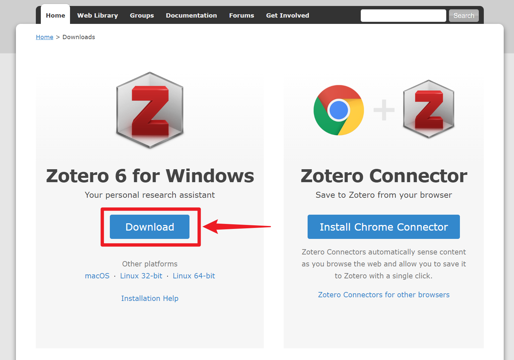

# 安装

## 主程序（PC）

请在 [Zotero 官网 (https://zotero.org)](https://zotero.org) 下载对应自己操作系统的安装包。

## 浏览器插件 Zotero Connector

Zotero 相较于其他文献管理软件的一大优势就是可以直接从网页中抓取元数据并存入数据库，这个过程通过浏览器插件 Zotero Connector 实现。

请在主程序安装完成后，打开常用的浏览器，点击上图右侧的 Install Connector 按钮下载。

支持常用浏览器：Chrome（谷歌浏览器），Firefox（火狐浏览器），Edge（微软自带浏览器），Safari（macOS 自带浏览器）。

::: tip

由于 Google Chrome Store 在国内无法正常访问，所以如果没有科学上网的手段，建议在国内使用 Microsoft Edge 作为替代品。MS Edge 目前也基于 Chromium 项目，与 Chrome 具备几乎相同的网络兼容性，且可以享受在国内完全可用的同步与扩展服务。

如果你使用谷歌浏览器且无法打开插件下载页面，可在其他镜像站下载。例如：

- [https://www.crxsoso.com/webstore/detail/ekhagklcjbdpajgpjgmbionohlpdbjgc](https://www.crxsoso.com/webstore/detail/ekhagklcjbdpajgpjgmbionohlpdbjgc)

:::

下载安装完毕后，在浏览器右上角可看到插件图标（或）。此时，浏览器插件已经安装成功了。

当你打开一个可抓取文献的网页时，插件图标会显示为，或等。稍后当我们设置完成，点击插件图标即可抓取文献。具体使用方法将在 [将条目添加进文献库](https://zotero.yuque.com/staff-gkhviy/zotero/lx3yts?view=doc_embed) 小节中展开。

## 其他平台客户端

### iOS

Zotero 官方目前已开发有 iOS 客户端，在 App store 搜索下载 Zotero 即可，APP 首页：[Zotero for iOS](https://apps.apple.com/cn/app/zotero/id1513554812)。

::: warning

要使用 iOS 客户端，需要使用官方同步或 WebDAV 同步二者之一，才能顺利同步附件。其他使用 ZotFile 等链接文件的同步方式不支持，未来也不会支持。

:::

### Android

Zotero 官方现已发布 [Zotero for Android 测试版](https://forums.zotero.org/discussion/110371/available-for-beta-testing-zotero-for-android#latest)，然而，测试期间存在人数限制，且下载链接在 Google Play，国内下载不便，支持功能也有限，有条件的同学可以自行尝试。

- [Google Play](https://play.google.com/store/apps/details?id=org.zotero.android)
- [LingXingZhong 镜像](https://ftp.linxingzhong.top/Zotero_android/)

在官方版本正式发布前， Android 用户可使用以下第三方客户端：

- Zoo for Zotero：

  - [Google Play](https://play.google.com/store/apps/details?id=com.mickstarify.zooforzotero)
  - [LingXingZhong 镜像](https://ftp.linxingzhong.top/zooforzotero_43_apps.evozi.com.apk)
  - [Android Apps APK 镜像](https://androidappsapk.co/detail-zoo-for-zotero/)
