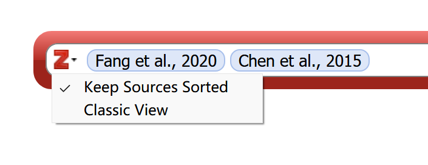
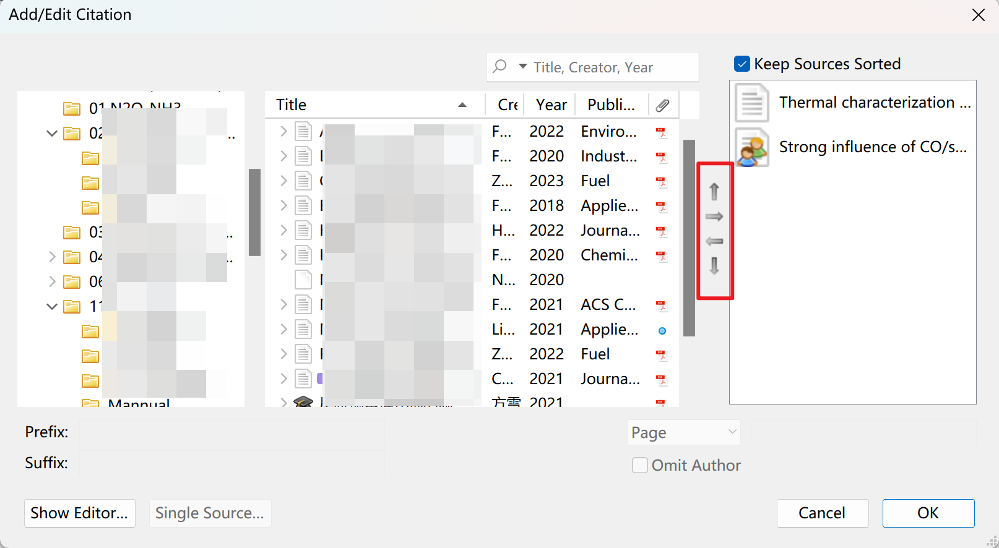

这些是使用 Zotero for MS Office Word 插件的说明。

要在 WPS 中使用插件，请参见 [在 WPS 中使用 Zotero Word 插件](./wps-plugin.md)。

## Zotero Word 插件选项卡

一般情况下，Zotero 安装时会安装 Zotero Word 插件，其会在 Microsoft Word 里添加一个 Zotero 选项卡。如果你的 Word 里没有 Zotero 选项卡，请参见 [故障排除 | 安装 Zotero 的 Word 插件](./faqs/word-addon.md#word-中没有-zotero-选项卡) 。

Zotero 选项卡包含以下图标：

| 名称                | 图标                                                             | 描述                                                                                                                                                   |
| ------------------- | ---------------------------------------------------------------- | ------------------------------------------------------------------------------------------------------------------------------------------------------ |
| 添加/编辑引注       |               | 在光标位置添加新引注或编辑文档中的现有引注。                                                                                                           |
| 添加/编辑参考文献表 |  | 在光标位置插入参考文献表或编辑现有书目。                                                                                                               |
| 添加笔记            |                                                                  | 在光标当前位置插入笔记。请注意，此功能不常用，点击后会出现黄色插入框。如果不小心点开了，可以用键盘上的 `Esc` 键关闭黄色插入框。                        |
| 文档首选项          |                 | 打开“文档首选项”窗口，例如更改引文样式。                                                                                                               |
| 刷新                |                             | 立即刷新所有引注和参考文献表，更新 Zotero 库中已更改的项目元数据。                                                                                     |
| 取消链接引注        |                         | 通过删除域代码来取消文档中 Zotero 引文的链接。这可以防止引文和书目的任何进一步自动更新。请注意，删除域代码是不可逆的，通常只能在文档的最终副本中完成。 |

## 文档首选项

“文档首选项”窗口允许您设置以下针对该文档的设置：

1. **引文样式**

   一般情况下，你只需要修改这一项，其余设置均保持默认即可。

2. 设置引注和参考文献表的格式的语言。
3. 对于基于注释的样式，例如“China National Standard GB/T 7714-2015（note，Chinese）”，引文是插入为脚注还或尾注。

   脚注和尾注的样式和格式由 Word（而不是 Zotero）控制。

4. 将引文存储为字段还是书签

   默认为“字段”。除非您需要使用 LibreOffice 与同事协作，否则应始终选择“字段”。

5. 对于缩写期刊标题的样式（例如，“Nature”），是否使用 MEDLINE 缩写列表来缩写标题。

   如果选择此选项（默认值），则 Zotero 中“ ”字段的内容将被忽略。

6. **是否自动更新引注和参考文献表**
   一般情况下开启即可。当文档中引文非常多，每次更新都会卡顿时，可以关闭此功能，添加一部分或最终手动进行更新。

## 添加引注

您可以通过单击“添加/编辑引注”（）按钮开始添加/编辑引用。

在一个未添加过引文的文档中，按下按钮将首先显示“文档首选项”窗口以让用户选择一个样式文件，之后按下按钮将显示引文对话框。

引文对话框用于从 Zotero 库中选择项目，并创建引文。

开始在对话框中键入标题的一部分、一个或多个作者的姓氏和/或年份。匹配项将立即显示在对话框下方。

::: tip

如果您在输入中文后，对话框下方并未出现相应的匹配项，您可以再输入一个空格，相关的匹配项就可以正常显示了。

:::

通过单击项目或在项目突出显示时按 Enter/Return 键来选择该项目。该项目将以阴影气泡的形式显示在对话框中。完成添加所有引用项目后，再次按 Enter/Return 键以插入引文并关闭“添加引文”框。

::: note 小技巧

在“添加引文”对话框中，您可以单击被引用项目的气泡，然后单击“在我的库中打开（或组库的名称）”以在 Zotero 中查看该项目。

孤立的项目（未连接到 Zotero 数据库中的任何项目）将没有“在我的库中打开”按钮。如果孤立项目是由协作者从其“我的媒体库”或您无权访问的群组中插入的，或者您已从 Zotero 资料库中删除了这些项目，则这些项目可能存在。

:::

### 包含多个被引用项目的引文

要创建包含多个引文的引文（例如，数字样式为`[2，4-6]`，作者日期样式为“（Smith 1776， Schumpeter 1962）”），请在“添加引文”框中一个接一个地添加它们。选择第一个项目后，不要按 Enter/Return 键，而是键入下一个项目的作者、标题或年份。

::: tip

如果在连续添加多个引文时，新输入的内容仍被包裹在上一个引用项目的气泡中，您可以先输入一个空格，然后再输入下一个引用项目的信息。

:::

某些引文样式要求一个文本内引文中的项目按字母顺序排序（例如，“（Doe 2000， Grey 1994， Smith 2008）”）或按时间顺序排序（“（Grey 1994， Doe 2000， Smith 2008）”）。Zotero 将自动遵循这些排序规则。

- 若要禁用引文中引文的自动排序，请拖动引文以在“添加引文”框中重新排列引文。您也可以单击“添加引文”框左侧的“Z”图标，然后取消选中“将源排序”选项。_此选项仅对指定引文排序顺序的引文样式显示。_ 要恢复自动排序，请重新选中“保持源已排序”选项。

## 添加参考文献表

单击“添加/编辑参考文献表”（）按钮会在光标位置插入参考文献表。

Zotero 将根据文档中的引文自动更新参考书目。

在极少数情况下，如果要将未在文档中引用的项目添加到书目中，可以再次单击“添加/编辑书目”按钮，这将打开 [书目编辑器](https://www.zotero.org/support/word_processor_plugin_usage#editing_the_bibliography)。在 Word 中对书目进行的手动编辑将在下次 Zotero 刷新文档时被覆盖。

## 切换到“经典视图”

“添加/编辑引注”对话框有默认版与经典版两种，下图为经典版的示例：

您可以通过单击“添加引文对话框”左侧的“Z”图标并选择“经典视图”来切换到“经典视图”引文对话框。

要永久切换到经典视图，请勾选 Zotero -编辑 -首选项 -“引用”选项卡 -使用经典添加引文对话框。

### 经典视图下使用多来源引用

单击引文选取对话框左下角“多重来源”，右侧会出现多重来源列表，将引文从左侧拾取到右侧即可。

### 经典视图下多重来源的引文排序

- 若要禁用引文中引文的自动排序，请在“添加引文”框中拖动引文以重新排列它们。你也可以取消选中“保持来源分类”选项。_此选项仅对指定引文排序顺序的引文样式显示。_ 要恢复自动排序，请重新选中“保持源已排序”选项。

## 自定义引用

可以通过各种方式自定义引文。

如果引文只是不正确或缺少数据，请首先确保 Zotero 中的项目元数据正确完整，然后单击插件中的“刷新”以使用任何更改更新文档。

可以通过引文对话框进行其他自定义。单击文档中的现有引文，然后单击“添加/编辑引文”以打开引文对话框，然后单击引文气泡以打开引文选项窗口，您可以在其中进行以下更改。

### 页码和其他定位器（图、表等）

在某些情况下，您希望引用项目的某个部分，例如某个页面，页码范围或卷。这种额外的引文特定信息（例如，引文“Doe et al.，2001 年，page 4-7”中的“page 4-7”）被称为“定位器”。

引用选项窗口具有不同定位器类型的下拉列表（默认为“page”），以及一个可在其中输入定位器值（例如“4-7”）的文本框。要引用除所列定位符以外的定位符（例如“表”），请使用“后缀”字段。

您还可以在插入引文时添加页码。搜索项目，在选择项目之前或之后，但在按 Enter 将引文插入到文档中之前，键入“p.34”、“p34”，甚至只是键入“34”，页码将添加到引文中。

### 前缀和后缀

“前缀”和“后缀”文本框允许您指定文本，分别位于自动生成的引用之前和之后。例如，您可能想要“cf. Tribe 1999， see also see……”，而不是“Tribe 1999”。

前缀和后缀字段中的任何文本都可以使用 HTML 标记 `<i>（斜体）、<b>（粗体）、<子>（下标）和<up>（上标）` 进行格式设置。例如，键入 `<i>cf</i>`。`example` 将显示为 `_cf_. example`。

前缀和后缀可以应用于引文中的每个项目，以创建复杂的引文。例如：“（参见 Smith 1776 的经典例子; 马克思 1867 年提出和另一种观点）”。通过在“前缀”和“后缀”字段中输入文本来修改引文始终比直接在 Word 中的引文字段中键入内容更可取。手动修改将阻止 Zotero 自动更新引文。

### 省略作者：在文本中使用作者

使用作者日期样式，作者经常被移到文本中，并从以下括号括起来的引文中省略，例如：“……根据史密斯（1776）的说法，劳动分工至关重要……“。要从引用中省略作者，请选中“省略作者”框（这将导致引用类似于“（1776）”而不是“（Smith，1776）”），并将作者的姓名（“Smith”）作为文档中常规文本的一部分。

### 其他更改

如果您的引文仍未按所需方式显示，您可以直接在文档中编辑引文，但请注意，这样做会阻止 Zotero 自动更新引文以反映文档中的其他更改（例如，对于“同上”或给定名称消除歧义）。在您进行手动编辑后，Zotero 将要求您确认是否要保留编辑并防止引文自动更新。最好是在要进行的更改的文本中做注释，等到准备好提交文档，然后在使用“取消链接引文”后在文档的副本中进行更改。

如果您认为引用样式中存在错误，请发布到 Zotero 论坛，以便我们可以进行调查，并在必要时更正样式。如果样式已更新，则文档将自动更新，以便在您下次刷新文档时反映任何更改。

## 编辑引注

如果您想在之前插入的引注中增加/删除引用项目，或者修改引注中的信息，您可以将光标定位在编号内（此时编号区域会出现灰色阴影），然后单击“添加/编辑引注”（）按钮开始编辑引注。

{width=60%}

## 编辑参考书目

当您在文档中添加和删除引文时，Zotero 将自动更新参考书目以反映您的更改。一般来说，这就是你所要做的。

但是，在极少数情况下，您可能希望将未引用的来源添加到参考书目中（例如，综述中包含的项目，但论文中未引用的项目）或删除文本中引用但不应包含在参考书目中的项目（例如，个人通信）。为此，请再次单击“添加/编辑书目”（）按钮以打开“编辑书目”窗口：

然后，您可以使用箭头添加或删除项目。

虽然也可以在此窗口中编辑书目参考文献的文本或格式，但不鼓励这样做。如果您更改了库中的数据，Zotero 不会自动更新此处编辑的引用。在这里编辑参考文献也有些不可靠; 一些用户报告说，当 Zotero 引用时，此处所做的修改有时不会持续存在，以及其他问题。

如果您需要编辑书目中的项目，最好在提交文档之前将其作为最后一步。首先，保存文档的备份副本。然后，单击“取消链接引文”按钮（）以断开文档与 Zotero 的连接，并将所有引文和书目转换为常规文本。最后，对参考书目文本进行调整。

此过程可用于对参考书目进行各种细微的修改，包括：

- 在综述或荟萃分析中包含的参考文献之前添加星号 `*`
- 以粗体、斜体或全大写设置特定作者的姓名
- 添加有关项目的批注或注释
- 为书目子部分添加标题（例如，主要来源与次要来源）

::: warning

- 对样式格式的一般更正应在 [CSL 引文样式](https://www.zotero.org/support/styles) 进行，而不是在此处进行。
- 对项目数据的更正应该在 Zotero 库中进行，而不是在这里。

:::

## 注意事项

::: warning

所有的引注顺序更改都应在 Word “引文编辑对话框”中进行，而不是直接在 Word 里手动修改！
所有的引注/参考文献表的样式修改都应在 CSL 文件中进行，而不是直接在 Word 里手动修改！
所有的条目信息，如作者、标题、期刊、期卷页等，都应在 Zotero 中更新条目信息，而不是直接在 Word 里手动修改！

:::

## 更多文档

更多 Word 中引用的常见问题请阅读 [常见问题 Word 中引用的常见问题](./faqs/word-citation.md) 。

另有一些 Word 加载项的问题解决可见 [常见问题 Word 加载项相关问题](./faqs/word-addon.md) 。
