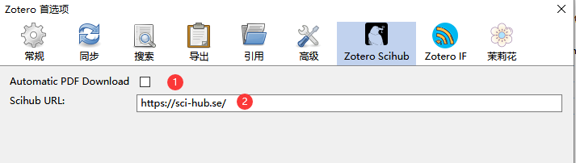
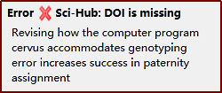
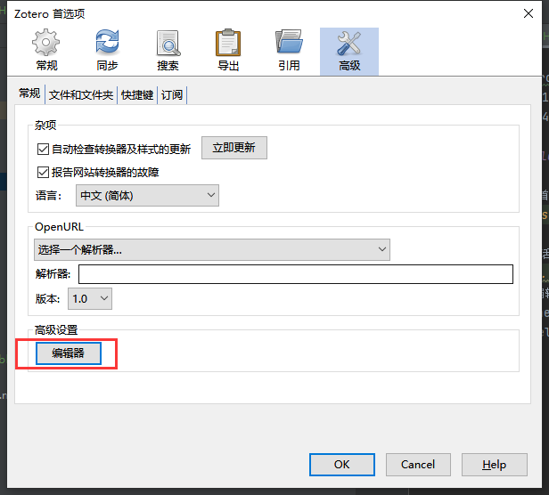
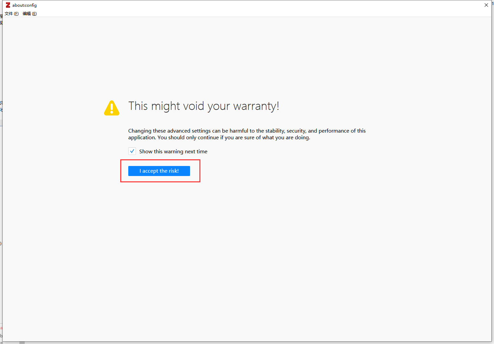
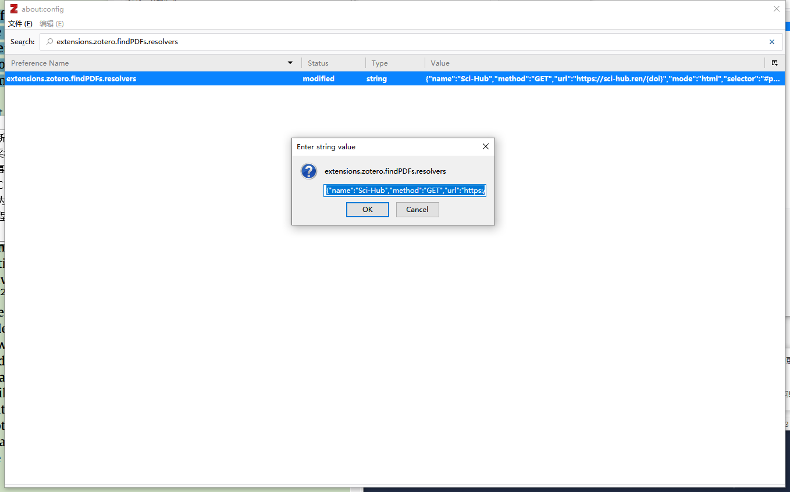

# Zotero SciHub

## 插件介绍

这是 Zotero 的一个附加组件，会自动从 SciHub 上为带有 DOI 的条目自动下载 pdf 格式的论文文件。

一旦你安装该插件，右键单击你收藏中的任何项目。现在将有一个名为`Update Scihub PDF`的菜单选项。点击后，将从 Scihub 下载 PDF 格式的文件，并附加到 Zotero 中对应的条目下。

同时对于您在安装此插件后添加的任何新论文，将会在后台从 SciHub 上自动下载对应的论文，并附加到 Zotero 中对应的条目下。

- Zotero SciHub 插件的 GitHub 地址：
  - 适配 Zotero 6：<https://github.com/ethanwillis/zotero-scihub>
  - 适配 Zotero 7：<https://github.com/syt2/zotero-scipdf>
- 插件下载：[Zotero 插件中文镜像](https://plugins.zotero-chinese.com/#/)
- Scihub 镜像地址：`https://sci-hub.se/`、`https://sci-hub.st/`、`https://sci-hub.ru/`、`https://www.sci-hub.ren/`

## 插件使用方法

### 插件设置



`Automatic PDF Download`:勾选后，在添加条目以后会自动为带有 DOI 的条目下载 Pdf 格式的论文。

`Scihub URL`：这里可自定义 Scihub 镜像的网站的地址。

### 常见问题

部分用户在使用过程中经常会碰到以下弹窗错误：




这种情况通常是访问次数过多以后，Sichub 服务器识别到了机器人抓取从而出现了验证码验证，您需要登陆 Scihub 输入出现的验证码信息。

建议在知网抓取文献的时候，建议关闭插件中的 `Automatic PDF Download`。部分中文文献带有 DOI 字段，在抓取这部分中文文献时，插件会访问 Scihub 进行下载，但由于 Scihub 网站基本上没有收录中文文献，所以插件也不会下载到 Pdf 文件。对 Scihub 网站过于频繁的访问会触发网站的验证机制。

::: warning

请勿在任何网站上使用批量抓取，严重时可能会使您的 IP 地址遭到封禁。

:::

## 不使用插件的原始方法

::: tip

[这种方法](https://www.zotero.org/support/kb/custom_pdf_resolvers)在修改 Scihub 地址时较为繁琐，但优点是不会遇到 Scihub 验证码弹窗。

当被 Scihub 拒绝时，两种方法都无法抓取文献。

:::

::: warning 谨慎使用此方法

此方法涉及修改隐藏首选项，请谨慎使用。

:::

### 操作步骤

1. 在 Zotero 依次点击`编辑`-`首选项`-`高级`-`常规`-`高级设置`-`编辑器`

   

2. 弹出如下图所示的对话框。 点击`I accept the risk`

   

3. 在搜索框中输入 `extensions.zotero.findPDFs.resolvers`，双击搜索到的 `extensions.zotero.findPDFs.resolvers`

   

4. 将下列代码粘贴进去直接替换原有内容

   ```json
   [
     {
       "name": "Sci-Hub",
       "method": "GET",
       "url": "https://sci-hub.se/{doi}",
       "mode": "html",
       "selector": "#pdf",
       "attribute": "src",
       "automatic": true
     }
   ]
   ```

   其中`"url":"https://sci-hub.se/{doi}"`, 可以替换为其他的 Sci-Hub 镜像地址。  
   如果想要从多个 Sci-Hub 地址抓取，按照如下格式添加

   ```json
   [
     {
       "name": "Sci-Hub",
       "method": "GET",
       "url": "https://sci-hub.se/{doi}",
       "mode": "html",
       "selector": "#pdf",
       "attribute": "src",
       "automatic": true
     },
     {
       "name": "Sci-Hub",
       "method": "GET",
       "url": "https://sci-hub.ru/{doi}",
       "mode": "html",
       "selector": "#pdf",
       "attribute": "src",
       "automatic": true
     }
   ]
   ```

5. 添加上述配置后
   - 对于新增的项目，Zotero 会自动增加 Sci-Hub 的源抓取 PDF。
   - 对于已存在的但缺失 PDF 的项目，可以右键点击`查找可用PDF`选项尝试重新抓取。
