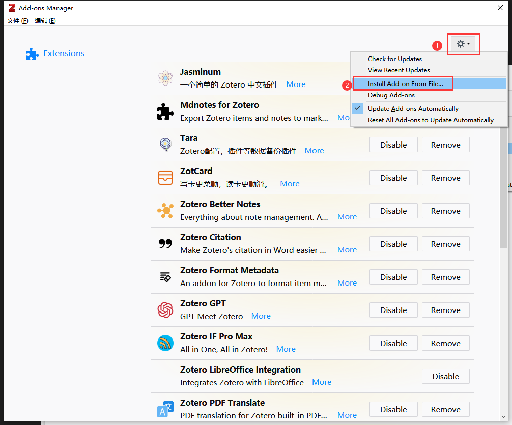
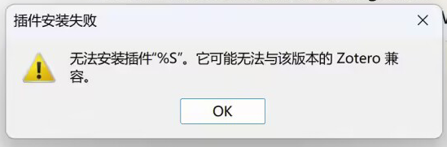

# 关于 Zotero 插件

## 什么是插件？插件可以做什么？

谈到 Zotero 插件，可能指的有三种东西：

- 安装在 Zotero 里的，用于增强 Zotero 的功能，一般大家提起 `Zotero 插件` 都指的是这一类。本文档中提到的 Zotero 插件都指这一种。
- （不是 Zotero 插件，是浏览器插件）安装在浏览器里的 Zotero Connecter，用于从网页上抓取文献元数据并存到 Zotero 里。
- （不是 Zotero 插件，是 Word 加载项）在 Microsoft Word 中的，正确称呼是 Word 加载项，用来插入引用和参考文献信息。

## 获取插件

- 官方插件收录链接：<https://www.zotero.org/support/plugins>
- 国内镜像：<https://plugins.zotero-chinese.com/#/>

::: tip 火狐浏览器用户请选择另存为

插件的后缀名为 `.xpi` ， 如果下载到后缀为 `.xpi` 的文件，不要解压，解压后会导致插件无法安装。

`.xpi` 也是火狐浏览器的插件后缀，因此火狐浏览器无法直接通过点击链接进行下载，需要右击链接，选择另存为，才可将插件保存至本地。

:::

::: tip Zotero 6 与 Zotero 7 的插件互不兼容

Zotero 6（正式版）和 Zotero 7（测试版）的插件互不兼容，请在下载插件安装包时下载与你 Zotero 版本适配的版本。[中文插件商店](https://plugins.zotero-chinese.com/)中有注明兼容的目标 Zotero 版本，下载时请务必注意。

Zotero 7 目前仍为测试版，使用中可能会遇到一些新问题，相关的解决方案也仍不够完善。对于绝大多数一般用户，建议继续使用 Zotero 6 正式版，并跟随正式版的更新节奏升级。

:::

## 安装插件

依次点击 `Zotero 菜单栏` => `工具（Tools）`=> `附加组件（Add-on）`，然后将下载的 xpi 文件拖入插件窗口，即可完成安装。

或者点击`右上角的齿轮` => `Install Add-on From File...` => `选择刚刚下载的 xpi 文件`，即可安装成功。

::: tip

对于部分老版本的插件，可能需要点击 `Restart now` 或者手动重启 Zotero 才可生效。

:::

::: details 无法安装插件"%S"。它可能无法与该版本的 Zotero 兼容

一些同学在安装插件的时候发现插件安装失败，Zotero 提醒不兼容。这种情况是由于下载的插件版本与插件所支持 Zotero 的版本不一致所导致的。

首先需要确定自己 Zotero 的版本，依次点击 `帮助` => `关于 Zotero`，即可看到自己 Zotero 的版本（如图则是 Zotero 6）

在[国内镜像](https://plugins.zotero-chinese.com/#/)下载插件时，查看页面中`目标 Zotero 版本`找到适合自己的插件版本，点击后面的下载链接就可以下载到适合自己的插件。

:::

## 更新插件

依次点击 `Zotero 菜单栏` => `工具（Tools）`=> `附加组件（Add-on）` => `右上角的齿轮` => `Check for Updates` 后 Zotero 会对插件的版本进行检查，并自动对插件进行更新。

::: tip

由于大部分插件的更新页面在 GitHub，国内部分地区可能无法直接访问，从而无法通过以上方式实现对插件的更新。如果无法直接访问插件的更新，可在此处下载最新版：<https://plugins.zotero-chinese.com/#/>

下载后，无需卸载原插件，按照安装插件的流程直接覆盖安装即可实现对插件的更新。

:::
