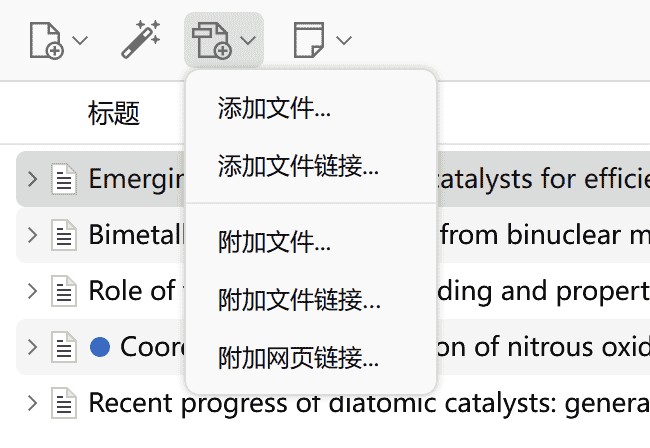
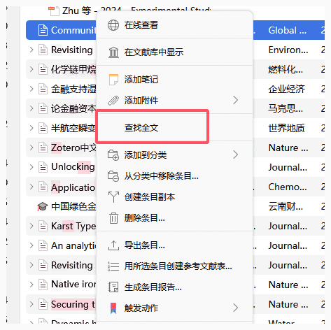
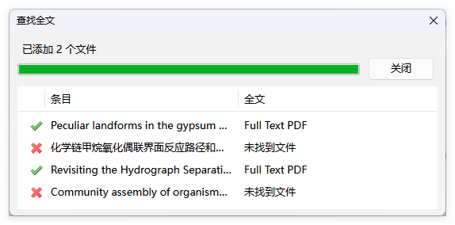

# 添加附件

除了项目元数据、注释和标签之外，Zotero 还可以用于管理文件。本页面介绍了将文件添加到 Zotero 库的不同方式，以及如何存储和同步添加的文件。

## 子附件和独立附件

::: info Todo

参考：<https://www.zotero.org/support/attaching_files>

:::

## 存储的附件和链接的附件

### 存储的附件

 

默认情况下，存储文件存储在 [Zotero 数据目录](./backup.md#数据文件) 中，Zotero 会自动管理它们，包括在 Zotero 中删除附件项时删除它们。如果使用 [文件同步](./sync.md) 功能，Zotero 会自动在设备之间同步存储的附件，并将它们储存在官方网盘（或 WebDAV 网盘）中。

将一个文件添加为存储的附件，该文件将被复制到 Zotero 数据目录，因此建议你删除原始文件以避免混淆。

### 链接的附件

 

对于链接文件，Zotero 只存储指向计算机上原始文件位置的链接。链接文件不会同步，如果附件项在 Zotero 中被删除，链接文件也不会被删除，Zotero 程序也不支持链接文件的同步。（可以简单理解为链接的文件在 Zotero 中作用类似于 Windows 的快捷方式）

如果您使用外部工具（Dropbox 等）同步链接文件以在多台计算机上使用，最好设置链接附件根目录，以便 Zotero 在每台计算机上都可以找到这些文件，即使包含文件夹位于文件系统中的不同位置。

### 链接的附件 → 存储的附件

如果希望将「链接的附件」转换为「存储的附件」以便 Zotero 管理它们，您可以从「工具」→「管理附件」→「转换已链接的附件为已存储的附件」菜单执行此操作。

## 为条目添加附件

### 通过浏览器

当您在浏览器中 [通过 Zotero Connector 保存条目](./add-items.md#通过浏览器添加条目) 时，Zotero 可以自动保存关联的网页快照和 PDF（可以在 Zotero 设置中更改是否保存关联的快照和 PDF）。此类快照和 PDF 作为存储的附件保存在 Zotero 数据目录中，并显示为已保存条目的子附件。

### 通过拖放

通过将文件从系统的文件浏览器拖到 Zotero 窗口中，然后将其拖放到左窗格中的集合或中央窗格中，可以将文件复制到库中。

拖放到现有 Zotero 条目上的文件将作为子附件添加。拖放到集合中、空白区域或中心窗格中的条目之间的文件将作为独立附件添加。

您还可以将 Zotero 中现有的独立附件拖放到常规 Zotero 条目上以创建子附件。

默认情况下，拖入 Zotero 的文件将作为存储的附件。要添加为链接的附件，请在拖拽时按住 Ctrl + Shift (Windows/Linux) 或 Cmd + Option (Mac) 键。 在 macOS 上，放开修饰键前，需要确保 Zotero 窗口位于前台。

### 通过附件菜单

选择一个条目后，可以单击条目列表顶部的「添加附件」回形针按钮。选择「附加文件副本...」或「附加文件链接...」将文件作为附件添加到条目中。

您还可以「附加 URI 链接...」以添加指向网页（ `http://` 或 `https://` ）或计算机上其他程序（例如 OneNote `onenote://` ）的链接。

当您右键单击某个条目并选择「添加附件」时，这些选项也可用。

### 查找全文（查找可用 PDF）

当条目不存在附件时，可右击该条目并选择「查找全文」来使用「解析器」自动下载文献。

Zotero 已经内置了 Unpaywall 数据镜像，因此不需要为其配置自定义解析器，当你使用默认的解析器点击「查找全文」后，Zotero 会自动从 Unpaywall 下载文献。

如何自定义解析器：

- [Custom PDF Resolvers - Zotero 官方文档](https://www.zotero.org/support/kb/custom_pdf_resolvers)
- [如何将解析器更改为 Sci-Hub](./plugins/zotero-scihub)

::: tip

无论使用默认解析器（Unpaywall）还是将解析器更改为 SCI-HUB，「查找全文」功能都无法下载中文文献，因为这些数据库没有收录中文文献（或收录量极少）。

:::

## 访问文件

双击条目即可打开该文件，也可以右击该条目并选择「查看 PDF」或「查看文件」。

如果要在系统资源管理器中查看文件本身，请右击条目并选择「显示文件」。存储的附件在 Zotero 数据目录中，每个文件都有自己的子目录，该子目录以随机的 8 个字符的字符串命名。

## 网页快照

::: info todo

<https://www.zotero.org/support/attaching_files#web_snapshots>

:::

## 附件名 vs 文件名

::: info Todo

参考：<https://www.zotero.org/support/file_renaming>

:::

附件有两个单独的名称：

- 附件名：条目列表中显示的附件标题
- 文件名：磁盘上的文件名

在 Zotero 6 中，由于默认启用「重命名文件名时自动重命名附件名」，以及收到 ZotFile 工作思维的影响，很多同学没有区分这两个名称，倾向于把附件名也设置为 `作者_标题.pdf` 等格式。

然而，Zotero 7 中，官方明确将这个两个概念进行了区分，原因如下：

附件的父行（也就是显示条目信息的那一行）已经显示标题和作者等元数据，因此无需通过在「附件名」上显示「文件名」来重复它，相反，更应该在附件名上体现有关文件来源的附加信息（例如，「已接受版本」或开放获取文件的「提交版本」，或「全文 PDF」 和 「支持材料」 等）。

单击附件后，您可以在右侧窗格中查看文件名，也可以通过 `右键单击` → `打开文件位置` 中查看文件名。

## 附件重命名

::: info Todo

参考：<https://www.zotero.org/support/file_renaming>

:::
