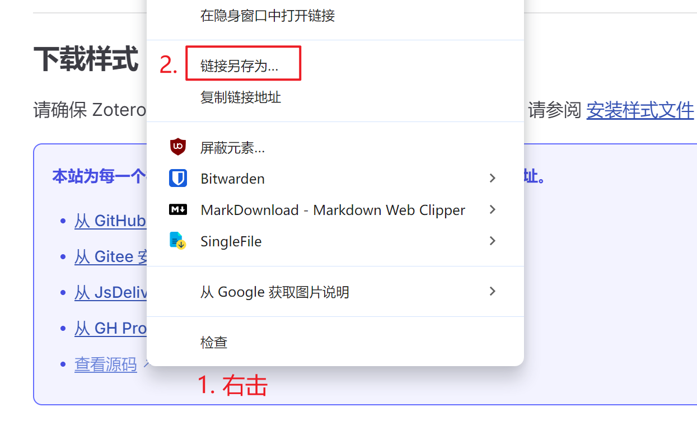
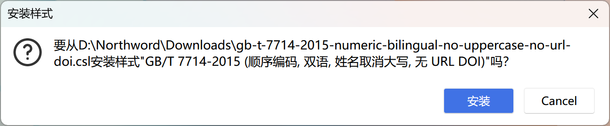

# 引文的格式

Zotero 使用 Citation Style Language 来生成引文格式，Zotero 官方提供了一组 CSL 样式，可以在 Zotero 内下载安装。

但是官方的 CSL 样式对国内期刊支持不全，且目前（CSL 1.0.2）仍未支持双语排版（「et al」与「等」混排），所以国内有热心开发者维护了一份第三方 CSL 样式，读者可以按需下载使用。

## 安装样式：从官方存储库

::: tip

适用于外文期刊、SCI 期刊等。

不支持双语排版。

:::

1. 打开 Zotero 软件，选择「编辑」->「设置」，在弹出窗口中选择「引用」。

   <!--  -->

2. 若样式管理器中无符合的样式，可以通过「获取更多样式」，搜索期刊名，点击符合要求的样式名，即可导入样式。

   

   

## 安装样式：从第三方存储库

::: tip

适用于中文期刊、国内学位论文等。

支持双语排版。

:::

如果上述 CSL 样式不符合你的要求，可到 [中文 CSL 样式](https://zotero-chinese.com/styles) 下载更多 CSL 样式。

### 1. 查找样式

首先你需要在 [中文 CSL 样式](https://zotero-chinese.com/styles) 页面上找到合适的 CSL 样式。

- 通过搜索和筛选快速找到你需要的样式
- 把鼠标放在样式的名称上可以预览其引注和参考文献表
- 点击样式名称进入详情页可以查看更多条目的显示效果

如果没有你想要的样式，可以点击页首的 「请求新样式 / 报告 CSL 样式问题」 来获取社区帮助。

### 2. 安装样式

单击样式名进入样式详情页，然后下滑找到 「下载链接」 小节，你可以看到很多安装链接。根据「下载链接」小节的描述，我们有两类安装样式的方法：

::: tip 自行选择可用链接

网站为每一个样式提供了多个下载链接，请自行选择可用的链接。

:::

#### 2.1 通过 Zotero Connector 直接安装样式

有的链接已经被 Zotero Connector 适配，因此可以直接安装，对于这类链接：

在确保 **Zotero 处于启动状态**时，**直接点击链接**，浏览器打开了一个新的网页，Zotero Connector 会在新的网页中显示一个「确认安装」的弹窗，直接点击「OK」即可：

::: warning 确保 Zotero 启动

:::

有小概率情况无法弹出这个「确认安装」的弹窗，可以尝试关闭页面重新打开。如果仍然不行，请尝试下面的「先下载文件后安装」。

#### 2.2 先下载文件后安装

根据「下载链接」部分里的提示，有的链接直接单击就可以下载文件，有的链接需要你手动 「右击」-「另存为」，按照提示的方法，将其保存为 `.csl` 文件：

然后双击打开 CSL 文件，在弹出窗口中选择「安装」。

#### 注意

由于这些 CSL 样式使用了 `citeproc-js` 提供了 CSL-M 扩展功能，因此安装时会出现「xxx.csl 不是一个有效的 CSL 1.0.2 样式文件，可能不能和 Zotero 一起正常工作」的警告，**属于正常现象，选择「OK」即可**。

随后，你就可以在字处理软件中将样式切换为刚刚安装的，请参阅 [在 Word 中使用](./ms-word-plugin.md) 了解详情。

## 管理和编辑样式

您可以通过单击 Zotero 样式管理器中的「-」按钮来删除已安装的样式。在此选项卡中，您还可以预览 Zotero 中所选项目的样式输出并编辑已安装的样式。

## 报告样式错误

如果 CSL 样式未提供预期输出，请首先确保您正在运行最新（稳定）版本的 Zotero，并从安装最新版本的样式。

一旦您确定样式偏离了样式指南、作者说明或已发布的示例，请报告该错误：

- 对于从官方存储库安装的样式

  请向 [Zotero 论坛](https://www.zotero.org/forum) 报告错误。您的帖子应使用标题 `Style Error: [Name of style]`，并提供样式指南的链接或摘录。

- 对于从中文存储库安装的样式

  请向 [中文 CSL 样式存储库](https://github.com/zotero-chinese/styles) 报告错误。

此外，您也可以尝试自己编辑样式。

## 请求新样式

- 对于外文期刊或样式，请参阅：[Requesting New Styles - Zotero Documentation](https://www.zotero.org/support/styles#requesting_new_styles)。
- 对于中文期刊或高校等的样式，请参阅：[Zotero 中文样式仓库](https://github.com/zotero-chinese/styles?tab=readme-ov-file#没有找到符合需要的样式)。

## 常见问题

::: warning

无论是何种方式请求社区的帮助，响应时间都取决于社区贡献者的时间安排。Zotero 官方支持和我们（中文社区）均不对响应时间作出承诺，请耐心等待志愿者的更新。

如有条件，欢迎自行修改并将成果贡献到上游仓库。

:::

对于 CSL 样式方面的问题，可以参阅：[Questions - Styles - Zotero Documentation](https://www.zotero.org/support/styles#questions)。
