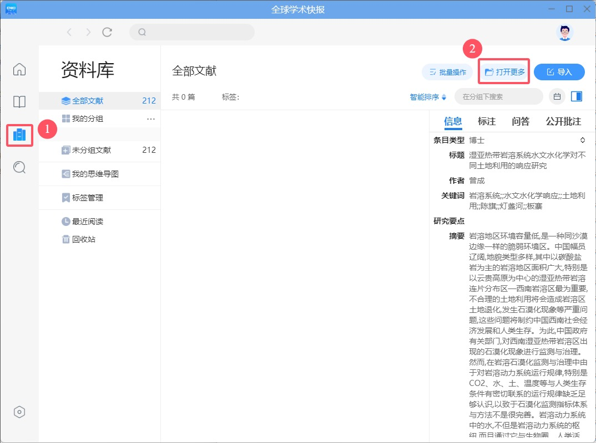
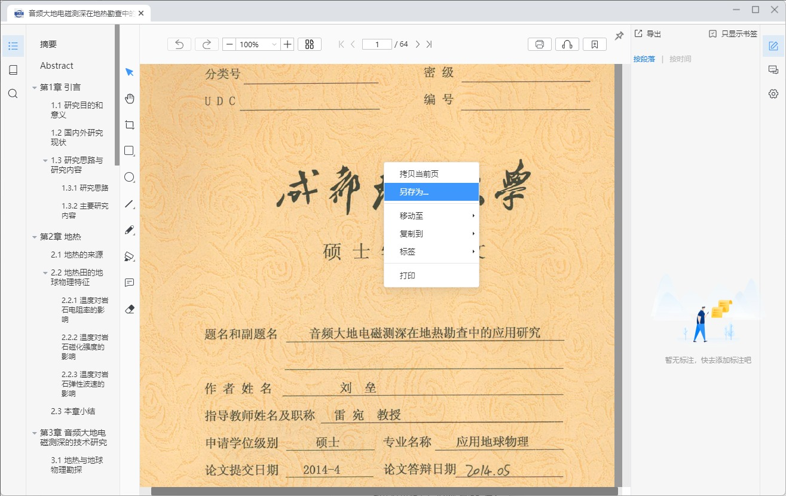
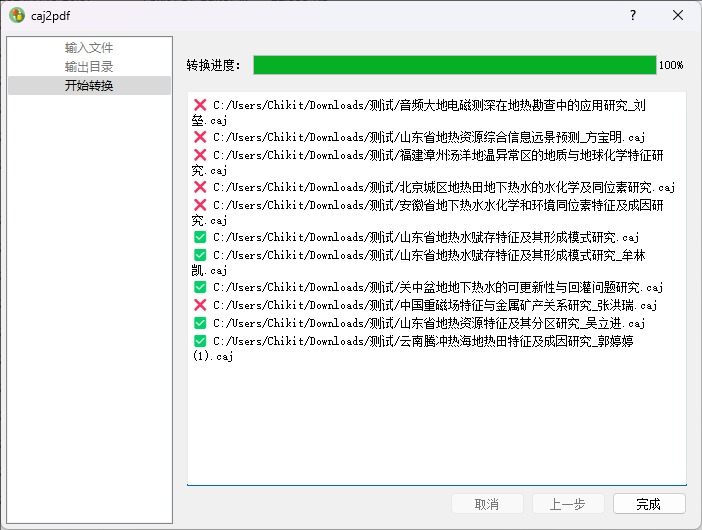
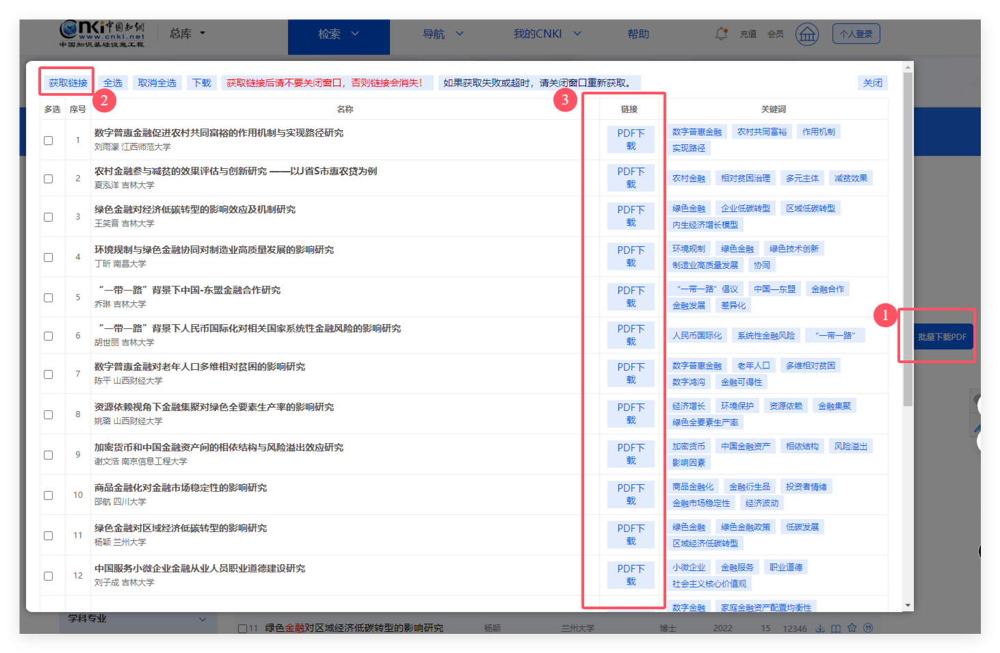
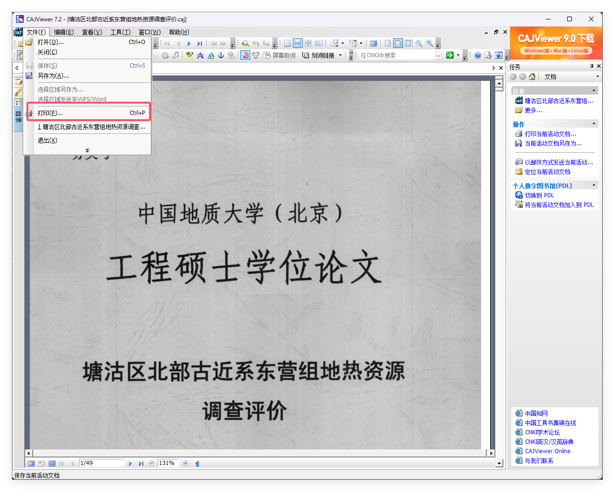
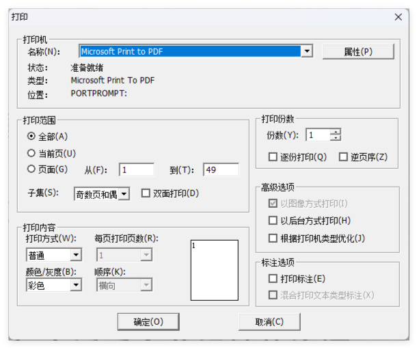
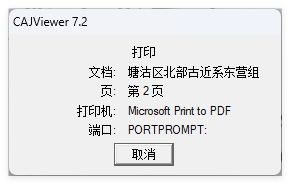

# CAJ 文件转为 PDF 文件

## caj 转换各方式优缺点对比

| 方式                              | 优点                 | 缺点                 | 推荐度     |
| --------------------------------- | -------------------- | -------------------- | ---------- |
| [全球学术快报](#全球学术快报)     | 无损转换，最好的方式 | 需要软件             | ⭐⭐⭐⭐⭐ |
| [caj2pdf 项目](#caj2pdf-项目)     | 无损转换             | 部分文献转换失败     | ⭐⭐⭐⭐   |
| [油猴脚本](#油猴脚本)             | 方便                 | 脚本更新可能不及时   | ⭐⭐⭐     |
| [虚拟打印机转换](#虚拟打印机转换) | 通用                 | 体积大，无法复制文字 | ⭐         |
| [网页转换](#网页转换)             | 通用                 | 收费                 | ⭐         |

## 全球学术快报

官网：<https://m.cnki.net/mcnkidown/index.html>

注册知网帐号 ：<https://my.cnki.net/Register/CommonRegister.aspx?returnUrl=https://www.cnki.net>

进入 `资料库` - `打开更多`- 选择想要转换的 caj 文件

在文献界面 `右键` - `另存为`- 保存 pdf 至指定目录即可。

## caj2pdf 项目

最初的[caj2pdf](https://github.com/caj2pdf/caj2pdf)项目由于长时间未更新以及没有可视化窗口，不推荐继续使用，更推荐使用[caj2pdf-qt](https://github.com/sainnhe/caj2pdf-qt)项目（[镜像站](https://caj2pdf-qt.sainnhe.dev/)）

这是一个 GUI 版本的 CAJ 转 PDF 转换器，基于 [caj2pdf](https://github.com/caj2pdf/caj2pdf) 和 [mupdf](https://mupdf.com/) 实现。

特性：

✅ 支持 CAJ/KDH/NH 文件格式  
✅ 跨平台 (Windows 7, 8, 10, 11; macOS; Linux)  
✅ 支持 32 & 64 位 CPU 架构  
✅ 批量转换  
✅ 多线程转换  
✅ 文件拖拽  
🔲 闭源引擎 ([caj2pdf#63](https://github.com/caj2pdf/caj2pdf/issues/63))

软件的使用也非常简单，`输入文件` → 选择 `输出目录` → `开始转换`，等待数秒即可。部分 caj 文件会转换失败，失败的文件可尝试其他方法进行转换。

## 油猴脚本

[中国知网 CNKI 硕博论文 PDF 下载](https://greasyfork.org/zh-CN/scripts/389343-%E4%B8%AD%E5%9B%BD%E7%9F%A5%E7%BD%91cnki%E7%A1%95%E5%8D%9A%E8%AE%BA%E6%96%87pdf%E4%B8%8B%E8%BD%BD)

::: info 提醒

该方法依赖于浏览器的 [Tampermonkey](https://www.tampermonkey.net/index.php?browser=chrome&locale=zh) 插件，如果您未安装，请先安装 [Tampermonkey](https://www.tampermonkey.net/index.php?browser=chrome&locale=zh) 插件。

:::

在搜索界面 点击 脚本的 `批量下载PDF` - `获取链接` - `PDF下载` - 下载对应的文章的 PDF 即可。

## 虚拟打印机转换

该方法需要电脑安装有[CAJViewer](https://cajviewer.cnki.net/)（或其他 CAJ 阅读器）以及 PDF 阅读器。

::: info 提醒

在测试过程中，发现 CAJViewer 9.0 无法保存 PDF 文件。可以尝试使用 CAJViewer 7.2 来解决此问题。

:::

1.使用 CAJViewer 打开 CAJ 文件，然后点击 `文件` - `打印`

2.选择打印机。由于电脑上安装的 PDF 阅读器不同，虚拟打印机的名称也会有所不同。在此示例中，选择 `Microsoft Print to PDF` 。

3.选择保存位置后，等待转换完成即可。

::: info 提醒

所有扫描版的 PDF 文件都可以使用 OCR 软件将图片中的文字转换为可编辑文本。例如，你可以使用 [Umi-OCR](https://github.com/hiroi-sora/Umi-OCR) 或其他常用的 PDF 阅读器（Adobe Acrobat、ABBYY、福昕阅读器等）来完成这一操作

:::

## 网页转换

由于大部分在线转换功能的网页都需要付费使用，在此不做推荐。
