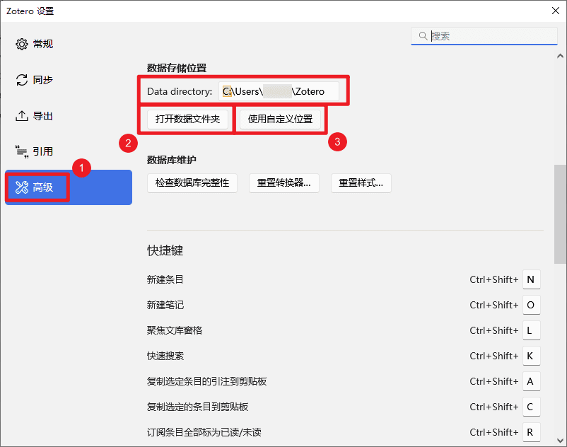

# 自定义 Zotero 数据存储位置

<Badge text="中级" />

Zotero 默认将所有文献条目、PDF、批注、笔记等存储在系统默认的「数据文件夹/Data Directory」（如 Windows 下的 `C:\Users\<用户名>\Zotero`）。如果需要将数据迁移到其他位置（例如硬盘的其他分区），可以在设置里选择新的存储目录。

::: danger

无论你选择何种同步方案，也无论基于何种原因，切勿将 Zotero 的 `数据存储位置/Data Directory` 自定义为任何网盘的同步文件夹中（包括 iCloud），也切勿使用任何网盘/同步盘的备份功能直接同步/备份这一目录!（包括但不限于直接使用坚果云的官方客户端直接同步备份这一文件夹）

这样做在某些情况下可能会导致你的 Zotero 数据库损坏，带来严重的问题！官方对于这一问题的说明见这两篇文章：

- [How can I access my library from multiple computers?](https://www.zotero.org/support/sync#alternative_syncing_solutions)
- [Can I store my Zotero data directory in a cloud storage folder?](https://www.zotero.org/support/kb/data_directory_in_cloud_storage_folder)

如果您已经将 Zotero 数据文件夹直接同步到网盘中，请您做好[备份](../backup#手动备份)，根据下面的教程将数据文件夹迁移到本地的其他位置，且确保未使用任何工具直接同步这一数据文件夹。

:::

## 操作步骤

1. **打开 Zotero 设置**

   点击 Zotero 的 `编辑` → `设置` → `高级`，在 `文件和文件夹` 中的 `数据存储位置` 可以看到当前的数据文件夹位置。点击 `打开数据文件夹` 按钮打开待迁移的数据文件夹备用。

   

   ::: tip 提醒  
   在继续下面的操作前，建议您先备份当前的数据文件夹，避免数据丢失。您可以将待迁移的数据文件夹中的所有内容复制到其他位置，以备不时只需。  
   关于备份的更多介绍，请参考：[Zotero 备份教程](../backup)。  
   :::

2. **选择新的数据目录**

   点击 `数据存储位置` 中的 `使用自定义位置`按钮，在弹出的对话框中您希望放置数据文件夹的位置，然后点击对话框中的 `新建文件夹` 按钮创建新的数据文件夹，在对话框中打开新创建好的数据文件夹，点击 `确定`。

   

   ::: details 数据目录放置位置的建议

   如果将数据目录放在不合适的位置，可能会因权限问题导致 Zotero 出现故障。以下是一些提醒和建议：

   - **切勿将数据目录放在任何网盘的同步文件夹中（包括 iCloud），也切勿使用任何网盘/同步盘的备份功能直接同步/备份这一目录！**
   - 不要将数据目录放在 Zotero 的程序安装目录下（如默认的 `C:\Program Files\Zotero`），也不要将数据目录选为 Zotero 的程序安装目录，避免文件混乱和权限问题。
   - 可以放在 `D:\ZoteroDataDirectory` 或 `E:\Data\ZoteroData` 等 **非系统盘** 的目录下，避免权限问题。
   - 数据目录的路径和文件夹名中不建议包含中文、空格或特殊字符，避免一些兼容问题。（如不建议将路径设置为 `D:\学术\Zotero Data` 或 `D:\My Data\Zotero Data`，您可以改为 `D:\Scholar\ZoteroData` 或 `D:\MyData\ZoteroData`）

   :::

   选择完新创建的空目录后，Zotero 会提示您目录为空。请点击 `是/Yes` 按钮。

   

3. **关闭 Zotero**

   在设置完成后，Zotero 会提醒退出 Zotero 程序。请点击 `退出 Zotero` 按钮，关闭 Zotero 程序。

   

4. **手动移动已有数据**

   请前往第 1 步中打开备用的待迁移数据文件夹，将原数据文件夹中的**所有内容**（包含 `zotero.sqlite` 文件、`storage` 文件夹等）拷贝到新数据目录下。

   

   ::: tip 提醒

   数据迁移完成之前，请勿打开 Zotero 程序。

   :::

5. **重新打开 Zotero**

   重新打开 Zotero，检查文库中的文献是否齐全，附件是否可以正常打开。

6. **完成迁移**

   如果一切正常，您已经成功将 Zotero 的数据目录迁移到新的位置。确认迁移完成且数据完整后，可以删除原数据目录下的文件。但建议先保留一段时间，直到确定迁移的数据无误。

   ::: tip 提醒

   如果迁移后无法正常使用 Zotero，您也可以将数据目录的设置恢复到原来的位置，Zotero 会自动识别并使用原来的数据目录。

   :::

## 注意事项

- **不要将数据目录直接设置在任何云盘同步文件夹下**，避免数据库损坏。
- 迁移完成后，如果出现无法打开 Zotero、看不到文献、无法找到附件等问题，请再次检查目标文件夹中的文件是否完整复制，以及 Zotero 设置中的目录路径是否指向这一新位置。
- 自定义数据文件夹时，无需搬迁用户配置文件，仅移动数据文件夹即可。用户配置文件夹建议保留在默认位置。
- 如果您使用 `Attanger/ZotMoov + 同步盘` 的同步方案，请不要手动移动用于异地存放附件的 `靶目录`，避免出现找不到的情况。同时，也不建议将 `靶目录` 设置在 Zotero 数据文件夹下，也不要将自定义的 Zotero 数据文件夹选为 `靶目录` 或放置在 `靶目录` 下，避免出现文件混乱。
