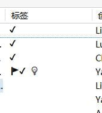

# Emoji 变成黑白该怎么办

近期许多同学在系统更新后发现 Zotero 中 emoji 变成黑白了，初步判断这是由于系统更新出现的问题。

该问题目前有两个解决方案，由于方法二会造成 emoji 图案发生改变，推荐先尝试方法一，如果方法一没有效果再尝试方法二

## 一、安装 seguiemj 字体

1. 首先在网盘中下载字体文件：<https://chikit.lanzoul.com/is3U51q0deyj>

2. 将下载的字体文件（seguiemj.ttf）复制到`C:\Windows\Fonts`，即可安装完成

3. 重启 Zotero 即可完成修复。

## 二、通过修改 `Zotero 设置` 来解决

具体操作步骤如下：

1. 在菜单编辑选择“设置”：
   
2. 弹出如下图所示的对话框。
   点击“I accept the risk”
   
3. 在搜索框中输入 emoji，双击搜索到的 `font.name-list.emoji`，由 `Segoe UI Emoji, Twemoji Mozilla` 修改为 `EmojiOne Mozilla`。
   
4. 然后重新启动 Zotero，Emoji 成功变回彩色，问题解决
   
