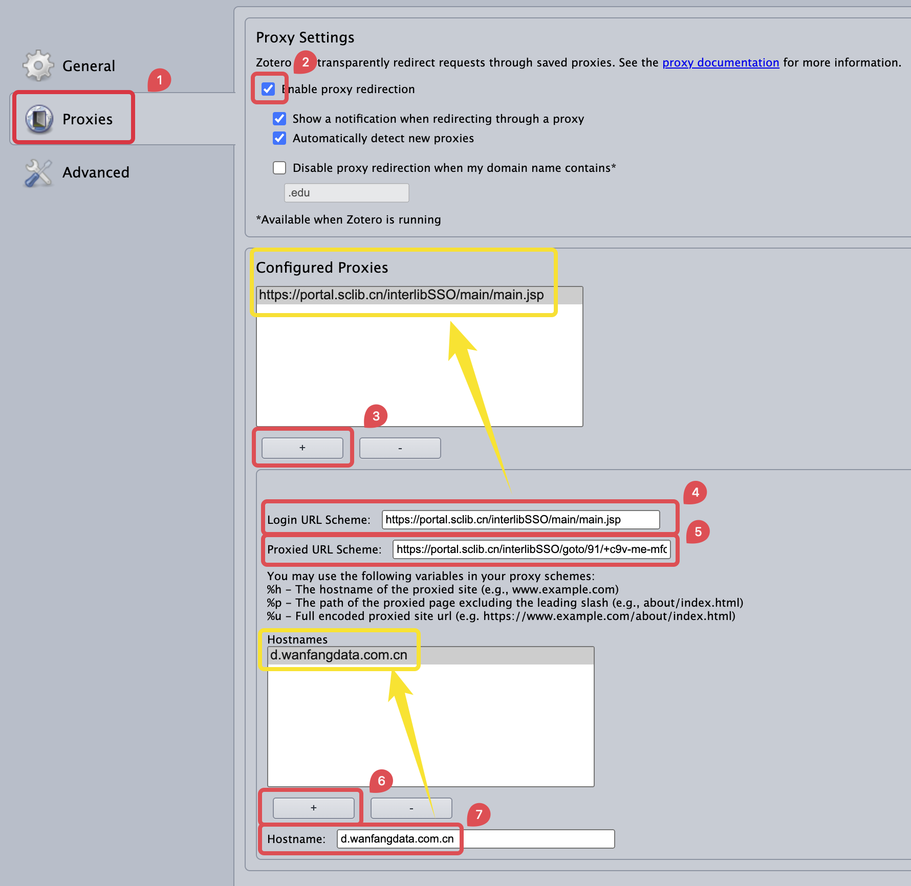
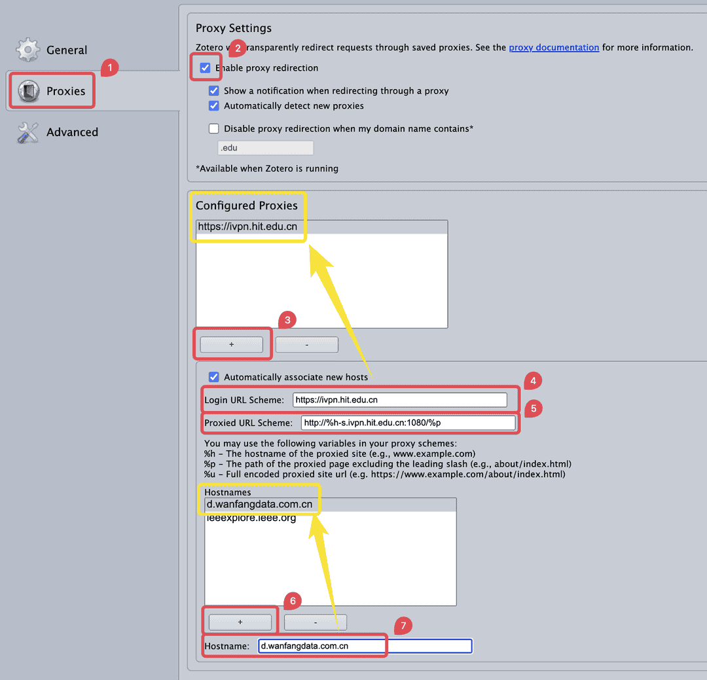

# 校外访问的常见问题

本文整理了一些关于校外访问文献资源的常见问题及解决方法。你可以在右侧大纲栏（部分窄屏设备也可能在顶部「页面导航」）或下面的目录快速定位到你需要的内容。

[[TOC]]

## 校外访问的基本概念

校外访问是指在不连接校园网的情况下，通过特定工具或服务访问学校购买的文献资源。常见的校外访问方式包括：

- **数据库官方提供的外部访问**：一些数据库提供的校外访问服务（如中国知网的高校/机构外部访问系统、ScienceDirect 的通过您的组织访问）。该方法通常不限制网络环境，需要学校统一认证登录的账号密码进行身份认证。
- **校外访问系统**：学校提供的 VPN 或 WebVPN 服务。
  - VPN：通过客户端加密连接虚拟接入校内网络，全局代理所有流量，可访问所有内网资源（如数据库、教务系统），需下载客户端。
  - WebVPN：通过浏览器访问特定网页链接，仅代理浏览器内的网页请求，无需客户端但功能受限（仅支持部分资源且无法代理其他软件）。
- **学校镜像站**：部分学校提供的文献数据库镜像站。

此外，还有一些其他的资源获取方式：

- **社会图书馆镜像站**：部分社会图书馆提供的文献数据库镜像站，如浙江图书馆、国家图书馆等单位提供的镜像站。
- **第三方文献资源站**：如 Unpaywall、Sci-Hub 等站点，提供免费获取文献的服务。
- **文献互助平台**：如科研通等平台，用户可以在上面分享和请求文献。

::: tip 提醒

通过校外访问服务访问数据库可能会导致 Zotero 无法正常抓取文献信息或附件，主要原因包括：

- **网址变更**：部分校外访问工具和镜像站会修改原始网址，导致 Zotero 无法识别网址，从而无法调用正确的转换器进行抓取。
- **页面内容变更**：部分校外访问工具和镜像站会修改原始页面内容，导致针对源站开发的转换器无法适用于该站。
- **缺少相应的转换器**：部分第三方文献资源站和文献互助平台可能没有专为其开发的转换器，导致 Zotero 无法从页面上抓取条目信息或附件。
- **兼容性问题**：某些校外访问工具访问数据库时可能因兼容问题无法下载文献，具体表现为无限加载或无限人机验证。
- **风控限制**：大量抓取可能触发目标网站的风控机制，导致抓取失败，具体表现为人机验证。
- **网络问题**：网络不稳定或访问速度慢可能导致网站访问和抓取失败，具体表现为超时或连接错误。

此外，学校的镜像站以及社会图书馆的镜像站可能与数据库官方的页面内容不一致，导致为源站开发的转换器可能无法完美兼容这些镜像站。而第三方的文献资源站和文献互助平台可能没有专为其开发的转换器，导致 Zotero 无法从页面上抓取条目信息或附件。

:::

## 解决校外访问抓取失败的问题

### 更新 Zotero 的转换器 <Badge text="初级" />

确保 Zotero 的转换器为最新版本。详细操作请参考：[更新抓取文献信息的转换器](./update-translators)。

::: tip 提醒

无论您是否通过校外访问抓取文献条目，都建议定期更新 Zotero 的转换器，确保转换器能够适配数据库网站的最新变动。

:::

### 使用数据库官方提供的外部访问服务 <Badge text="初级" />

数据库官方提供的外部访问服务通常是最稳定的校外访问方式。该方法不会修改页面网址，无需转换器做特殊兼容，无需做特殊设置，且可在国外网络环境下使用。一般情况下，只要数据库官方支持通过你的学校/机构进行外部访问，就建议优先使用这一方式。

各个数据库的校外访问入口通常在数据库的登录页面中，也可能在文献的详情信息也上（通常会叫做 `Log in via an institution`、`Institution Login`、`Institutional Sign In` 等等）。以下整理了一些常见学术数据库的校外访问入口，供参考使用：

::: details 常见学术数据库的校外访问入口

#### 中文数据库

- **中国知网**  
  使用 [中国知网高校/机构外部访问系统](http://fsso.cnki.net)。
- **万方数据**  
  使用 [万方数据机构外部访问系统](http://fsso.wanfangdata.com.cn)。
- **维普期刊**  
  访问 [维普期刊官网](https://qikan.cqvip.com/)，然后点击页面右上角的「登录」按钮，根据实际情况选择「第三方登录」中的「CARSI 馆外登录」或「中国科技云登录」。

#### 英文综合数据库

- **Elsevier（ScienceDirect）**  
  使用 [ScienceDirect 通过您的组织访问](https://www.sciencedirect.com/user/institution/login)。
- **IEEE Xplore**  
  访问 [IEEE Xplore 官网](https://ieeexplore.ieee.org)，然后点击页面上的「Institutional Sign In」。
- **ProQuest**  
  访问 [ProQuest 官网](https://search.proquest.com)，然后点击页面上的「通过您的图书馆登录以访问更多功能」。
- **PubMed**  
  无需使用校外访问，直接访问 [美国国立生物技术信息中心官网](https://pubmed.ncbi.nlm.nih.gov)。注意，PubMed 只是检索网站，不直接提供 PDF 附件下载。下载附件时可能仍然需要登录文献所在的数据库。
- **SpringerLink**  
  使用 [Springer 机构访问](https://wayf.springernature.com/?redirect_uri=https%3A%2F%2Flink.springer.com)。
- **Taylor & Francis**  
  使用 [Taylor & Francis Shibboleth sign in](https://www.tandfonline.com/action/ssostart?redirectUri=%2F)。
- **Web of Science**  
  无需使用校外访问，直接访问 [Web of Science 官网](https://webofscience.clarivate.cn/)。注意，Web of Science 只是检索网站，不直接提供 PDF 附件下载。下载附件时可能仍然需要登录文献所在的数据库。
- **Wiley Online Library**  
  使用 [Wiley 机构登录](https://onlinelibrary.wiley.com/action/ssostart?redirectUri=%2F)。

:::

### 使用学校的 VPN <Badge text="中级" />

通过学校的 VPN 客户端连接校园网是较为的校外访问方式。该方法可以全局代理所有流量，以校园网环境访问所有内网资源（如数据库、教务系统），需要下载客户端，但不需要额外的配置。

### 使用学校的 WebVPN <Badge text="高级" />

如果通过学校的 WebVPN 访问数据库，实际访问的链接会变得与数据库官网的原始链接不同，很有可能导致 Zotero Connector 无法为该网站正确匹配到相应的转换器，最终只能抓到一个网页快照。

如果您需要使用学校的 WebVPN 访问数据库，建议配置 Zotero Connector 选项中的「Proxies」，确保 Zotero Connector 能够正确识别经 WebVPN 代理后的页面链接。

这里提供了常见的两种情况，介绍如何配置 Zotero Connector 选项中的「Proxies」。

::: details 情况 1：WebVPN 代理后的链接里没有原始链接的 Host

#### 1. 分析原始网页链接和 WebVPN 代理后的链接之间的对应关系

##### 1.1 原始网页链接的组成部分

以万方官网的期刊文章链接为例：

`https://d.wanfangdata.com.cn/periodical/hjkxyj202501001`

**链接分解**：

- **Protocol (协议)**: `https://`  
  （从开头到第一个冒号的部分）
- **Host (主机)**: `d.wanfangdata.com.cn`  
  （第一个双斜杠 `//` 和第一个单斜杠 `/` 之间的部分）
- **Path (路径)**: `periodical/hjkxyj202501001`  
  （第一个单斜杠 `/` 之后的部分）

##### 1.2 WebVPN 代理地址

经过四川省图书馆 VPN 代理后，同一条链接变为：

`https://portal.sclib.cn/interlibSSO/goto/91/+c9v-me-mfc-s-9bnl9bm/periodical/hjkxyj202501001`

**变化对比**：

- **原 Host**: `d.wanfangdata.com.cn` → **代理后 Host**: `portal.sclib.cn`
- **Path 前缀变化**: 增加了 `interlibSSO/goto/91/+c9v-me-mfc-s-9bnl9bm/`，但原路径 `periodical/hjkxyj202501001` 完整保留。

也就是说，经过四川省图书馆的 WebVPN 代理后，原始链接中 `Path` 沿用到了代理后的链接中，接到了新的 Host 和 Path 前缀后面。代理后的链接不再需要填写原始链接的 `Host` 和 `完整链接`。

#### 2. 配置 Zotero Connector 的代理规则

##### 2.1. **创建代理规则**

在 Zotero Connector 浏览器扩展的设置中，进入 「Proxies」→「Configured Proxies\*\*」，点击 `+` 新增规则。

##### 2.2. **填写关键参数**

- **Login URL Schema**:
  用于登录你的 WebVPN 代理的链接，可不填。如四川省图书馆数字资源导航：

  `https://portal.sclib.cn/interlibSSO/main/main.jsp`

- **Proxied URL Schema**:
  在代理链接中，把官网链接的 `Host`、`Path`、`完整链接` 分别替换为 `%h`、`%p`、`%u`。

  根据前面的对比可知，四川省图书馆的 WebVPN 链接中只有 `Path` 沿用了下来，接在了代理后新的 Host 和 Path 前缀后面。此时，代理链接中不需要原链接中的 `Host` 和 `完整链接`。因此这里的代理链接的组成为：`https://portal.sclib.cn/interlibSSO/goto/91/+c9v-me-mfc-s-9bnl9bm/` + `%p`。

  此时，Proxied URL Schema 需要填写：
  `https://portal.sclib.cn/interlibSSO/goto/91/+c9v-me-mfc-s-9bnl9bm/%p`

- **Hostnames**:
  点击 `+` 添加 `d.wanfangdata.com.cn`，表示此规则仅对万方数据生效。

#### 3. 为其他网站添加更多的代理规则

如果当前的规则可以适用于其他网站，可以在该规则的 `Hostnames` 中添加更多的 Host 名称。如果当前的规则不适用于其他网站，可以继续添加更多的代理规则，具体步骤与上述相同，只需根据不同网站的 WebVPN 代理链接进行相应的修改即可。

对于当前案例的情况，代理后链接中加入的 Path 前缀与原始链接的 `Host` 有关，但不能通过 `%h` 直接得到，因此不能通过直接添加 `Hostnames` 兼容更多网站。如果需要为其他网站添加代理规则，需要重新分析其他原始链接和 WebVPN 代理后的链接之间的对应关系，配置更多代理规则。具体步骤与上述相同。

:::

::: details 情况 2：WebVPN 代理后的链接里保留了原始链接的 Host

#### 1. 分析原始网页链接和 WebVPN 代理后的链接之间的对应关系

##### 1.1 原始网页链接的组成部分

以万方官网的期刊文章链接为例：

`https://d.wanfangdata.com.cn/periodical/hjkxyj202501001`

**链接分解**：

- **Protocol (协议)**: `https://`  
  （从开头到第一个冒号的部分）
- **Host (主机)**: `d.wanfangdata.com.cn`  
  （第一个双斜杠 `//` 和第一个单斜杠 `/` 之间的部分）
- **Path (路径)**: `periodical/hjkxyj202501001`  
  （第一个单斜杠 `/` 之后的部分）

##### 1.2 WebVPN 代理地址

经过哈尔滨工业大学 WebVPN 代理后，同一条链接变为：

`http://d-wanfangdata-com-cn-s.ivpn.hit.edu.cn:1080/periodical/hjkxyj202501001`

**变化对比**：

- **原 Host**: `d.wanfangdata.com.cn` → **代理后 Host**: `d-wanfangdata-com-cn-s.ivpn.hit.edu.cn`
- **Path**: `periodical/hjkxyj202501001` 保持不变。

也就是说，经过哈尔滨工业大学的 WebVPN 代理后，原始链接的 `Host` 被重新编码并嵌入到了代理后的 Host 中，`Path` 完整保留。代理后的链接不再需要填写原始链接的 `完整链接`。

具体来看，代理后链接变为 http 链接，原始链接的 `Host` `d.wanfangdata.com.cn` 被重新编码为 `d-wanfangdata-com-cn`（这一过程 Zotero Connector 可以自动处理）。对于 https 链接，代理后的链接中增加了 `-s` 后缀和 `ivpn.hit.edu.cn:1080` 的后缀，最后完整保留 `Path`。

#### 2. 配置 Zotero Connector 的代理规则

##### 2.1. **创建代理规则**

在 Zotero Connector 浏览器扩展的设置中，进入 「Proxies」→「Configured Proxies\*\*」，点击 `+` 新增规则。

##### 2.2. **填写关键参数**

- **Login URL Schema**:
  用于登录你的 WebVPN 代理的链接，可不填。如哈尔滨工业大学 WebVPN 登录页面：

  `https://ivpn.hit.edu.cn`

- **Proxied URL Schema**:
  在代理链接中，把官网链接的 `Host`、`Path`、`完整链接`分别替换为 `%h`、`%p`、`%u`。

  根据前面的对比可知，哈尔滨工业大学的 WebVPN 链接中，代理后链接变为 http 链接，原始链接的 `Host` 可被 Zotero Connector 自动重新编码成 `%h`，对于 https 链接，代理后的链接中增加了 `-s` 后缀和 `ivpn.hit.edu.cn:1080` 的后缀，最后完整保留 `Path`。此时，代理链接中不需要原链接中的 `完整链接`。因此这里的代理链接的组成为：`http://` + `%h` + `-s` + `.ivpn.hit.edu.cn:1080/` + `%p`。

  此时，Proxied URL Schema 需要填写：
  `http://%h-s.ivpn.hit.edu.cn:1080/%p`

- **Hostnames**:
  点击 `+` 添加 `d.wanfangdata.com.cn`，表示此规则仅对万方数据生效。

#### 3. 为其他网站添加更多的代理规则

如果当前的规则可以适用于其他网站，可以在该规则的 `Hostnames` 中添加更多的 Host 名称。如果当前的规则不适用于其他网站，可以继续添加更多的代理规则，具体步骤与上述相同，只需根据不同网站的 WebVPN 代理链接进行相应的修改即可。

对于当前案例的情况，不同网站的 `Host` 都可被 Zotero Connector 自动重新编码成 `%h`，`Path` 完整保留并替换为 `%p`，其余内容均保持不变。因此可以直接给当前的规则添加 `Hostnames` 兼容更多网站，而不需要重复添加更多的代理规则。

:::

## 使用其它方式添加条目 <Badge text="初级" />

如果校外访问的方式无法抓取文献的元数据，或者在使用校外访问时无法抓取到 PDF 附件，您可以使用其他方式获取条目和附件。

- 通过附件添加条目。您可以通过校外访问服务手动下载 PDF 附件，然后[通过附件检索文献元数据](../add-items#通过附件添加条目-推荐)。通过附件检索元数据时无需使用校外访问服务，也无需拥有 PDF 附件的下载权限。
- 分开获取条目和 PDF 附件。Zotero Connector 在抓取文献元数据时无需拥有 PDF 附件的下载权限。换言之，即便不适用校外访问，也可以通过 Zotero Connector 直接在数据库官网抓取文献的元数据。抓取完成后，再单独通过校外访问下载 PDF 附件，并将其[添加到抓取到的条目中](../add-attachments#为条目添加附件)。添加条目的可用方法详见[添加条目教程](../add-items)。
