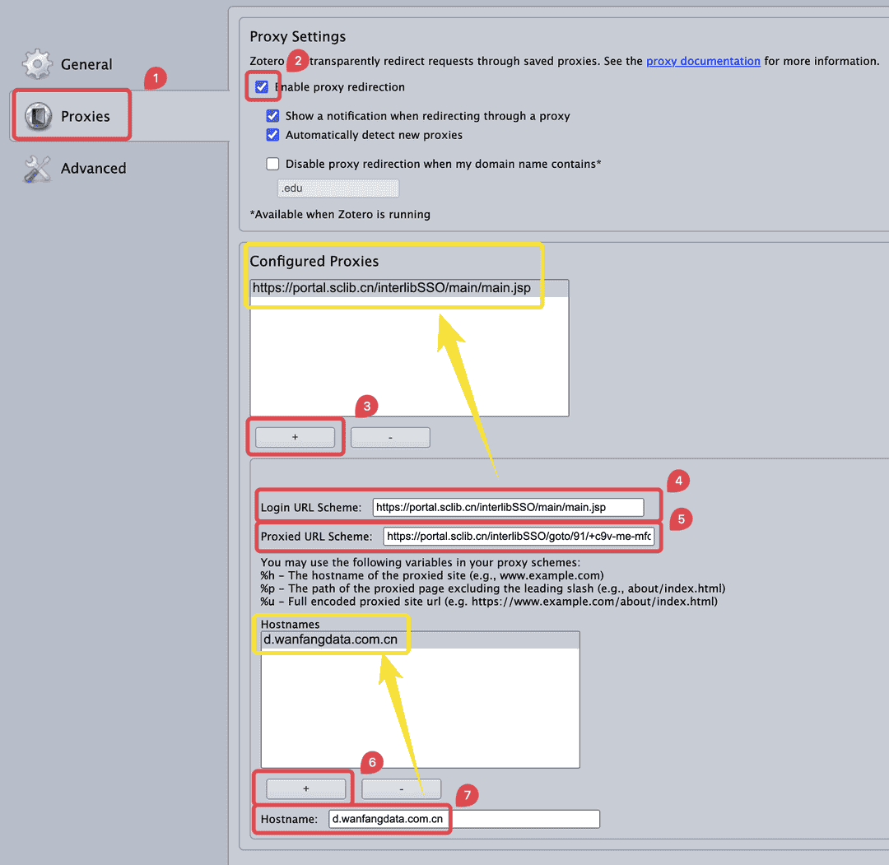

# 校外访问的常见问题

本文整理了一些关于校外访问文献资源的常见问题及解决方法。你可以在右侧大纲栏（部分窄屏设备也可能在顶部「页面导航」）或下面的目录快速定位到你需要的内容。

[[TOC]]

## 校外访问的基本概念

校外访问是指在不连接校园网的情况下，通过特定工具或服务访问学校购买的文献资源。常见的校外访问方式包括：

- **数据库官方提供的外部访问**：一些数据库提供的校外访问服务（如中国知网的高校/机构外部访问系统、ScienceDirect 的通过您的组织访问）。该方法通常不限制网络环境，需要学校统一认证登录的账号密码进行身份认证。
- **校外访问系统**：学校提供的 VPN 或 WebVPN 服务。
  - VPN：通过客户端加密连接虚拟接入校内网络，全局代理所有流量，可访问所有内网资源（如数据库、教务系统），需下载客户端。
  - WebVPN：通过浏览器访问特定网页链接，仅代理浏览器内的网页请求，无需客户端但功能受限（仅支持部分资源且无法代理其他软件）。
- **学校镜像站**：部分学校提供的文献数据库镜像站。

此外，还有一些其他的资源获取方式：

- **社会图书馆镜像站**：部分社会图书馆提供的文献数据库镜像站，如浙江图书馆、国家图书馆等单位提供的镜像站。
- **第三方文献资源站**：如 Unpaywall、Sci-Hub 等站点，提供免费获取文献的服务。
- **文献互助平台**：如科研通等平台，用户可以在上面分享和请求文献。

::: tip 提醒

通过校外访问服务访问数据库可能会导致 Zotero 无法正常抓取文献信息或附件，主要原因包括：

- **网址变更**：部分校外访问工具和镜像站会修改原始网址，导致 Zotero 无法识别网址，从而无法调用正确的转换器进行抓取。
- **页面内容变更**：部分校外访问工具和镜像站会修改原始页面内容，导致针对源站开发的转换器无法适用于该站。
- **缺少相应的转换器**：部分第三方文献资源站和文献互助平台可能没有专为其开发的转换器，导致 Zotero 无法从页面上抓取条目信息或附件。
- **兼容性问题**：某些校外访问工具访问数据库时可能因兼容问题无法下载文献，具体表现为无限加载或无限人机验证。
- **风控限制**：大量抓取可能触发目标网站的风控机制，导致抓取失败，具体表现为人机验证。
- **网络问题**：网络不稳定或访问速度慢可能导致网站访问和抓取失败，具体表现为超时或连接错误。

此外，学校的镜像站以及社会图书馆的镜像站可能与数据库官方的页面内容不一致，导致为源站开发的转换器可能无法完美兼容这些镜像站。而第三方的文献资源站和文献互助平台可能没有专为其开发的转换器，导致 Zotero 无法从页面上抓取条目信息或附件。

:::

## 解决校外访问抓取失败的问题

### 更新 Zotero 的转换器 <Badge text="初级" />

确保 Zotero 的转换器为最新版本。详细操作请参考：[更新抓取文献信息的转换器](./update-translators)。

::: tip 提醒

无论您是否通过校外访问抓取文献条目，都建议定期更新 Zotero 的转换器，确保转换器能够适配数据库网站的最新变动。

:::

### 使用数据库官方提供的外部访问服务 <Badge text="初级" />

数据库官方提供的外部访问服务通常是最稳定的校外访问方式。该方法不会修改页面网址，无需转换器做特殊兼容，无需做特殊设置，且可在国外网络环境下使用。一般情况下，只要数据库官方支持通过你的学校/机构进行外部访问，就建议优先使用这一方式。

各个数据库的校外访问入口通常在数据库的登录页面中，也可能在文献的详情信息也上（通常会叫做 `Log in via an institution`、`Institution Login`、`Institutional Sign In` 等等）。以下整理了一些常见学术数据库的校外访问入口，供参考使用：

::: details 常见学术数据库的校外访问入口

#### 中文数据库

- **中国知网**  
  使用 [中国知网高校/机构外部访问系统](http://fsso.cnki.net)。
- **万方数据**  
  使用 [万方数据机构外部访问系统](http://fsso.wanfangdata.com.cn)。
- **维普期刊**  
  访问 [维普期刊官网](https://qikan.cqvip.com/)，然后点击页面右上角的「登录」按钮，根据实际情况选择「第三方登录」中的「CARSI 馆外登录」或「中国科技云登录」。

#### 英文综合数据库

- **Elsevier（ScienceDirect）**  
  使用 [ScienceDirect 通过您的组织访问](https://www.sciencedirect.com/user/institution/login)。
- **IEEE Xplore**  
  访问 [IEEE Xplore 官网](https://ieeexplore.ieee.org)，然后点击页面上的「Institutional Sign In」。
- **ProQuest**  
  访问 [ProQuest 官网](https://search.proquest.com)，然后点击页面上的「通过您的图书馆登录以访问更多功能」。
- **PubMed**  
  无需使用校外访问，直接访问 [美国国立生物技术信息中心官网](https://pubmed.ncbi.nlm.nih.gov)。注意，PubMed 只是检索网站，不直接提供 PDF 附件下载。下载附件时可能仍然需要登录文献所在的数据库。
- **SpringerLink**  
  使用 [Springer 机构访问](https://wayf.springernature.com/?redirect_uri=https%3A%2F%2Flink.springer.com)。
- **Taylor & Francis**  
  使用 [Taylor & Francis Shibboleth sign in](https://www.tandfonline.com/action/ssostart?redirectUri=%2F)。
- **Web of Science**  
  无需使用校外访问，直接访问 [Web of Science 官网](https://webofscience.clarivate.cn/)。注意，Web of Science 只是检索网站，不直接提供 PDF 附件下载。下载附件时可能仍然需要登录文献所在的数据库。
- **Wiley Online Library**  
  使用 [Wiley 机构登录](https://onlinelibrary.wiley.com/action/ssostart?redirectUri=%2F)。

:::

### 使用学校的 VPN <Badge text="中级" />

通过学校的 VPN 客户端连接校园网是较为的校外访问方式。该方法可以全局代理所有流量，以校园网环境访问所有内网资源（如数据库、教务系统），需要下载客户端，但不需要额外的配置。

### 使用学校的 WebVPN <Badge text="高级" />

如果通过学校的 WebVPN 访问数据库，实际访问的链接会变得与数据库官网的原始链接不同，很有可能导致 Zotero Connector 无法为该网站正确匹配到相应的转换器，最终只能抓到一个网页快照。

如果您需要使用学校的 WebVPN 访问数据库，建议配置 Zotero Connector 选项中的「Proxies」，确保 Zotero Connector 能够正确识别经 WebVPN 代理后的页面链接。

#### 配置步骤

不同的 WebVPN 的链接结构可能不同，在配置 Zotero Connector 的代理规则时，需要根据实际的 WebVPN 代理链接的结构特点进行处理。这里以一篇万方官网的期刊文章为例进行说明。

假设原始链接为：`https://d.wanfangdata.com.cn/periodical/hjkxyj202501001`

1. **分析链接结构**

   首先，需要分析原始链接的结构，确定协议、主机和路径部分。示例原始链接的结构如下：

| 结构项           | 内容                         |
| ---------------- | ---------------------------- |
| Protocol（协议） | `https://`                   |
| Host（主机）     | `d.wanfangdata.com.cn`       |
| Path（路径）     | `periodical/hjkxyj202501001` |

1. **确定代理链接的结构特点**

   WebVPN 代理通常有两种主要类型：

   - **类型 1**: 代理后链接中不保留原始 Host
     - 例如：`https://portal.sclib.cn/interlibSSO/goto/91/+c9v-me-mfc-s-9bnl9bm/periodical/hjkxyj202501001`
     - 这种代理后的链接中未包含原始 Host（`d.wanfangdata.com.cn`）。
   - **类型 2**: 代理后链接中保留了编码后的原始 Host
     - 例如：`http://d-wanfangdata-com-cn-s.ivpn.hit.edu.cn:1080/periodical/hjkxyj202501001`
     - 对于这一种代理，原始链接的 Host 被编码后嵌入到代理链接的域名中。（`d.wanfangdata.com.cn` 被编码为 `d-wanfangdata-com-cn`添加到了代理后的链接中）。

2. **创建代理规则**

   - 在 Zotero Connector 浏览器扩展中，进入「Proxies」→「Configured Proxies」
   - 点击 `+` 按钮添加新规则

3. **填写代理规则参数**

   - **Login URL Schema**: 填写登录 WebVPN 的登录入口链接。非必填项。
   - **Proxied URL Schema**: 填写代理链接的结构。比较 WebVPN 代理链接和原始链接的结构，将代理链接中与原始链接相同的部分使用以下替换符来表示：
     - `%h`: 用于替换原始链接的 Host 部分（ Host 中的 `.` 会被替换为 `-`）
     - `%p`: 用于替换原始链接的 Path 部分
     - `%u`: 用于替换完整的原始 URL
   - **Hostnames**: 点击 `+` 按钮，然后在「Hostname」中输入此规则适用的网站域名（如 `d.wanfangdata.com.cn`）

4. **适配更多网站**

   - 如果不同网站的 Proxied URL Schema 相同，则该代理规则可用于多个网站，可直接在「Hostnames」中添加更多域名；
   - 如果不同网站代理链接中未被替换的部分存在不同，需配置的 Proxied URL Schema 也就不同，则需在「Configured Proxies」创建多条规则。

#### 常见 WebVPN 代理的参数示例

下面，我们为两种常见的 WebVPN 代理类型给出相应的配置示例。

::: details WebVPN 代理类型 1：代理链接不保留原始 Host

在这种类型下，代理后的链接完全使用新的域名。

##### 示例链接

- 原始链接: `https://d.wanfangdata.com.cn/periodical/hjkxyj202501001`
- 代理后链接: `https://portal.sclib.cn/interlibSSO/goto/91/+c9v-me-mfc-s-9bnl9bm/periodical/hjkxyj202501001`

##### 配置参数确定方法

1. 拆分原始链接

| 结构项   | 内容                         |
| -------- | ---------------------------- |
| Protocol | `https://`                   |
| Host     | `d.wanfangdata.com.cn`       |
| Path     | `periodical/hjkxyj202501001` |

2. 比较原始链接和代理后链接的结构，确定需要替换的部分

   - 原始链接中的 Host 部分未在代理后链接中出现，因此 `%h` 不需要使用；
   - 原始链接中的 Path 部分 `periodical/hjkxyj202501001` 在代理后链接中保持不变，这部分内容可以用 `%p` 表示；
   - 代理后链接中没有用到完整的原始 URL，因此 `%u` 不需要使用。

3. 应用替换符构建 Proxied URL Schema

   将代理链接中可替换的部分替换为对应的替换符，其余部分直接保留原有内容，拼接 Proxied URL Schema。

   - 拆分代理后链接中可替换的部分：`https://portal.sclib.cn/interlibSSO/goto/91/+c9v-me-mfc-s-9bnl9bm/` + `periodical/hjkxyj202501001`
   - 使用替换符号替换可替换的部分：`https://portal.sclib.cn/interlibSSO/goto/91/+c9v-me-mfc-s-9bnl9bm/` + `%p`

4. 配置参数

- Login URL Schema（自行查询登录页面链接，非必填）: `https://portal.sclib.cn/interlibSSO/main/index.jsp`
- Proxied URL Schema: `https://portal.sclib.cn/interlibSSO/goto/91/+c9v-me-mfc-s-9bnl9bm/%p`
- Hostnames: 点击 `+` 按钮，在「Hostname」中输入 `d.wanfangdata.com.cn`，表示此规则仅对万方数据生效。

5. 为其他网站添加更多的代理规则

比较不同网站代理后链接，可以发现这一类的代理后链接中未被替换的部分存在不同，因此不能通过直接添加 `Hostnames` 兼容更多网站。如果需要为其他网站添加代理规则，需要重新分析其他原始链接和 WebVPN 代理后的链接之间的对应关系，配置更多代理规则。具体步骤与上述相同。

:::

::: details WebVPN 代理类型 2：代理链接保留原始 Host

在这种类型下，原始链接的 Host 被编码后嵌入到代理链接的域名中。

##### 示例链接

- 原始链接: `https://d.wanfangdata.com.cn/periodical/hjkxyj202501001`
- 代理后链接: `http://d-wanfangdata-com-cn-s.ivpn.hit.edu.cn:1080/periodical/hjkxyj202501001`

##### 配置参数确定方法

1. 拆分原始链接

| 结构项   | 内容                         |
| -------- | ---------------------------- |
| Protocol | `https://`                   |
| Host     | `d.wanfangdata.com.cn`       |
| Path     | `periodical/hjkxyj202501001` |

2. 比较原始链接和代理后链接的结构，确定需要替换的部分

   - 原始链接中的 Host 部分 `d.wanfangdata.com.cn` 在被编码后变为 `d-wanfangdata-com-cn`（Zotero Connector 会自动将 `.` 替换为 `-`），代理后链接中的相应内容可以用 `%h` 表示；
   - 原始链接中的 Path 部分 `periodical/hjkxyj202501001` 在代理后链接中保持不变，这部分内容可以用 `%p` 表示；
   - 代理后链接中没有用到完整的原始 URL，因此 `%u` 不需要使用。
   - 代理后链接中编码后的 Host 之后有一个 `-s` 的部分（`d-wanfangdata-com-cn-s`），这部分说明原始链接的协议是 `https`，如果原始链接的协议是 `http`，则没有这一部分。这一部分无法用替换符表示，需要在 Proxied URL Schema 中直接保留。
   - 无论原始链接的 Protocol 是 `http` 还是 `https`，代理后链接的协议都是 `http`，因此在 Proxied URL Schema 中需要将协议部分写为 `http://`。

3. 应用替换符构建 Proxied URL Schema

   将代理链接中可替换的部分替换为对应的替换符，其余部分直接保留原有内容，拼接 Proxied URL Schema。

   - 拆分代理后链接中可替换的部分：`http://` + `d-wanfangdata-com-cn` + `-s` + `.ivpn.hit.edu.cn:1080/` + `periodical/hjkxyj202501001`
   - 使用替换符号替换可替换的部分：`http://` + `%h` + `-s` + `.ivpn.hit.edu.cn:1080/` + `%p`

4. 配置参数

- Login URL Schema（自行查询登录页面链接，非必填）: `https://ivpn.hit.edu.cn`
- Proxied URL Schema: `http://%h-s.ivpn.hit.edu.cn:1080/%p`
- Hostnames: 点击 `+` 按钮，在「Hostname」中输入 `d.wanfangdata.com.cn`，表示此规则对万方数据生效。

5. 为其他网站添加更多的代理规则

这种模式的 WebVPN 可以为多个不同的网站仅使用一条代理规则。因为无论访问哪个站点，代理链接的结构都是相同的，未被替换符替换的部分保持不变。仅有 Protocol 为 `http` 时需要另外添加一条去掉 `-s` 的规则（目前绝大多数网站已经使用 `https` 协议）。如果需要为其他网站添加代理规则，只需在「Hostnames」中添加更多的域名即可。

例如，如果您还需要访问 IEEE Xplore，则可以直接在 Hostnames 中添加 `ieeexplore.ieee.org`，表示此规则也适用于 IEEE Xplore。

:::

::: tip 提醒

不同学校/机构的 WebVPN 的链接结构可能不同，也可能出现其他情况，这里只是罗列了两种国内常见的 WebVPN 样式。您需要分析不同网站的 WebVPN 代理链接和原始链接之间的对应关系，根据配置步骤配置相应的代理规则。

:::

## 使用其它方式添加条目 <Badge text="初级" />

如果校外访问的方式无法抓取文献的元数据，或者在使用校外访问时无法抓取到 PDF 附件，您可以使用其他方式获取条目和附件。

- 通过附件添加条目。您可以通过校外访问服务手动下载 PDF 附件，然后[通过附件检索文献元数据](../add-items#通过附件添加条目-推荐)。通过附件检索元数据时无需使用校外访问服务，也无需拥有 PDF 附件的下载权限。
- 分开获取条目和 PDF 附件。Zotero Connector 在抓取文献元数据时无需拥有 PDF 附件的下载权限。换言之，即便不适用校外访问，也可以通过 Zotero Connector 直接在数据库官网抓取文献的元数据。抓取完成后，再单独通过校外访问下载 PDF 附件，并将其[添加到抓取到的条目中](../add-attachments#为条目添加附件)。添加条目的可用方法详见[添加条目教程](../add-items)。
