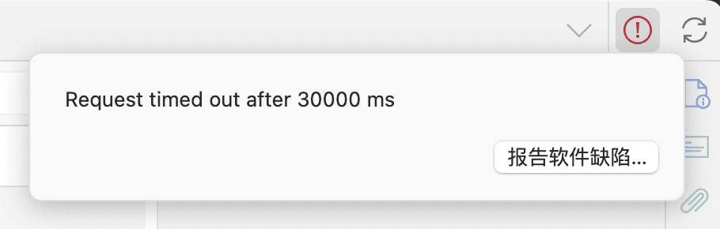

# 同步问题的常见问题

本页面整理了一些 Zotero 同步相关的问题及解决方法，你可以在右侧大纲栏（部分窄屏设备也可能在顶部「页面导航」）或下面的目录快速定位到你需要的内容。

如果仍没有找到你需要的问题，可以考虑在 Zotero 中文社区提问咨询或前往 Zotero 官方论坛发帖求助。

[[TOC]]

:::: tip 关于同步方案的提示

我们推荐使用 WebDAV 同步方案，结合坚果云、InfiniCLOUD 等网盘的 WebDAV 服务进行附件的同步。WebDAV 同步方案简单易用，支持 Zotero 移动端 App，不需要额外安装插件，且不容易出问题。

文件同步方案的详细对比和配置教程见：[Zotero 同步方案对比](../sync#文件的同步)。

::: info 提醒

「坚果云」不是一种同步方案，而是一个网盘服务提供商。它既提供了可用于「WebDAV 同步」的 WebDAV 服务，也提供了可用于「Attanger + 同步盘」中同步本地文件夹的坚果云官方客户端。您需要根据具体使用了哪项功能来确定当前使用的同步方案，而不是仅仅依靠「坚果云」这个服务商名称。其他网盘服务商也同理。

:::

::: danger

无论你选择何种同步方案，也无论基于何种原因，切勿将 Zotero 的 `数据存储位置/Data Directory` 自定义为任何网盘的同步文件夹中（包括 iCloud），也切勿使用任何网盘/同步盘的备份功能直接同步/备份这一目录!（包括但不限于直接使用坚果云的官方客户端直接同步备份这一文件夹）

这样做在某些情况下可能会导致你的 Zotero 数据库损坏，带来严重的问题！官方对于这一问题的说明见这两篇文章：

如果您已经将 Zotero 数据文件夹直接同步到网盘中，请您做好[备份](../backup#手动备份)，根据 [自定义数据文件夹](../faqs/custom-data-directory) 的教程将数据文件夹迁移到本地的其他位置，且确保未使用任何工具直接同步这一数据文件夹。

:::

::::

## 准备工作：确定附件的存储类型

最直接的判断方法是根据文库中的附件图标判断附件的类型。根据附件的类型，可以判断当前使用的同步方案是否存在问题。

- **存储的附件**

   

  图标上没有小链条，表示该附件是存储的附件，由 Zotero 直接管理。需采用「WebDAV 同步方案」或「Zotero 官方存储空间」进行同步。

- **链接的附件**

   

  图标上有小链条，表示该附件是链接的附件，Zotero 仅保存了一个指向该文件的链接，文件本身存储在其他位置。需采用「Attanger + 同步盘」方案进行同步。

- 如果您在使用 Attanger/ZotMoov + 同步盘方案时，发现 Zotero 中的附件图标上没有小链条，表示该附件不是链接的附件，未被移动到同步目录，无法被同步。请按照教程：[迁移到 Attanger + 同步盘方案](#教程迁移到-webdav-同步方案) 处理。

## 问题排查

请根据您使用的同步方案，在下面对应的章节排查常见问题。

---

### WebDAV 同步常见问题

#### 问题 1：附件丢失

检查附件在添加时的设备上能否正常打开。如果在所有设备上都无法打开，您可能需要重新下载这一附件并重新添加至 Zotero。

#### 问题 2：附件的类型与同步方案不匹配

附件的类型应与同步方案相匹配，否则会导致附件无法打开。如果您发现 Zotero 中的附件图标上有小链条，表示该附件是链接的附件，Zotero 仅保存了一个指向该文件的链接，文件本身无法被同步。请按照教程：[迁移到 WebDAV 同步方案](#教程迁移到-webdav-同步方案) 处理。

#### 问题 3：同步设置有误

请参照 [WebDAV 同步方案的配置教程](../sync#通过-webdav-同步附件)，检查 **每一个设备上** 的 WebDAV 同步设置是否正确（移动端 Zotero 应用也需要设置 WebDAV 同步，详见：[移动端配置教程](../mobile)），点击「验证服务器」按钮，确保验证成功。

常见的错误有：

- **WebDAV 网址错误**：请检查 WebDAV 网址是否正确，`http` 或 `https` 选择应正确，链接结尾不应有 `/` 符号。
- **误用登录密码**：WebDAV 同步的密码通常是网盘服务商提供的随机应用密码，而不是在网页上登录网盘官网时自己设定的密码。
- **移动端未设置 WebDAV 同步**：如果您在移动端使用 Zotero App，除了登录 Zotero 账号之外，也需要设置 WebDAV 同步，详见：[移动端配置教程](../mobile)。

#### 问题 4：Zotero 联网异常

点击 Zotero 界面右上角的同步按钮，等到同步按钮不在转圈后，查看左边是否有红的的警告图标（圆圈内有一个感叹号），如果有，点击图标查看弹出的错误信息。如果报错显示 `Request timed out...`，请检查您的网络连接是否正常，或尝试更换网络环境。如果您电脑里安装有访问国外网站的工具，请先打开，再关闭，然后重新再尝试同步。

::: details WebDAV 同步常见报错速查

##### 401 错误：验证错误

- **原因**：账号或密码错误。
- **解决方法**：
  - 确保使用的是官网生成的应用密码，而非登录密码。
  - 每个设备单独申请应用密码，不建议混用。

##### 403 错误：禁止访问

- **原因**：
  - 访问频率过高，IP 被封。
  - 其他原因导致账号被封。
- **解决方法**：
  - 检查是否触发坚果云的访问限制：
    - 免费用户：每 30 分钟不超过 600 次请求。
    - 付费用户：每 30 分钟不超过 1500 次请求。
  - 如果触发限制，稍等一段时间后重试。
  - 若问题持续，联系坚果云官方客服排查。

##### 404 错误：路径不存在

- **原因**：访问的文件或路径不存在。
- **解决方法**：
  - 确保 WebDAV 地址正确（如 `dav.jianguoyun.com/dav`）。
  - 检查云端是否生成了 `zotero` 文件夹，里面是否有后缀名为 `.prop` 和 `.zip` 的文件。
  - 若地址无误但问题仍存在，可参考相关文档进行进一步排查。

##### 413 错误：文件过大

- **原因**：上传的文件体积超出限制。
- **解决方法**：
  - 虽然坚果云官方客户端支持单文件最大 5GB，但 Zotero 的 WebDAV 上传限制通常为 500MB。
  - 对过大的 PDF 文件进行拆分或压缩后重新同步。
  - 将过大的文件转为链接的附件，使用其他同步盘软件进行同步。
  - 直接手动发送该附件，不使用同步方式。

:::

#### 问题 5：网盘空间/流量不足

请检查网盘的存储空间是否已满，或流量是否已用完。如果已达到网盘的存储上限或流量上限，Zotero 将无法上传新的附件，请升级网盘套餐。

::: details 坚果云免费用户的流量限制说明

坚果云免费用户具有以下限制：

- 流量与空间限制：每月上传流量 1GB/月、下载流量 3GB/月，空间受限于上传流量。请注意，每个账号的流量重置时间不同，通常不是每个月的 1 号，具体以坚果云网页上的显示为准。

- 文件上传大小限制：当前 WebDAV 客户端和网页端上传大小的限制是一致的，默认为 500MB（私有云可以通过相关设置调整）。

- 访问频率限制：由于 WebDAV 协议比较占用系统资源，免费版用户限制访问频率为每 30 分钟不超过 600 次请求。付费用户限制访问频率为每 30 分钟不超过 1500 次请求。

当然对于大部分用户免费账户是完全够用的（虽然每个月只有 1GB 上传流量，但是好处是每个月都可以有 1GB，一年最多可以拥有 12GB）。如果您对容量（流量）的需求很高，可付费[购买坚果云专业版](https://www.jianguoyun.com/s/pricing)，或者使用其他支持 WebDAV 同步的网盘。

:::

#### 问题 6：文件同步历史异常

如果上面的步骤都没有解决问题，通常是本地的文件同步历史异常，导致部分附件未被同步。您可以在每一个电脑上重置文件同步历史。步骤详见：[重置文件同步历史](#教程重置文件同步历史)。

---

### Attanger/ZotMoov + 同步盘同步问题

#### 问题 1：附件丢失

检查附件在添加时的设备上能否正常打开。如果在所有设备上都无法打开，您可能需要重新下载这一附件并重新添加至 Zotero。

#### 问题 2：附件的类型与同步方案不匹配

附件的类型应与同步方案相匹配，否则会导致附件无法打开。如果您发现 Zotero 中的附件图标上没有小链条，表示该附件不是链接的附件，未被移动到同步目录，无法被同步。请按照教程：[迁移到 Attanger + 同步盘方案](#教程迁移到-attanger--同步盘方案) 处理。

#### 问题 3：同步设置有误

同步设置有误通常会导致附件无法打开。请参照 [Attanger + 同步盘方案的配置教程](../sync#通过第三方网盘同步附件)，检查 **每一个设备上** 的 Attanger/ZotMoov 同步设置是否正确，确保设置的目标目录是正确的。

常见的错误有：

- **目标目录错误**：请检查目标目录（靶目录）是否正确设置为同步盘的目录。
- **已链接附件的根目录错误**：请检查已链接附件的根目录是否正确设置为与目标目录相同（同步盘的目录）。请注意，不同的电脑上应根据当前电脑的实际情况，设为这台电脑的同步盘目录。

#### 问题 4：同步盘故障

请检查同步盘客户端是否正常运行，是否处于在线状态。请确保同步盘的客户端在后台运行，并且没有出现错误提示。

#### 问题 5：部分附件无法被移动

如果部分附件始终无法被移动并转换为链接的附件，常见原因有：

- **附件没有所属的文献条目**：如果附件是一个独立的顶级条目，没有所属的文献条目，插件可能无法移动这一个附件。请为该附件创建一个文献条目后再尝试。详见：[添加条目教程](../add-items#通过附件添加条目推荐)。
- **「重命名/移动的附件类型」中不包含这一附件类型的后缀名**：默认情况下，Attanger 不会移动`CAJ` 文件、`PPT` 文件、`HTML` 网页快照等类型的文件。请在插件设置「重命名/移动的附件类型」中补充需要被移动的文件的后缀名。

#### 问题 6：插件版本和 Zotero 版本不匹配

建议将 Zotero 和插件都更新到最新的正式版。

1. 更新 Zotero 版本：将 Zotero 更新到最新的正式版。可从 Zotero 官网下载最新的正式版覆盖安装。
2. 更新插件版本：按照[插件安装步骤](../plugins/about-plugin#更新插件)下载最新的插件安装包并覆盖安装。

#### 问题 7：Zotero 中删除附件时，系统中的文件无法同步删除

这是 Zotero 链接的附件的特性。详细说明和解决方案见：[删除 Zotero 中链接的附件时，同时删除系统中的文件](#教程删除-zotero-中链接的附件时同时删除系统中的文件)。

---

### Zotero 移动端同步问题

#### 问题 1：未正确设置 WebDAV 同步

目前，Zotero 官方的移动端 App 仅支持 WebDAV 同步方案。请确保您在移动端的 Zotero App 中设置了 WebDAV 同步，且设置正确。配置方法见：[移动端配置教程](../mobile)。

移动端的 WebDAV 同步的注意事项与电脑端基本相同，请按照 [WebDAV 同步常见问题](#webdav-同步常见问题) 中的步骤进行排查。

::: warning 对于自建 WebDAV 服务的提醒

如果你在使用 iPhone/iPad 的 Zotero App，受限于 iOS/iPadOS 的安全限制，可能无法使用 `http` 协议进行同步，也无法使用自签证书的 `https` 协议进行同步。如果您是自建的 WebDAV 服务（如使用了 NAS 提供的 WebDAV 服务），请使用 `https` 协议，并确保是由受信任的 CA 签发的证书。您可能需要注册一个自己的域名。

:::

#### 问题 2：电脑上使用了移动端不支持的同步方案

如果您在电脑上使用了「Attanger/ZotMoov + 同步盘」的同步方案，一定会导致附件无法在移动端打开。请按照教程：[迁移到 WebDAV 同步方案](#教程迁移到-webdav-同步方案) 处理。

#### 问题 3：附件无法打开的问题

如果您在正确处理了上面的问题后，仍然无法打开附件，建议您在电脑上重新下载该附件，并重新添加至 Zotero，重新同步后再尝试打开。

## 附录：同步常见问题处理教程

### 教程：迁移到 WebDAV 同步方案

如果您在使用 WebDAV 同步方案时遇到了链接的附件，或希望迁移到 WebDAV 同步方案，您可以按照下面的步骤处理：

1. **在 Zotero 中全选文献**：在分类中选择「我的文库」，然后在右侧文献列表任意点击一篇文献条目，按下 `Ctrl + A` 全选所有条目。
2. **转换链接的附件为存储的附件**：请根据下面的教程，将链接的附件转换为存储的附件。

   :::: details 如果您安装了 Attanger 插件...
   1. 选中需要转换的文献条目或附件。如果您需要转换所有附件，可以在分类中选择 `我的文库`，然后在右侧文献列表任意点击一篇文献条目，按下 `Ctrl`+ `A` 即可全选所有条目。
   2. 右键点击选中了的任意一个条目，点击 `附件管理` → `撤销移动附件`，将链接的附件转换为存储的附件。在「转换为存储文件」窗口中，可以按需勾「存储后删除原始文件」，删除靶目录中的原始文件，删除后附件只存在于 Zotero 数据目录中。
   3. 完成操作后，附件会作为副本存储在 Zotero 数据目录中，重新由 Zotero 管理。

   ::: tip 提示

   如果您使用 WebDAV 同步方案或 Zotero 官方存储空间，请将 Attanger 插件中的 `附加类型` 设置为 `副本` 并关闭 `自动移动添加到附件` 功能，者直接禁用或卸载 Attanger 插件。
   - **将附加类型设为副本**：请在 Zotero 的 `编辑` → `设置` → `Attanger` 设置中，在 `附加类型` 中选择 `副本`。
   - **禁止自动移动附件**：请在 Zotero 的 `编辑` → `设置` → `Attanger` 设置中，取消勾选`自动移动添加的附件`。
   - **禁用插件**：请在 Zotero 的 `工具` → `插件` 中，找到 Attanger 插件，关闭右边的开关禁用插件。
   - **卸载插件**：请在 Zotero 的 `工具` → `插件` 中，找到 Attanger 插件，点旁边的 `···` 按钮，点击 `Remove` 卸载插件。

   :::

   ::::

   :::: details 如果您没有安装 Attanger 插件...
   1. 选中需要转换的文献条目或附件。如果您需要转换所有附件，可以在分类中选择 `我的文库`，然后在右侧文献列表任意点击一篇文献条目，按下 `Ctrl`+ `A` 即可全选所有条目。
   2. 右键点击选中了的任意一个条目，点击 Zotero 的 `工具` → `管理附件` → `转换已链接文件为已存储文件...`，将链接的附件转换为存储的附件。「转换为存储文件」窗口中，可以按需勾选 `存储后删除原始文件`，删除靶目录中的原始文件，删除后附件只存在于 Zotero 数据目录中。
   3. 完成操作后，附件会作为副本存储在 Zotero 数据目录中，重新由 Zotero 管理。

   ::: tip 提示

   如果您使用 WebDAV 同步方案或 Zotero 官方存储空间，请在完成转换后禁用各附件管理插件中移动附件的功能，或直接卸载该插件。
   - **禁用插件**：请在 Zotero 的 `工具` → `插件` 中，找到 Attanger 插件，关闭右边的开关禁用插件。
   - **卸载插件**：请在 Zotero 的 `工具` → `插件` 中，找到 Attanger 插件，点旁边的 `···` 按钮，点击 `Remove` 卸载插件。

   :::

   ::::

3. **设置 WebDAV 同步**：按照 [WebDAV 同步方案的配置教程](../sync#通过-webdav-同步附件) 设置 WebDAV 同步。

### 教程：迁移到 Attanger + 同步盘方案

如果您在使用 Attanger + 同步盘方案时遇到了存储的附件，或希望迁移到 Attanger + 同步盘方案，您可以按照下面的步骤处理：

1. **重新设置 Attanger + 同步盘同步**：按照 [Attanger + 同步盘方案的配置教程](../sync#通过第三方网盘同步附件) 设置 Attanger/ZotMoov + 同步盘同步。请仔细检查各项设置是否正确。
2. **移动所有附件**：在 Zotero 中全选文献，右键点击选中的任意一个条目，然后使用插件的功能将所有附件移动到指定的同步盘目标目录。具体操作详见 [Attanger + 同步盘方案的配置教程](../sync#通过第三方网盘同步附件)。

### 教程：重置文件同步历史

如果您在使用 WebDAV 同步方案时遇到了存储的附件无法打开的问题，您可以在每一个电脑上重置文件同步历史。步骤如下：

1. 打开 Zotero 的设置，点击 `同步` 选项卡。
2. 点击 `重置` 中的 `显示重置选项` 按钮。
   
3. 在 `Library` 中选择 `我的文库`，选中 `重置文件同步历史`，点击 `重置...` 按钮。
   
4. 点击 Zotero 界面右上角的同步按钮，耐心等待同步完成后再在其他设备上重新尝试同步。

### 教程：删除 Zotero 中链接的附件时，同时删除系统中的文件

当您使用 Zotero 的「删除条目...」功能删除一个链接的附件时，Zotero 仅删除数据库中的链接，而不会删除链接指向的文件本身。

针对这一问题，您可以下载并安装 [Del Item With Attachment 插件](https://zotero-chinese.com/plugins/#search=Del+Item+With+Attachment)，然后在文库中选中需要删除的条目（或条目中的附件），右键点击，选择「删除附件」→「删除条目和附件」，即可删除 Zotero 中的链接和系统中的文件。

::: tip 提示

请注意，使用 Del Item With Attachment 插件的功能删除附件时，即便条目只是被删除到回收站中，系统中的文件也会在点击时直接被删除，**无法被恢复**。如果条目从回收站中恢复，附件链接会无法打开，只能新下载一个附件，然后将失效的附件链接定位到新下载的附件上。

如果你选中的只是条目中的附件，您仍然可以使用 Del Item With Attachment 插件的「删除条目和附件」功能来删除附件。此操作不会导致附件所述的上级文献信息条目被误删除，也不会导致其他未被选中的附件被删除。对于 Zotero 来说，此时删除的条目即为这个附件。

:::
