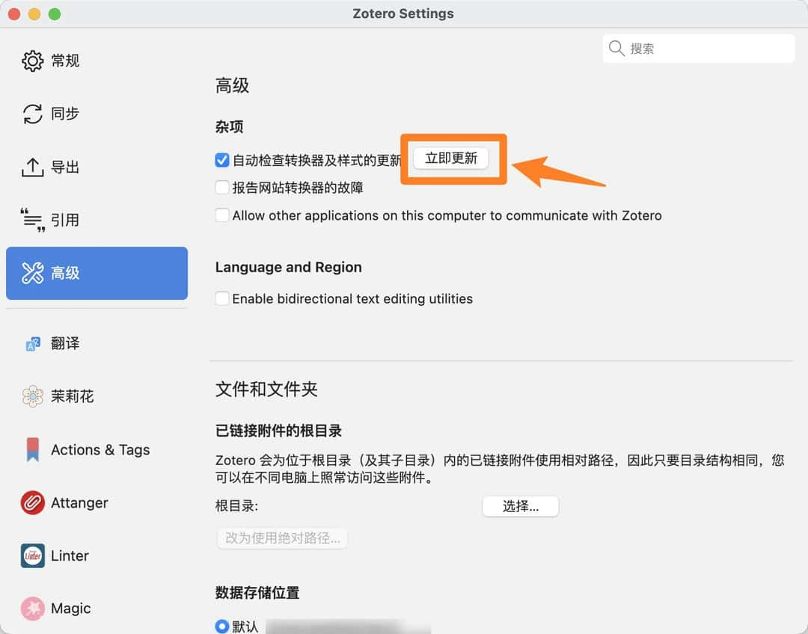
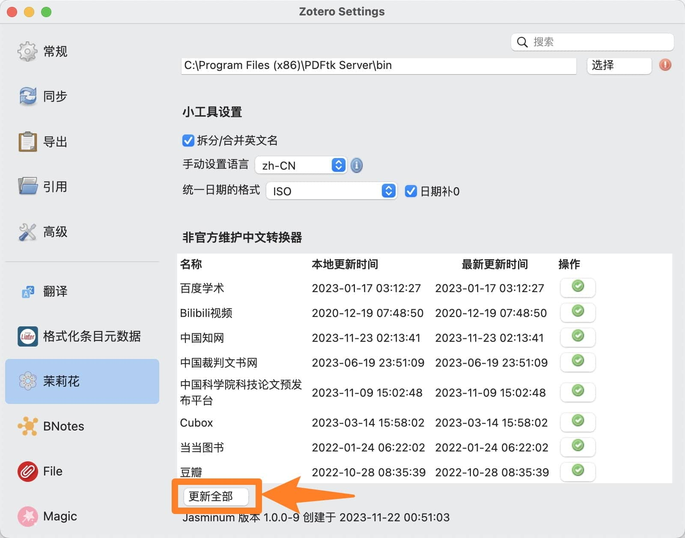
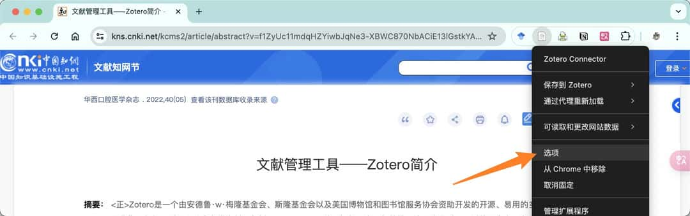
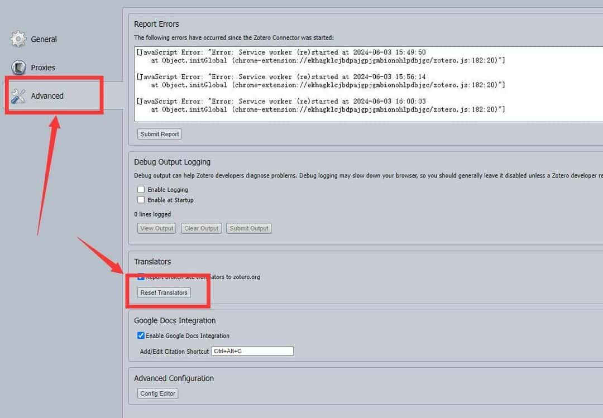
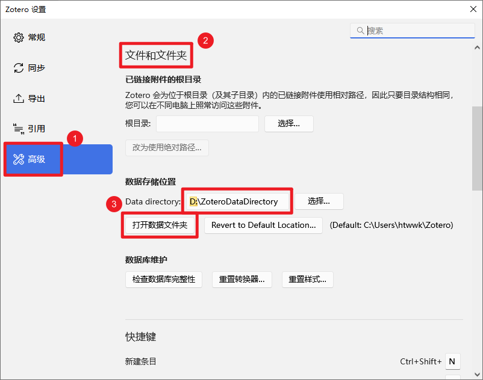
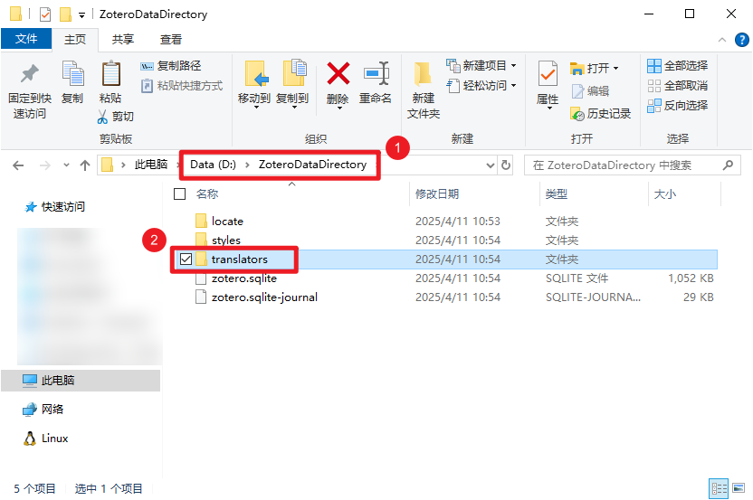
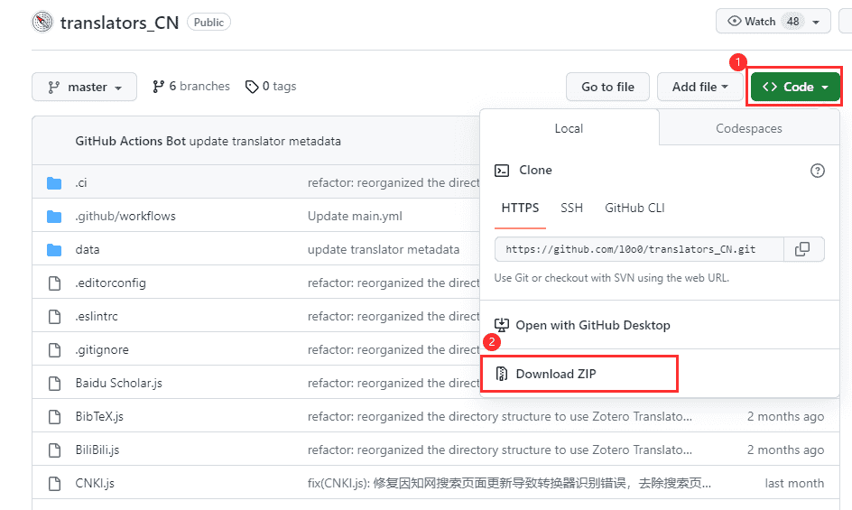
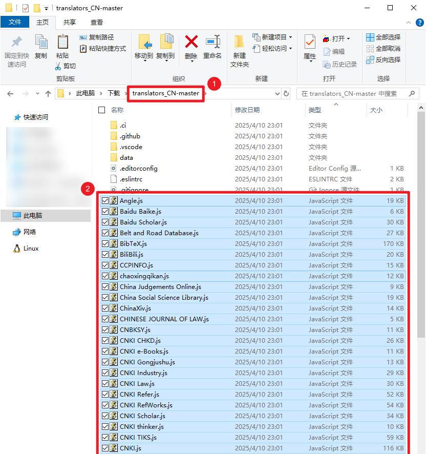
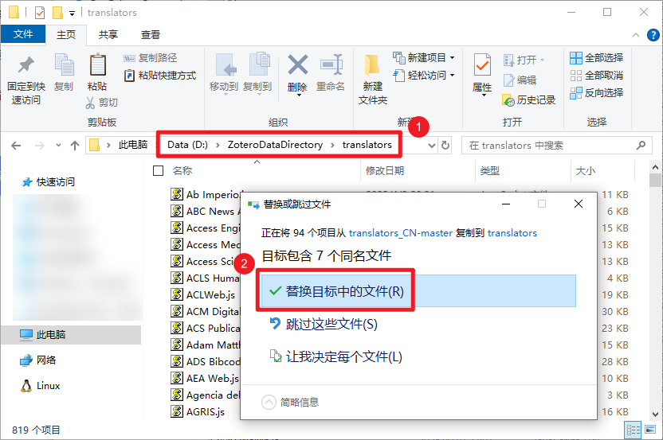
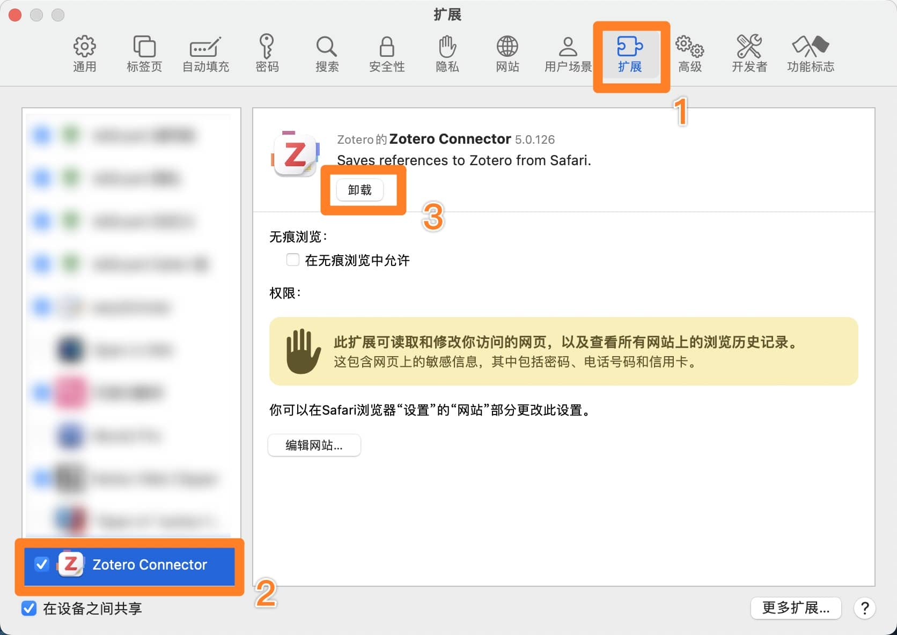

# 抓取文献条目信息的常见问题

本页面整理了一些抓取文献条目信息相关问题，你可以在右侧大纲栏（部分窄屏设备也可能在顶部「页面导航」）快速定位到你需要的内容。

如果仍没有找到你需要的问题，可以考虑在 Zotero 中文社区提问咨询或前往 Zotero 官方论坛发帖求助。

[[TOC]]

## 基础知识：如何判断抓取是否成功？

Zotero 文库中主要有三类内容： **文献条目，附件文件，笔记** 。其中，附件文件和笔记既可以附属于一篇文献的条目，也可以自己作为顶级项目独立存储在文库中。常见的条目类型以及常用的添加条目方法请阅读 [添加条目教程](../add-items.md) 。

::: info 一点说明

以下是文库中常见的几种情况：

- **绿色**的情况最完美，可以正常阅读文献也可以正常引用；
- **橙色**的情况有正确的文献信息，可以正常引用，在[手动补充附件](../add-attachments.md#为条目添加附件)后也可以在 Zotero 中阅读论文全文；
- **红色**的情况只有一个顶级附件，无法正常引用，必须为其[抓取](../add-items.md#通过附件添加条目-推荐)/[创建](../add-items.md#手动创建条目-万能方法)一个条目后才能正常引用。

:::

Zotero Connector 浏览器扩展在网页上抓取文献时通常可以得到两类内容： **文献信息（文献条目的元数据）** ，以及相应的 **附件（如 PDF 全文、网页截图等）** 。

- 一般来说，只要你在网页上或 Zotero 里 **能够正确地识别出文献类型** （[条目图标](../add-items.md#条目-item) 与该文献的类型相对应），就已经意味着你的文献信息/元数据 **抓取是成功的** 。如果希望抓取的是「学位论文」，条目左边的图标却是「网页」或「期刊文章」，这通常意味着抓取失败或抓取到的部分信息不准确。
- 通过网页自动抓取 PDF 附件的功能在实际使用中比较玄学，可能会因为各种各样的限制无法自动抓到附件。 **如果条目抓取正常，只是抓不到附件，通常是无解的。**

正因如此， **只要你能够正确抓取到文献信息，就不建议继续折腾下去了。如果抓不到 PDF 附件，建议直接手动下载后 [添加到 Zotero 中抓取好的条目](../add-attachments.md#为条目添加附件)** 。

::: warning ⚠ 避免批量抓取文献

无论何时，请避免进行大量的批量抓取操作，严重时可能导致封禁！

:::

:::: info 尽量在文献详情页抓取

在文献搜索界面或阅读界面进行条目抓取非常容易失败，请在文献的详情页（如下）进行条目的抓取。

::: details 典型的详情页示例

:::

::::

::: tip ScienceDirect 需要手动完成反爬虫验证

ScienceDirect 增强了反爬虫机制，这限制了 Zotero 的抓取功能，Zotero 7 中针对该措施推出了一项新功能。当你尝试抓取 ScienceDirect 上的文章时，Zotero 会显示 ScienceDirect 的验证码页面。如果你完成了验证码，Zotero 则会完成 PDF 的下载。

:::

如果你不能正确地抓取文献信息，或者抓取后的条目里文献信息缺失，那么下面这篇文档会对你有所帮助。

## 更新抓取文献信息的转换器

在使用 Zotero 的过程中，我们经常需要更新 `转换器` 来实现从网页快速抓取文献信息。通常，我们可以借助 Zotero 本身的功能以及 茉莉花 插件快速完成该操作。但当 Zotero 或 茉莉花 插件出现故障无法完成一键自动更新时，我们也可以手动下载新版的转换器文件，并进行手动更新。

::: info 提醒

这里的「转换器」指的是 Zotero 从浏览器网页抓取文献信息时所需的转换器，在 Zotero 中有时也被称作是「翻译器」或「translator」。如果你遇到的是语言翻译问题（如标题翻译、摘要翻译、文献阅读中的句段翻译等），通常与本文讲的转换器（translator）无关，请参照 Translate for Zotero 插件的教程进行排查。

:::

### 方法 1：一键自动更新 <Badge text='推荐' />

#### 步骤 1. 更新官方转换器

在 `Zotero 设置` 中，进入 `高级` 设置，点击下方「自动检查转换器和样式的更新」后面的 `立即更新` 按钮。

::: tip 推荐保持自动更新

我们推荐保持勾选 「自动检查转换器和样式的更新」 以获得最新的官方转换器。

:::

::: warning 「更新转换器」 和 「重置转换器」 是不同的！

注意：如无必要，不要点设置页下面的「数据库维护 -> 重置转换器 (Reset Translators)」 按钮，这会删除整个 translators 文件夹。

:::

#### 步骤 2. 更新中文转换器

1. 安装/更新茉莉花插件

   茉莉花插件是一个 Zotero 中文生态增强插件，提供了中文转换器的更新服务，请确保你安装了最新版本的茉莉花插件，浏览 [茉莉花](../plugins/jasminum.md) 了解详情。

2. 进入茉莉花插件的设置，转到 「非官方维护中文转换器（翻译器）」 部分，然后点击 「更新全部」 按钮。

   

   ::: info 提醒

   建议不定期来这里更新一下非官方维护中文转换器（翻译器）。特别是在遇到中文文献无法抓取的时候，通常意味着这里的转换器需要更新了。

   :::

#### 步骤 3. 更新 Zotero Connecter 的缓存

1. 更新 **每一个浏览器** 中 Zotero Connector 扩展里的转换器（translators）。

   ::: tip

   从 Zotero Connector v5.0.124 开始，官方移除了 Zotero Connector 设置里 「Advanced」->「Translators」 中的 `Update Translaors` 按钮，如果你的浏览器扩展中仍然保留 `Update Translaors` 按钮，请务必先[升级 Zotero Connector 浏览器扩展](../install.md#浏览器扩展-zotero-connector)再进行后续操作。

   :::

   请根据您使用的浏览器点开下面相应的说明，并按照说明中的步骤操作。（360（极速）浏览器、搜狗浏览器、QQ 浏览器等基于 Chromium 等国内厂商推出的浏览器请参照 Google Chrome 的步骤操作）

   ::: details Google Chrome、 Microsoft Edge 和 Mozilla Firefox

   1. 右键点击 Zotero Connector 按钮，然后点击 选项/Preference

      

   2. 点击 Advanced 中的 Reset Translators 按钮

      

   :::

   ::: details Apple Safari

   虽然 Zotero 目前已经支持在 Safari 中使用，但实际使用中在 Safari 中抓取失败的案例比较多。 \*\*建议使用 Microsoft Edge、Google Chrome 或 Mozilla Firefox 浏览器进行抓取。

   1. 在网页空白处点鼠标右键，然后点击 Zotero Preference

      

   2. 点击 Advanced 中的 Reset Translators 按钮

      

   :::

   ::: warning

   **这一步骤非常关键！** 请务必确保为 **每一个浏览器** 中的 Zotero Connector 扩展更新转换器！

   点击 Reset Translators 按钮时，你也可以通过检查日志的方式确保转换器成功更新

   

   :::

2. 重启浏览器。

3. 此时你已经完成了转换器的更新。此时如果你的浏览器仍然不能完成对文献的识别，在确保步骤 1-2 正确的前提下，可重复几次步骤 3 。

### 方法 2：手动替换转换器文件更新 <Badge text="高级" />

::: warning 不推荐这种方法

我们推荐使用 「方法 1：自动更新」 完成转换器更新。

:::

1. 在 Zotero-编辑-设置-高级-文件和文件夹 找到自己的数据储存位置。

   例如，下图中的数据储存位置就是 `E:\Zotero File`，这里也可以点击「打开数据文件夹」快速打开你的数据文件夹。

   

2. 找到数据文件夹中的 translators 文件夹（对上图而言就是 `E:\Zotero File\translators`），这里是 Zotero 转换器 的存放位置。

   

3. 在 [Zotero translators 中文维护小组](https://github.com/l0o0/translators_CN) 下载最新的转换器。

   

4. 将下载的 zip 文件解压后选择其中所有的转换器文件（.js 文件），并复制。

   

5. 将所有的转换器文件粘贴到第 1 步中 translators 文件夹并替换，此时已经完成 Zotero 中 转换器文件的更新。

   

6. 更新 **每一个浏览器** 中 Zotero Connector 扩展里的转换器（translators）。

   ::: tip

   从 Zotero Connector v5.0.124 开始，官方移除了 Zotero Connector 设置里 「Advanced」->「Translators」 中的 `Update Translaors` 按钮，如果你的浏览器扩展中仍然保留 `Update Translaors` 按钮，请务必先[升级 Zotero Connector 浏览器扩展](../install.md#浏览器扩展-zotero-connector)再进行后续操作。

   :::

   请根据您使用的浏览器点开下面相应的说明，并按照说明中的步骤操作。（360（极速）浏览器、搜狗浏览器、QQ 浏览器等基于 Chromium 等国内厂商推出的浏览器请参照 Google Chrome 的步骤操作）

   ::: details Google Chrome、 Microsoft Edge 和 Mozilla Firefox

   1. 右键点击 Zotero Connector 按钮，然后点击 选项

      

   2. 点击 Advanced 中的 Reset Translators 按钮

      

   :::

   ::: details Apple Safari

   虽然 Zotero 目前已经支持在 Safari 中使用，但实际使用中在 Safari 中抓取失败的案例比较多。 \*\*建议使用 Microsoft Edge、Google Chrome 或 Mozilla Firefox 浏览器进行抓取。

   1. 在网页空白处点鼠标右键，然后点击 Zotero Preference

      

   2. 点击 Advanced 中的 Reset Translators 按钮

      

   :::

   ::: warning

   **这一步骤非常关键！** 请务必确保为 **每一个浏览器** 中的 Zotero Connector 扩展更新转换器！

   点击 Reset Translators 按钮时

   你也可以通过检查日志的方式确保转换器成功更新

   
   :::

此时你已经完成了转换器的更新，此时如果你的浏览器仍然不能完成对文献的识别，在确保步骤 1-5 正确的前提下，可重复几次步骤 6。

## 卸载并重装 Zotero Connector 浏览器扩展 <Badge text="中级" />

如果按照上面的步骤更新后仍然无法正常抓取，建议卸载并重装最新版本的 Zotero Connector 浏览器扩展。

请根据您使用的浏览器点开下面相应的说明，并按照说明中的步骤操作。（360（极速）浏览器、搜狗浏览器、QQ 浏览器等基于 Chromium 等国内厂商推出的浏览器请参照 Google Chrome 的步骤操作）

::: details Google Chrome、 Microsoft Edge 和 Mozilla Firefox

1.  进入浏览器的管理扩展程序页面

    Google Chrome：点击浏览器界面右上角的 `三个点` 按钮，然后点击 「扩展程序」->「管理扩展程序」。

    Microsoft Edge：点击浏览器界面右上角的 `三个点` 按钮，然后点击 「扩展」->「管理扩展」。

    Mozilla Firefox：点击浏览器界面右上角的 `三横线` 按钮，然后点击 `扩展和主题`。

    

2.  找到 Zotero Connector，点击 `移除` / `删除` / `三个点` 按钮里的 `移除`。

    

3.  按照下面教程中的说明重新安装最新版的 Zotero Connector 浏览器扩展。

    [Zotero Connector 浏览器扩展安装说明](../install.md#浏览器扩展-zotero-connector)

:::

::: details Apple Safari

虽然 Zotero 目前已经支持在 Safari 中使用，但实际使用中在 Safari 中抓取失败的案例比较多。 \*\*建议使用 Microsoft Edge、Google Chrome 或 Mozilla Firefox 浏览器进行抓取。

Safari 的浏览器扩展是跟随 Zotero 客户端一同安装的，重装 Zotero Connector 时通常需要卸载并重装 Zotero 客户端本体。

通常来说，仅删除 Zotero 客户端本体的执行文件不会影响到你的文库文献、设置、插件等数据，重新安装 Zotero 后所有内容都会保持以前的状态。如果不放心，你也可以先查看这一篇文档先备份一下 Zotero 数据文件和用户配置文件：[备份 Zotero 数据](../backup.md)

1.  打开 Safari，点击系统菜单栏左上角的 `Safari 浏览器`，然后点击 `设置`。

    

2.  在弹出的窗口中点击顶部的 `扩展` 选项卡，在左边栏找到 Zotero Connector，然后点击右边界面里的 `卸载`。

    

3.  点击弹窗中的 `在访达中显示`。

    

4.  完全退出 Safari 浏览器，然后回到上一步的访达界面中，将 Zotero 程序文件删除（如果不小心关闭了刚刚弹出的访达窗口，你也可以重新开启一个访达窗口，然后在左边栏中点击 `应用程序`，然后删除里面的 Zotero 程序文件）。

5.  重新从 Zotero 官网下载新的 Zotero 安装包并完成安装。[获取 Zotero 下载链接](../install.md)

6.  运行一次 Zotero，此时 Safari 的 Zotero Connector 扩展会自动安装。

7.  重新运行 Safari 浏览器，如果没有看到 Zotero Connector 扩展图标，你可以在第 2 步的 `扩展` 选项卡中找到左边栏里的 Zotero Connector，确保它前面的复选框已经勾选。

8.  如果 Zotero Connector 图标仍未出现，你可以在 Safari 窗口顶部的按钮区域空白处点鼠标右键，然后点击 `自定义工具栏...`，然后将下方的 Zotero Connector 图标拖到上方按钮区域里你希望放置的位置上。

:::

## 使用其他添加条目的方式 <Badge text="初级" />

如果以上所有操作都未能解决你遇到的抓取问题，可能你访问的网页目前无法通过 Zotero Connector 抓取文献信息。你可以尝试换其他网站进行抓取，或者改用 [通过附件添加条目](../add-items.md#通过附件添加条目-推荐)、[由通用格式的引用信息导入](../add-items.md#由通用格式的引用信息导入-通用方法) 以及 [手动创建条目](../add-items.md#手动创建条目-万能方法) 等备用方式。详细操作步骤请阅读 [添加条目教程](../add-items.md) 。
