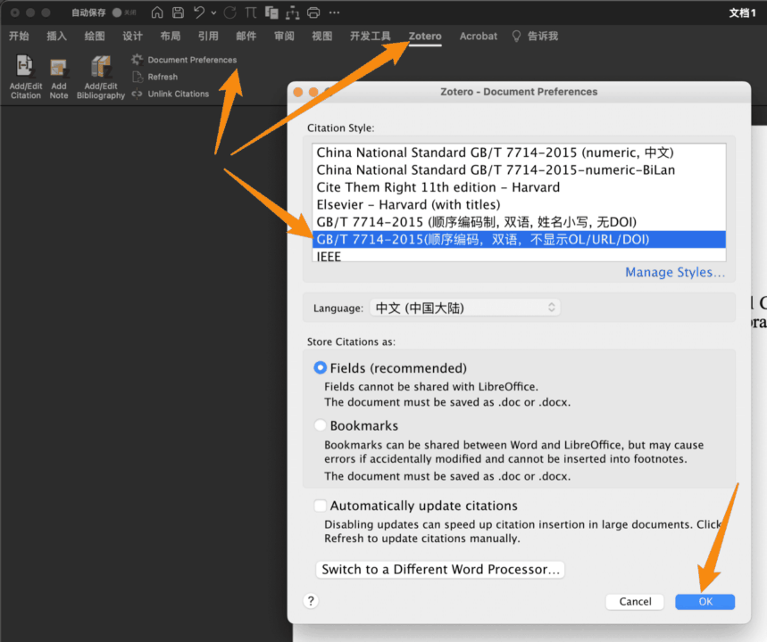

---
author:
  - name: Northword
  - name: winding
  - name: ShareStuff
  - name: Chikit_L
  - name: 可口可乐
    url: https://github.com/wakewon
date: 2023-10-04 11:38:09
updated: 2024-01-31 20:01:21
order: 2
---

# 关于 Word 引用的各种问题

本页面整理了一些使用字处理插件常遇到的一些问题，你可以在右侧大纲栏（部分窄屏设备也可能在顶部“页面导航”）快速定位到你需要的内容。

如果没有在本页面找到你需要的问题，可以参考官方文档 [Zotero 文字处理插件报告的一些问题以及可能的解决方案](https://www.zotero.org/support/word_processor_plugin_troubleshooting)。

如果仍没有找到你需要的问题，可以考虑在 Zotero 中文社区提问咨询或前往 Zotero 官方论坛发帖求助。

[[TOC]]

## 插入参考文献的基础教程

在开始排查问题之前，请务必先了解 Zotero 的 Word 加载项中各个按钮的功能和用法。在 Word 中插入参考文献的基本操作请阅读：

[在 Word 中插入参考文献的基础教程](../ms-word-plugin.md)

此外，关于 Zotero 参考文献插入及排版的基本教程您还可以观看这个视频：

[Zotero 文献在 Word 中的引用](https://www.bilibili.com/video/BV1ma4y1f7yg/)

其中包括以下问题的解答：

1. 如何安装/重新安装 Word 中的 Zotero 工具条（Word 加载项）。
2. 如何从 Zotero 官方下载参考文献格式。
3. 如何在 Word 中插入参考文献。
4. 如何在 Word 中设置引用样式。

::::: info 提醒

请注意， **Zotero 在更新至 6.0.23 或更高版本后，Word 选项卡里的按钮顺序有调整。** 新版本交换了第二个和第三个按钮的位置， **在阅读教程的时候请注意点击的按钮具体是哪一个，不要只去数是第几个按钮。**


:::: details 按钮功能说明

**目前新版本里横向布置三个大按钮分别是：**

1.  **插入/编辑引注** `Add/Edit Citation`

在当前光标位置插入或编辑引注。

::: tip

此按钮只是插入引注，不会在文末自动生成参考文献表。要插入参考文献表，请点击 `插入/编辑参考文献表` 按钮。

:::

2.  **插入/编辑参考文献表** `Add/Edit Bibliography`

在光标当前位置插入或编辑已存在的参考文献表。

::: info

一般情况下，在文末写一个 `参考文献` 标题，然后按回车另起一行，再点击这个按钮插入参考文献表。

:::

3.  **插入笔记** `Add Note`

在光标当前位置插入笔记。

::: tip

此功能不常用，点击后会出现黄色插入框。如果不小心点开了，可以用键盘上的 `Esc` 键关闭黄色插入框。

:::

**三个纵向布置的小按钮分别是：**

1.  **文档首选项** `Document Preferences`

更改参考文献样式或语言，开启/关闭自动更新引注功能。

2.  **刷新** `Refresh`

更新引注引注编号及文末参考文献表内容，关闭自动更新引注功能后需手动点击此按钮更新引注。

3.  **取消链接引注** `Unlink Citations`

删除所有 Zotero 域代码且断开与 Zotero 文库链接。点击后所有的引注和文末的参考文献表都会变成纯文本。

::: warning

该操作不可逆，一旦断开连接，所有的引注信息都会变成纯文本，无法再自动更新编号和参考文献表，也无法恢复到以前带有链接的状态。因此强烈建议在断开连接之前将文档另存一份备用，仅将用于提交/共享的副本断开连接。

:::

::::

:::::

::: warning

在插入文献之前， **请务必先将 Zotero 里英文论文详细信息中的 `语言/Language` 字段改为** `en` 或 `en-US` 等与文献语言一致的信息，否则在中英文混排时可能会遇到错误。具体方法见后文里 **中英文混排** 部分的内容。

:::

## 插入引用常见的操作问题

在实际使用中，有一些操作上的小技巧，在这里略作整理：

1.  **Zotero 有两种插入文献的方式，一种是搜索对话框，另一种是经典视图的选择窗：**


如果你在使用新式搜索框，推荐采用`年份 作者姓名`进行检索（两个关键词中间敲一个空格）。

这两种界面可以在插入的时候临时切换，也可以在 Zotero 首选项 里修改默认使用经典选择窗。操作步骤请参见[在 Word 中插入参考文献的基础教程](../ms-word-plugin.md)

2. 如果你使用搜索框， **输入中文关键词后没有候选项目** ，请 **按一下键盘的空格键** ，然后就有候选项了。

3. 如果你 **在一处位置想同时引用多个文献** ，请在插入引用时 **一次性插入每一个文献** ，不要分成两次分开插。

:::: tip 插入多条文献

**在使用搜索窗时** ，先加入第一个文献，然后不要急着按回车确认插入，而是改为 **按一下空格然后继续搜下一个文献** 。直到所有文献都完成插入之后再按回车确认本次插入。

**在使用经典选择窗时** ，点击左下角的 `多重来源/Multiple Sources` 来实现同时插入多个文献。具体操作请参见[在 Word 中插入参考文献的基础教程](../ms-word-plugin.md)

::: info

注：这个窗口内可以多选，可以在左边窗口一次性选择多个条目，然后统一点向右的箭头加到右边。待全部文献添加完成后，再点击确认完成插入。

:::

::::

4. 如果你 **在插入完成后想重新修改引用信息** ，请先在 Word 中插好的编号角标中间点一下，使输入光标在角标内（此时角标会变为灰色），然后点 `插入/编辑引注` 按钮即可编辑/增删此处引用的文献。

{width=60%}

5. 在 `插入/编辑引注` 过程中，请务必在选择文献过程中 **不要转到其他窗口去翻看查阅** 。如果边翻看边插入，很有可能导致插入失败并报错。如果插入过程中希望查阅信息，你可以先按回车键确认本次插入，待查阅完成后再用第 4 点提醒中的方法编辑/补充引用。

6. Zotero 在插入文献时更新角标的速度非常缓慢， **建议关闭自动更新引用** 。这一设置在 Word 中的 Zotero 选项卡内：

{width=60%}

在关闭之后，你 **需要在增删引用项目后手动点 `刷新` 按钮更新引用信息及编号** 。在 Zotero 6.0 新版本下，这个更新可能非常缓慢，你需要多一点耐心。

## 格式问题

### 调整缩进、行距等格式

**Word 中参考文献书目列表的排版问题是 Word 段落样式控制的。** 其中包括：是否首行缩进，是否悬挂缩进，编号和后续文字之间的制表位空白大小，字体及文字大小，是否全部加粗，行间距大小……

这部分样式你需要 **在 Word 中修改“书目”样式** 。具体方法详见这一教程：

[如何设置 Zotero 生成的参考文献格式，刷新后不变？](https://zhuanlan.zhihu.com/p/58969571)

### 设置斜体及上下标等

一些论文的题目需要在参考文献中表现为上标、下标或者斜体：如 CO~2~，H^+^、_Nature_，这该如何实现呢？

方式一：~~插入参考文献后在 Word 中手动修改，但是这种方法每次刷新后需要重新设置非常麻烦。~~（这是不正确的方式，不推荐）

方式二：在 Zotero 中修改该文献的条目信息，通过在题目中添加以下代码来实现上标、下标、斜体、加粗的效果，添加完后返回 Word 刷新引文：

```html
<sup>上标</sup>
<sub>下标</sub>
<i>斜体</i>
<b>加粗</b>
```

:::: details 示例

::: info 标题

`Influence of surface active groups on SO2 resistance of birnessite for low-temperature NH3-SCR`

`Influence of surface active groups on SO<sub>2</sub> resistance of birnessite for low-temperature NH<sub>3</sub>-SCR`

:::

::: info 参考文献表

[1] X. Fang, Y. Liu, L. Chen, Y. Cheng, Influence of surface active groups on SO2 resistance of birnessite for low-temperature NH3-SCR, Chem. Eng. J. 399 (2020) 125798. <https://doi.org/10.1016/j.cej.2020.125798>.

[1] X. Fang, Y. Liu, L. Chen, Y. Cheng, Influence of surface active groups on SO~2~ resistance of birnessite for low-temperature NH~3~-SCR, Chem. Eng. J. 399 (2020) 125798. <https://doi.org/10.1016/j.cej.2020.125798>.

:::

如上示例在 Zotero 条目信息中对需要为下标的单词两侧分别加上 `<sub>`和`</sub>`，回到在 Word 中点击 `Refresh` 刷新条目信息即可看到下标效果已经成功实现。


::::

::: tip 使用 Linter 插件快捷插入

插件 [Linter for Zotero](../plugins/linter.md) 提供了辅助输入这些富文本标签的功能，可前往 [插件商店](https://zotero-chinese.com/plugins)下载安装。

:::

::: tip 使用 Quicker 快捷插入

使用 quicker 动作可以也可以方便的实现同样的效果：

- [添加斜体标识](https://getquicker.net/Sharedaction?code=98c3d460-22b5-49ab-99c2-08d9c6b06ad1)
- [添加加粗标识](https://getquicker.net/Sharedaction?code=dc815b9a-f463-4233-99c5-08d9c6b06ad1)
- [添加上标标识](https://getquicker.net/Sharedaction?code=dee60abc-d1f5-40ad-99c3-08d9c6b06ad1)
- [添加下标标识](https://getquicker.net/Sharedaction?code=b44c0592-89fa-41c2-99c4-08d9c6b06ad1)

:::

### 中英文混排

Zotero 官方样式对于中英文混排支持得十分差劲，尤其是在 `等` 和 `et al.` 的处理上。幸运地是，有很多热心的大佬在这方面进行了许多探索，社区维护了一份支持中英文混排的 CSL 样式文件。

你需要：

1. 安装支持双语排版的 CSL 样式文件，见 [安装支持双语排版的参考文献样式](../citation-styles.md#第三方-csl-样式下载)；你也可以根据你自己的需要修改属于自己的样式文件，可以看一下这个视频教程自行定制样式：[style csl 文件简单编辑](https://zhuanlan.zhihu.com/p/336009544)
2. 需要在 Word 中指定当前文档使用的样式

   {width=60%}

   ::: warning

   请务必注意， **样式的选择是在 Word 里进行的** ，不是在 Zotero 设置里！Zotero 设置里的列表仅用来安装新样式，不能用作选择默认样式！

   :::

3. 在 Zotero 中为每一个条目添加语言，中文条目填写 `zh` 或 `zh-CN`，英文条目填写 `en` 或 `en-US`。

### 注意事项及与样式相关的常见问题

1. 中英文混排的各个样式文件通常是依靠 Zotero 文献条目信息中的 `语言/Language`，你需要在插入参考文献之前 **预先将英文和中文文献的语言设定为相应要求的内容** 。一般来说，常见的中英混排 csl 样式文件通常要求将英文文献 `信息/Info` 中 `语言/language` 字段修改为`en`，而中文文献设置成`zh` 或 `zh-CN`。

   ::: warning

   请务必注意，英文文献的语言需要设置为 `en` ，而不是其他任何内容！（即便设置成 english 也不行！）

   如果你的文献语言设定不规范，可以通过标题或作者字段对所有文献进行排序，然后分别选中英文文献，将其 [语言] 字段的信息统一为 `en`；取消选中后再选中中文文献，将其 `语言` 字段的信息统一为`zh`或者样式文件要求的样子。

   插件 [Linter for Zotero](../plugins/linter.md) 提供了自动识别条目语言并设定语言字段的功能，可前往 [插件商店](https://zotero-chinese.com/plugins)下载安装。

   {width=60%}

   :::

2. 如果你设置了新样式后，样式仍未变更，你可以在 **Word 上 `Zotero` 插件选项卡中的 `Document Preferences` 里** 随意切换到任何一个其他样式，确定。等待更新完成后，重新进设置里改回你想用的设置，文档会再次刷新，然后就好了。

3. Word 中参考文献的显示内容是 csl 文件决定的。如果你觉得 **参考文献里显示的内容** 不符合你的要求，你需要按照前面的教程修改 csl 文件。

4. 如果你设置的样式全都正确，却发现有的正文角标里的内容多了点东西（页码），可以编辑一下这一处引用，把不必要的信息删掉：


## Word 中没有 Zotero 选项卡

一些朋友在 Word 中的 Zotero 选项卡突然消失了，或者使用的时候报错要求重装/升级该加载项。 **这一加载项需要在 Zotero 首选项 中安装** 。具体步骤如下：

1. 保存好正在编辑的 Word 文档，并**彻底退出 Word**。
2. 打开 `Zotero 首选项`。
3. 在 `引用/Cite` -`文字处理软件/Word Processors` 中点击 `重新安装 Microsoft Word 加载项/Reinstall Microsoft Word Add-in` 即可完成安装/更新/重装。


:::warning

如果退出 Word 后重新安装这一加载项仍然报错，建议重启电脑后再尝试。

:::

若上图的【**文字处理软件/Word Processors**】没有内容显示，则需要在 Zotero 软件界面，单击打开 `工具/Tools` - `插件 / Plugins / 附加组件 / Add-ons`，


找到【**Zotero Word for Windows Integration**】插件，确保其没有处理禁用状态。


## 报错“无法与 Zotero 通讯”


遇到该问题时，请确保你的 Zotero 程序在运行的状态，如果你的 Zotero 在运行状态，依然遇到该问题，可以通过重新安装加载项来解决：


依次打开 `编辑` - `设置` - `引用` - `重新安装加载项Microsoft Word`，然后重新打开 Word，问题即可得到解决。

## Zotero 在更新文档时出错

::: tip

本小节在翻译 [官方文档](https://www.zotero.org/support/kb/debugging_broken_documents) 的基础上，进行了再次整合，以 Microsoft Word 为例进行操作。如果您使用的是 Google Docs 或者 LibreOffice ，可访问 [官方文档 | 排除文字处理器文档中的错误](https://www.zotero.org/support/kb/debugging_broken_documents) 获取帮助。

:::


如果您在尝试在一个**新的空文档**中使用 Zotero 时出错，请参阅 [文字处理器插件故障排除](https://www.zotero.org/support/word_processor_plugin_troubleshooting)。

如果您可以在新的空 Word 文档中插入引文，但在**现有文档**中使用 Zotero 时出现错误，可以按照以下步骤进行问题排查：

1. 检查 Word 设置

   在`文件-选项-高级`，勾选 `键入内容替换所选文字`，问题即可得到解决。
   如问题未得到解决，请按照后续步骤逐步进行排查。

   

2. 重启 Zotero 和 Word。

3. 确保您使用的是最新版本的 Zotero 和 Word。

4. 排除故障时，禁用 Word 中的修订功能，因为它在使用 Zotero 时会产生复杂的效果。
   如果在插入或修改 Zotero 引文时启用了修订功能，它可能会将文档中的许多或所有 Zotero 引文标记为已更改。如果您以前启用了修订功能，请尝试接受所有更改，看看这是否能解决问题。

5. 检查图片标题中的引用。Zotero 不会让你插入它们，但如果你将引用复制到标题中，这很可能是问题的根源。删除这部分引用。

6. 尝试将文档内容复制并粘贴到新文档中，以查看问题是否消失。您可能需要点击 `Document Preferences` 按钮，您的旧引用才会被识别。

7. 通过复制文件本身，而不是通过复制和粘贴内容，制作文档的副本，用于调试。

8. 如果在 Windows 上使用 OneDrive，请将文档的副本保存到本地硬盘，或者尝试删除文件名中的任何空格。OneDrive 会干扰插件的使用，请在使用 Zotero 过程中避免与 Onedrive 同时使用。

9. 打开复制的文件，检查切换到不同的参考书目样式后是否出现错误。

10. 如果文档有参考书目（bibliography,），请删除它后检查是否仍然出现错误。

11. 调试时，如果您在 Word 插件中使用字段模式，显示字段代码而不是格式化文本可能会有所帮助。为此，请在 Word 中按 Alt/Option-F9（或 Alt/Option-Fn-F9）。

12. **隔离有问题的引用。**
    在文档副本中，每次删除一半内容，看看错误是否仍然发生。如果没有，使用 "撤消" 恢复已删除的部分，然后尝试删除另一半。对出现错误的部分重复删除一半的过程，如果两个部分都出现错误，则随机选取一个。继续这样做，直到找到出现问题时必须存在的最小部分（最好只有一个引文）。从原始文档中删除孤立的引文，问题就会消失（除非有多个断开的引文，在这种情况下您需要重复该过程）。

## 域代码相关问题

### 您已经修改该引文，是否保留更改？


该弹窗通常是用户手动修改了引文或参考文献表，比如该弹窗即为某文献在文中编码为“[1]”，用户手动把它修改为了“[111]”，Zotero 再次刷新时会询问用户是否保留这些修改？

如果用户需要保留自己的修改，则点击“是 yes”，如果用户需要抛弃自己的修改，使用 Zotero 生成的内容，则需要选择“否 No”。

::: danger

注意：请谨慎选择“是 Yes”，该操作会让 Zotero 不再更新此处！

:::

::: warning

所有的引注顺序更改都应在 Word “引文编辑对话框”中进行，而不是手动修改！

所有的引注/参考文献表的样式修改都应在 CSL 文件中进行，而不是手动修改！

所有的条目信息，如作者、标题、期刊、期卷页等，都应在 Zotero 中更新条目，而不是手动在域代码上修改！

:::

如果已经点了 “是 yes”，Zotero 不再对这一处引文进行更新，而后续又想要 Zotero 对其更新，可以参照下一节。

#### 使 Zotero 恢复对引文的更新

首先分析一下 Word 加载项 在 Word 留下的域代码结构，以 [https://doi.org/10.1021/acscatal.0c05697](https://doi.org/10.1021/acscatal.0c05697) 为例，其正常插入 Word 后产生的域代码为：

::: details Zotero 引文在 Word 中产生的域代码截图


:::

其中标黄部分是标识这是一个 Word 域代码块的声明，可以不去管，重点在包含在其中的 json 内容，为了方便理解，将其格式化后显示如下：

::: details 上述可以正常更新的域代码格式化后的代码

```json
{
  "citationID": "gr3uElq7",
  "properties": {
    "formattedCitation": "\\super [1]\\nosupersub{}",
    "plainCitation": "[1]",
    "noteIndex": 0
  },
  "citationItems": [
    {
      "id": 2220,
      "uris": ["http://zotero.org/users/7424907/items/SUW7JYI9"],
      "itemData": {
        "id": 2220,
        "type": "article-journal",
        "abstract": "To explore effective way for the complete catalytic degradation of toluene at low temperature, catalysts with diverse activity of adsorbed oxygen (Oads) and lattice oxygen (Olatt) are synthesized by introducing Sr2+ into the birnessite structure. Sr modification highly improved low-temperature catalytic activity and CO2 selectivity of toluene oxidation under moist condition, especially on the BS-7.5 (Sr:Mn = 0.075) catalyst. A series of physiochemical characterizations and DFT calculations identified abundant Olatt with higher activity in Sr-doped birnessite and higher activity of Oads in pure birnessite. In situ DRIFTS analysis further confirmed that activation of Olatt introduced by Sr replacement of Mn governed the reaction process towards continuous deep oxidation of toluene. These findings provide a deeper understanding of the mechanism of toluene degradation and strongly pave a way for improving the complete catalytic oxidation performance of VOCs at low temperature over MnO2 catalysts from the aspect of regulating active oxygen-related properties.",
        "archive": "Q1",
        "archive_location": "工程技术1区 Top",
        "call-number": "8.04",
        "collection-title": "无",
        "container-title": "Fuel",
        "DOI": "10.1016/j.fuel.2022.124116",
        "ISSN": "0016-2361",
        "journalAbbreviation": "Fuel",
        "language": "en",
        "license": "8.04",
        "note": "JCR分区: Q1\n中科院分区升级版: 工程技术1区\n中科院分区基础版: 工程技术2区\n影响因子: 8.04\n5年影响因子: 6.63\nEI: 是",
        "page": "124116",
        "source": "能源与燃料2区 工程：化工1区",
        "title": "Regulating oxygen species for promoted deep oxidation of toluene: A comparative study of adsorbed oxygen and lattice oxygen",
        "title-short": "Regulating oxygen species for promoted deep oxidation of toluene",
        "volume": "321",
        "author": [
          {
            "family": "Zhang",
            "given": "Luyue"
          },
          {
            "family": "Liu",
            "given": "Yongjun"
          },
          {
            "family": "Fang",
            "given": "Xue"
          },
          {
            "family": "Cheng",
            "given": "Yan"
          }
        ],
        "issued": {
          "date-parts": [["2022", 8, 1]]
        }
      }
    }
  ],
  "schema": "https://github.com/citation-style-language/schema/raw/master/csl-citation.json"
}
```

:::

其被修改后，域代码则会变为：

::: details 不能正常更新的域代码

```json {6}
{
  "citationID": "gr3uElq7",
  "properties": {
    "formattedCitation": "\\super [1]\\nosupersub{}",
    "plainCitation": "[1]",
    "dontUpdate": true,
    "noteIndex": 0
  },
  "citationItems": [
    {
      "id": 2220,
      "uris": ["http://zotero.org/users/7424907/items/SUW7JYI9"],
      "itemData": {
        "id": 2220,
        "type": "article-journal",
        "abstract": "To explore effective way for the complete catalytic degradation of toluene at low temperature, catalysts with diverse activity of adsorbed oxygen (Oads) and lattice oxygen (Olatt) are synthesized by introducing Sr2+ into the birnessite structure. Sr modification highly improved low-temperature catalytic activity and CO2 selectivity of toluene oxidation under moist condition, especially on the BS-7.5 (Sr:Mn = 0.075) catalyst. A series of physiochemical characterizations and DFT calculations identified abundant Olatt with higher activity in Sr-doped birnessite and higher activity of Oads in pure birnessite. In situ DRIFTS analysis further confirmed that activation of Olatt introduced by Sr replacement of Mn governed the reaction process towards continuous deep oxidation of toluene. These findings provide a deeper understanding of the mechanism of toluene degradation and strongly pave a way for improving the complete catalytic oxidation performance of VOCs at low temperature over MnO2 catalysts from the aspect of regulating active oxygen-related properties.",
        "archive": "Q1",
        "archive_location": "工程技术1区 Top",
        "call-number": "8.04",
        "collection-title": "无",
        "container-title": "Fuel",
        "DOI": "10.1016/j.fuel.2022.124116",
        "ISSN": "0016-2361",
        "journalAbbreviation": "Fuel",
        "language": "en",
        "license": "8.04",
        "note": "JCR分区: Q1\n中科院分区升级版: 工程技术1区\n中科院分区基础版: 工程技术2区\n影响因子: 8.04\n5年影响因子: 6.63\nEI: 是",
        "page": "124116",
        "source": "能源与燃料2区 工程：化工1区",
        "title": "Regulating oxygen species for promoted deep oxidation of toluene: A comparative study of adsorbed oxygen and lattice oxygen",
        "title-short": "Regulating oxygen species for promoted deep oxidation of toluene",
        "volume": "321",
        "author": [
          {
            "family": "Zhang",
            "given": "Luyue"
          },
          {
            "family": "Liu",
            "given": "Yongjun"
          },
          {
            "family": "Fang",
            "given": "Xue"
          },
          {
            "family": "Cheng",
            "given": "Yan"
          }
        ],
        "issued": {
          "date-parts": [["2022", 8, 1]]
        }
      }
    }
  ],
  "schema": "https://github.com/citation-style-language/schema/raw/master/csl-citation.json"
}
```

:::

可以看到，多了第六行 `"dontUpdate": true,`，我们将这一行去掉，再更新域代码，即可恢复 Zotero 对该处的更新。

### 字段是代码而不是引文/参考书目文本

::: tip 待办

<https://www.zotero.org/support/kb/word_field_codes>

:::

### 引文或参考书目总是以灰色或其他颜色突出显示

::: tip 待办

<https://www.zotero.org/support/kb/citations_highlighted>

:::

## 没有监测到引用

::: tip 待办

<https://www.zotero.org/support/kb/word_field_codes>

:::

## 将引注链接到参考文献表

参阅：[将引注链接到参考文献表](../misc/link-citation-to-bibliography.md) 。

## 更多教程

Johnmy 老师也制作了非常多的关于 Zotero 的教程，如果有疑问也请务必在这里多找找多看看：

[GB/T 7714 相关的 csl 以及 Zotero 使用技巧及教程](https://gitee.com/redleafnew00/Chinese-STD-GB-T-7714-related-csl)

[一些软件使用过程中的技巧，如 Endnote, Zotero 等](https://zhuanlan.zhihu.com/c_1071081428967743488)
