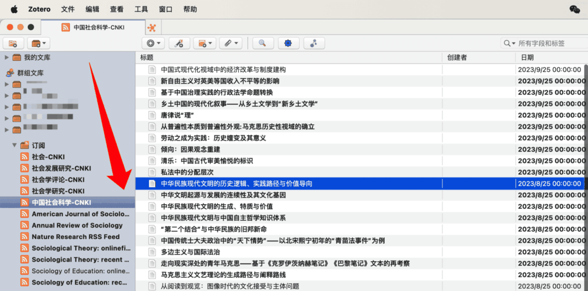
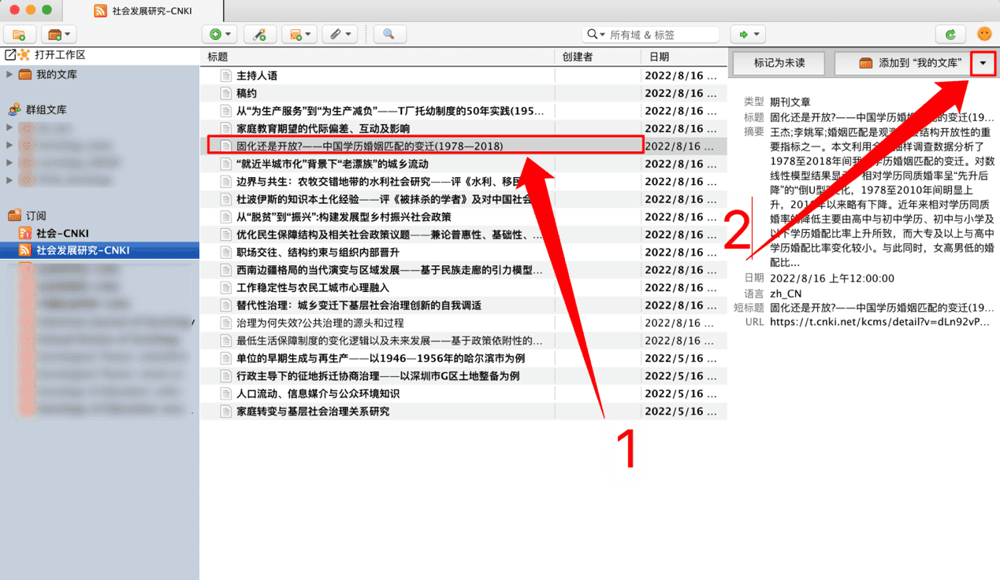
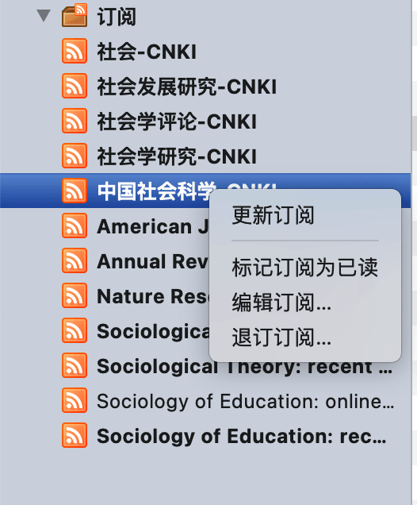
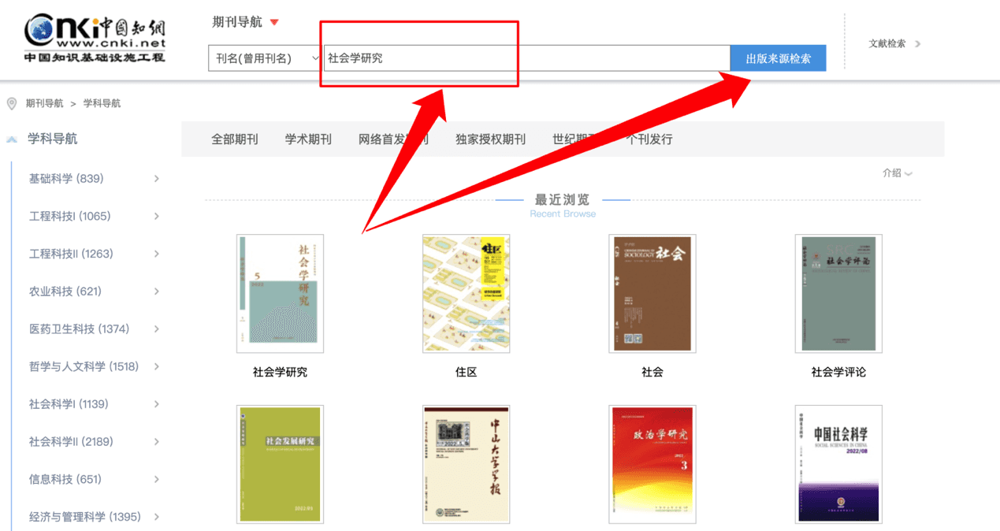
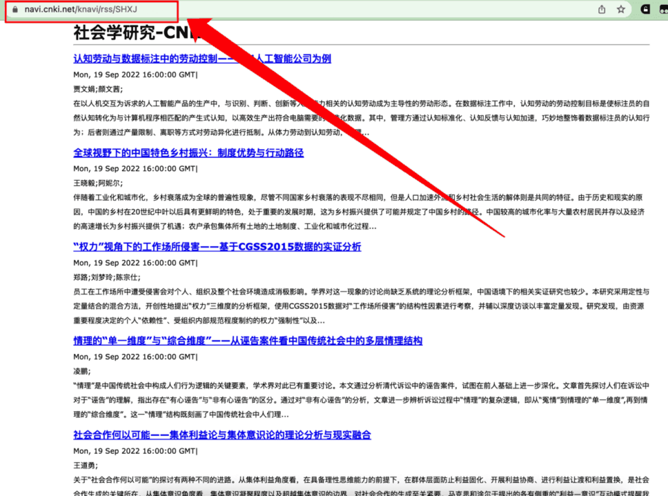
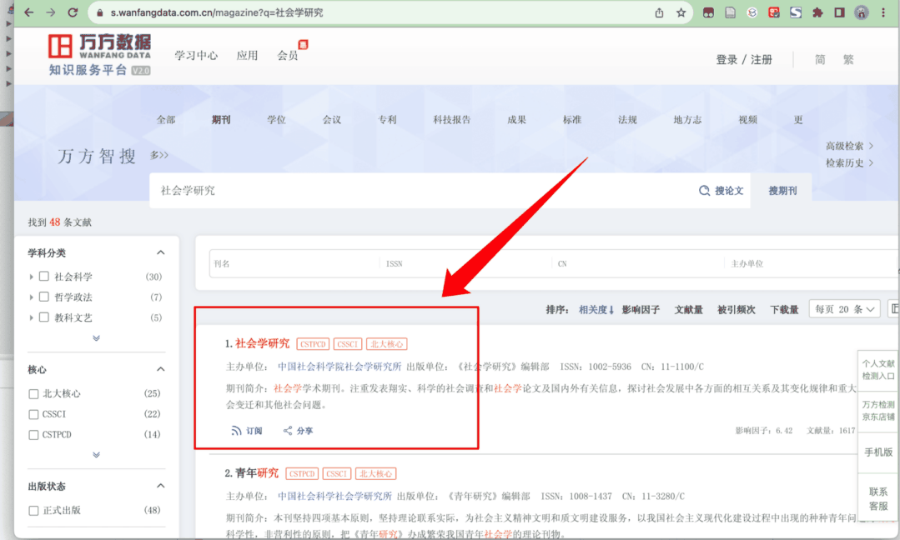
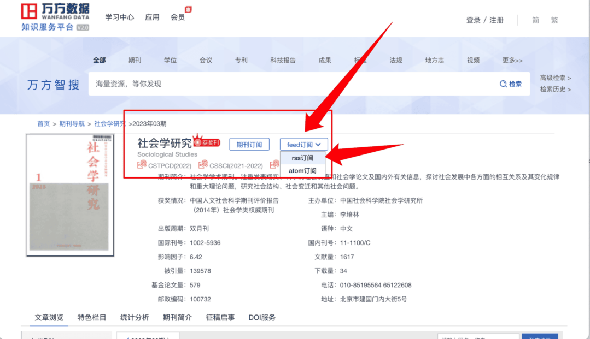

# Feed RSS

<Badge text="高级" />

Feed 是发现新研究的好方法。通过 Feed，您可以订阅来自期刊、网站、出版商、机构、研究小组或其他来源的更新，并快速查找新文章或作品。如果您在出版物的提要中找到想要保存并进一步阅读的项目，只需单击按钮即可将其添加到您的 Zotero 库中。

- 追踪期刊目录更新
- 追踪数据库中某些「关键词」相关的文献更新情况
- 订阅任意网站的内容更新，例如 b 站 up 主的视频更新...

## Zotero 订阅设置

在 Zotero 主界面，左上角工具栏选择  - 新建订阅 - 从网址...

之后会弹出以下窗口

在网址栏填入订阅网址（如何获取请往下拉），Zotero 识别成功之后会自动填入标题（可以自己手动更改，**Zotero 不会根据期刊订阅先后给订阅的期刊排序，可以手动在期刊名前面加上 1234 或者字母来排序**）并且进行高级选项设置，保存之后即可在主界面左侧`订阅`处看到订阅的内容及更新。

### 订阅来源

**从网址订阅：**"从网址订阅"是最直接、最方便的添加 RSS 订阅的方式，只需要提供订阅源的链接即可，是我们用 Zotero 追踪期刊更新时最常用的方式，**以下涉及的实例也将基于此方式进行。**

**OPML 订阅**："来自 OPML"主要用于之前有使用其它 RSS 阅读器，从其它阅读器中导入已经订阅的内容至 Zotero 中，**一般用户很少涉及此方式，故不过多介绍。**

### 高级选项

「更新订阅每 N 小时」：即设定订阅间隔，每 N 个小时从订阅 URL 爬取期刊目录，加载在该「订阅」界面。如果 N 设置为 24，则每 24 小时会刷新一遍订阅，订阅界面会 24 小时加载一次期刊目录，如果有内容更新，就会加载出现在 Zotero 订阅界面。

「删除**已读**提要题目于之后 N 天」：即点击了该条目查看右侧的条目详细信息（Zotero 会自动设置为"已读"状态）N 天后在期刊订阅界面删除该条目，如果不想删除已读条目，则将 N 设置为一个较大的数值，例如 1000000。

「删除**未读**提要条目于之后 N 天」：即该条目一直处于未点击查看该条目的具体信息，N 天后在期刊订阅界面删除该条目。如果不想删除未读条目，则将 N 设置为一个较大的数值，例如 1000000。

以上三项订阅参数的默认设置入口（Zotero7）：

Win：编辑 - 设置 - 高级 - 订阅

Mac：Zotero - 设置 - 高级 - 订阅

在此设置页面中，可以设置对订阅的条目按"最早条目在先" / "最新条目在先"的排序。

### 从"订阅"添加文献条目到"我的文库"/"群组文库"

Zotero 的订阅内容并不会保存在个人文库中，也不可以直接引用"订阅"中的条目，因此需要引用则需要将其添加到"我的文库"（也可以共享到群组文库）

点开 Zotero 某一期刊/RSS 订阅内容，点击具体条目，看到右侧信息栏，点击 中的 ▽ 倒三角图标，选择你想要保存到的本地文库文件夹 📂/在线群组文件夹 📂，再点击"添加到 XXXX"，即可从订阅中添加到自己的文献库/某个群组文库中（可以同时添加到若干个文库）。

### 订阅界面右键功能介绍

> 在订阅界面点击某个具体的订阅期刊，右键即可出现以下菜单选项

> **更新订阅**：除了 Zotero 自动按照订阅某期刊时"高级选项"的更新选项去更新订阅外，手动更新订阅，如有最新内容则自动加载到右侧具体条目面板中
>
> **标记订阅为已读**：Zotero 订阅界面中未读的期刊/具体文献条目将会**加粗**显示，点击该选项将会**设置该期刊所有内容为已读状态，取消加粗显示。**
>
> **编辑订阅**：回到"**2、高级选项**"中的设置界面，可以更改某一个期刊的高级选项，便于进行个性化订阅设置。
>
> **退订订阅**：即从订阅面板删除该订阅期刊，会有确认取消窗口避免误删，请慎重选择！

## 订阅网址（RSS 链接）获取

### 中文期刊订阅------以知网、万方数据库为例

#### 知网

进入 [知网期刊导航界面](https://navi.cnki.net/knavi/journals/index?uniplatform=NZKPT)，在「搜索框 🔍」输入想要订阅的「中文期刊全称」，并点击「出版来源检索」>

在搜索结果界面，点击进入期刊页面

在期刊主页左上角找到并点击「RSS 订阅」

复制浏览器地址栏中的网址，进入 Zotero，按照"一、Zotero 订阅设置"步骤填入并设置即可。

#### 万方数据库

进入[万方智搜](https://c.wanfangdata.com.cn/periodical)（<https://c.wanfangdata.com.cn/periodical>）界面，在「搜索框 🔍」输入想要订阅的「中文期刊全称」，并点击「搜期刊」

进入搜索结果界面点击期刊名称

进入期刊主页后，找到页面中部的「feed 订阅」选项，点击「rss 订阅」

跳转如下页面后，浏览器地址栏的网址即 RSS 订阅链接，复制浏览器地址栏中的网址，进入 Zotero，按照"一、Zotero 订阅设置"步骤填入并设置即可。

### 英文期刊订阅

一般而言英文期刊/数据库都在期刊页面提供了 RSS 订阅选项，只需要找 RSS 图标 ，即可获取订阅网址（RSS 地址）

打开 Annual Review of Psychology 网页，找到右上角的 RSS feed 
符号，点击打开

打开之后如下图示，复制浏览器地址栏的网址，即 RSS 地址，进入 Zotero，按照"一、Zotero 订阅设置"步骤填入并设置即可。

### 关键词订阅（PubMed 为例）

打开 [PubMed](https://pubmed.ncbi.nlm.nih.gov/) 官网，在搜索栏输入你想追踪的文献关键词，例如"heat wave"，点击搜索

如下图示，点击搜索框下面的"Create RSS"，进入该关键词订阅的设置界面

在设置界面，修改为合适"Number of items displayed"（追踪的文献条目数量），点击"Create RSS"，生成"RSS Feed link"后点击 copy，将其按照"一、Zotero 订阅设置"的方法填入 Zotero，即可订阅追踪该关键词的相关文献进展。

### 配合 RSSHub Radar 订阅任意网站内容

RSSHub Radar 是 [RSSHub](https://www.appinn.com/rssbud-with-rsshub-for-ios/)
的衍生项目，用来快速发现当前网页的 RSS 地址，如果支持 RSSHub 则显示
RSSHub 地址，支持包括**Zotero**、 [Tiny Tiny RSS](https://www.appinn.com/tiny-tiny-rss/)、FreshRSS、Feedly、Inoreader 在内的 11 款阅读器一键订阅。

主要功能：

- 快速发现和订阅当前页面自带的 RSS
- 快速发现和订阅当前页面支持的 RSSHub
- 快速发现当前网站支持的 RSSHub
- 支持一键订阅 RSS 到 Tiny Tiny

RSS、Miniflux、FreshRSS、Feedly、Inoreader、Feedbin、The Old Reader、Feeds.Pub、本地阅读器一旦检测出 RSS 地址，RSSHub Radar 就会在角标上显示出数量。

RSSHub Radar 浏览器扩展下载与安装（含教程）：GitHub 主页、Gitee 镜像主页、RSSHub Radar 与 Zotero 联动。

打开你想关注的 UP 主（以 sharestuff 为例），点击浏览器右上角的 RSSHub
Radar 插件图标

选择所需要订阅的内容，点击"复制"，进入 Zotero 进行 URL 订阅即可。

## 订阅功能常见问题及解决方法（更新中）

1、**填入网址后不能自动识别与保存的解决方法**：检查或更换网络，重启 Zotero 后第一时间进入订阅填入网址，能够自动识别并填充标题即可成功订阅；部分网址需要在科学网络的情况下才能识别成功，如遇外网期刊订阅无法保存时，需要保证自己的网络足够科学。

2、**订阅间隔设置不当导致的条目重复问题**：在 Zotero6 中该问题较为常见，尚未完美的解决方案，只能根据期刊更新周期设定订阅间隔。例如《社会学研究》为双月刊，建议从其发刊日时添加订阅，N 设定为 2X30X24 小时。某些 Zotero 版本，如果高级选项的「更新订阅每 N 小时」中 N 设置为 24，则每 24 小时会刷新一遍订阅，订阅界面会 24 小时加载一次期刊目录，导致期刊「订阅」界面出现重复文献条目。
