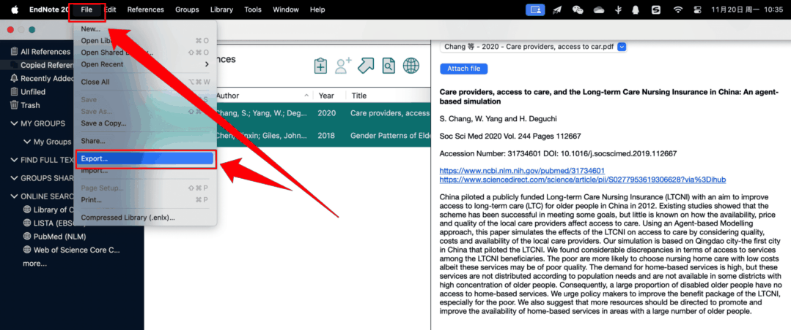
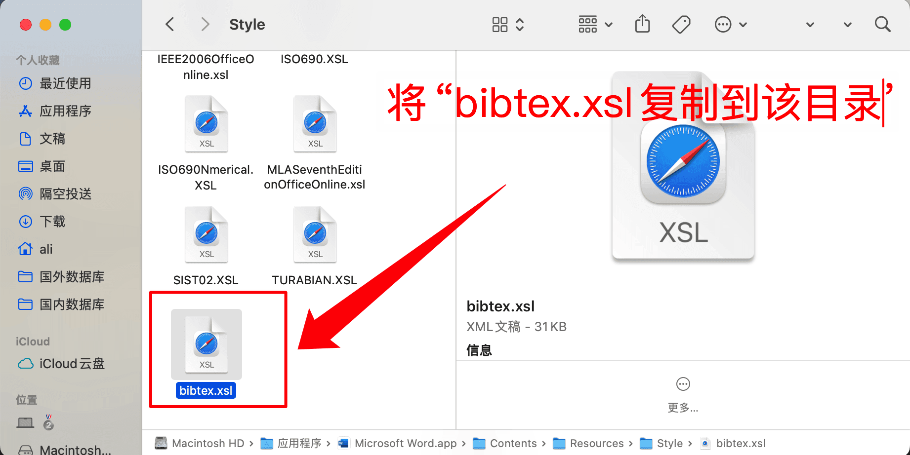
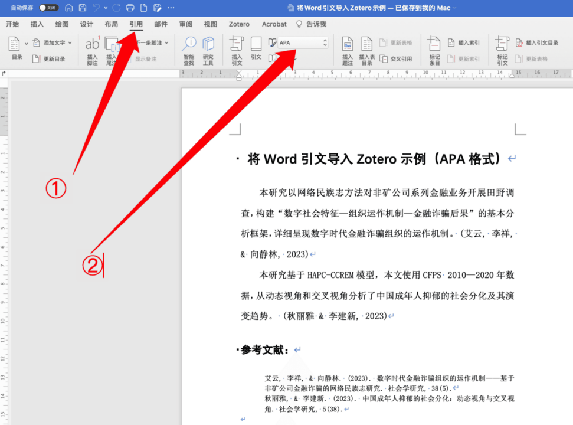
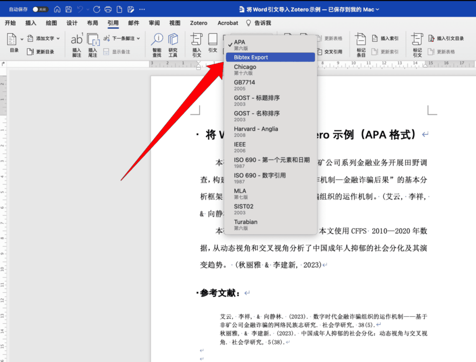
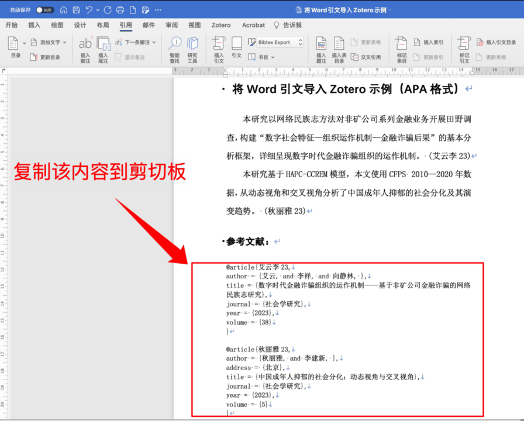
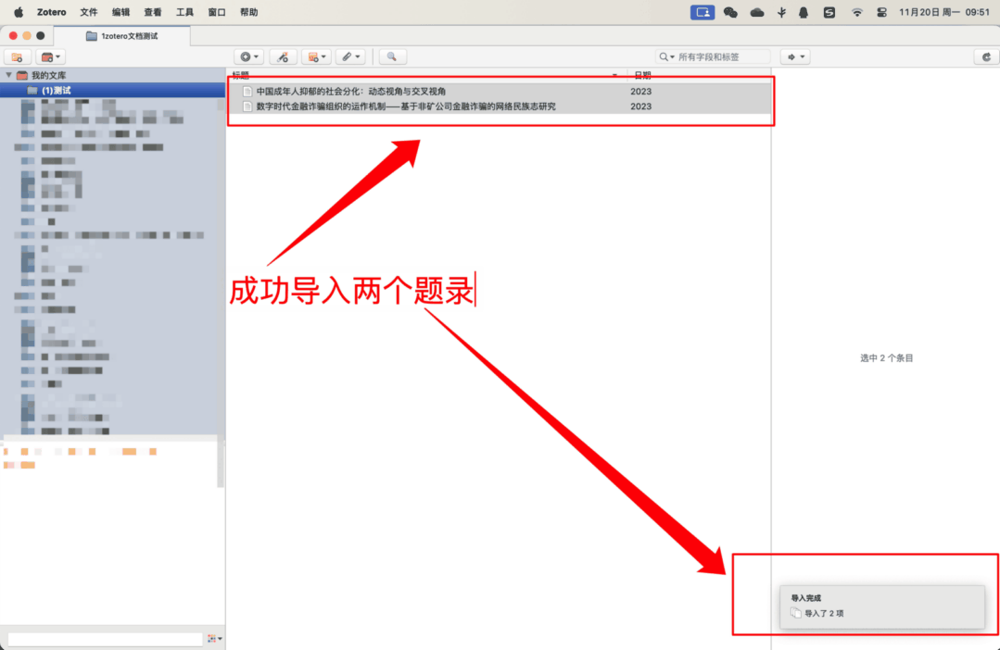

---
authors:
  - 阿狸
icon: copy
---

# 从其他软件导入条目

## 从 Endnote 导入

### 导出 EndNote 库

Zotero 无法直接导入 `.enl` 格式的 EndNote 库，因此第一步是从 EndNote 导出您的库为 XML 格式。

对于较旧的 EndNote 库，可能需要在导出之前将图形转换为附件。步骤为：“References”菜单 -> “Figure” -> “Convert Figures to File Attachments…”。

1. 如果您想要导出 EndNote 库的子集，请先选择您想要导出的条目
2. 转到“File”菜单 → “Export”。将弹出一个对话框，询问您导出文件的保存位置
3. 在上一步弹出的对话框中导航到您的 EndNote 数据目录（通常为 `我的文档/endnote.data`）。该目录包含一个“PDF”文件夹，但您应确保选择数据目录而不是任何子文件夹（例如 PDF 文件夹）内

   ::: warning

   这个很重要！ Zotero 将在相对于导出的 XML 文件位置的目录中查找文件附件。如果您将此文件保存在错误的位置，则当您导入 Zotero 时，文件附件将不会包含在内。

   :::

   ::: details 找不到库存储在了哪里？

   有两种方法，一种方法为搜索 enl 文件。

   另一种方法为复制要导出的文献到新库（New library）：

   打开 Endnote 软件，点击左上角工具栏【Referrence】=>【Copy Reference To】=>【New Library...】

   

   如下图示，在弹出来的文件浏览器页面选择一个容易找到的文件夹（以桌面为例，图中步骤 ①），接着自定义库的名称（后续导入 Zotero 内成为一个新文件夹默认使用该名称，图中步骤 ② 以**test**为例），点击【Save】

   

   Endnote 内打开保存的新库，点击左上角工具栏【File】=>【Export】

   

   :::

4. 选择“保存类型”为“XML”
5. 如果您只想导出库的子集，请选中“Export Selected References”框，否则，请确保未选中它
6. 点击“Save”
7. 退出 EndNote

### 导入 Zotero

如果您不导入到空库中，我们强烈建议您 [备份 Zotero 数据目录](./backup.md)。备份后，如果你对这次导入不满意，只需从备份中恢复您的库即可。

您还应该在 Zotero 的 [同步](./sync.md) 首选项中暂时禁用自动同步。导入库并检查确保您对导入的数据满意后，您可以重新启用自动同步。

打开 Zotero，在左上角工具栏选择【文件】=>【导入...】

如下图示，在弹出的 import 窗口界面选择【A file（BibTex，RIS,Zotero RDF,etc.）】,点击继续

在弹出的文件浏览器界面选择从 EndNote 中导出的 xml 文件，点击【Open】

在弹出的 import 窗口中，有两类选项，第一类是导入的题录信息的位置：是否将题录信息导入到一个新的分类。

第二类是文件的位置：我们推荐选择“Copy files to the Zotero storage folder”，这将条目的 PDF 等附件也导入到 Zotero 的存储文件夹中，便于 Zotero 同步（否则只是存储文件链接，在其他设备打不开附件），最后点击【继续】。

如下图所示，Endnote 的题录和附件则导入成功。

请注意，如下图示，如果 Zotero 在 EndNote XML 数据中遇到它不支持的任何字段（例如，自定义字段、作者地址、作者隶属关系），它会将这些数据添加到附加到导入项目的注释笔记中。这些注释将标记为“\_EndnoteXML 导入”。如果导入增加了许多这些注释笔记，Zotero 的性能可能会受到负面影响。您应该查看其中每个注释，以确定是否需要保留数据并删除任何不必要的注释笔记。此外，还应检查这些注释笔记，以确定是否可以将任何数据迁移到正确的 Zotero 字段（如果以非标准方式使用 EndNote 字段，这一点尤其重要）。

## 从 Microsoft Word 导入

**1、下载 bibtex.xsl 文件**

下载地址：<https://gist.githubusercontent.com/JaimeChavarriaga/40166befb14f2fe5dac390688d9eaf03/raw/faf4aa3f72e553095f81f1440c3dce744c2755a2/bibtex.xsl>

**2、Word 软件添加 bibtex 样式**

目录如下（详细步骤以 Mac 为例）

Mac 目录：

`/Applications/Microsoft Word.app/Contents/Resources/Style`

Windows 目录

Word 2010 for Windows:

`C:\Program Files\Microsoft Office\<Office version>\Bibliography\Style`

Word 2016/2019/Office 365 for Windows:

`C:\Users\<currentusername>\AppData\Roaming\Microsoft\Bibliography\Style`

打开访达，左上角工具栏点击【前往】=>【前往文件夹】

在弹出的窗口粘贴上面提到的 Mac 路径，按 Enter 键

将下载好的 bibtex.xsl 文件复制到该文件夹下。

**3、Word 引文导出**

打开 Word 文件，如下图中 ① 所示，在选项卡中点击【引用】，紧接着点击图中 ② 所示，切换引文格式

选择“Bibtex Export”

即可看到文末参考文献列表的引文格式发生了变化，复制下图所示区域的代码到剪切板。

**4、导入 Zotero**

打开 Zotero，在“我的文库”中选择（或新建后选中）一个文件夹，用于存放要导入的文献条目，在左上角工具栏点击【文件】=>【从剪切板导入】

即可如下图所示，成功导入 Word 文档中引用的文献。

## 其他工具软件

详细信息请见官方链接：[https://www.zotero.org/support/moving_to_zotero](https://www.zotero.org/support/moving_to_zotero)。

- Mendeley: <https://www.zotero.org/support/kb/mendeley_import>
- Citavi: <https://www.zotero.org/support/kb/import_from_citavi>
- Plain text reference lists: <https://www.zotero.org/support/kb/importing_formatted_bibliographies>
- Bib(La)TeX: <https://www.zotero.org/support/kb/importing_standardized_formats>
- JabRef: <https://www.zotero.org/support/kb/importing_standardized_formats>

## Zotero 支持导入的文件格式

- Zotero RDF
- CSL JSON
- BibTeX
- BibLaTeX
- RIS（Can be convenient for quick edits between export & import because of its simple structure）
- Bibliontology RDF
- MODS (Metadata Object Description Schema)
- Endnote XML（Best format for exporting from Endnote）
- Citavi XML（Best format for exporting from Citavi）
- MAB2
- MARC
- MARCXML
- MEDLINE/nbib
- OVID Tagged（使用教程参考<https://www.lib.whu.edu.cn/sybz/WHU04134Ovid.pdf）>
- PubMed XML
- RefWorks Tagged（Best format for exporting from RefWorks）
- Web of Science Tagged
- Refer/BibIX（Generally avoid if any other option is available）
- XML ContextObject
- Unqualified Dublin Core RDF

您还可以通过支持【导出上述文件格式的网站或软件】中导入题录到 Zotero，例如 Reference Manager、RefWorks、Papers、Google Scholar Library、ReadCube 等，方法是下载好以上的标准化的参考格式文件，例如 RIS、BibTeX 或 CSL JSON，然后通过单击“文件”→“导入...”导入 Zotero，然后选择“文件”，即可导入 Zotero。
