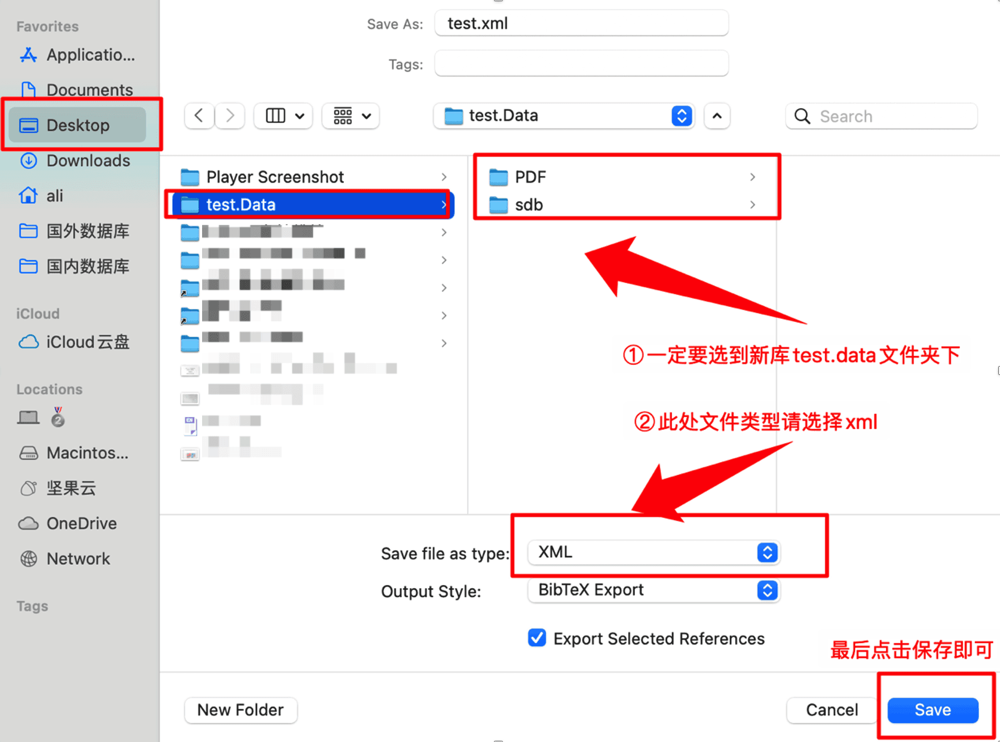

---
authors:
  - 阿狸
icon: copy
---

# 从其他软件导入条目

## 从 Endnote 导入

**1、复制要导出的文献到新库（New library）**

注意：默认位置通常在**我的文档/Endnote.data**，此步骤使用于无法找到默认库的文件路径的用户，如能找到，请跳到**2、导出 Endnote 题录和附件**。
打开 Endnote 软件，点击左上角工具栏【Referrence】=>【Copy Reference To】=>【New Library...】

如下图示，在弹出来的文件浏览器页面选择一个容易找到的文件夹（以桌面为例，图中步骤 ①），接着自定义库的名称（后续导入 Zotero 内成为一个新文件夹默认使用该名称，图中步骤 ② 以**test**为例），点击【Save】

Endnote 内打开保存的新库，点击左上角工具栏【File】=>【Export】

**2、导出 Endnote 题录和附件**

如下图所示，在弹出的窗口选择**1、复制要导出的文献到新库**中所保存的新库目录（也可以找到默认目录，该目录下包含“PDF”、“sdb”），但请不要选择“PDF”/“sdb”这两个子目录！！！
图中 ② 处请选择 XML 格式，然后点击保存，test.data 文件夹下将会出现一个后缀名为 xml 的文件。

**3、导入 Zotero**

打开 Zotero，在左上角工具栏选择【文件】=>【导入...】

如下图示，在弹出的 import 窗口界面选择【A file（BibTex，RIS,Zotero RDF,etc.）】,点击继续

在弹出的文件浏览器界面选择步骤**2、导出 Endnote 题录和附件**中保存的 xml 文件，点击【Open】

在弹出的 import 界面中如下图选择以下两个选项，将导入的题录单独放在一个文件夹，然后将条目的 PDF 附件也导入到 Zotero 的存储文件夹中，便于 Zotero 同步（否则只是存储文件链接，在其他设备打不开附件），最后点击【继续】。

如下图所示，Endnote 的题录和附件则导入成功。

请注意，如下图示，如果 Zotero 在 EndNote XML 数据中遇到它不支持的任何字段（例如，自定义字段、作者地址、作者隶属关系），它会将这些数据添加到附加到导入项目的注释笔记中。这些注释将标记为“\_EndnoteXML 导入”。如果导入增加了许多这些注释笔记，Zotero 的性能可能会受到负面影响。您应该查看其中每个注释，以确定是否需要保留数据并删除任何不必要的注释笔记。此外，还应检查这些注释笔记，以确定是否可以将任何数据迁移到正确的 Zotero 字段（如果以非标准方式使用 EndNote 字段，这一点尤其重要）。

## 从 Microsoft Word 导入

**1、下载 bibtex.xsl 文件**

下载地址：<https://gist.githubusercontent.com/JaimeChavarriaga/40166befb14f2fe5dac390688d9eaf03/raw/faf4aa3f72e553095f81f1440c3dce744c2755a2/bibtex.xsl>

**2、Word 软件添加 bibtex 样式**

目录如下（详细步骤以 Mac 为例）

Mac 目录：

`/Applications/Microsoft Word.app/Contents/Resources/Style`

Windows 目录

Word 2010 for Windows:

`C:\Program Files\Microsoft Office\<Office version>\Bibliography\Style`

Word 2016/2019/Office 365 for Windows:

`C:\Users\<currentusername>\AppData\Roaming\Microsoft\Bibliography\Style`

打开访达，左上角工具栏点击【前往】=>【前往文件夹】

在弹出的窗口粘贴上面提到的 Mac 路径，按 Enter 键

将下载好的 bibtex.xsl 文件复制到该文件夹下。

**3、Word 引文导出**

打开 Word 文件，如下图中 ① 所示，在选项卡中点击【引用】，紧接着点击图中 ② 所示，切换引文格式

选择“Bibtex Export”

即可看到文末参考文献列表的引文格式发生了变化，复制下图所示区域的代码到剪切板。

**4、导入 Zotero**

打开 Zotero，在“我的文库”中选择（或新建后选中）一个文件夹，用于存放要导入的文献条目，在左上角工具栏点击【文件】=>【从剪切板导入】

即可如下图所示，成功导入 Word 文档中引用的文献。

## 其他工具软件

详细信息请见官方链接：[https://www.zotero.org/support/moving_to_zotero](https://www.zotero.org/support/moving_to_zotero)。

- Mendeley: <https://www.zotero.org/support/kb/mendeley_import>
- Citavi: <https://www.zotero.org/support/kb/import_from_citavi>
- Plain text reference lists: <https://www.zotero.org/support/kb/importing_formatted_bibliographies>
- Bib(La)TeX: <https://www.zotero.org/support/kb/importing_standardized_formats>
- JabRef: <https://www.zotero.org/support/kb/importing_standardized_formats>

## Zotero 支持导入的文件格式

- Zotero RDF
- CSL JSON
- BibTeX
- BibLaTeX
- RIS（Can be convenient for quick edits between export & import because of its simple structure）
- Bibliontology RDF
- MODS (Metadata Object Description Schema)
- Endnote XML（Best format for exporting from Endnote）
- Citavi XML（Best format for exporting from Citavi）
- MAB2
- MARC
- MARCXML
- MEDLINE/nbib
- OVID Tagged（使用教程参考<https://www.lib.whu.edu.cn/sybz/WHU04134Ovid.pdf）>
- PubMed XML
- RefWorks Tagged（Best format for exporting from RefWorks）
- Web of Science Tagged
- Refer/BibIX（Generally avoid if any other option is available）
- XML ContextObject
- Unqualified Dublin Core RDF

您还可以通过支持【导出上述文件格式的网站或软件】中导入题录到 Zotero，例如 Reference Manager、RefWorks、Papers、Google Scholar Library、ReadCube 等，方法是下载好以上的标准化的参考格式文件，例如 RIS、BibTeX 或 CSL JSON，然后通过单击“文件”→“导入...”导入 Zotero，然后选择“文件”，即可导入 Zotero。
