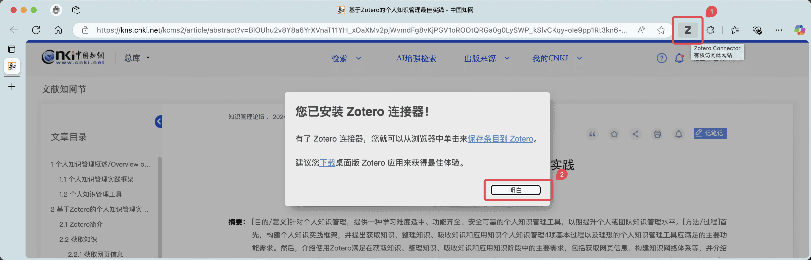
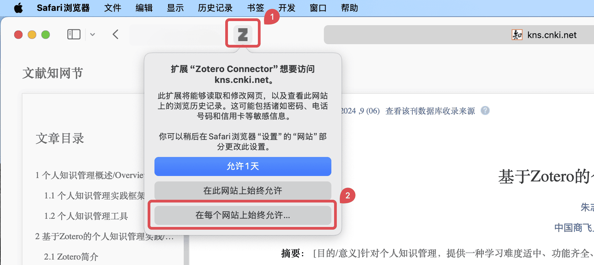
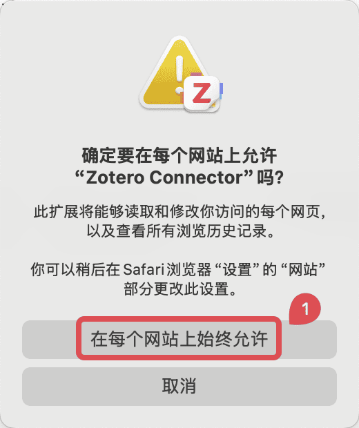

# 安装

## 主程序（PC）

请在 [Zotero 官网](https://www.zotero.org/download/) ，在页面左边下载对应自己操作系统的 Zotero 安装包。

### 测试版本的 Zotero

我们始终推荐大部分用户使用正式版本的 Zotero 而非测试版本，测试版本将面临包括但不限于崩溃、数据丢失等问题。

::: details 获取 Zotero beta 版本

你可以在 [Zotero Beta Builds - Zotero Documentation](https://www.zotero.org/support/beta_builds) 里下载测试版本的 Zotero。

注意：测试版本的 Zotero 将强制保持最新构建版本，如果你需要旧版本的 beta 版本，可以前往 [Zotero 7 beta 历史版本](./faqs/zotero-7-beta-versions.md) 获取。

:::

## 浏览器扩展 Zotero Connector

Zotero 相较于其他文献管理软件的一大优势就是可以直接从网页中抓取元数据并存入数据库，这个过程通过浏览器扩展 Zotero Connector 实现。

请在主程序安装完成后，打开常用的浏览器，访问 [Zotero 官网](https://www.zotero.org/download/) ，点击页面右边 Zotero Connector 的 `Install Connector` 按钮进行安装。

支持常用浏览器：Chrome（谷歌浏览器），Firefox（火狐浏览器），Edge（微软自带浏览器），Safari（macOS 自带浏览器，无需手动安装 Zotero Connector）。

此外，360（极速）浏览器、搜狗浏览器、QQ 浏览器等基于 Chromium 的浏览器也适用 Chrome 的扩展。

:::: details 如果您无法打开 Zotero Connector 的下载页面...

由于网络环境问题，Google Chrome Store 在国内无法正常访问。使用 Google Chrome 以及部分国内浏览器时，可能需要借助一些访问国外网站的工具才能直接从商店安装 Zotero Connector。

如果您在国内无法打开 Zotero Connector 的下载页面，建议使用 Microsoft Edge 作为替代品。Microsoft Edge 与 Chrome 具备几乎相同的网络兼容性，且可以享受在国内完全可用的同步与扩展服务。

::: details 推荐方案：安装其他浏览器

如果您在国内无法打开 Zotero Connector 的下载页面，您可以访问以下链接下载其他浏览器：

- [Google Chrome](https://www.google.com/chrome/)
- [Microsoft Edge](https://www.microsoft.com/zh-cn/edge/) <Badge text="推荐" />
- [Mozilla Firefox（国际官网）](https://www.mozilla.org/zh-CN/firefox/new/) <Badge text="推荐" />
- [Firefox 火狐浏览器（中国官网）](https://www.firefox.com.cn/)

:::

::: details 其他方案：从镜像站下载插件离线安装包

如果你使用谷歌浏览器且无法打开扩展下载页面，可在其他镜像站下载。例如：

- [https://www.crxsoso.com/webstore/detail/ekhagklcjbdpajgpjgmbionohlpdbjgc](https://www.crxsoso.com/webstore/detail/ekhagklcjbdpajgpjgmbionohlpdbjgc)

不建议从镜像站下载插件离线安装包来安装。镜像站提供的安装包可能不可靠，且版本可能落后于官方版本，使用时请谨慎。

:::

::::

下载安装完毕后，在浏览器右上角可看到扩展图标 。此时，浏览器扩展已经安装成功了。

:::: details 如果您无法在浏览器中看到 Zotero Connector 图标...

如果您在浏览器中无法看到 Zotero Connector 图标，可能是因为扩展未启用或被隐藏。

::: details 如果您使用的是 Chrome、Edge 或其他 Chromium 内核的浏览器...

1. 点击浏览器右上角的扩展图标（拼图形状）。
2. 在下拉菜单中找到 Zotero Connector 图标，点击右侧的钉子图标将其固定到浏览器工具栏上。

:::

::: details 如果您使用的是 Firefox 浏览器...

1. 点击浏览器右上角的扩展图标（拼图形状）。
2. 在下拉菜单中找到 Zotero Connector 图标，点击右侧的齿轮图标，选择「固定到工具栏」。

:::

::: details 如果您使用的是 Safari 浏览器...

1. 点击屏幕左上角的「Safari 浏览器」菜单，选择「设置」。
2. 在弹出的窗口中，选择「扩展」选项卡。
3. 在左侧的扩展列表中找到 Zotero Connector，确保前面的勾选框处于已勾选状态。

:::

::::

当你打开一个可抓取文献的网页时，扩展图标会显示为， 或  等。稍后当我们设置完成，点击扩展图标即可抓取文献。具体使用方法将在 [将条目添加进文献库](./add-items.md) 小节中展开。

:::: details 如果 Zotero Connector 图标显示为灰色的「Z」...

这可能是您第一次使用 Zotero Connector，或者您在浏览器中没有打开任何可抓取文献的特殊网页。

请先打开一个可抓取文献的网页。如果图标仍显示为灰色的「Z」，您只需要点击一下灰色的「Z」图标，在接下来的弹窗中点击「明白」之后，图标就会变成正常的文献类型图标，即可正常使用。

::: details 如果您使用的是 Safari 浏览器...

如果您使用的是 Safari 浏览器，您在点击灰色的「Z」图标后，可能会弹出一个提示框，询问您是否允许 Zotero Connector 访问当前网站。

1. 请在弹窗中点击「在每个网站上始终允许...」按钮。

2. 请在下一个弹窗中继续点击「在每个网站上始终允许」按钮。

{width=40%}

:::

::::

## 其他平台客户端

### iOS

Zotero 官方目前已开发有 iOS 客户端，在 App store 搜索下载 Zotero 即可，APP 首页：[Zotero for iOS](https://apps.apple.com/cn/app/zotero/id1513554812)。

::: warning

要使用 iOS 客户端，需要使用官方同步或 WebDAV 同步二者之一，才能顺利同步附件。其他使用 ZotFile 等链接文件的同步方式不支持，未来也不会支持。

:::

### Android

Zotero 官方现已正式发布发布 [Zotero for Android](https://forums.zotero.org/discussion/124672/now-available-zotero-for-android)，请自行尝试以下可用的下载链接。

- [Google Play](https://play.google.com/store/apps/details?id=org.zotero.android)，你可能需要科学上网才能访问此链接
- Google Play 镜像，你可能需要在对应链接里安装这些镜像站点自己的 APP，然后在他们的 APP 里再安装 Zotero，具体请参考各自的安装指引：
  - [APK Combo](https://apkcombo.com/zh/zotero/org.zotero.android/)
  - [Up to down](https://zotero.en.uptodown.com/android/download)

我们也创建了一个仓库提供从源码编译的 Zotero Android 版本，见 [`northword/zotero-android-nightly-build`](https://github.com/northword/zotero-android-nightly-build) 仓库，但需注意，这个仓库发布的不是正式版本，仅供测试使用！
