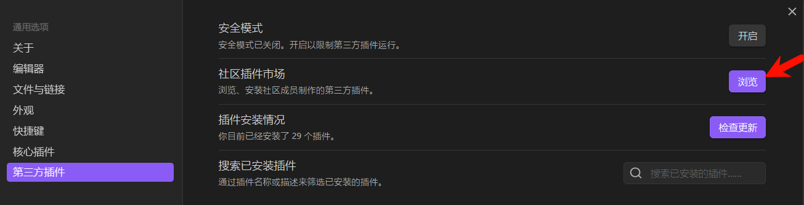
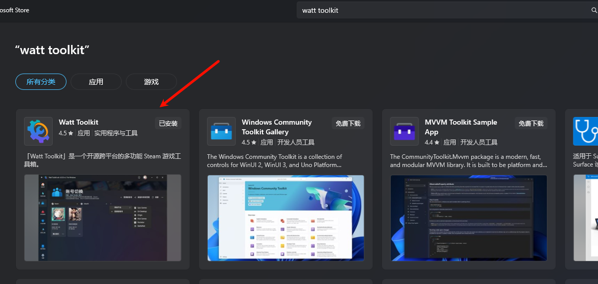
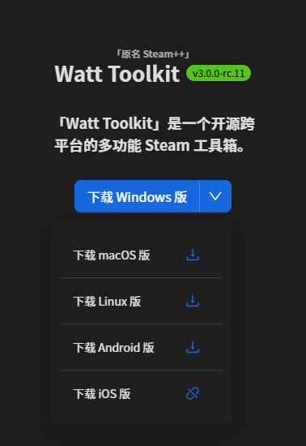
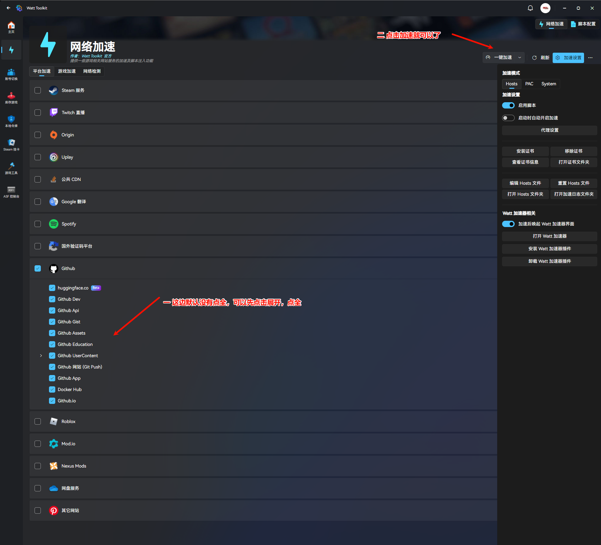

# 利用 Obsidian Web Clipper 浏览器插件 配合 obsidian-local-images 插件 结合 betternotes 实现保存网页快照的功能

## 一 使用 Obsidian Web Clipper 浏览器插件抓取网页

## 下载

[Obsidian Web Clipper](https://obsidian.md/clipper#more-browsers)

1.edge 的扩展插件是引用到谷歌商店的，所以要科学上网一下

2.如果不想科学上网有两个办法，

第一 可以用 fixfox 火狐浏览器

第二 可以去 GitHub 项目上，下载对应 crx 安装，

由于无论是相较于原生谷歌商店下载插件来说，还是去第三方商店获取谷歌插件，用官方原生 crx 扩展可能更安全一点，

推荐去 GitHub（[发布 ·obsidianmd/obsidian-clipper](https://github.com/obsidianmd/obsidian-clipper/releases)）上去进行下载

例如现在是 0.9.4 版本就直接去下载对应的版本 zip，解压一下，

然后去浏览器开启开发者模式，加载已经解压缩的插件就可以了

GitHub 项目 [obsidianmd/obsidian-clipper： Obsidian 的官方网页剪辑器扩展。](https://github.com/obsidianmd/obsidian-clipper)

### （二）使用

去扩展里面显示插件

其实也不需要配置很多，就是设置一下文章保存的 obsidian 文件夹就可以了

点击一下 Add to obsidian 跳转到 obsidian 就保存好了，不过这个是网页图片，要转换为本地图片还需要使用，obsidian 的 local-images 插件

## 二 下载网络图片

obsidian 的 local-images 插件

第一种下载方式是直接去 obsidian 插件商店下载（推荐）

点击浏览

输入 Local images 第二个 Local images 比较好用一点

第二种下载方式去 GitHub 下载[发布 ·aleksey-rezvov/obsidian-local-images](https://github.com/aleksey-rezvov/obsidian-local-images/releases)

按照自己的使用习惯去配置一下

在你刚刚获取的文章界面，打开命令行输入 lo，选择 Local images: Download images locally for all your notes

本地镜像：本地下载镜像 Local images: Download images locally

本地图像：将所有笔记的图像下载到本地 Local images: Download images locally for all your notes

好了现在就保存到你的网页图片就保存到你的设置的文档里面了

### 三 解决上不了 GitHub 的办法

win 可以去微软应用商店下载

其他系统可以去官网下载[瓦特工具箱(Steam++官网) - Watt Toolkit](https://steampp.net/)

使用的话，这边默认没有点全，可可以先点击展开，点全，然后点击加速就可以

### 四 结合 Better Notes 保存

文字的就可以直接粘贴到 betternotes 插件里面 图文版本的话就可以放在 obsidian 进行保存了。
