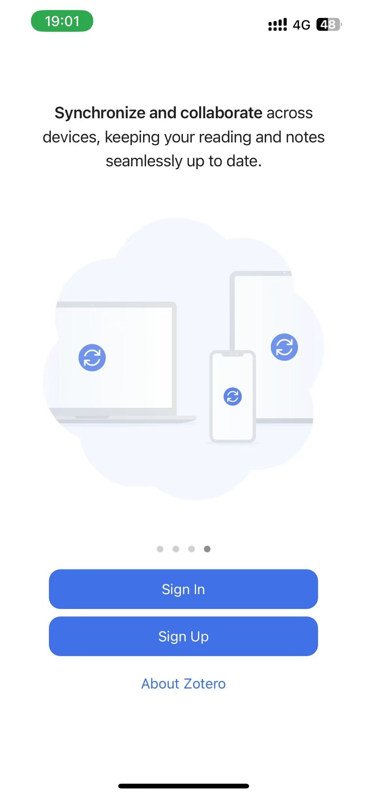
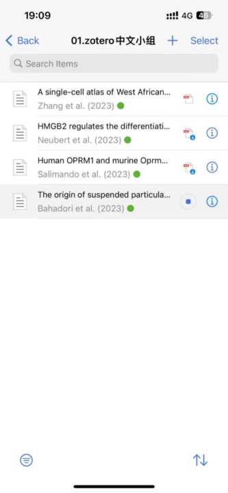

# 移动端

## iOS

官方已经发布了 Zotero for iOS，并且支持支持 WebDAV 同步，iOS 端的设置相对比较简单，只需要登录 Zotero 账户和完成 WebDAV 网盘设置即可。

### 安装

见 [安装](./install.md#ios)。

### 配置同步

::: tip

在进行该部分操作时，请确保您拥有「Zotero 账户」、「具有 WebDAV 同步功能的网盘」、「完成 PC 端相关设置」。

:::

::: warning

要使用 iOS 客户端，需要使用官方同步或 WebDAV 同步二者之一，才能顺利同步附件。其他使用 ZotFile 等链接文件的同步方式不支持，未来也不会支持。

:::

1. 在第一次打开 Zotero 时，会提醒登录，选择 Sign In（此时需要登录你的 Zotero 账户）

   {width=50%}

2. 登录完成后，返回 app 主页，点击右上角的齿轮图标

   

3. 点击 `account` 进入同步设置

4. 从上到下依次为：

   - 附件同步方式：`WebDAV`
   - WebDAV 地址：`dav.jianguoyun.com/dav`
   - 坚果云账户：邮箱
   - 密码：此处的密码是在坚果云中创建的应用密码，不是坚果云网盘的登录密码）

   ::: details 如何获取坚果云的应用密码

   1. 在[坚果云官网登录](https://www.jianguoyun.com/d/login)您的坚果云账户。

   2. 登录后点击 右侧用户名->账户信息

   

   3. 选择安全选项，下滑到底，点击添加应用。

   

   4. 完成后，记录下生成的密码。

   

   

   :::

   验证服务器后显示 `Verified` 表示设置成功。

   

5. 等待片刻文献即可同步成功。可以点击文献直接阅读，也点击文献右侧的 `i` 标志查看文献信息
   

6. 在文献阅读时，可以进行高亮内容，任意划线等操作。完成阅读是直接返回，你的阅读记录会后台自动同步到其他客户端。
   

## Android

Zotero 官方已于 2025 年 6 月 5 日[正式发布 Android 版本客户端](https://www.zotero.org/blog/zotero-for-android/)。

### 安装

见 [安装](./install.md#android)。

### 配置同步

Zotero 官方 Android 客户端的配置方法与 iOS 端大体相同，请参考详见 [iOS](#ios) 进行配置，此处不再赘述。

::: warning

要使用 Android 客户端，需要使用官方同步或 WebDAV 同步二者之一，才能顺利同步附件。其他使用 ZotFile 等链接文件的同步方式不支持，未来也不会支持。

:::
