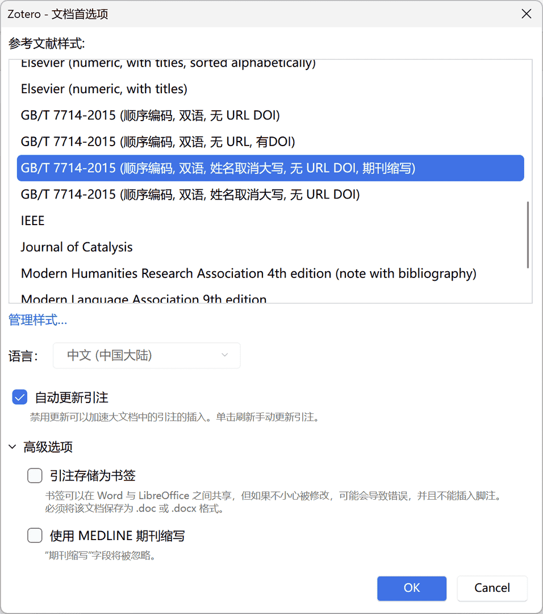

# 在 Word 中插入参考文献

这些是使用 Zotero for MS Office Word 插件的说明。

要在 WPS 中使用插件，请参见 [在 WPS 中使用 Zotero Word 插件](./wps-plugin.md)。

## Zotero Word 插件选项卡


一般情况下，Zotero 安装时会安装 Zotero Word 插件，其会在 Microsoft Word 里添加一个 Zotero 选项卡。如果你的 Word 里没有 Zotero 选项卡，请参见 [故障排除 | 安装 Zotero 的 Word 插件](./faqs/word-addon.md#word-中没有-zotero-选项卡) 。

Zotero 选项卡包含以下图标：

| 名称                | 图标                                                                               | 描述                                                                                                                            |
| ------------------- | ---------------------------------------------------------------------------------- | ------------------------------------------------------------------------------------------------------------------------------- |
| 添加/编辑引注       |               | 在光标位置添加新引注或编辑光标位置现有的现有引注。                                                                              |
| 添加/编辑参考文献表 |  | 在光标位置插入参考文献表或编辑现有书目。                                                                                        |
| 添加笔记            |                                                                                    | 在光标当前位置插入笔记。请注意，此功能不常用，点击后会出现黄色插入框。如果不小心点开了，可以用键盘上的 `Esc` 键关闭黄色插入框。 |
| 文档首选项          |                 | 打开「文档首选项」窗口，例如更改引文样式。                                                                                      |
| 刷新                |                             | 立即刷新所有引注和参考文献表，如当前文档所引用的 Zotero 文库条目题录信息发生变动，则本文档的数据也会更新到最新状态。            |
| 取消链接引注        |                         | 通过删除域代码来取消文档与 Zotero 文库的链接，之后引注和参考文献表将不再会更新。请注意，此操作不可逆，建议仅在定稿时进行。      |

## 文档首选项



「文档首选项」窗口允许您设置以下针对该文档的设置：

1. **参考文献样式**

   一般情况下，你只需要修改这一项，其余设置均保持默认即可。

2. 「语言」：设置引注和参考文献表的格式的语言。
3. 「引注显示为」：对于基于注释的样式，例如「China National Standard GB/T 7714-2015（note，Chinese）」，引文是插入为脚注还或尾注。

   脚注和尾注的样式和格式由 Word（而不是 Zotero）控制。

4. **「自动更新引注」**
   一般情况下开启即可。当文档中引文非常多，每次更新都会卡顿时，可以关闭此功能，添加一部分或最终手动进行更新。

   由于在 macOS 上更新引注通常较慢，故 mac 用户可以选择关闭此选项。

5. 「高级选项」

   1. 「将引文存储为书签」

      默认为存储为「字段」。除非您需要使用 LibreOffice 与同事协作，否则应始终选择「字段」。

   2. 「使用 MEDLINE 期刊缩写」

      仅对于缩写期刊标题的样式包含此选项。如果勾选此选项（默认值），则 Zotero 中「期刊缩写」字段的内容将被忽略。

## 添加引注

您可以通过单击「 添加/编辑引注」在当前光标位置插入或编辑引注。

::: tip

此按钮只是插入引注，不会在文末自动生成参考文献表。要插入参考文献表，请点击 「插入/编辑参考文献表」 按钮。

:::

在一个未添加过引文的文档中，按下按钮将先弹出一个「文档首选项」窗口以让你选择一个 CSL 样式，之后再点「添加/编辑引注」将直接显示「引注对话框」，这个对话框可以从 Zotero 库中选择条目，并创建引注。

开始在对话框中键入标题的一部分、一个或多个作者的姓氏和/或年份。匹配项将立即显示在对话框下方。


::: tip

如果您在输入中文后，对话框下方并未出现相应的匹配项，您可以再输入一个空格，相关的匹配项就可以正常显示了。

:::

单击某条目可以选择这个条目，也可以用键盘「↑↓」+「Enter」 键来选择条目。

::: tip 快速选择正在阅读的

如果你在 Zotero 的条目列表里已经选中了一些条目，或者是你正在阅读一篇文献，「引文对话框」将自动将这些条目显示在对话框的「已选择 / Seleted」区域，你可以直接按下「Enter」确认选择。

注：这是 Zotero 7 的新特性，先前版本的 Zotero 不支持。

:::

选中的条目以气泡形状显示在对话框中。完成选择后，再次按「Enter/Return」键以插入引注并关闭引注对话框。


### 孤立的条目

在「添加引注」对话框中，您可以单击被引用条目的气泡，然后单击「在我的库中打开（或组库的名称）」以在 Zotero 中查看该条目。

孤立的条目（未连接到 Zotero 数据库中的任何条目）将没有「在我的库中打开」按钮。


孤立条目通常是以下原因导致的：

- 协作者从 TA 自己的文库或您无权访问的群组中插入的
- 您已从 Zotero 文库中删除了这些条目
- 你曾经有个一样的重复条目 A 和 B，你在文档里插入了 A，然后在 Zotero 里删除了 A 留下了 B（而不是合并）

Zotero 可以正常为孤立条目排序，但由于你的 Zotero 库中没有这个条目，因此你无法修改它的题录信息。若要更新，请将这些文献重新导入您自己的文库，并重新插入。

### 在同一位置引用多个文献


要在同一位置引用多篇文献（例如，数字样式为`[2，4-6]`，作者日期样式为`(Smith 1776, Schumpeter 1962）`），请在「添加引注」框中一个接一个地添加它们。选择第一个项目后，不要按 Enter/Return 键，而是继续选择下一个条目。

::: tip

如果在连续添加多个引文时，新输入的内容仍被包裹在上一个引用项目的气泡中，您可以先输入一个空格，然后再输入下一个引用项目的信息。

:::

::: details 按作者字母或时间排序？

某些引文样式要求一个文本内引文中的项目按字母顺序排序（例如，「（Doe 2000， Grey 1994， Smith 2008）」）或按时间顺序排序（「（Grey 1994， Doe 2000， Smith 2008）」）。Zotero 将自动遵循这些排序规则。

若要禁用引文中引文的自动排序，请拖动引文以在「添加引文」框中重新排列引文。您也可以单击「添加引文」框左侧的「Z」图标，然后取消选中「将源排序」选项。_此选项仅对指定引文排序顺序的引文样式显示。_ 要恢复自动排序，请重新选中「保持源已排序」选项。

:::

### 编辑引注

如果您想在之前插入的引注中增加/删除条目，或者修改引注的信息，可以将光标定位在引注内（此时引注区域会出现灰色阴影），然后再单击「 添加/编辑引注」按钮开始编辑引注。

{width=60%}

## 添加参考文献表

单击「 添加/编辑参考文献表」按钮会在光标位置插入参考文献表。

::: info

一般情况下，在文末写一个 `参考文献` 标题，然后按回车另起一行，再点击这个按钮插入参考文献表。

:::

Zotero 将根据文档中的引文自动更新参考书目。

在极少数情况下，如果要将未在文档中引用的条目添加到书目中，可以再次单击「添加/编辑参考文献表」按钮，这将打开 [参考文献表编辑器](#编辑参考文献表)。

::: warning

不要在 Word 中手动编辑参考文献表，这些编辑将在下次 Zotero 刷新文档时被覆盖。

:::

### 参考文献表段落格式

参考文献表的缩进、悬挂、字体字号、行间距、编号与条目之间的距离等，都是在 Word 「书目」样式中修改，请阅读 [关于引用文献的一揽子问题](./faqs/word-addon.md) 中的 Word 样式小节。

## 添加笔记

在光标当前位置插入笔记。

::: tip

此功能不常用，点击后会出现黄色插入框。如果不小心点开了，可以用键盘上的 `Esc` 键关闭黄色插入框。

:::

## 切换到「经典视图」

「添加/编辑引注」对话框有默认版与经典版两种，下图为经典版的示例：


::: details 查看经典视图使用方法

您可以通过单击「添加引文对话框」左侧的「Z」图标并选择「经典视图」来切换到「经典视图」引文对话框。


要永久切换到经典视图，请勾选 Zotero -编辑 -首选项 -「引用」选项卡 -使用经典添加引文对话框。


### 经典视图下使用多来源引用

单击引文选取对话框左下角「多重来源」，右侧会出现多重来源列表，将引文从左侧拾取到右侧即可。

### 经典视图下多重来源的引文排序


- 若要禁用引文中引文的自动排序，请在「添加引文」框中拖动引文以重新排列它们。你也可以取消选中「保持来源分类」选项。_此选项仅对指定引文排序顺序的引文样式显示。_ 要恢复自动排序，请重新选中「保持源已排序」选项。

:::

## 自定义引注

可以通过各种方式自定义引注。

如果引注只是不正确或缺少数据，请首先确保 Zotero 中的条目元数据正确完整，然后单击 Word 中 Zotero 选项卡中的「刷新」以更新文档。

可以通过引注对话框进行以下更改：


### 页码和其他定位符（图、表等）

在某些情况下，您希望引用条目的某个部分，例如某个页面，页码范围或卷（例如，引注 `Doe et al., 2001，page 4-7` 中的 `page 4-7`），这种额外的引文特定信息被称为「定位符」。

引注选项窗口的「page」处有个下拉列表，里面是不同的定位符类型，后面的输入框里输入这个定位符的值。

要使用其他的定位符，例如「表」，请使用「后缀」。

您还可以在插入引注时添加页码。搜索条目，在选择条目之前或之后，但在按 Enter 将引注插入到文档中之前，输入 `p.34`、`p34`，甚至 `34`，都可以将页码添加到引注中。

### 前缀和后缀

有时候，你需要 `cf. Tribe 1999， see also see……` ，而不只是 `Tribe 1999`，你就需要「前缀」和「后缀」。

前缀和后缀字段中的任何文本都可以使用 HTML 标记 `<i>斜体</i>`、`<b>粗体</b>`、`<sub>下标</sub>` 和 `<sup>上标</sup>` 进行格式设置。

前缀和后缀可以应用于引注中的每个条目，以创建复杂的引注。例如：

```plain
（参见 Smith 1776 的经典例子; 马克思 1867 年提出和另一种观点）
```

通过在「前缀」和「后缀」修改引注始终比直接在 Word 域代码字段中输入内容更可取。手动修改域代码字段将阻止 Zotero 自动更新引注。

### 省略作者：在文本中使用作者

使用作者日期样式，作者经常被移到文本中，并从以下括号括起来的引文中省略，例如：

```plain
……根据 Smith（1776）的说法，劳动分工至关重要……

```

这种需要从引注中省略作者，请选中「省略作者」框（产生的引注变成 `(1776)` 而不是原来的 `(Smith，1776)`），并将作者的姓名「Smith」作为文档中常规文本的一部分。

### 其他更改

如果您的引注仍未按所需方式显示，您可以直接在文档中编辑引注，但请注意，这样做会阻止 Zotero 自动更新引注以反映文档中的其他更改（例如，对于「同上」或给定名称消除歧义）。在您进行手动编辑后，Zotero 将要求您确认是否要保留编辑并防止引注自动更新。

最好是在要进行的更改的文本中做注释，等到准备好提交文档，然后在使用「取消链接引文」后的文档副本中进行更改。

如果您认为 CSL 样式中存在错误，请发布到 Zotero 论坛，并在必要时更正样式。如果样式已更新，则文档将自动更新。

## 编辑参考文献表

当您在文档中添加和删除引注时，Zotero 将自动更新参考文献表。一般来说，这已经足够了。

::: details

但是，在极少数情况下，您可能希望将未引用的文献添加到参考文献表中（例如，综述中包含的项目，但论文中未引用的项目）或删除文本中引用但不应包含在参考书目中的项目（例如，个人通信）。

为此，请再次单击「添加/编辑书目」（）按钮以打开「编辑书目」窗口：


然后，您可以使用箭头添加或删除项目。

虽然也可以在此窗口中编辑书目参考文献的文本或格式，但不鼓励这样做。如果您更改了库中的数据，Zotero 不会自动更新此处编辑的引用。在这里编辑参考文献也有些不可靠; 一些用户报告说，当 Zotero 引用时，此处所做的修改有时不会持续存在，以及其他问题。

如果您需要编辑书目中的项目，最好在提交文档之前将其作为最后一步。首先，保存文档的备份副本。然后，单击「取消链接引文」按钮（）以断开文档与 Zotero 的连接，并将所有引文和书目转换为常规文本。最后，对参考书目文本进行调整。

此过程可用于对参考书目进行各种细微的修改，包括：

- 在综述或荟萃分析中包含的参考文献之前添加星号 `*`
- 以粗体、斜体或全大写设置特定作者的姓名
- 添加有关项目的批注或注释
- 为书目子部分添加标题（例如，主要来源与次要来源）

:::

## 定稿：取消链接

删除所有 Zotero 域代码且断开与 Zotero 文库链接。点击后所有的引注和文末的参考文献表都会变成纯文本。

::: warning

该操作不可逆，一旦断开连接，所有的引注信息都会变成纯文本，无法再自动更新编号和参考文献表，也无法恢复到以前带有链接的状态。

因此强烈建议在断开连接之前将文档另存一份备用，仅将用于提交/共享的副本断开连接。

正常地，Zotero 会在取消链接时自动新建一个文档，但如果文档保存在 OneDrive 上，这种自动机制无法生效，Zotero 会弹窗要求你手动新建一个文档。

:::

## 注意事项与常见问题

::: warning

- 所有的引注/参考文献表的样式修改都应在 [CSL 引文样式](./citation-styles.md) 中进行，而不是直接在 Word 里手动修改！
- 对引注顺序更改应在 Word 「引注编辑对话框」中进行，而不是直接在 Word 里手动修改！
- 所有的条目信息，如作者、标题、期刊、期卷页等，都应在 Zotero 中更新条目信息，而不是直接在 Word 里手动修改！

:::

::: tip 常见问题

插入引文中遇到的一些常见问题，请参见 [关于 Word 引用的各种问题](./faqs/word-addon.md) 。

:::
