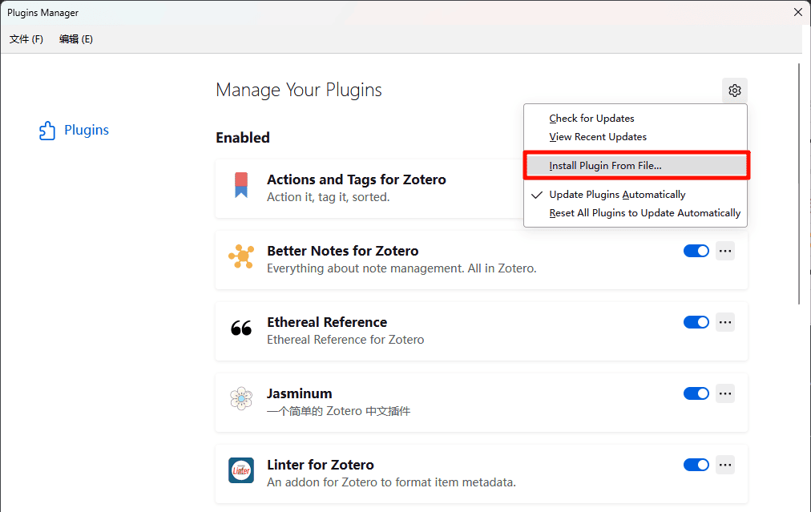
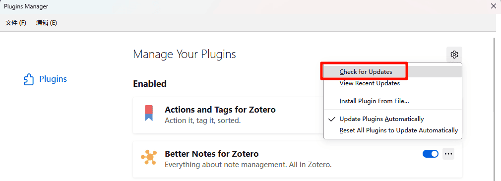

# 关于 Zotero 插件

## 什么是插件？插件可以做什么？

谈到 Zotero 插件，可能指的有三种东西：

- 安装在 Zotero 里的，用于增强 Zotero 的功能，一般大家提起 `Zotero 插件` 都指的是这一类。本文档中提到的 Zotero 插件都指这一种。
- （不是 Zotero 插件，是浏览器扩展）安装在浏览器里的 Zotero Connecter，用于从网页上抓取文献元数据并存到 Zotero 里。
- （不是 Zotero 插件，是 Word 加载项）在 Microsoft Word 中的，正确称呼是 Word 加载项，用来插入引用和参考文献信息。

## 获取插件

- 官方插件收录链接：<https://www.zotero.org/support/plugins>
- Zotero 中文社区插件商店：[https://zotero-chinese.com/plugins](https://zotero-chinese.com/plugins)

::: tip 火狐浏览器用户请选择另存为

插件的后缀名为 `.xpi` ， 如果下载到后缀为 `.xpi` 的文件，不要解压，解压后会导致插件无法安装。

`.xpi` 也是火狐浏览器的插件后缀，因此火狐浏览器无法直接通过点击链接进行下载，需要右击链接，选择另存为，才可将插件保存至本地。

:::

::: tip Zotero 6 与 Zotero 7 的插件互不兼容

Zotero 6（上一版本）和 Zotero 7（最新版本）的插件互不兼容，请在下载插件安装包时下载与你 Zotero 版本适配的版本。[中文插件商店](https://zotero-chinese.com/plugins/) 中有注明兼容的目标 Zotero 版本，下载时请务必注意。

:::

## 安装插件

依次点击 「Zotero 菜单栏」->「工具（Tools）」->「插件（Plugins）」，然后将下载的 xpi 文件拖入插件窗口，即可完成安装。

或者点击 「右上角的齿轮」->「Install Add-on From File...」->「选择刚刚下载的 xpi 文件」，即可安装成功。

::: tip

对于部分老版本的插件，可能需要点击 `Restart now` 或者手动重启 Zotero 才可生效。

请不要一次性同时安装多个插件，否则可能导致插件安装不正确。这里指的一次性安装多个插件是指一次性将多个插件的 xpi 安装包拖入 Zotero 的插件管理界面；或是在 `Install Plugin From File` 中同时选择多个插件的 xpi 安装包。 

遇到此问题，可以先将所有插件卸载，随后逐个（一次只安装一个）安装插件即可。

:::

## 更新插件

依次点击 「Zotero 菜单栏」->「工具（Tools）」->「插件（Plugins）」->「右上角的齿轮」->「Check for Updates」 后 Zotero 会对插件的版本进行检查，并自动对插件进行更新。

::: tip

由于大部分插件的更新页面在 GitHub，国内部分地区可能无法直接访问，从而无法通过以上方式实现对插件的更新。如果无法直接访问插件的更新，可在此处下载最新版：<https://zotero-chinese.com/plugins/>

下载后，无需卸载原插件，按照安装插件的流程直接覆盖安装即可实现对插件的更新。

:::

## 常见问题

请见 [插件安装的常见问题](../faqs/plugins.md)。
