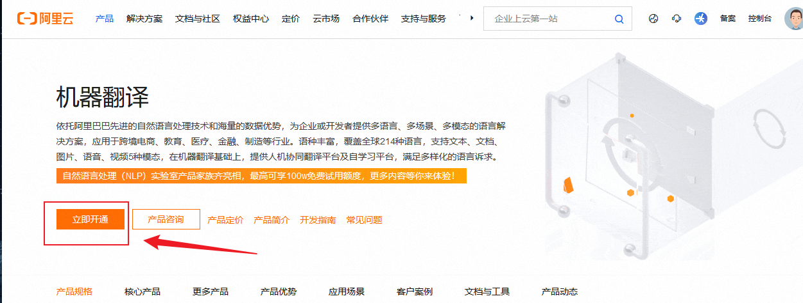
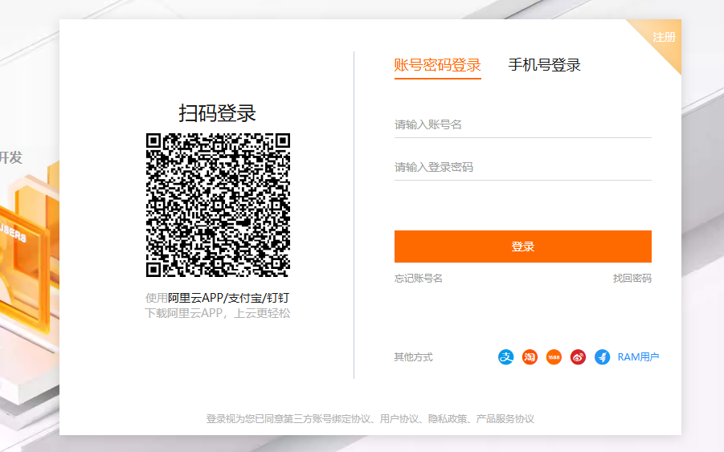
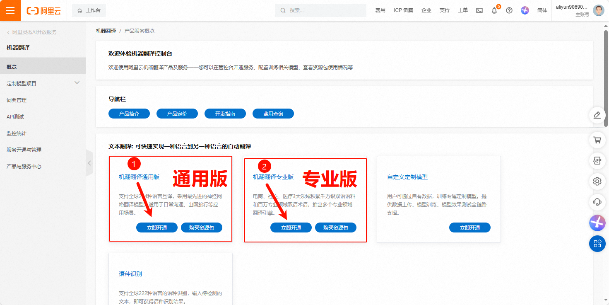
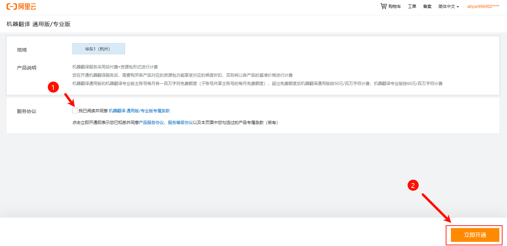
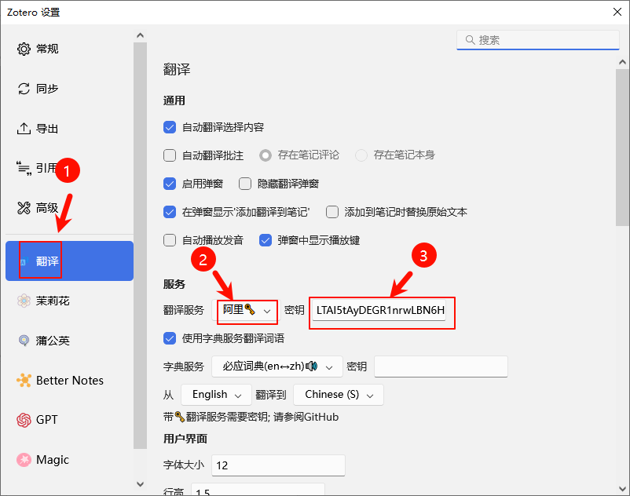
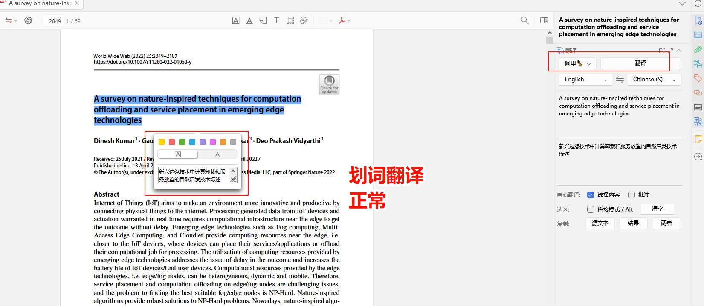

# 阿里翻译接口申请及配置

## 1. 翻译接口申请

打开 [阿里翻译](https://www.aliyun.com/product/ai/alimt?spm=5176.19720258.J_8058803260.278.e9392c4a5eczxp)阿里翻译页面，点击立即开通，在登录页面，使用支付宝扫码登录。

> [!TIP]
> 注意，如果第一次开通，可能会提示你需要进行实名认证，按照提示进行认证即可

使用支付宝扫描登录

扫码成功后，跳转到控制台（如果未跳转到控制台，请访问），分别有两个接口，按照需求进行开通

1. 通用版，支持全球 214 种语言互译，采用最先进的神经网络翻译模型，适用于日常沟通、出国旅行等应用场景。
2. 专业版，电商、社交、医疗 3 大领域积累千万级双语语料和百万专业领域双语术语，推出多个专业领域翻译引擎。

下面以专业版为例，直接点击立即开通

[https://mt.console.aliyun.com/service](https://mt.console.aliyun.com/service) 打开这个，你能看到 2 个服务都已经开通了

把鼠标移动到右上角，点击下面的 AccessKey 管理

点击继续使用 AccessKey，

如果后面忘记了 AccessKey 或发生泄露，可以重新在这申请一个新的。

## 2. Zotero 翻译引擎设置

打开 Zotero 设置，翻译插件设置，找到阿里引擎，按照 AccessKey ID#AccessKey Secret，输入到密钥这栏中。注意这里的 AccessKey ID 和 AccessKey Secret 从你上面下载的 csv 文件里查看。

打开一篇英文 PDF，使用阿里的引擎，试试划词翻译正常不。有中文输出说明配置正常。

## 3. 翻译使用量查看

阿里云的翻译流量会每月更新，请不要超过每月的使用额度，不然会自动产生扣费。免费额度快用光了，请切换到其他引擎，查看具体的使用量，到

[https://mt.console.aliyun.com/monitor](https://mt.console.aliyun.com/monitor) 查看

