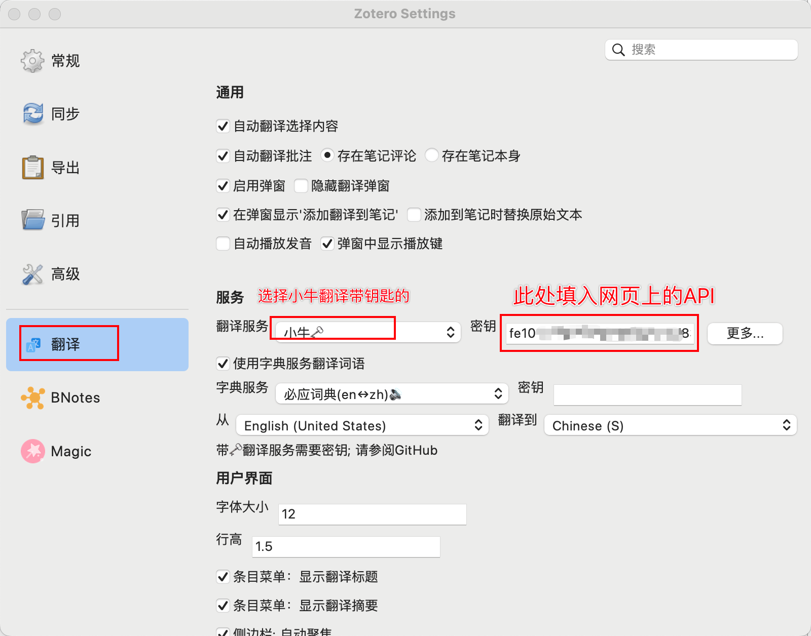

# 小牛翻译接口申请及配置

## 1. 注册小牛翻译账号

到小牛翻译的[注册页面](https://niutrans.com/register)，使用手机号或邮箱进行注册。

登录小牛控制台，在 < 个人中心 > 页基本信息部分可看到，查看及复制前需先点击右侧显示，将**符号变为具体数字。注：APIKEY 在 24 小时之内只允许重置一次。

## 2. Zotero 翻译插件设置

Zotero PDF translate 插件设置小牛翻译接口，注意请 `直接输入API，不需要登录`

同时在**全文翻译里设置好对应的引擎**

### 2.1 100 万翻译流量赠送

扫描关注公众号，绑定好账号后就可领取 100 万翻译流量

可以查看领取的流量，后面使用也可以关注流量消费情况
