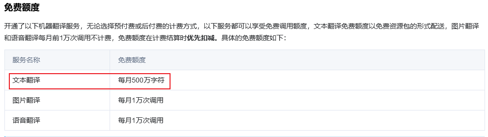
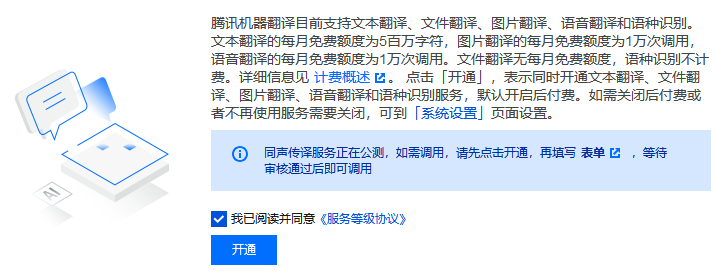
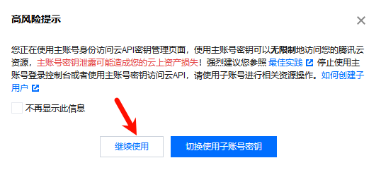
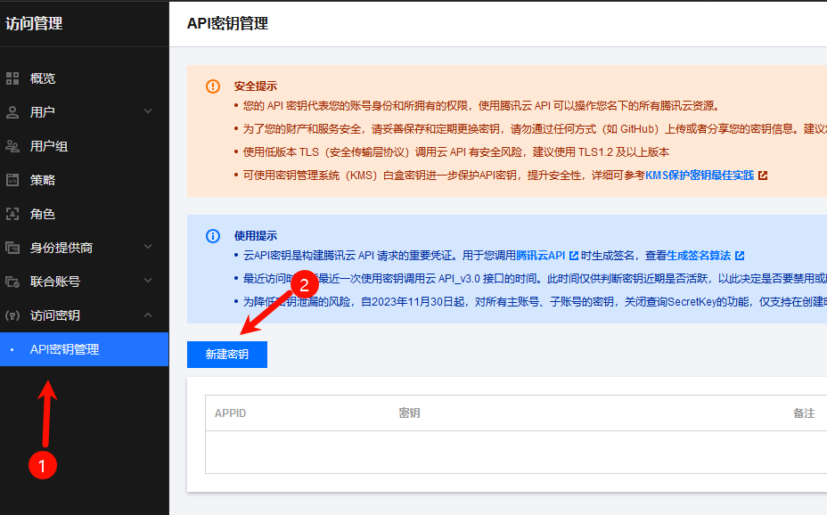
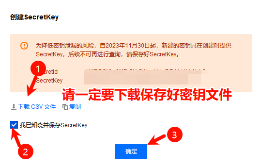
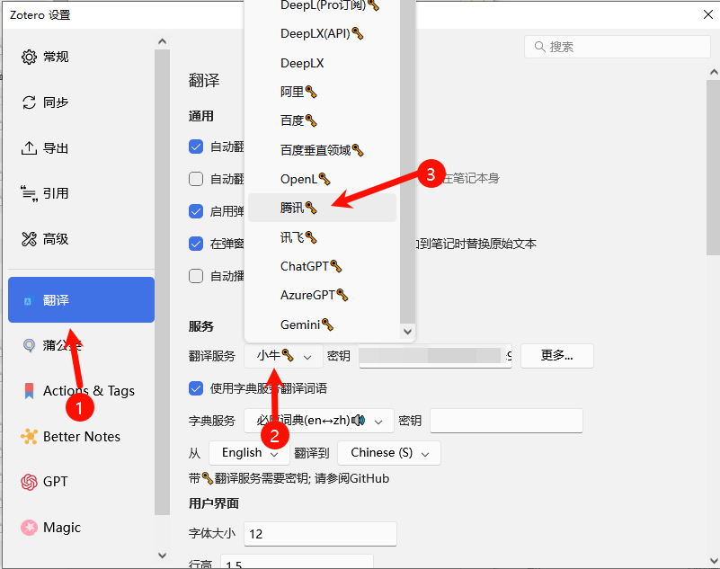
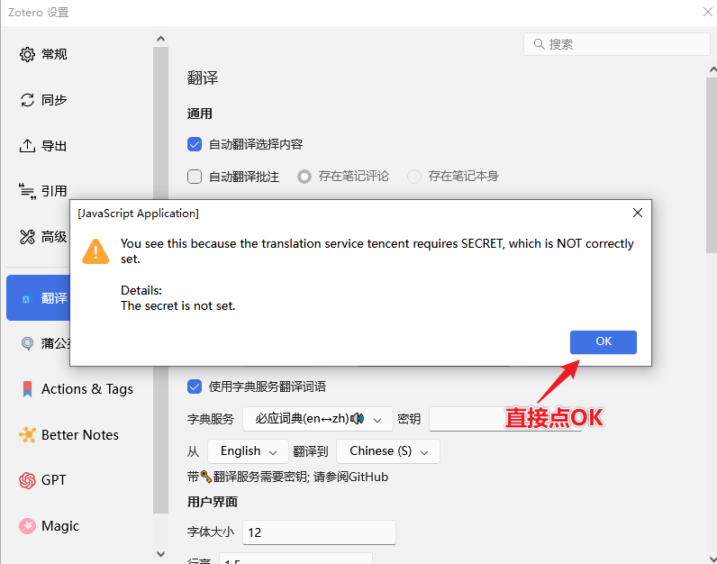
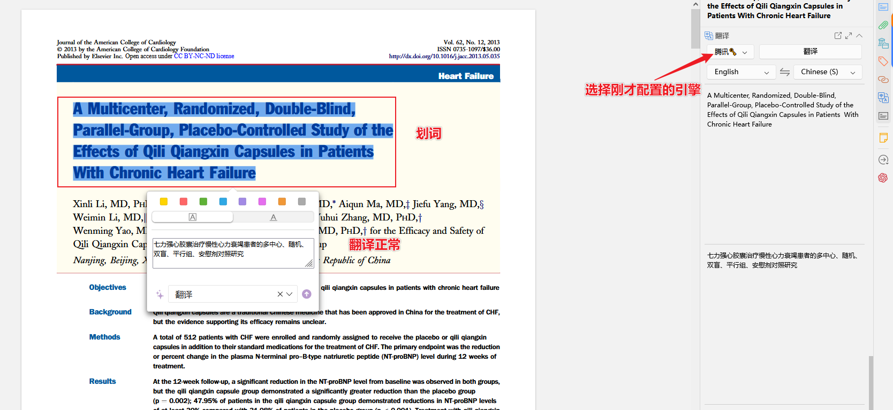

# 腾讯翻译接口申请和配置

腾讯翻译每月 500W 免费额度，非常适合大批量的文献全文翻译

## 1. 账号注册

打开腾讯翻译页面 [https://cloud.tencent.com/product/tmt](https://cloud.tencent.com/product/tmt)

点击立即使用，扫码登录

同意协议，点击开通

账号注册成功后就可以继续申请 API。

## 2. 申请 API

打开 API 管理后台 [https://console.cloud.tencent.com/cam/capi](https://console.cloud.tencent.com/cam/capi)，如果没有其他需求，直接点击继续使用。

创建 API

点击新建密钥后，在弹出窗口，点击下载 CSV 文件，请妥善保存好这个文件。密钥创建之后是不能在后台查询到的，请一定要保管好（如果找不到了，就重新新建一个密钥）。

成功创建了一个密钥

> [!TIP]

## 3. 关闭自动扣费

[https://console.cloud.tencent.com/tmt](https://console.cloud.tencent.com/tmt) 打开这个，关闭上图的设置，避免自动扣费。

## 4. 翻译插件接口配置

打开 Zotero 设置窗口

弹出的提示窗口，直接点 OK

这里非常重要，非常考验细节，请同学们填写的时候多加注意

请按照下面的格式（前面没有空格）：secretId#SecretKey，填上你申请的密钥，注意这里的格式。

secretID，SecretKey 就是你下载的 CSV 文件中，对应的两列值，

按上面的格式写完之后，复制到上面窗口的密钥框中。

## 5. 测试

在 Zotero 中随便打开一个英文 PDF，划词翻译，看看效果正常不

## 6. 翻译流量额度查看

打开 [https://console.cloud.tencent.com/tmt](https://console.cloud.tencent.com/tmt)

## 7. 翻译异常解决

如果上面的操作步骤完成后，翻译出现问题，可以看看是否开通了腾讯的翻译服务。

在放大镜那里输入机器翻译，在下方选择机器翻译

按下方提示，点击开通，开通机器翻译服务，然后再试试。

