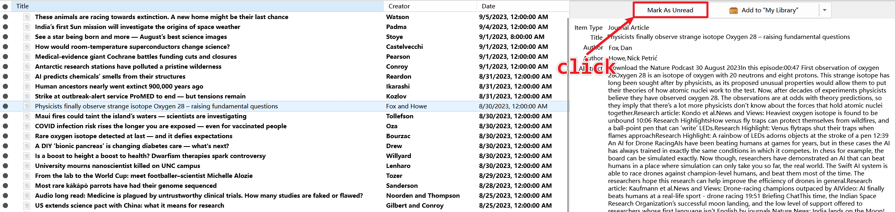
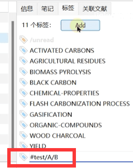
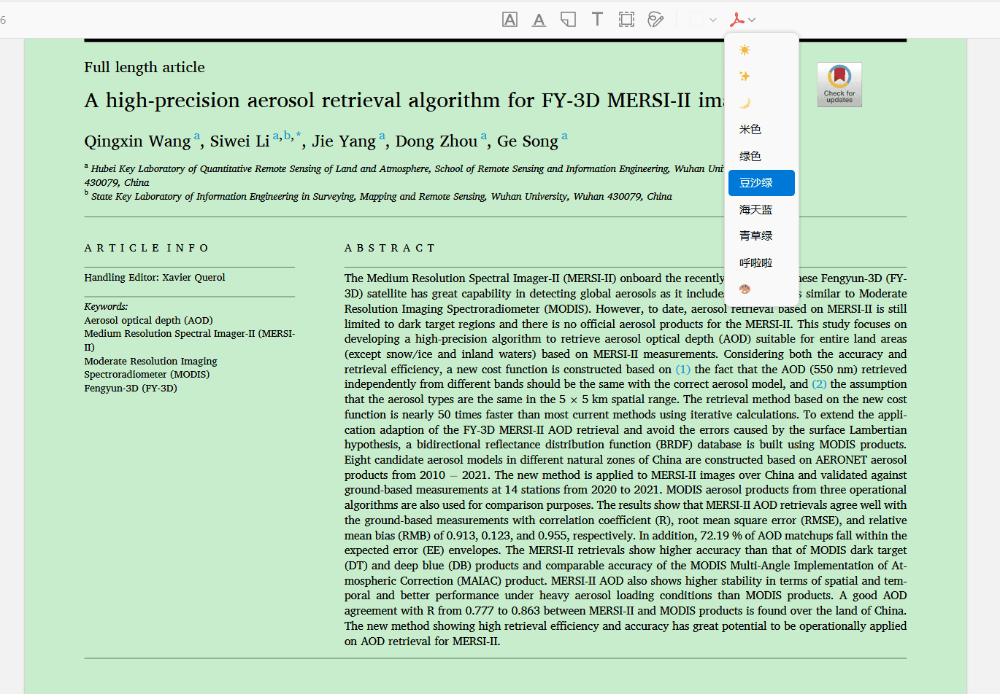
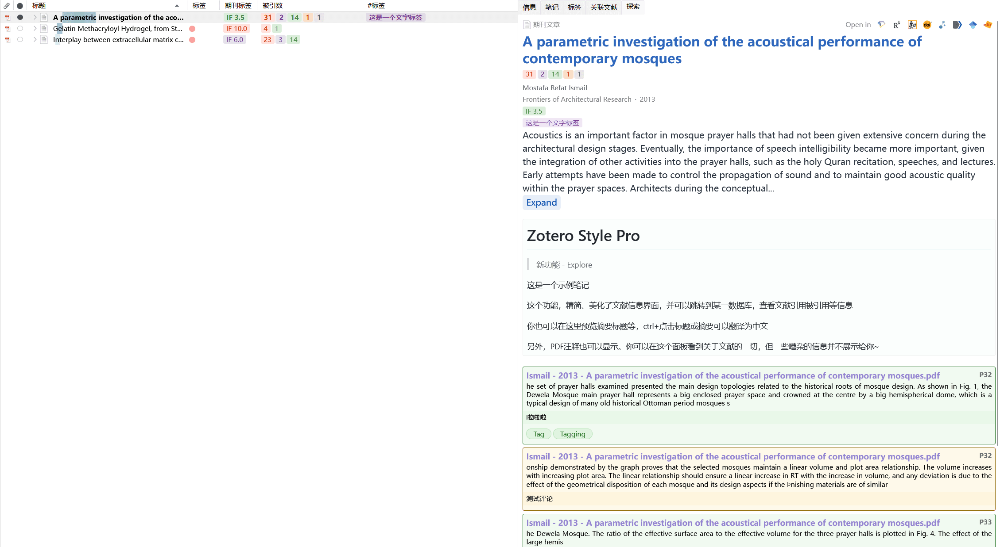
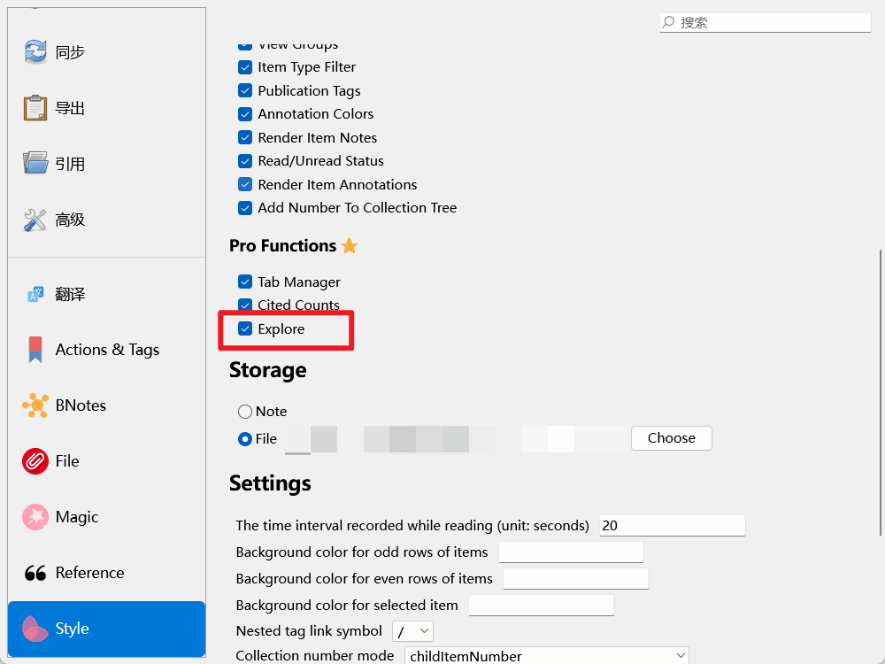

---
authors:
  - Chikit
date: 2024-03-13 21:39:17
---

# Ethereal Style for Zotero

::: info 关于插件

这是一个多彩的插件，用于增强 Zotero 的界面功能，让您享受阅读文献的乐趣！

项目主页：<https://github.com/MuiseDestiny/zotero-style>
下载地址：[插件商店 - Zotero 中文社区](https://zotero-chinese.com/plugins/#search=ethereal+style)。

:::

首先需要明确的是，本插件`适用人群`：想美化自己的 Zotero，有一定学习插件的时间。

💡 强烈建议先**按照文章顺序**将整个教程**完整的阅读一遍**，了解插件的各个功能，再根据兴趣了解某个功能的详细设置/使用方法。

该插件有很多提升效率的功能，也有很多美化的功能，但也可能导致 Zotero 卡顿，在使用时应该根据自己的情况进行调整。

<!-- [[toc]] -->

## 开始之前

在使用插件之前，你需要知道 `Style` 的设置方式主要有两种。

### 列设置

第一种，右键任意一个列的名字，会弹出一个右键菜单，并且在最后有两个按钮，一个是`列设置`，一个是[`视图组`](#视图组)。前者是对应列的设置选项，后者是一个将列分组快速切换的功能，后续会提到。

例如：如果你想设置标签，你可以在`标签`上右键，然后点击**列设置**，这是一切设置的起点，你在不同列名上右键，对应的列设置功能不同。

<!-- {width=50%} -->


### 命令框

第二种，通过命令框修改设置。Style 命令框的快捷键是`Shift + P`，有时候也可能是`Shift + Tab + P`，许多功能通过此快捷键进行使用，如果显示不全时，可通过暂时禁用其他插件解决。


<!--  -->

::: info

如果你的 Emoji 变成黑白了，可以通过这个教程来解决问题 👉[Emoji 变成黑白该如何解决](../faqs/monochrome-emoji.md)

:::

::: tip

在 GitHub 上，你可以留下你的颜色搭配，也可以学习其他人的颜色搭配 👉[颜色搭配征集](https://github.com/MuiseDestiny/zotero-style/issues/48)

:::

## 列

### 标题（阅读进度条）

阅读进度直观地反映了您对某个项目下的 PDF 各页的阅读时间分布情况，颜色越深阅读时间越长。

阅读进度条显示在两个地方，其一是作为`标题列`的背景：


其二是在[命令框](#命令框)。用选中要查看的这条文献,按 `Shift + P`，一个的命令窗口出现了。你可以点击“高能阅读进度条”,以查看你阅读的详细时间。鼠标点击进度条，还可以快速跳转到 PDF 对应页面。


::: details 点击此处了解 阅读进度条 的详细设置

右键点击 `标题` 列，选择 `列设置（标题）` 进入列设置后可以对阅读进度条进行相关的设置

- `Tags` ：勾选后，Zotero 的标签会在标题前显示；或者使用[标签列](#标签) _Z6_
- `Color` ：阅读进度条的颜色
- `Opacity`：透明度；如果你想关闭标题进度条，可以把它拉到开头，也就是 opacity=0
- `Odd Color` :奇数行条目背景色 _Z6_
- `Even Color` ：偶数行条目背景色 _Z6_
- `Selected Color` ：选中行条目背景色 _Z6_
- `Translate`：在标题上显示翻译 _Z7_

:::

### 标注（原进度）

它可以直观地表示某个项目对应的 PDF 每页的注释字数。


::: details 点击此处了解 标注列 的详细设置

在`标注`列上右击，选择`列设置（标注）`，进入标注列的设置窗口。

- Zotero 7
  - `Opacity`：调整 标注列 的透明度
- Zotero 6
  - `Style`：显示方式
  - `Color`: 颜色
  - `Opacity`: 透明度
  - `Circle`:

<!--  -->
<!-- {width=50%} -->

:::

### 标签


在 Zotero 6 上，Style 插件为标题列提供了一个选项，允许将标签在标题前显示，但 Style 十分鼓励打开本列显示标签，因为这种圆圆的标签十分好看，并且这一列经过像素级优化使得圆形和 Emoji 对齐（下图是对比）。


::: details 点击此处了解 标签列 的详细设置

<!-- {width=50%} -->

右键点击 `标签` 列，选择`列设置（标签）`后可以对`标签列`进行相关的设置

- `Align` 标签左对齐，还是右对齐；
- `Margin` 相邻标签的间距大小；

**你可能会疑问，为什么我设置了标签，但不在这里显示？**

在 Zotero 中有`普通标签`和`颜色标签`之分，只有`颜色标签`才可以在这里显示。

如果想让你的标签显示在标签列中，需要先对标签进行分配颜色，请参考 [为标签分配颜色和顺序](../organize-library.md#设置彩色标签设置星级)。


<!-- {width=50%}

{width=33%} -->

:::

### `#标签`


它的功能很简单，标签列会渲染 Emoji，但一旦涉及到文字，就会渲染成一个圆。

#标签会显示你所输入的所有内容。但考虑到你的 Zotero 里已有海量标签，为了不让它显示所有标签，这里只会显示`#`开头的标签。

::: details 点击此处了解 #标签 的详细设置

<!-- {width=33%} -->

- `Match` ：如果你会正则表达式，你可以在此尽情发挥，你也可以参考 [`getTagMatch` 源码](https://github.com/MuiseDestiny/zotero-style/blob/master/src/modules/tags.ts#L245)；如果你不会，那么只需要知道：

  | 输入       | 含义                                                                                |
  | ---------- | ----------------------------------------------------------------------------------- |
  | `#`        | 显示所有以 `#` 开头的标签，但在显示时会删除 `#`。                                   |
  | `~~/`      | 显示除了以 `/` 开头的所有标签                                                       |
  | `/^#(.+)/` | 使用输入的正则表达式匹配标签，`(.+)` 是实际显示的标签内容。多个 `(.+)` 将自动连接。 |

- `Text` ：文本颜色。如果你使用 Zotero 6 且使用 Night 或 Theme 插件提供的黑暗模式，建议设置文本颜色为白色；
- `BackgroundColor`： 与标签列不同，这里无论有没有身份，只要它过了 Match 这一关,都可以登上 `#标签` 的舞台，但为了美观，会分配默认背景颜色；
- 其它设置可以自己尝试~

:::

### 期刊标签

和一篇文献一样，一个期刊也是可以有很多标签来描述它的，比如 JCR 分区、中科院分区、影响因子等，这些都可以通过期刊标签实现。


::: info 该功能的数据来源于 easyScholar，因此需要配置 easyScholar 密钥。
:::

::: details 点击此处了解 期刊标签 的详细设置

{width=67%}

- `Secret Key`: easyScholar 密钥，见下文
- `Field`：要显示哪些期刊标签字段，见下文
- `Map`：映射，用于精简标签，支持正则。比如你想把 SCIIF(5) 显示为 IF(5)，填写 SCIIF(5)=IF(5) 即可，多个映射用逗号隔开，详见下文
- `Rank Colors` ：五个等级对应的颜色；
- `Sort By` ：超纲了，用默认就可以了，不需要深入了解；

#### easyScholar 密钥

1.  密钥申请：在 easyScholar 官网首页登录后，点击右上角用户名进入后台，点击 “开放接口”，即可看见[密钥](https://www.easyscholar.cc/console/user/open)。

    ⚠️ 请保护好你的密钥，不要以任何方式透漏给任何人。⚠️

2.  密钥填写：直接填写到上方 `Secret Key` 里。

    如果你没有看到`Secret Key`这一项（Zotero 6 用户），那么你进入[`高级编辑器`](../misc/preference.md)，在弹出的窗口中输入`easyscholar`，并搜索，双击搜索结果后，填写 easyScholar 密钥，并点击 OK。

    

#### Fileds

你可以直接填写`sciif,sciBase,sci,ssci,pku,sciwarn,eii`。
这些代码分别为`JCR-影响因子-2022(2022.6.28)`、`中科院基础版`、`JCR-分区2022(2022.6.28)`、`JCR-分区2022(2022.6.28)`、`中文核心`、`中科院预警`、`EI`

**当然我们更推荐根据下面链接 Publication Tags 部分介绍自行填写**

| Field             | Name                 | 来源                                                                                                                                       |
| ----------------- | -------------------- | ------------------------------------------------------------------------------------------------------------------------------------------ |
| ccf               |                      | 《中国计算机学会推荐国际学术会议和期刊、中文科技期刊目录-2019、计算领域高质量科技期刊分级目录》，数据集从高到低分为：A(T1), B(T2), C(T3)。 |
| swufe             |                      | 《西南财经大学学术期刊目录 2018》，数据集从高到低分为：A+, A, B, C。                                                                       |
| cufe              |                      | 《中央财经大学期刊目录（2019 版）》，数据集从高到低分为：AAA, AA, A。                                                                      |
| ssci              |                      | 《JCR-分区-影响因子-2022(2022.6.28).pdf》，数据集从高到低分为：Q1, Q2, Q3, Q4。                                                            |
| sci               |                      | 《JCR-分区-影响因子-2022(2022.6.28).pdf》，数据集从高到低分为：Q1, Q2, Q3, Q4。                                                            |
| sciif             |                      | 《JCR-分区-影响因子-2022(2022.6.28).pdf》，easyScholar 将影响因子从 10, 4, 2, 1, 0 分为 5 个等级。                                         |
| jci               |                      | 《JCR-分区-影响因子-2022(2022.6.28).pdf》，easyScholar 将 JCI 指数从 3, 1, 0.5, 0 分为 4 个等级。                                          |
| sciif5            |                      | 由于还未收集到最新 5 年影响因子数据，所以仍沿用 2021 年的数据。easyScholar 将 5 年影响因子从 10, 4, 2, 1, 0 分为 5 个等级。                |
| ahci              |                      | 《JCR-分区-影响因子-2022(2022.6.28).pdf》。该数据集只有一个等级。                                                                          |
| fdu               |                      | 《复旦大学学位与研究生教育国内期刊指导目录（2018 年 1 月修订）》，数据集从高到低分为：A, B。                                               |
| sjtu              |                      | 《上海交通大学 SCISCIE 论文 A 档 B 档期刊分类目录及其他刊物等级参考(2018.5)》，数据集从高到低分为：A, B。                                  |
| xmu               |                      | 《厦门大学人文社科核心学术期刊目录（2017）》，该数据集只有一个等级：一类。                                                                 |
| cssci             |                      | 《CSSCI 来源期刊、扩展版目录 2021-2022》。数据集从高到低分为：CSSCI， CSSCI 扩展版。                                                       |
| ruc               |                      | 《中国人民大学核心期刊目录 2017》，数据集从高到低分为：A+, A, A-, B。                                                                      |
| cscd              |                      | 《中国科学引文数据库来源期刊列表（2021-2022 年度）》，数据集从高到低分为： 核心库，扩展库。                                                |
| swjtu             |                      | 《西南交通大学学术期刊分级目录（2017 年修订版）》，数据集从高到低分为：A++, A+, A, B+, B。                                                 |
| uibe              |                      | 《对外经济贸易大学科研奖励外文核心期刊专题分类目录》,数据集从高到低分为： A, A-, B。                                                       |
| pku               |                      | 《中文核心期刊要目总览》（2020 年版）》，该数据集只有一个等级。                                                                            |
| xdu               |                      | 《关于发布《西安电子科技大学高水平期刊目录（2021 年）》的通知》，数据集从高到低分为： 一类贡献度，二类贡献度。                             |
| sdufe             |                      | 《山东财经大学学术期刊分类目录》，数据集从高到低分为： 特类期刊, A1, A2, B, C。                                                            |
| eii               | EI 检索              | 《CPXSourceList062022.xlsx》，该数据集只有一个等级。                                                                                       |
| nju               |                      | 《南京大学超一流、学科群一流、SCI A 区和 B 区期刊目录.xlsx》，数据集从高到低分为： 超一流期刊（学科群一流期刊）, A, B。                    |
| zhongguokejihexin | 中国科技核心期刊目录 | 《2021 年版中国科技核心期刊目录.pdf》, 该数据集只有一个等级。                                                                              |
| cqu               |                      | 《重庆大学人文社会科学类、自然科学类期刊分级目录》，数据集从高到低分为：A（权威期刊）， B（重要期刊）， C。                                |
| hhu               |                      | 《河海大学高质量论文期刊及学术会议目录（自然科学类，不含计算机科学与技术、软件工程学科）》，数据集从高到低分为：A 类，B 类，C 类。         |
| ajg               |                      | 《ABS-2021.pdf》英文约 1700 种。数据集从高到低分为：4\*, 4, 3, 2, 1                                                                        |
| xju               |                      | 《新疆大学 2020 版自然科学、人文社科学术期刊目录，2021 年人文社科学术期刊调整目录》。数据集从高到低分为：一区， 二区， 三区，四区， 五区。 |
| cug               |                      | 《中国地质大学科技类、人文社科类期刊分区总汇》。数据集从高到低分为：T1, T2, T3, T4, T5。                                                   |
| fms               |                      | FMS 管理科学高质量期刊推荐列表(2022) 。数据集从高到低分为：A(T1), B(T2), C, D。                                                            |
| scu               |                      | 《四川大学-高质量科技期刊及学术会议分级参考方案（暂行）-2021 年 4 月.xlsx》。数据集从高到低分为：A, A-, B, C, D, E。                       |
| utd24             |                      | 《互联网公开收集》， 该数据集只有一个等级。                                                                                                |
| ft50              |                      | 《互联网公开收集》 ，该数据集只有一个等级。                                                                                                |
| sciUp             | 中科院升级版         | 微信小程序：《中科院文献情报分区中心表 2022 年 12 月最新》数据集从高到低分为 1 区，2 区，3 区，4 区。                                      |
| sciBase           | 中科院基础版         | 微信小程序：《中科院文献情报分区中心表 2021 年 12 月最新》数据集从高到低分为 1 区，2 区，3 区，4 区。                                      |
| sciwarn           | 中科院预警           | 《国际期刊预警名单(试行)-2021.12.31》 ，该数据集只有一个等级。                                                                             |
| cju               |                      | 《长江大学自然科学高质量期刊（中国期刊）分级目录（2021 版）.pdf》数据集从高到低分为 T1, T2, T3。                                           |
| zju               |                      | 《浙江大学国内学术期刊分级目录指南·2020 版.pdf》数据集从高到低分为国内一级学术期刊，国内一级核心期刊。                                     |

如果您使用的是自定义数据集，则必须找到数据集的自定义字段定义，并将其填入`Fields`部分。

#### Map

您可以通过编辑 `列设置` 中的 `Map` 字段自定义标签的显示，使用字符串或 regex 将标签替换为您所需的格式。有关 regex 语法，请参阅 [正则表达式语法](https://developer.mozilla.org/zh-CN/docs/Web/JavaScript/Guide/Regular_Expressions) 或其他教程。

每个标记都保持以下格式：`field=value`，其中，`field` 是上面才讲过的标签的字段，`value` 是要将 `field` 映射为的值，键和值之间用 `=` 隔开，每一对标记之间用半角逗号（输入法英文状态下输入） `,` 分隔。

下面是一个典型示例（可以直接抄作业）：

```
SCI=,  /SCIIF/=IF,  EI检索=EI,  /^(\d+)\.(\d{1})\d*$/=$1.$2,  北大中文核心=北核,  SCIWARN=🚫,  /医学(\d+)区/=医$1,  /生物学(\d+)区/=生$1,  /农林科学(\d+)区/=农$1,  /环境科学与生态学(\d+)区/=环$1,  /化学(\d+)区/=化$1,  /工程技术(\d+)区/=工$1,  /数学(\d+)区/=数$1,  /物理与天体物理(\d+)区/=物$1,  /地球科学(\d+)区/=地$1,  /材料科学(\d+)区/=材$1,  /计算机科学(\d+)区/=计$1,  /经济学(\d+)区/=经$1,  /法学(\d+)区/=法$1,  /管理学(\d+)区/=管$1,  /心理学(\d+)区/=心$1,  /人文科学(\d+)区/=人$1,  /教育学(\d+)区/=教$1,  /综合性期刊(\d+)区/=综$1
```

也可以根据示例进行自定义:

SCI:

```ini
SCI=,
/SCIIF/=IF,
```

EI:

```ini
EI检索=EI,
```

Decrease decimal:

```ini
/^(\d+)\.(\d{1})\d*$/=$1.$2,
```

Chinese 中文检索：

```ini
北大中文核心=北核,
```

Chinese Academy of Sciences (CAS) warnings 中科院预警：

```ini
SCIWARN=🚫,
```

CAS quartiles 中科院分区升级版:

```ini
/医学(\d+)区/=医$1,
/生物学(\d+)区/=生$1,
/农林科学(\d+)区/=农$1,
/环境科学与生态学(\d+)区/=环$1,
/化学(\d+)区/=化$1,
/工程技术(\d+)区/=工$1,
/数学(\d+)区/=数$1,
/物理与天体物理(\d+)区/=物$1,
/地球科学(\d+)区/=地$1,
/材料科学(\d+)区/=材$1,
/计算机科学(\d+)区/=计$1,
/经济学(\d+)区/=经$1,
/法学(\d+)区/=法$1,
/管理学(\d+)区/=管$1,
/心理学(\d+)区/=心$1,
/人文科学(\d+)区/=人$1,
/教育学(\d+)区/=教$1,
/综合性期刊(\d+)区/=综$1,
```

:::

### 评级

当您选择一个项目时，项目的评级会转换为等待状态，例如 5 分。然后您可以单击来快速完成您的评分。
该功能比 Endnote 更灵活、易用且支持自定义。支持滑动，点击一次即可完成评级，非常方便。

{width=50%}

::: details 点击此处了解 评级列 的详细设置

右键点击 `评级签` 列，进入列设置后可以对`评级列`进行相关的设置

<!--  -->

- `Selected Star`：达到等级时所使用图标。
- `UnSelected Star`：未达到等级时的图标
- `Padding`:图标的间隔距离

你可以在任意 emoji 网站上复制你喜欢的 emoji 表情到这里来，DIY 你的个性评价列。

以上图为例，`Selected Star` 为 `⭐`，`UnSelected Star` 为 `🌙`，图中所选的评级为 3 级，则显示 `⭐⭐⭐🌙🌙`。

<!-- {width=50%} -->

在旧的插件版本上（Zotero 6），设置项有些不同：

- `Mark`：同 `Selected Star`
- `Option`：同 `UnSelected Star`
- `Color`:可以设置文本的颜色
- `Size`: Emoji 的大小

:::

### 创建者

Zotero 支持显示创建者列，但仅能显示第一作者，如”Polygon et al.“，”张三 等“。

通过 Style 你可以自定义作者的显示，使其显示末尾作者（很多情况下，末尾作者是我们较为关注的通讯作者）。

::: details 点击此处了解 创建者列 的详细设置

右键点击 `创建者签` 列，进入列设置后可以对`创建者列`进行相关的设置

<!-- {width=50%} -->

- `Format`：显示的格式，支持的变量包括`lastName`、`firstName`和`firstCreator`

  你需要注意的是，使用这些变量要用`${变量}` 的形式使用

- `Slices` JS 的切片，多个用`,` 隔开，不理解没关系，请看下面的示例

`Join` 多个作者如何链接；

假设一篇文献的作者是：老大，老二，老三，老四，老五，老六

**示例 1：**只显示前两个作者，如：老大、老二

{width=50%}

这里的 slices 填写了`0:2`，意思是所有作者里，我只显示第 0 个，第 1 个。因为 JS 里索引从 0 开始，翻译过来就是只显示第 1、2 个作者。

并用 Join 里的逗号隔开。

示例 2：只显示第二个作者，如：老二

{width=50%}

这里的 slices 填写了 1:2，表示显示第 1 个和…没了（因为是左闭右开的区间），只显示第一个。翻译过来就是只显示第 2 个作者。

示例 3：只显示第一个和最后一个作者，如：老大、老六

{width=50%}

可以发现，slices 是支持多个索引的。

在内部多次索引的结果用`concat`函数连接。

:::

### 简记

- 在这里，你可以对这篇文章做一个粗略的标记，以方便下次对文献进行查找定位

- 你也可以使用 GPT 插件实现 快速 AI 生成简记（重要：使用该功能需要 GPT 插件>=0.5.0）


### 阅读时间/阅读时间列

单位：`分钟`


### 已读/未读状态

Style 提供了单独的阅读状态列来方便对文献的阅读状态进行区分，未读的论文以粗体显示，已读的论文不加粗。这与 RSS 中的阅读按钮相同。

如何标记？

| 场景                        | 示例                                                            |
| --------------------------- | --------------------------------------------------------------- |
| Zotero 项目面板（插件功能） |     |
| Zotero RSS (Zotero 功能)    |  |

### 状态

Zotero 里经常需要标记文献阅读状态，比如`在读`，`已读`等。并且每个人标记的状态描述不一样。

借助 Zotero 的标签系统，`#开头的标签`视为`嵌套标签`，在`状态功能`之前就有很多人用`/read`，`/unread`作为阅读状态标记。所以 `状态`功能 设定斜杠`/`为标记开头。

所以你只需要为 Zotero 里一篇文献打上一个以`/`开头的标签，然后在 Zotero 整个软件的左下角标签里右键这个斜杠`/`开头标签指派颜色即可。

你也可以选中刚刚添加斜杠/标签的文献按 `shit+p` 然后点击标签，进去输入颜色代码即可，比如#03764。重复创建多个这样的标签，并指派颜色。

点击文献的状态标签，还在多个状态之间自由切换。


## 视图组

由于许多插件可能会扩展 Zotero 的列，但由于屏幕尺寸的原因常常受到限制，这时我们经常需要频繁地显示/隐藏列，通过`视图组`可以更方便快捷的切换不同的 列组。

比如，有时候，你只想看`标题`和`标签`，那么你可以先将其它列取消勾选，然后点击新增视图（例如，命名`视图1`），填写一些基本信息即可完成创建一个视图。类似的，如果你想看`进度`，你可以勾选进度，再创建一个视图。当你切换到`视图1`的时候，你的列会自动切换成`标题`和`标签`列。灵活使用`视图组`功能，可以大大提高你的效率。


此时，在这里会出现几个点点，通过点击，你可以快速切换不同的识图。


::: details 点击此处了解 视图组 的详细设置和使用方法

{width=50%}

当你添加`视图组`的时候，可以通过`Name`来命名你的视图，同时你可以在`Content`内写下各种内容，还可以通过`Position`对`视图组（圆点）`的顺序进行调整（圆点顺序依次是 默认视图 → 1 → 2 → .....）


此时，在这里会出现几个点点，这里点点的颜色，是唯一没有提供颜色定义的。使用鼠标可以进行一系列操作。

| 操作     | 目标            | 执行             |
| -------- | --------------- | ---------------- |
| 左键单击 | 一个视图        | 切换至指定视图   |
| 左键长按 | 一个视图        | 升级指定视图数据 |
| 右键单击 | 一个视图        | 删除指定视图     |
| 右键长按 | `添加视图` 按钮 | 保存当前视图     |

:::

## 标注

通过 Style 你可以 自定义`标注`的`颜色`和`名字`


::: details 点击此处了解 标注 的详细设置

你可以通过`Shift+P`，点`标注`进入标注的自定义列表。

- `左键单击`：切换不同的标注方案
- `左键单击方案名称`：修改方案名称
- `长按`：修改已有标注。
- 点击`+`：添加新的标注方案。
- `长按颜色区域`：删除标注方案


通过`长按`你可以进入方案详情，在这个界面你可以修改 标注 的`颜色`和`名称`，同时你可以添加新的颜色来 DIY 你的个性标注。


修改好标注，回到文献阅读界面，你就可以看到修改后的`标注颜色`以及`颜色名称`。


:::

## 嵌套标签

嵌套标签可以重新分类您的 Zotero 项目。它可以在某种程度上取代 Zotero 的收藏。

{width=50%}

你可以在插件提供的`嵌套标签视图`和 Zotero 本身提供的`标签视图`之间轻松切换。

| 嵌套标签                                                          | Zotero 标签                                                   |
| ----------------------------------------------------------------- | ------------------------------------------------------------- |
|  |  |

和 Zotero 自带的标签视图一样，它可以定位，不仅是定位条目，甚至可以定位 PDF 里某一页的某一段落的某一句话的标注。

你可以通过`嵌套标签`索引 Zotero 里的任何的东西，包括但不仅限于条目 PDF 段落，笔记，附件等各种。

{width=50%}

{width=50%}

它是配合`#标签列`使用的，它所显示的标签与`#标签的列`设置的 Match 息息相关。

::: details 删除标签

⚠️ 注意：**删除标签**操作无法撤销！！！在进行此操作前，请认真考虑！！！！⚠️


:::

::: details 点击此处了解 嵌套标签 的详细使用方法

| 操作     | 目标     | 执行                                                           |
| -------- | -------- | -------------------------------------------------------------- |
| 左键单击 | 操作图标 |   |
| 左键单击 | 标签     |  |
| 右键单击 | 标签     |  |

:::

## 全文翻译（仅支持 Zotero 7）

通过 Style 可以实现英文文献的全文翻译，提高学习效率。


需要注意的是 `全文翻译` 只有文字部分，你可以搭配[Zotero Figure](https://github.com/MuiseDestiny/zotero-figure)来使用

::: details 点击此处了解 全文翻译 的详细使用方法

选中一篇英文翻译后，你可以通过`Shift+P`，点`全文翻译`来对一篇文献进行翻译。


在全文翻译界面，你可以通过`Shift+P`，点`全文翻译`来实现 `原文的显示/隐藏`。


:::

## 关系图谱

由 Obsidian 源代码渲染的 Obsidian 非交互图。它可以直观地显示项目的相关项目。你可以从关系图谱（`点击`）定位 Zotero 项目，也可以从 Zotero 项目（`ctrl+点击`）定位关系图谱节点。


在文库中，你可以选择多个条目快速将他们关联起来。


::: details 点击此处了解 关系图谱 的详细设置和使用方法


:::

## PDF 背景色

在 PDF 阅读时，你可以通过切换 PDF 背景色 来让你的阅读更加舒适。

在 PDF 阅读界面`单击🎨`可以添加 新的 PDF 样式。 `长按`可编辑 已经保存 PDF 样式。



::: details 点击此处了解 PDF 背景色 的详细设置和使用方法


如果你不喜欢背景色，你也可以在 首选项 中关闭这个功能

{width=67%}

:::

## 插件配置导入/导出

通过这个功能你可以快速导入/导出 Zotero 中所有插件的相关配置。


## 文献信息面板

Zotero 本身的文献信息，包含所有字段，并非所有字段都很重要，看起来非常混乱。

Style 参考 ResearchGate、SemanticScholar、Readpaper 的排版，为 Zotero 设计了一个全新的文献信息面板。



**特色功能**

1. 摘要标题，`Ctrl+点击`翻译为中文（需要安装 translate 插件）

2. 摘要更易读

3. 通过`Open in`可以快速查看大型数据库对文献的展示，比如 ResearchGate 会展示文献的参考文献和引用文献的文献，以及引用时的上下文。这对某一研究领域探索性研究很有帮助

4. 展示笔记预览，展示 PDF 标签预览

5. 显示期刊标签、被引数标签和#标签

::: details 点击此处了解 文献信息面板 的更多使用方法


如果你不喜欢 文献信息面板，你也可以在 首选项 中关闭这个功能

{width=67%}

:::

## 阅读记录


::: details 点击此处了解 阅读记录 的详细设置和使用方法

首选项将`Read Status`取消勾选以关闭该 UI


:::

## 笔记预览 （仅支持 Zotero 6）

你不需要展开一个文献条目，点里面的笔记，然后查看笔记内容了

预览笔记不可编辑，点击进入编辑模式

笔记预览功能需要配合 Better Notes 插件


Zotero 的标注储存在 PDF 条目，可以不打开直接读取，这一特性提供了基于标注的无限可能。

单击复制，双击打开 PDF 并定位到标注

**Ctrl + 鼠标滚轮放大缩小**


## 快速过滤 （仅支持 Zotero 6）

通过点击代表物品类型的图标，可以完成物品类型的快速过滤。并重复上述过程即可退出过滤。请注意，此过滤对所有集合都有效。但当你切换到类别过滤项为空时它会自动退出。

## 记录时间间隔设置

Style 之所以可以可视化阅读时间，是因为内置了一套记录阅读时间的功能。

然而这个记录很影响计算机浏览一个 PDF 的刷新度，包括 Zotero 的刷新度，在设置的时候建议不低于 5s。

当然你也可以设置一个小于 0 的数字，这也意味着你不需要阅读时间可视化功能，也就是关闭记录功能，。

## Tab Manager（Pro 高级版功能）

1. 当你打开很多选项卡的时候，要求需要一个竖向已打开文献视图；
2. 当你研究某个领域、背景、方法时，经常打开多篇文献对比阅读，这些已被打开的文献是值得被记忆的；
3. 从已打开的 PDF 里快速切换，您可以看到标题、作者、年份等更多信息

{width=67%}

{width=67%}

{width=67%}
