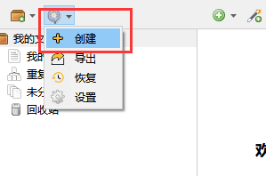

# 蒲公英

::: tip Tara

Tara 是一个用于备份和恢复 Zotero 配置的插件，支持备份：

✅ 备份已安装插件  
✅ 备份 CSL 文件  
✅ 备份转换器 (translators)  
✅ 备份 Locate 文件夹  
✅ 备份 Zotero 配置及插件配置

下载地址：

- [GitHub](https://github.com/l0o0/tara)
- [中文社区插件合集页](https://zotero-chinese.com/plugins/#search=蒲公英)

:::

## 创建备份

下载安装 Tara 插件后，通过点击 `Tara` 图标来创建一个备份

创建成功后，会在 Zotero 中生成一个 `Tara_backup` 的条目并自动生成一个 ZIP 格式的附件，这个就是备份文件。

如果你再点一次创建，会再生成个附件，你可以选择不同时间段的备份文件进行恢复。

## 恢复备份

点击`恢复`

可以根据时间来选择要恢复的备份

等待备份恢复完成，再重启 Zotero

## 导出备份文件

点击`导出`

等待完成后，去备份目录查看文件是否生成

导出时，会将当成的配置信息和插件导出到一个单独 ZIP 文件中，导出的备份会默认储存在 `数据储存文件夹\backup` 下。

## 在新电脑上进行数据恢复

在新电脑上安装了 Zotero，此时 Zotero 上没有任何插件，配置都是默认的。这时，你可以把第三步导出的 2 个文件复制到新电脑上。

在新电脑 Zotero 上，先安装 `Tara.xpi` 插件。

插件安装成功，点击恢复，会出现一个文件选择的窗中，选择第三部中所生成的备份文件，之后 Zotero 会恢复对应的插件及相关配置。

## 在不同电脑上同步备份

当你在多个电脑上同时使用 Zotero 时，可以通过 Zotero 的 `同步功能` 来实现数据的快速备份和恢复。

首先在不同电脑上分别配置同步，然后可以在 A 电脑上创建一个备份，备份文件是随条目一起同步的。那 B 电脑 Zotero 应该会自动同步了创建的备份条目 `Tara_backup` 及对应的附件。

当你在 B 电脑的 Zotero 上点击恢复，选择 A 电脑上刚创建的备份。这样两台电脑上的 Zotero 配置和插件信息就一起同步了。

::: tip 注意修改 Tara 的 「备份 Locate」 设置

由于不同系统平台或主机上的文件路径可能不一致，tara 在备份时默认过滤掉了 `locate` 文件夹，可以通过点击 `Tara 图标-设置` 进行修改。

:::
