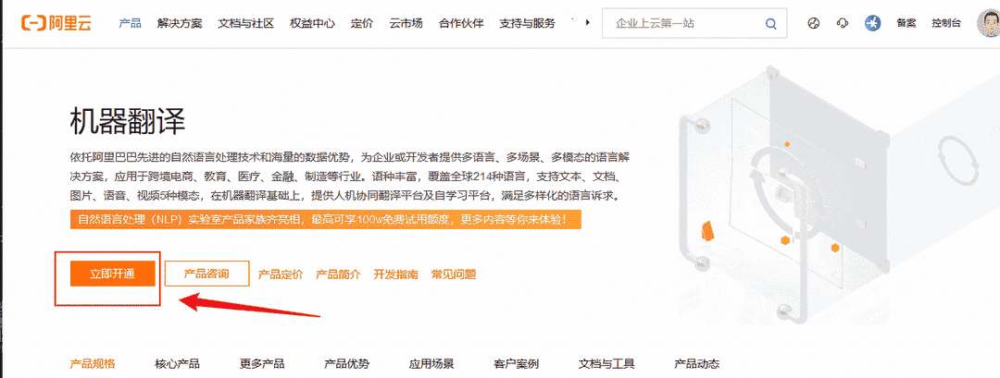
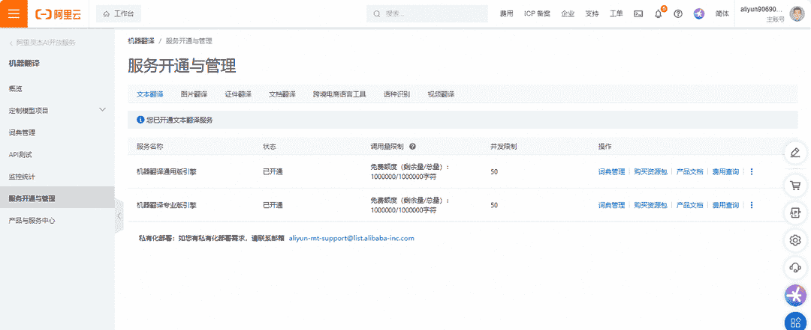
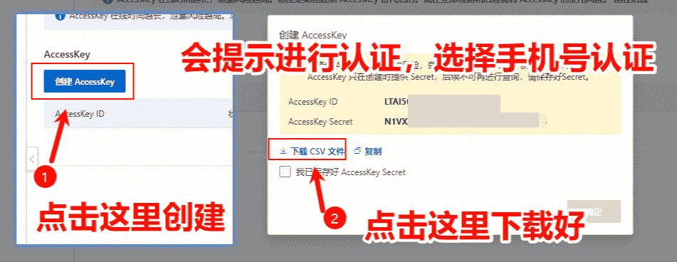
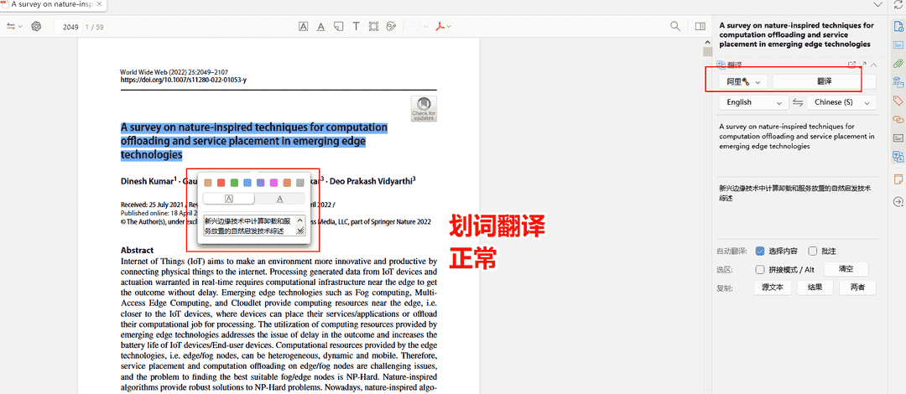

# 阿里翻译接口申请及配置

## 1. 翻译接口申请

打开 [阿里翻译](https://www.aliyun.com/product/ai/alimt?spm=5176.19720258.J_8058803260.278.e9392c4a5eczxp) 页面，点击立即开通，在登录页面，使用支付宝扫码登录。

::: tip

注意，如果第一次开通，可能会提示你需要进行实名认证，按照提示进行认证即可。

:::

使用支付宝扫码登录：

扫码成功后，跳转到控制台（如果未跳转到控制台，请访问），分别有两个接口，按照需求进行开通：

1. 通用版，支持全球 214 种语言互译，采用最先进的神经网络翻译模型，适用于日常沟通、出国旅行等应用场景。
2. 专业版，电商、社交、医疗 3 大领域积累千万级双语语料和百万专业领域双语术语，推出多个专业领域翻译引擎。

下面以专业版为例，直接点击立即开通：

你可以在 [控制台 - 服务开通与管理](https://mt.console.aliyun.com/service) 里查看已开通的服务：

把鼠标移动到右上角，点击下面的 AccessKey 管理：

点击继续使用 AccessKey：

如果后面忘记了 AccessKey 或发生泄露，可以重新在这申请一个新的：

## 2. Zotero 翻译引擎设置

打开「Zotero 设置」，转到「翻译」选项卡，在「翻译服务」里选择「阿里」，按照 `AccessKey ID#AccessKey Secret` 格式，输入到「密钥」中。注意这里的 `AccessKey ID` 和 `AccessKey Secret` 从你上面下载的 csv 文件里查看。

打开一篇英文 PDF，使用阿里的引擎，试试划词翻译正常不。有中文输出说明配置正常。

## 3. 翻译使用量查看

阿里云的翻译流量会每月更新，请不要超过每月的使用额度，不然会自动产生扣费。免费额度快用光了，请切换到其他引擎，查看具体的使用量，到 [控制台 - 监控统计](https://mt.console.aliyun.com/monitor) 查看。

