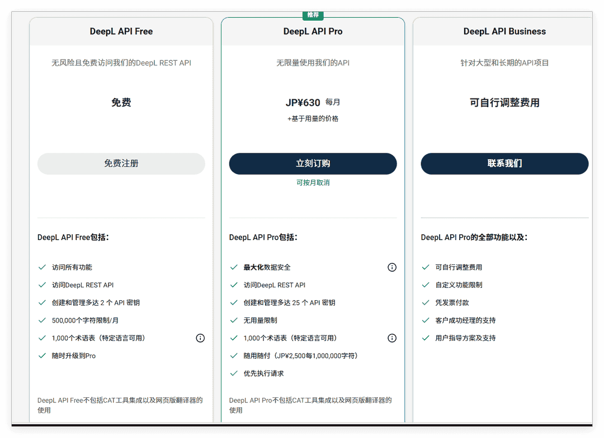
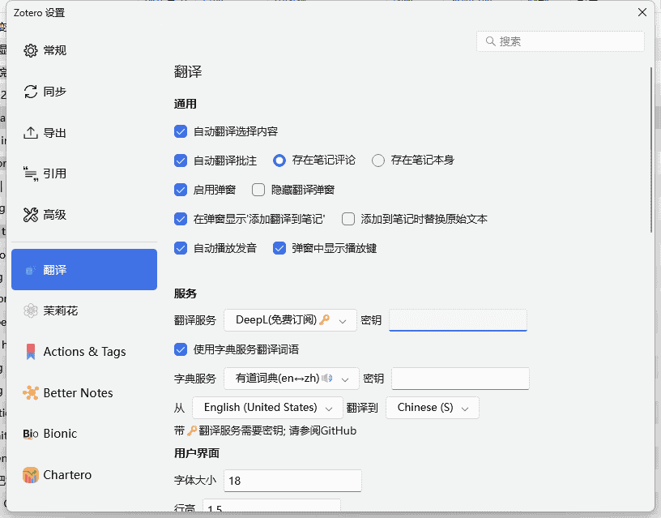

# DeepL 接口申请及配置

DeepL api 免费版包括：

✅ 访问 DeepL REST API

✅ 创建和管理多达 2 个 API 密钥

✅ 500,000 个字符限制/月

✅ 1,000 个术语表（特定语言可用）

::: warning

Deepl api 的申请需要准备**国外信用卡**，或者**国外的虚拟信用卡**

如果你没有国外信用卡，可以尝试使用 [DeepLx](/user-guide/plugins/translate/deeplx) 或者 第三方服务商购买

:::

## 1. 接口申请

进入 DeepL [申请 api](https://www.deepl.com/zh/pro-api?aid=segment_0004#api-pricing) 的页面，选择适合您的 API 套餐服务，点击免费注册/立即订阅。

详细教程略过。

## 2. 翻译插件配置

打开翻译插件的设置，根据申请的套餐选择接口「免费/pro」

DeepL 的 API 验证密钥，在 DeepL 官网的账户信息页面可以看到。格式类似 `xxx-xxx-xxx:fx`。
