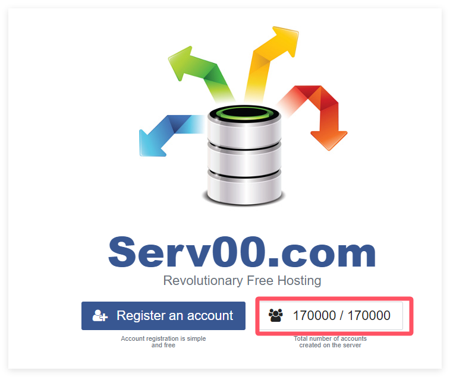

# DeepLx 项目

由于各种原因，在国内注册 DeepL 的免费计划都十分困难。于是出现了[DeepLX](https://github.com/OwO-Network/DeepLX/?tab=readme-ov-file)项目，该项目可让用户在不注册账号的前提下，使用 DeepL 作为翻译服务。DeepLX 是一款基于 DeepL 翻译引擎的开源工具，旨在为用户提供免费、高质量的翻译服务。它通过调用 DeepL 的 API 接口，实现文本、文档等多种内容的翻译功能。DeepLX 的优势在于其翻译质量高，支持多种语言，且操作简单易用。

::: warning

DeepLX 的使用需要进行部署，涉及 Docker 或服务器相关知识。如果您对此不太熟悉，建议选择其他翻译引擎。

:::

主要特点：

- 高质量翻译：基于 DeepL 引擎，翻译结果准确、自然。

- 多语言支持：支持包括英语、中文、日语、法语、德语等在内的多种语言互译。

- 免费使用：相较于 DeepL 官方服务的收费模式，DeepLX 提供免费翻译服务。

- 开源项目：代码公开，用户可自行部署或修改，满足个性化需求。

- 跨平台支持：可在 Windows、macOS、Linux 等系统上运行。

使用教程见：[DeepLX](https://deeplx.owo.network/)

一些衍生项目：

- 本地部署 DeepLX：[deeplx-local](https://github.com/ycvk/deeplx-local)

- 使用 FreeBSD (Serv00) 环境中使用部署[deeplx-freeAPI-serv00Public](https://github.com/aigem/deeplx-freeAPI-serv00)，[点击查看视频教程](https://www.bilibili.com/video/BV1e9bceoECw/)

::: details 如何申请免费的 Serv00

访问[Serv00 官网](https://www.serv00.com/)，注意看是否有名额注册，点击「注册账户」进入注册页面。

1.输入用户名、邮箱、验证码等信息，托管费用填写 0，然后点击「创建账户」。

2.注意，官方要求至少每隔 3 个月登录一次，否则账号可能被删除。

3.如果遇到「Maintenance time. Try again later」的提示，是由于 IP 不够纯净的问题。

通过以上步骤，您可以顺利申请 Serv00 服务。

:::
