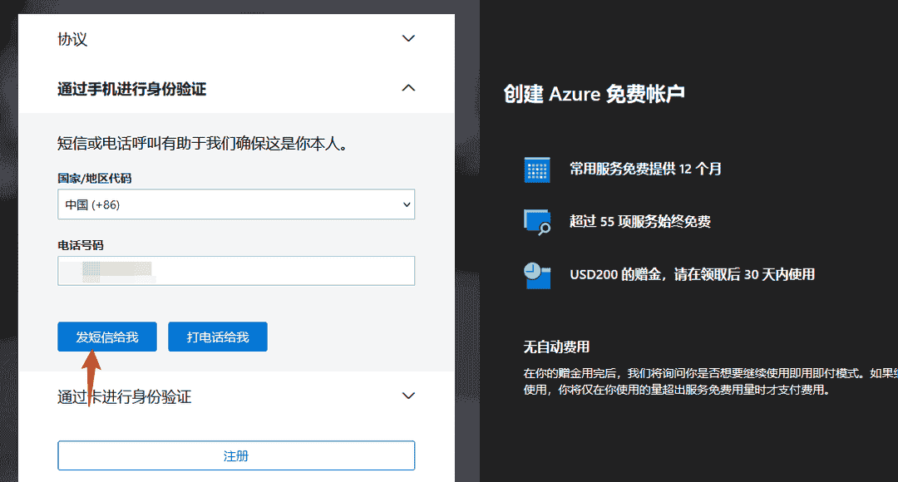
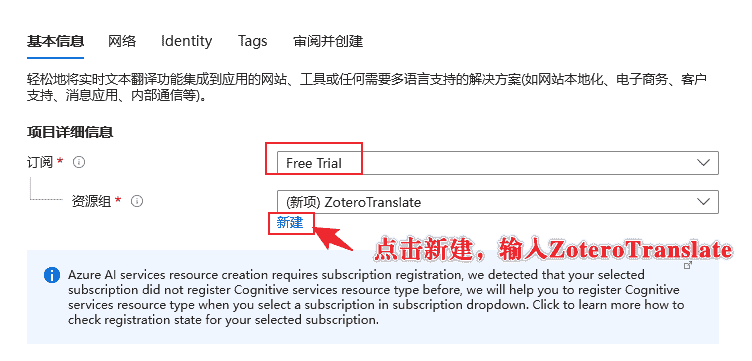
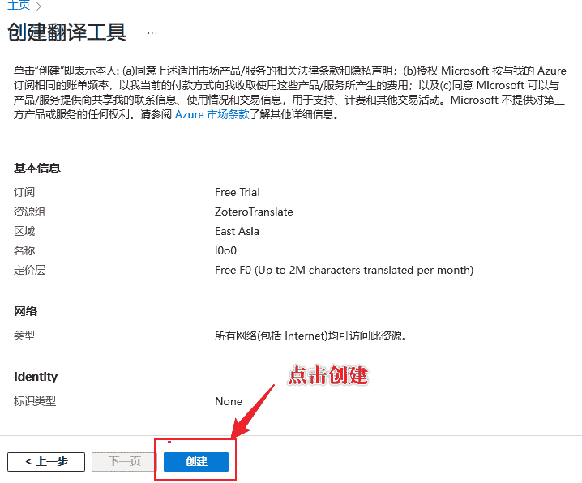
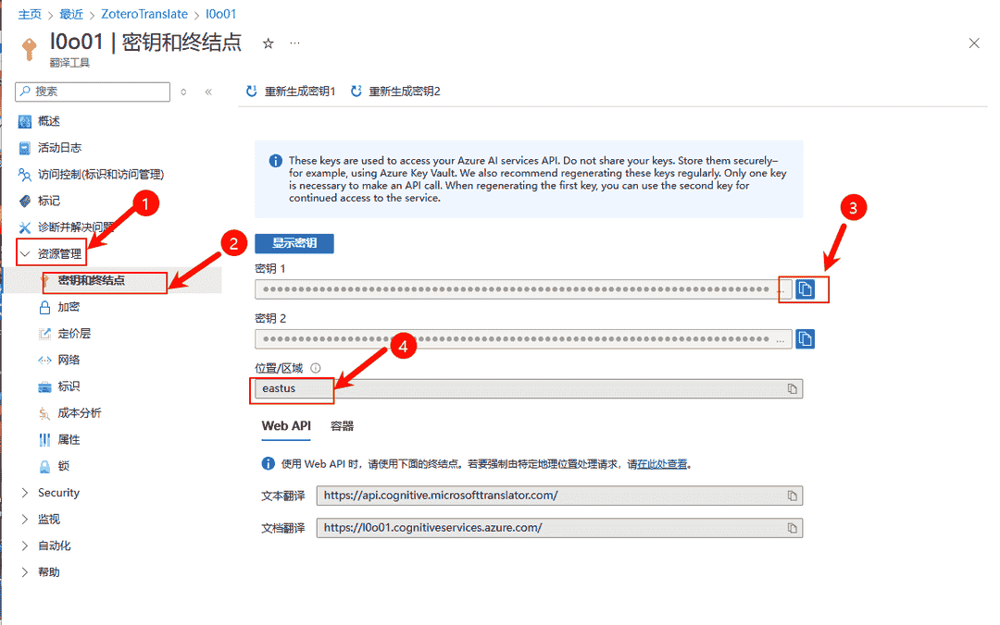
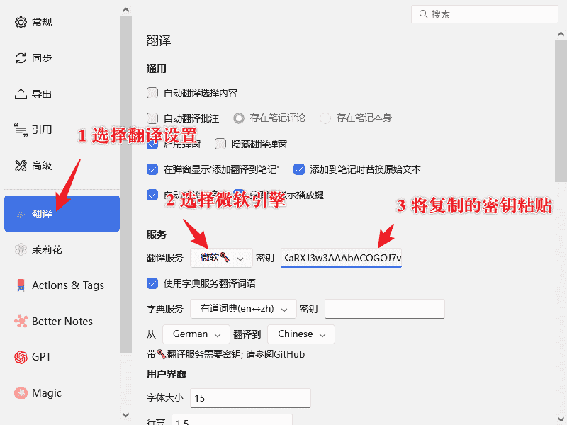

# 微软翻译接口申请及配置

## 1. 接口申请

打开 [微软的接口平台](https://azure.microsoft.com/zh-cn/pricing/purchase-options/azure-account/?icid=ai-services)

点击「免费试用 Azure」，会提示你登录微软账号，如果你没有账号，可以申请一个后再登录。

跳转到登录页面，并使用账号登录。

弹出开通服务的窗口，勾选第一个同意，点击「下一步」：

进行短信验证：

可能需要绑定信用卡：

然后直接下一步，可能会遇到邮箱或其他验证方式，直接按照操作说明进行验证。

打开 [微软翻译设置](https://portal.azure.com/#create/Microsoft.CognitiveServicesTextTranslation) 申请翻译服务：

注意上面请选择「East Asia」，后面密钥设置时需要用到这个参数。

点击审阅并创建：

等待服务创建完成，你可以在 Azure 主页中看到你的新翻译服务，点击下面的链接 [https://portal.azure.com/#home](https://portal.azure.com/#home)。

如果上面第 4 个 位置/区域 是全球，可不必复制。

## 2. 翻译插件配置

打开翻译插件的设置：

上图第三步，复制密钥时，请按照 `secretKey#region` 的格式进行。`scretKey` 是下图的第三步，`region` 是下图第四步。注意如果 `region` 是`全球 global`，可以不必填 `region`，只复制 `scretKey` 即可。

